# 🔬HTTP Enumeration

## Lab 1 - Method Enumeration

> 🔬 [HTTP Method Enumeration](https://attackdefense.com/challengedetailsnoauth?cid=1802)
>
> - Target IP: `192.41.48.3`
> - Credentials: `john`:`password`

```bash
ip -br -c a
	eth1@if193355  UP  192.41.48.2/24 
```

- Open the browser and navigate to
  - `http://192.41.48.3/login.php`

- **View Source code** of the login page and check the `POST` method

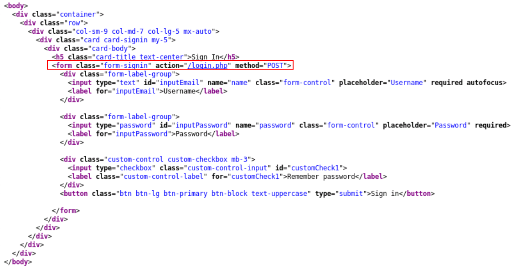

- Login with the provided credentials
- Follow the remaining links
  - `http://192.41.48.3/post.php`
  - `http://192.41.48.3/index.php`

### Dirb

- Enumerate hidden directories using [**`dirb`**](https://www.kali.org/tools/dirb/)

```bash
dirb http://192.41.48.3
```

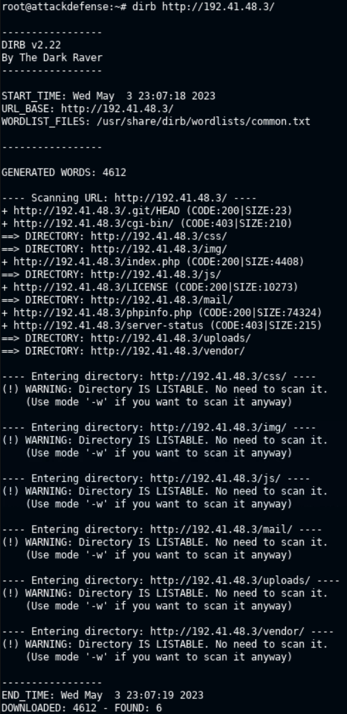

> 📌 Hidden directories are `css`, `img`, `js`, `mail`, `uploads`, `vendor`

### Curl

- Use **`curl`** to send some requests

```bash
# GET
curl -X GET 192.41.48.3

# HEAD
curl -I 192.41.48.3

# OPTIONS
curl -X OPTIONS 192.41.48.3 -v

# POST
curl -X POST 192.41.48.3

# PUT
curl -X PUT 192.41.48.3
```

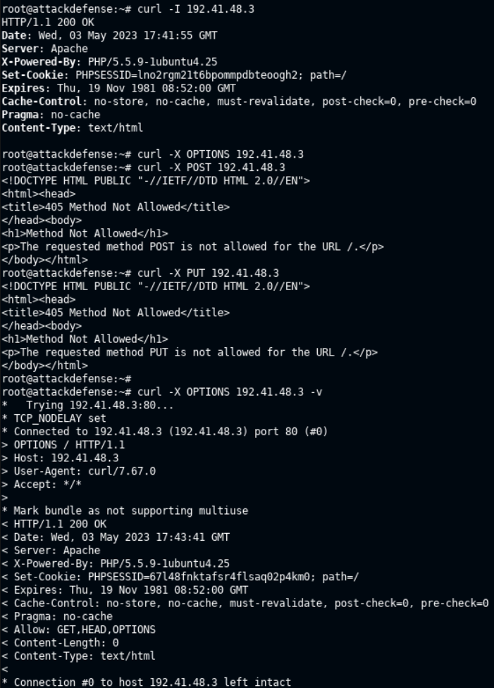

- Use **`curl`** to interact with `login.php` and `post.php`

```bash
curl -X OPTIONS 192.41.48.3/post.php -v
	Allow: GET,POST,HEAD,OPTIONS

curl -X OPTIONS 192.41.48.3/login.php -v
	Allow: GET,POST,HEAD,OPTIONS

curl -X POST 192.41.48.3/login.php -d "name=john&password=password" -v
```

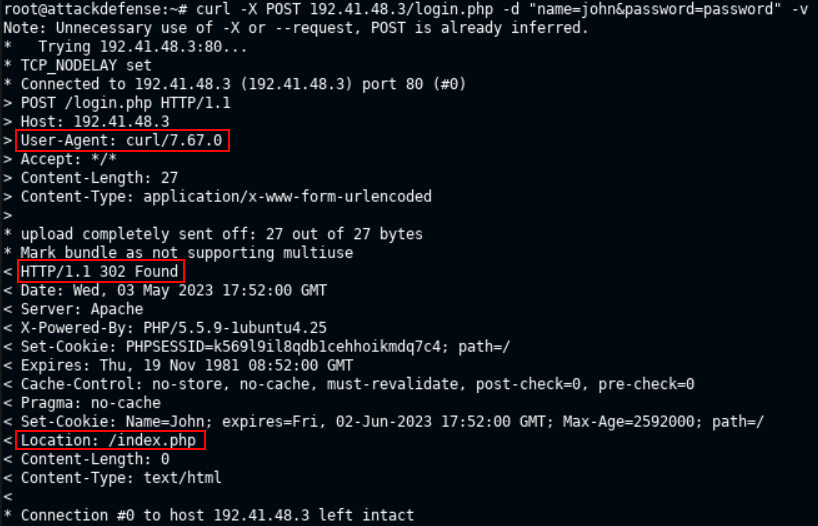

- Interact with `uploads` directory

```bash
curl -X OPTIONS 192.41.48.3/uploads/ -v
```

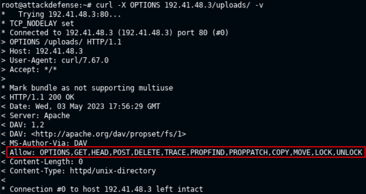

> 📌 `WebDAV` module is enabled on the Apache Server and allows file upload via `PUT` method.

- Upload a file with **`PUT`** method

```bash
echo "Hello Hackers" > hello.txt

curl 192.41.48.3/uploads/ --upload-file hello.txt
```

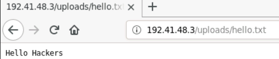

```bash
curl -X DELETE 192.41.48.3/uploads/hello.txt -v
```

### BurpSuite

> 🔬 Check the [BurpSuite Basics lab here](../../exam-preparation-labs/p.t.-prerequisites-labs/burp-suite-basics.md)

- Target IP has changed to `192.83.140.3`
- Use [**`BurpSuite`**](https://portswigger.net/burp) to interact with the web page, by turning on the `FoxyProxy` Firefox plugin and opening the BurpSuite with the Proxy intercept on.
- Capture the home page and send it to `Repeater`
- Use the various options to sed **requests** and check the **response**.

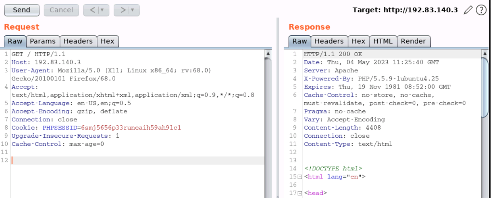

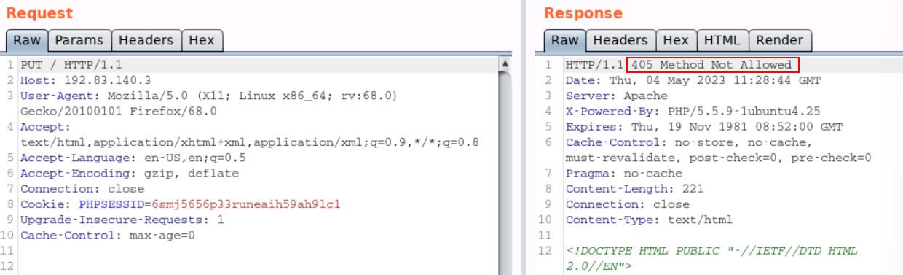

- Try to login in the webpage, intercept the request and send it to the repetear
- Send a `POST` to `login.php` with valid credentials

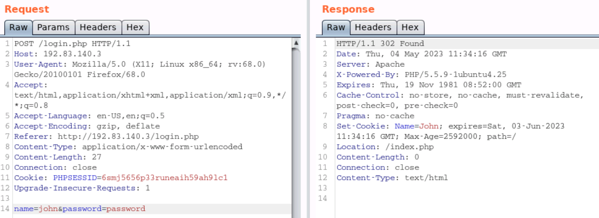

- Try to upload a file to `/uploads/`

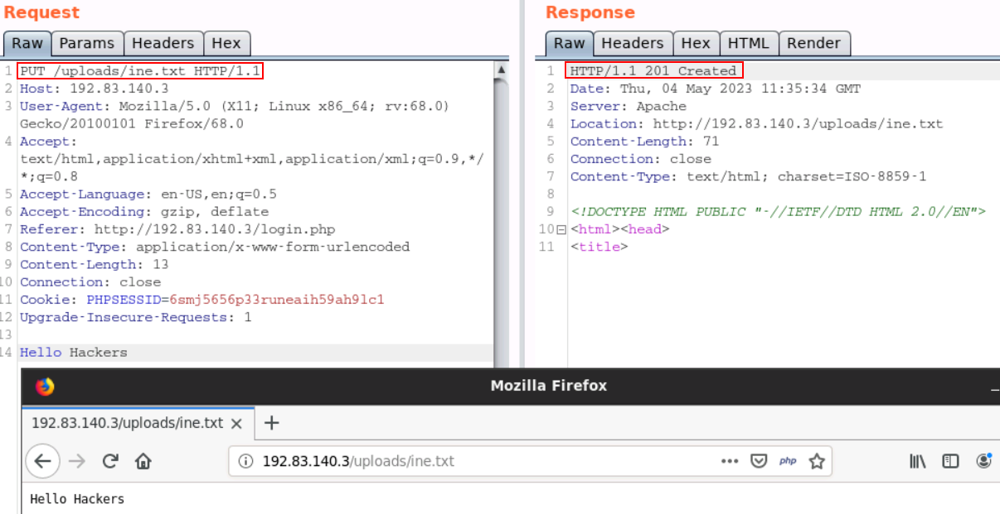

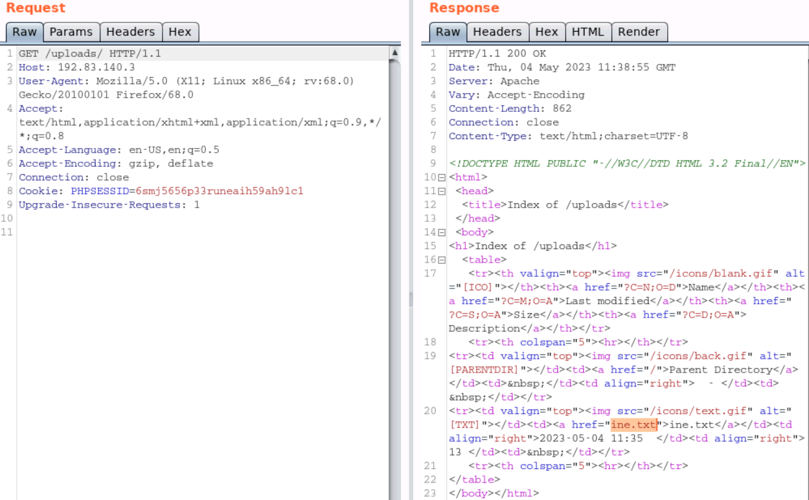

------

## Lab 2 - Directory Enumeration

### [Gobuster](https://github.com/OJ/gobuster)

> 🔬 [Directory Enumeration with Gobuster](https://.attackdefense.com/challengedetails?cid=1882)
>
> - Target IP: `192.185.38.3`
> - Enumerate a **Multillidae II** vulnerable web app

```bash
ip -br -c a
	eth1@if203734  UP  192.185.38.2/24

nmap -sS -sV 192.185.38.2
```

- Open the browser and navigate to
  - `http://192.185.38.3/`

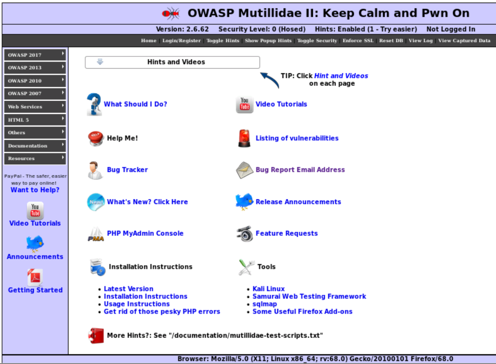

- Use **`gobuster`** to enumerate directories, ignoring `403` and `404` status codes

```bash
gobuster dir -u http://192.185.38.3 -w /usr/share/wordlists/dirb/common.txt -b 403,404
```

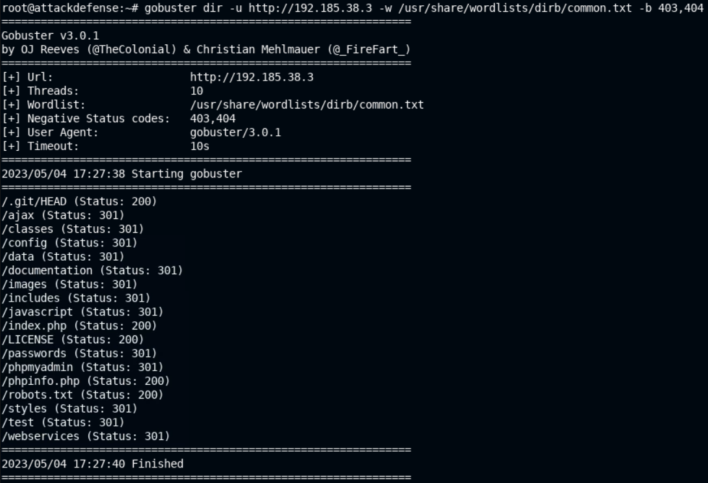

- Scan to find specific file extensions and interesting files

```bash
gobuster dir -u http://192.185.38.3 -w /usr/share/wordlists/dirb/common.txt -b 403,404 -x .php,.xml,.txt -r

# -u = url string
# -w = wordlist
# -b = status code blacklist
# -x = extensions string
# -r = follow redirect
```

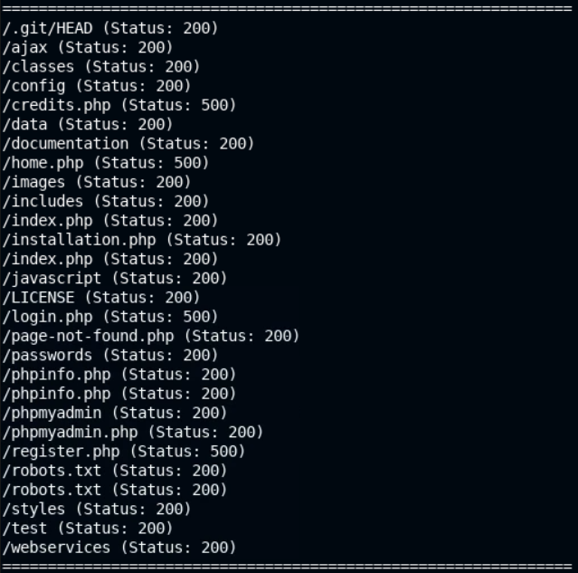

```bash
gobuster dir -u http://192.185.38.3/data -w /usr/share/wordlists/dirb/common.txt -b 403,404 -x .php,.xml,.txt -r
```

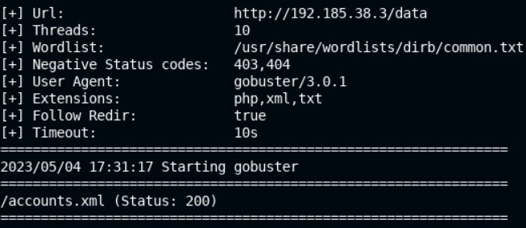

- Check the `xml` file
  - `http://192.185.38.3/data/accounts.xml`


### Burp Suite

> 🔬 [Directory Enumeration with Burp Suite](https://attackdefense.com/challengedetails?cid=1886)
>
> - Target IP: `192.221.162.3`
> - Enumerate a **Multillidae II** vulnerable web app

```bash
ip -br -c a
	eth1@if203734  UP  192.221.162.2/24

nmap -sS -sV 192.221.162.3
```

- Open the browser and navigate to
  - `http://192.221.162.3/`
  - Activate FoxyProxy Plugin
- Start `BurpSuite` (set *User options/Display/Look* to *Darcula* and restart BurpSuite)
  - Intercept the home page request and send it to `Intruder`
  - **`Intruder`** - set `HOST` target IP and `PORT`
  - Configure **`Payload Positions`**
    - Clear §
    - Add `§name§` in the `GET` request
  - **`Payloads - Options`** - add a list of strings and load the ` /usr/share/wordlists/dirb/common.txt` list
  - **`Start Attack`** and check the status code

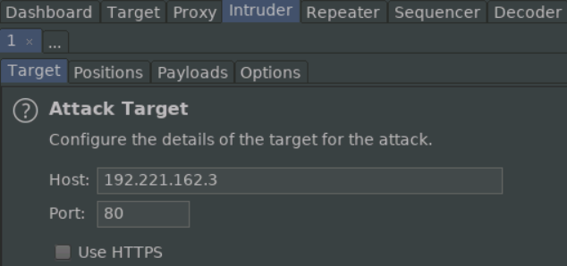

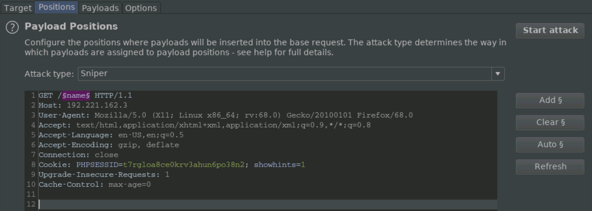

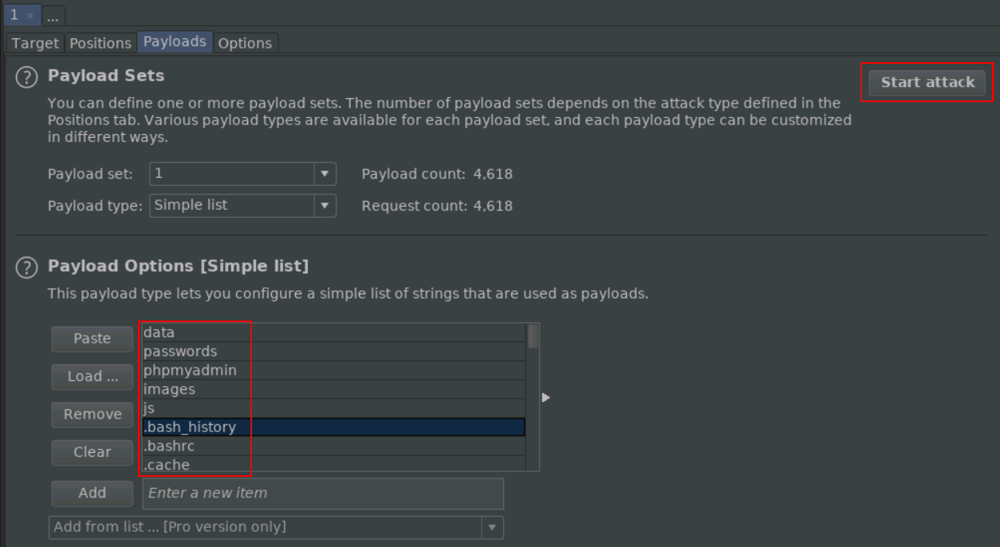

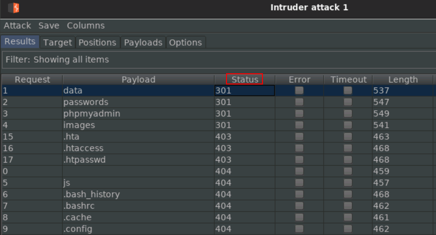

- Navigate to `http://192.221.162.3/passwords/accounts.txt`

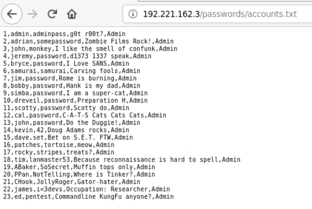

------

