# 🔬Web App Scanning

## Lab 1 - [ZAProxy](https://www.zaproxy.org/)

> 🔬 [Scanning Web Application with ZAProxy](https://attackdefense.com/challengedetails?cid=1888)
>
> - Target IP: `192.192.29.3`
> - Scan and identify a vulnerable web app (bWAPP) with **ZAProxy**

```bash
ip -br -c a
	eth1@if203734  UP  192.192.29.2/24

nmap -sS -sV 192.192.29.3
```

- Start **`owasp-zap`** from the start menu
  - Use **`Manual Explore`** and input the URL
    - `http://192.192.29.3/`
  - **Launch Browser** to open the browser session with the ZAP HUB

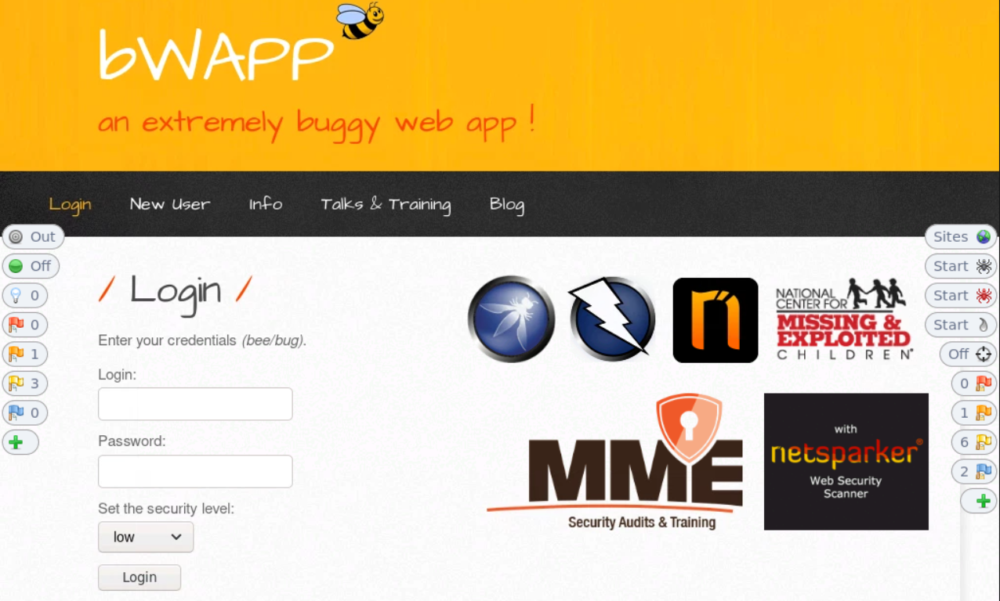

- Login to the web app with `bee`:`bug` credentials
  - set the security level to `low`

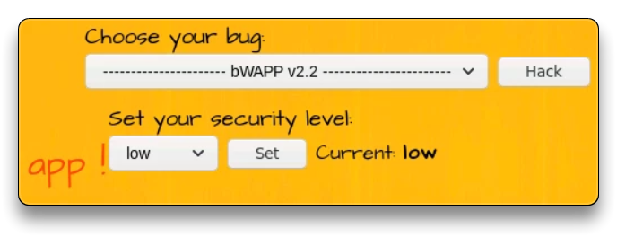

- Try some HTML and SQL Injection or other bugs from the `https://192.192.29.3/portal.php` page

### ZAProxy

- Configure authenticated session in ZAProxy

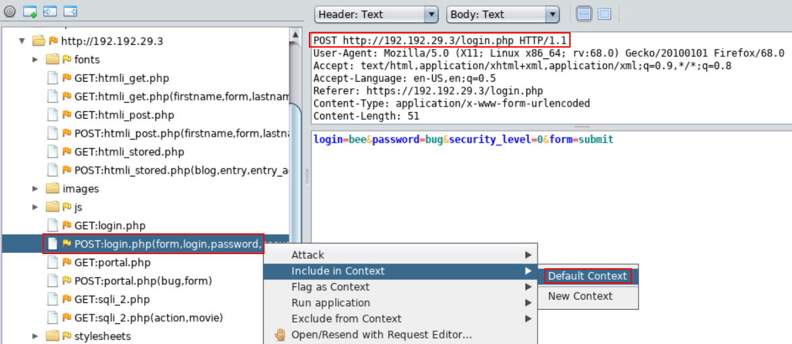

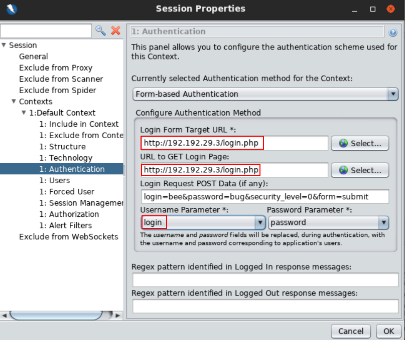

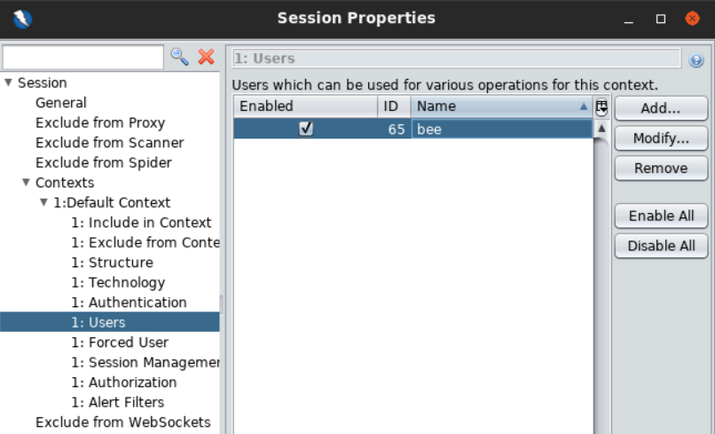

- Enable `Forced User mode`

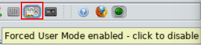

- `Include in Context` the Site `https://192.192.29.3/` and confirm with **`OK`**

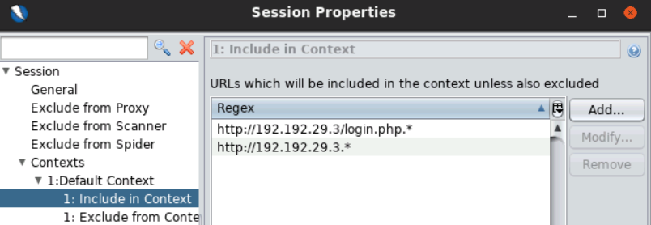

- Run a **`Spider`** attack on the site, select the `bee` user and Start the scan

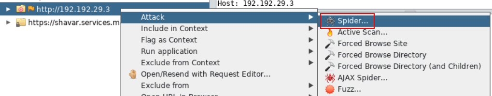

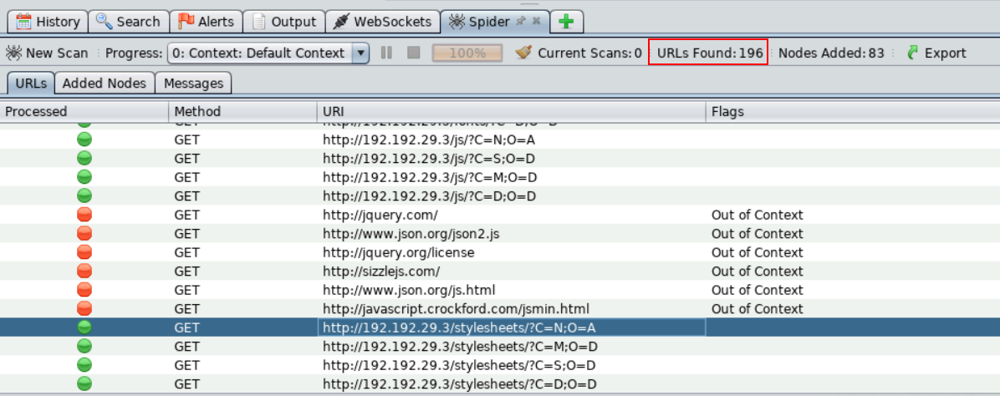

- Run an **`Active Scan`** on the site, select the `bee` user and Start the scan

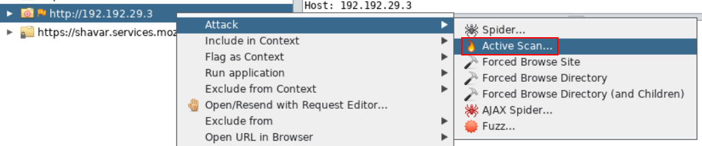

- In the `Alerts` tab check the 🚩`High` risk Alerts

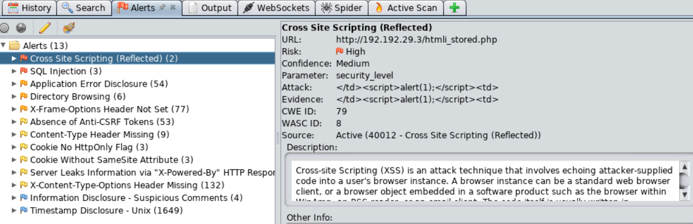

- Try to navigate to `https://192.192.29.3/htmli_stored.php`, inject the **`XSS`** (**Cross-site Scripting**) payload and Submit it
  - The XSS payload will be triggered

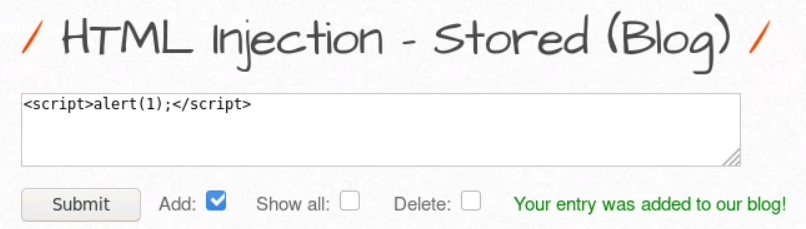

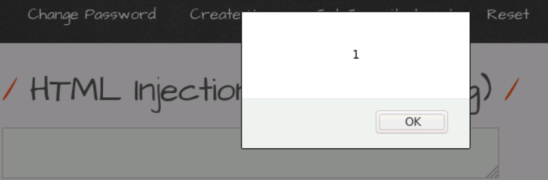

- Using the `ZAP HUD`, Site Alerts can be accessed. Every vulnerability is clickable and can be directly tried via the URL

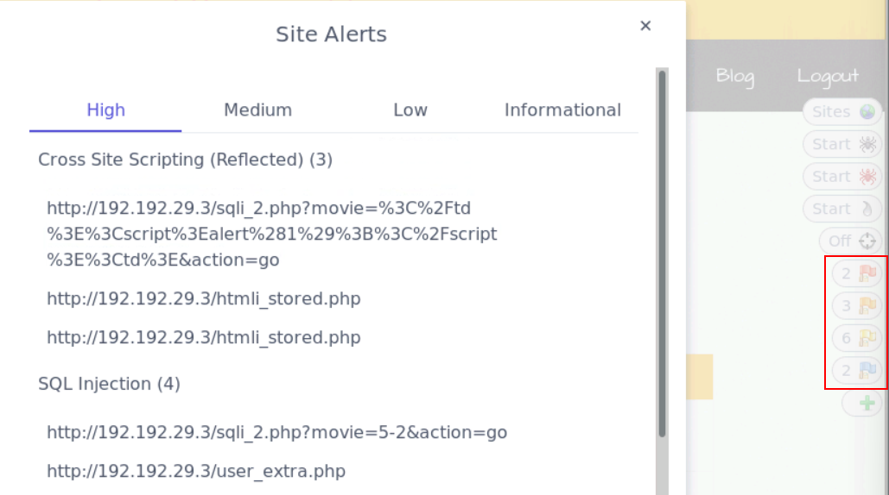

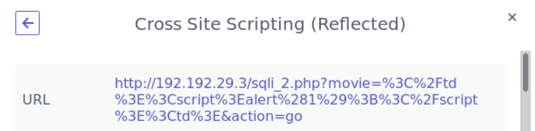

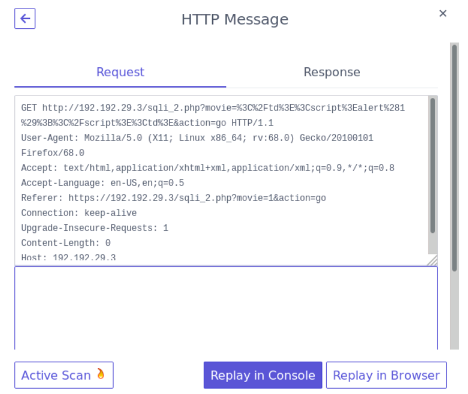

- Try a SQL Injection attack by opening this link
  - `http://192.210.141.3/sqli_1.php?action=search&title=ZAP'+OR+'1'%3D'1'+--+`
  - The table records will be dumped on the web page

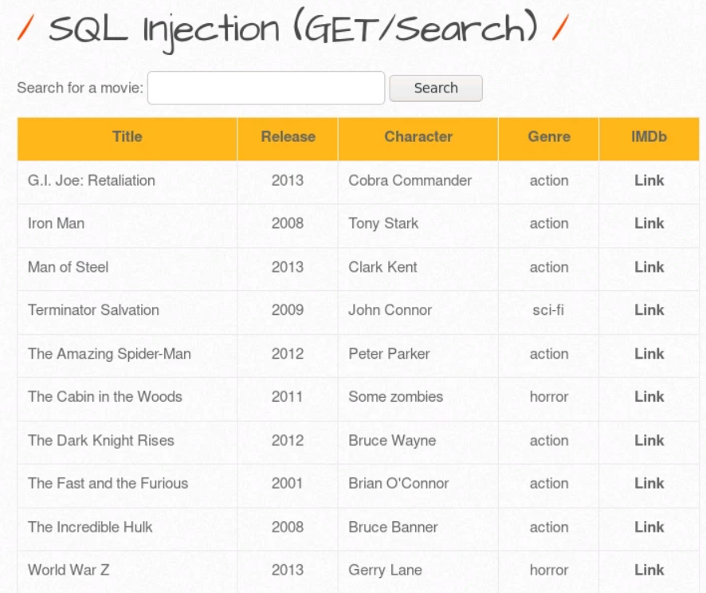

## Lab 2 - [Nikto](https://github.com/sullo/nikto)

> 🔬 [Scanning Web Application with Nikto](https://attackdefense.com/challengedetails?cid=2128)
>
> - Target IP: `192.157.60.3`
> - Scan and identify web app vulnerabilities (Multillidae II) with **Nikto**
>   - LFI

```bash
ip -br -c a
	eth1@if203734  UP  192.157.60.2/24

nmap -sS -sV 192.157.60.3
```

- Open the browser and navigate to
  - `http://192.157.60.3/`

### Nikto

- In the Bash terminal run **`nikto`** and output the results to a file

```bash
nikto -h http://192.157.60.3 -o niktoscan-192.157.60.3.txt
```

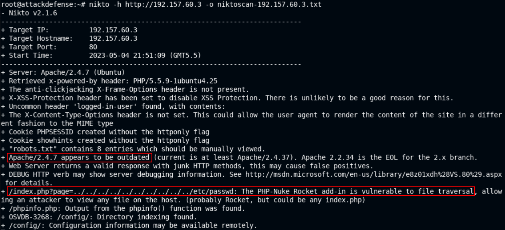

- Scan the target web app for **L**ocal **F**ile **I**nclusion (**LFI**) vulnerability by copying the link from the browser
  - `http://192.157.60.3/index.php?page=arbitrary-file-inclusion.php`
  - output to an `HTML` file

```bash
nikto -h http://192.157.60.3/index.php?page=arbitrary-file-inclusion.php -Tuning 5 -o nikto.html -Format htm
```

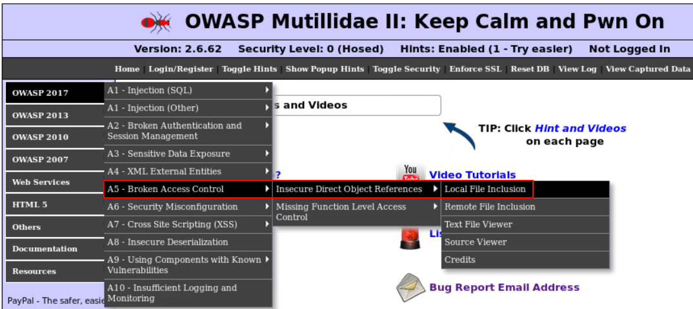

```
firefox nikto.html
```

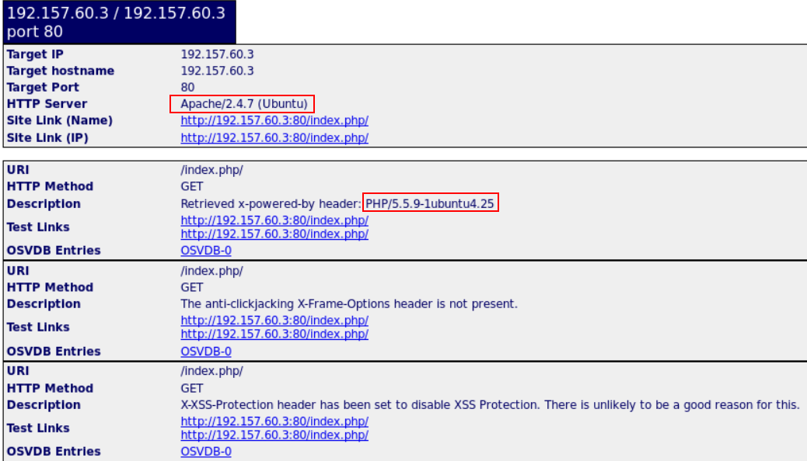

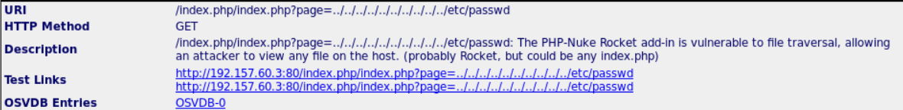

- *The PHP-Nuke Rocket add-in is vulnerable to **file traversal**, allowing an attacker to view any file on the host*
  - View the contents of the `passwd` file of the target machine
  - `http://192.157.60.3/index.php/index.php?page=../../../../../../../../../../etc/passwd`


------

