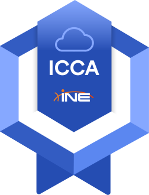

# ☁️ICCA Certification

## [ICCA - Cloud Foundations & Management Learning Path](https://my.ine.com/Cloud/learning-paths/d9eeb38f-d936-42ca-993b-8e33fdd750e6/cloud-foundations-management-icca)

- covers understanding of cloud technologies
- provides the essential cloud skills for managing cloud platforms (AWS, Azure, Google Cloud)
- prepares for the ICCA exam & certification

### Course duration & Topics

~ 17 hours

Activities: **2** sections , **3** courses , **33** videos, **23** quizzes, **9** labs

- [**Cloud Foundations**](cloud-foundations/README.md) ~ 10 hours
- [**Cloud Management Concepts**](cloud-management/README.md) ~ 2 hours
- [**Fundamentals of Cloud Identity, Security, and Compliance**](cloud-sec/README.md) ~ 5 hours

Instructor: [Tracy Wallace](https://twitter.com/TracyWallaceTec)

### Useful links

- Where to find the Cloud Foundations & Management (ICCA) course? - [INE Learning Paths](https://my.ine.com/learning-paths)
- Where to find the ICCA certification exam? - [ICCA FAQs](https://info.ine.com/icca-certification/)
- 🔬 For the **training** part I will use the provided INE Labs Environment (with the `ICCA paid course`)
- [Video INE Live - More on ICCA & Demo Lab](https://www.youtube.com/watch?v=Wuz5-XarQWg)

## [ICCA](https://info.ine.com/icca-certification/) Exam

- Time limit: **90 minutes**
- Questions: **46**
- Hands-on Lab Objectives: **4**
- Expiration date: yes (3 years)
- Objectives:
  - Explain cloud management concepts
  - Describe the benefits of the cloud and cloud data protection concepts and tools
  - Explain cloud regulatory compliance, infrastructure protection, identify and access management
  - Describe cloud "Platform as a Service (PaaS)" and "Infrastructure as a Service (IaaS)"
  - Identify cloud monitoring and automation features, identity vulnerabilities and protection tools
- In browser hands-on Cloud Lab, open book
- ***Voucher expires Nov 16, 2023***

------

