# 📒1. Cloud Foundations

> #### 📕 Learning Objectives
>
> * Define **cloud** and identify cloud services and providers

📍 ***The cloud is just someone else's computer.***

## Basics

| On-Premises Information System Architecture |                                   |
| :-----------------------------------------: | --------------------------------- |
|              Physical Facility              | Cost of space, Physical Security  |
|           Physical Infrastructure           | Network, Power, Racks, Storage    |
|               Virtualization                | Platforms, Maintenance, Licensing |
|              Virtual Machines               |                                   |
|                  Services                   |                                   |
|                  Workload                   |                                   |

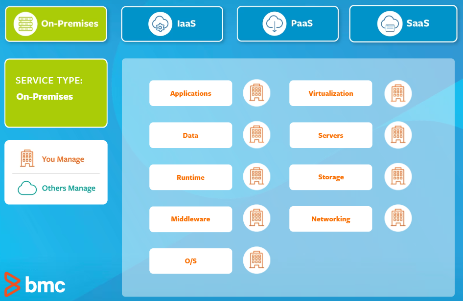

Cloud Architecture is the same as the above on-premises architecture, but it takes care of the physical infrastructure by providing it with built in security and redundancy at a large scale.

In addition, the **management plane** relates to the management and control of the cloud infrastructure and services, with key functions like monitoring, resource provisioning/allocation, configuration, security controls, troubleshooting, etc.

|   Cloud Architecture    |
| :---------------------: |
|    Physical Facility    |
| Physical Infrastructure |
|     Virtualization      |
|    Management Plane     |
|    Virtual Machines     |
|        Services         |
|        Workload         |

### Types of Cloud Services

**Workload level** - *Software as a Service (SaaS)*

- **SaaS** - software applications are delivered over the internet as a service (e.g. Google Tools, Microsoft365, etc).

**Services level** - *Platform as a Service (PaaS)*

- **PaaS** - provides a complete runtime environment for developers to build, deploy and manage applications. 

**Virtual Machine level** - *Infrastructure as a Service (IaaS)*

- **IaaS** - virtualized computing resources (virtual machines, storage, networking components) are provided by the cloud provider to users over the internet as a service.

These Cloud services types support levels of customization and can also offer a range of distinct "*as a Service*" options.

When moving from IaaS to SaaS, *ease of administration* increases and *control* is reduced, and vice versa.

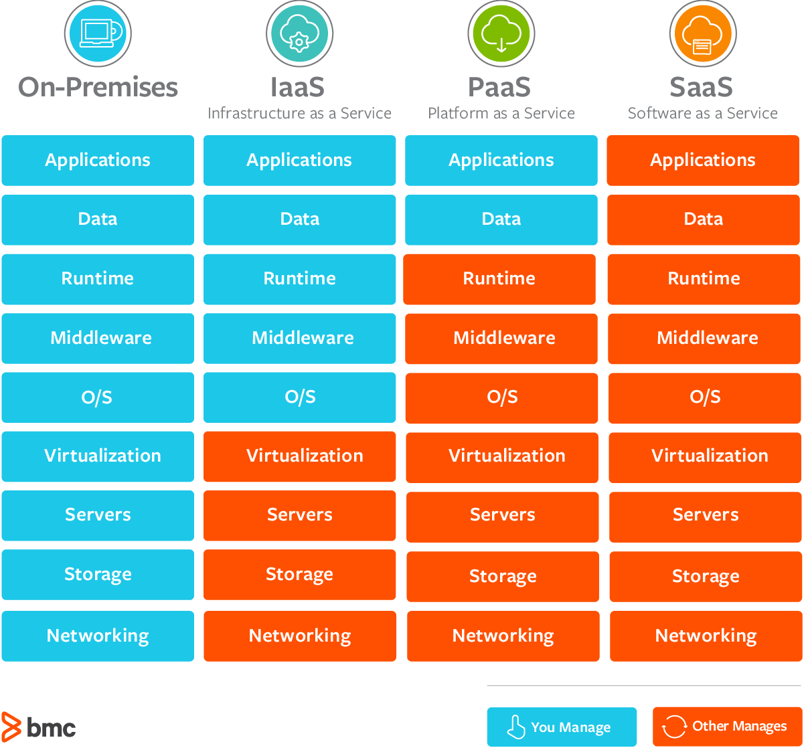

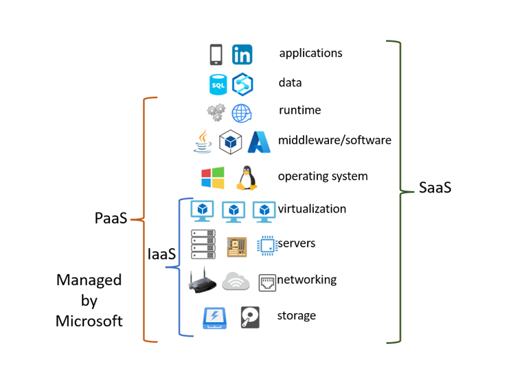

Cloud services can be accessed through the Internet or via a private VPN Connection.

### Cloud Providers

> 1. Amazon Web Services (AWS)
> 2. Microsoft Azure
> 3. Google Cloud Platform (GCP)
> 4. IBM Cloud
> 5. Oracle Cloud Infrastructure (OCI)
> 6. Alibaba Cloud
> 7. Salesforce Cloud
> 8. VMware Cloud
> 9. Digital Ocean
> 10. Rackspace
> 11. Cisco Cloud Services
> 12. Red Hat OpenShift
> 13. Heroku
> 14. SAP Cloud Platform
> 15. Adobe Experience Cloud
>
> (not exhaustive list)

- 🔗 About [Cloud Market Share](https://www.wpoven.com/blog/cloud-market-share/)
- 🔗 By [IDC - Worldwide Public Cloud Services Revenue and Year-over-Year Growth 2021](https://www.idc.com/getdoc.jsp?containerId=prUS49420022)

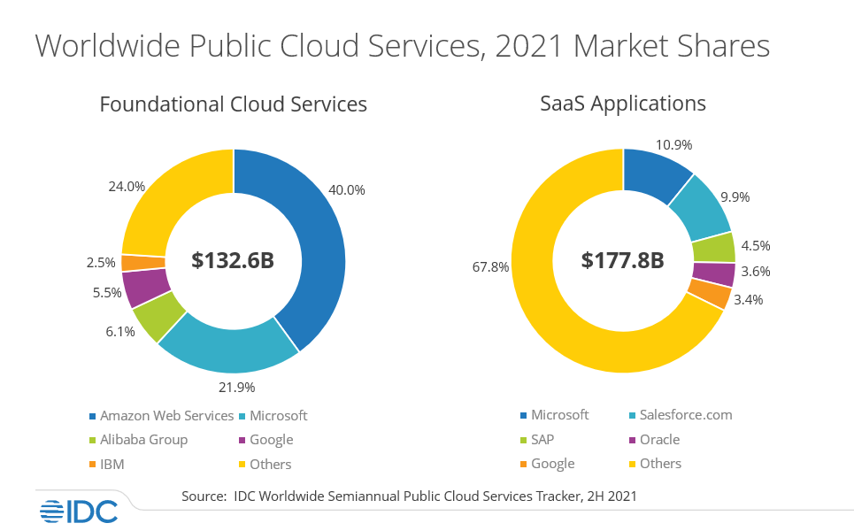

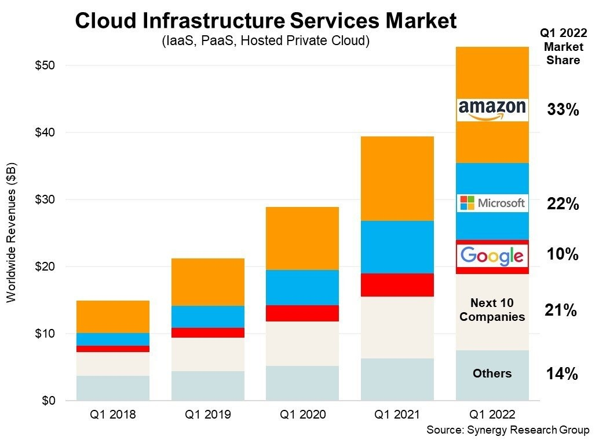

- 🔗 [Gartner Says More Than Half of Enterprise IT Spending in Key Market Segments Will Shift to the Cloud by 2025](https://www.gartner.com/en/newsroom/press-releases/2022-02-09-gartner-says-more-than-half-of-enterprise-it-spending)

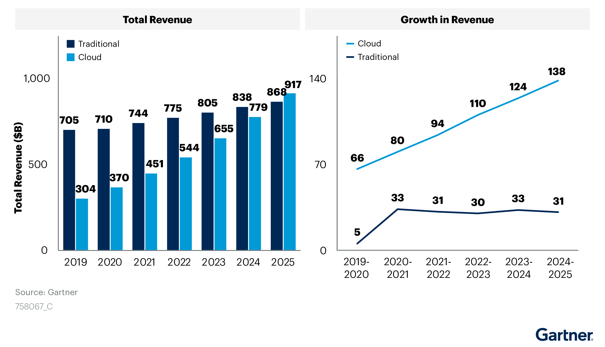

#### [Amazon Web Services (AWS)](https://aws.amazon.com/what-is-aws/)

- **AWS** is a leading cloud computing platform with a market share of around 33% (Q1 2022). It operates in 31 geographic launched regions, has over 200 services, and serves diverse industries. It offers job opportunities and certifications in AWS skills and is widely adopted by [companies](https://www.mytechmag.com/companies-that-use-aws/) like Airbnb, Kellogg’s, Netflix, McDonald's, The Guardian, etc.
  - [EC2](https://docs.aws.amazon.com/AWSEC2/latest/UserGuide/concepts.html) (Elastic Compute) instance - virtual machines
  - [S3](https://docs.aws.amazon.com/AmazonS3/latest/userguide/Welcome.html) (Simple Storage Service) bucket - cloud storage space

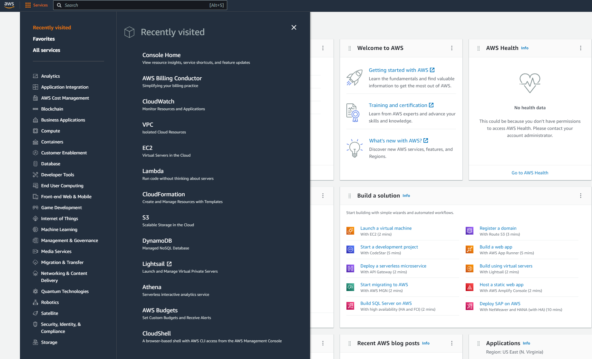

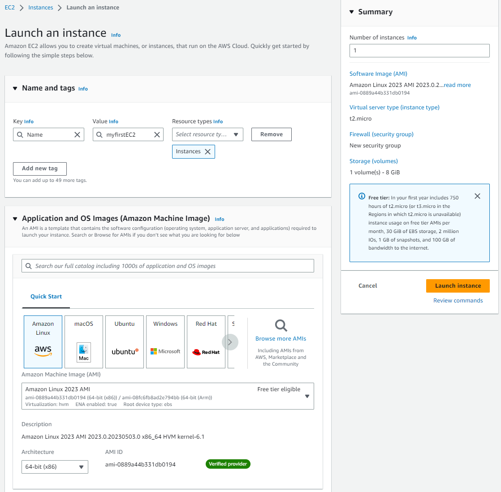

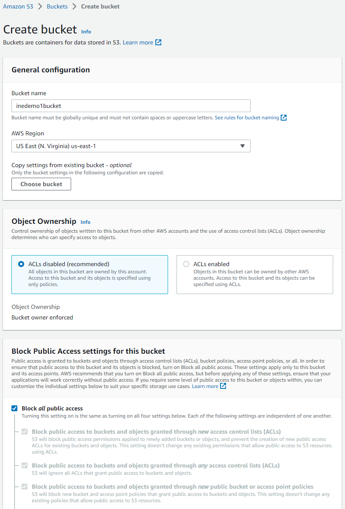

#### [Microsoft Azure](https://azure.microsoft.com/en-us/resources/cloud-computing-dictionary/what-is-azure/)

- **Azure** is a cloud computing platform with a worldwide presence (over 60 regions) and more than 600 services. Azure serves diverse industries and is used by notable [organizations](https://www.cisin.com/coffee-break/enterprise/who-are-biggest-customers-of-the-microsoft-azure-platform.html) such as eBay, BMW and Walmart. It offers certifications for professionals in Azure technologies.
  - [Virtual Machines](https://learn.microsoft.com/en-us/azure/virtual-machines/)
  - [Storage Account](https://learn.microsoft.com/en-us/azure/storage/)

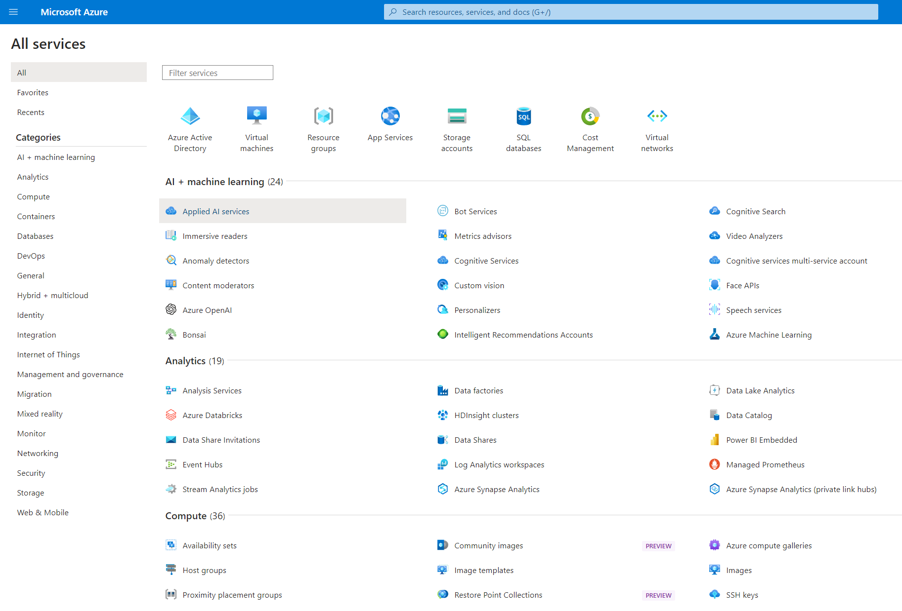

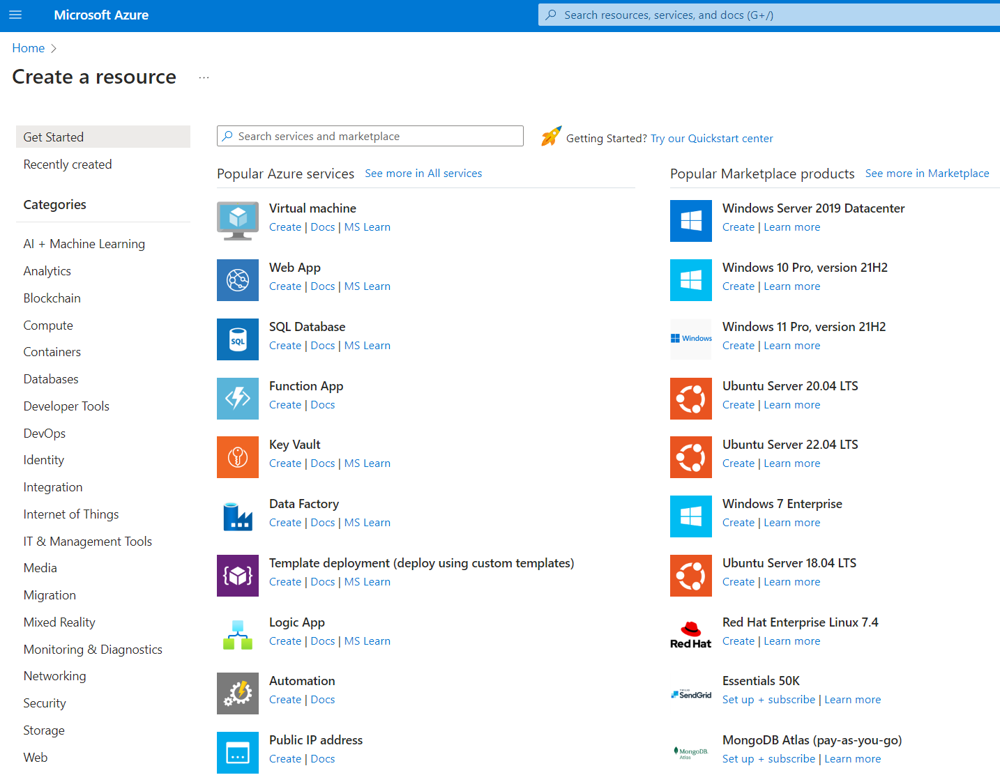

#### [Google Cloud Platform (GCP)](https://cloud.google.com/docs/overview/)

- **GCP** is a major cloud provider with a global infrastructure spanning over 70 zones and 20 regions, serving diverse industries and notable [customers](https://cloud.google.com/customers) such as Twitter and PayPal. In Q1 2021, Google Cloud reported revenue of $4.05 billion. GCP is known for its data analytics and machine learning capabilities and emphasizes sustainability. Certifications are available for professionals in GCP technologies.
  - Compute Engine API - for virtual machines
  - Cloud Storage Buckets
  - Cloud Run - containerized applications

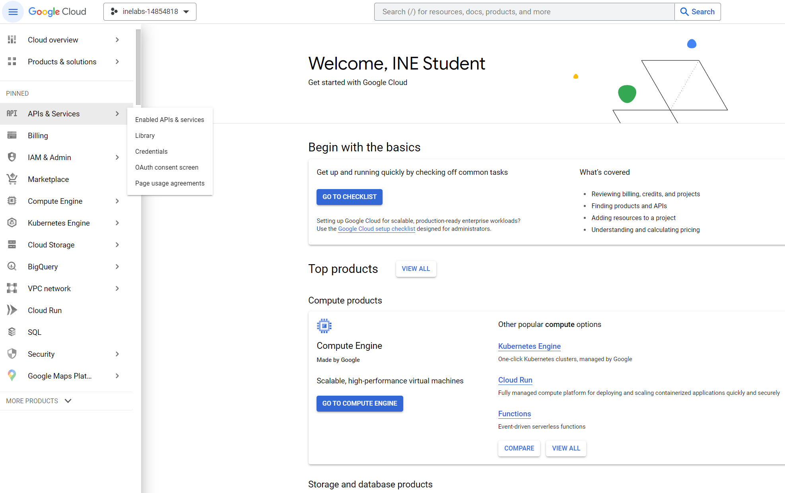

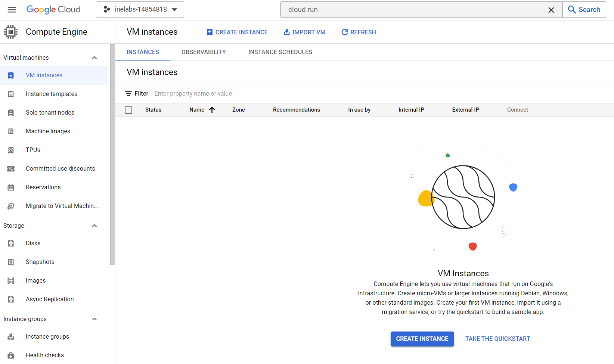

### Why Cloud

The key advantages of choosing cloud computing are:

- Scalability - easily adjust resources based on demand.
  - capacity-based spending

- **Cost** Efficiency - pay only for what you use, no upfront investment.
  - **consumption-based spending** (functions, services, storage)

- Accessibility and Flexibility - access applications and data from anywhere.
- Reliability and **Availability** - high uptime and built-in redundancy.
  - minimized administrative overhead

- Data **Security** and Compliance - robust security measures and regulatory compliance.
- Disaster Recovery and Backup - automated backup and quick recovery options.
- Collaboration and Productivity - real-time collaboration and increased efficiency.
- Innovation and Agility - rapid adoption of new technologies and services.
- Green and Sustainable Computing - energy-efficient infrastructure.
- Continuous Updates and Maintenance - provider handles maintenance and updates.

🔗 [CapEx vs OpEx in Cloud Computing](https://www.cloudzero.com/blog/capex-vs-opex)

**CapEx** (Capital expenditure) - `e.g.` on-premises capacity expansion/reduction

- hardware and licensing, replace/sell equipment

**OpEx** (Operating expenses) - `e.g.` cloud-base capacity expansion/reduction

- pay for what is used, no hardware purchase
- reduce monthly cost, no upgront capital costs

*Moving to the cloud might not be a good idea in case of ongoing operational investments, regulatory compliance and data fencing.*

## Management

### Tools

- **Web based** cloud management tools
  - [AWS Console](https://console.aws.amazon.com/)
  - [Azure Portal](https://portal.azure.com)
  - [GCP Console](https://console.cloud.google.com/)
  
- Command line interface (**CLI**) and Powershell CLI
  - [AWS CLI](https://docs.aws.amazon.com/cli/latest/userguide/install-cliv2.html)
    - [PowerShell](https://docs.aws.amazon.com/powershell/latest/userguide/pstools-getting-set-up.html)
  - [Azure CLI](https://docs.microsoft.com/en-us/cli/azure/install-azure-cli)
    - [Azure PowerShell](https://learn.microsoft.com/en-us/cli/azure/choose-the-right-azure-command-line-tool)
  - [Google Cloud SDK](https://cloud.google.com/sdk)
    - [Cloud Tools for PowerShell](https://cloud.google.com/tools/powershell/docs/quickstart)
  - Cloud shell ([AWS](https://docs.aws.amazon.com/cloudshell/latest/userguide/welcome.html), [Azure](https://learn.microsoft.com/en-us/azure/cloud-shell/overview), [GCP](https://cloud.google.com/shell))

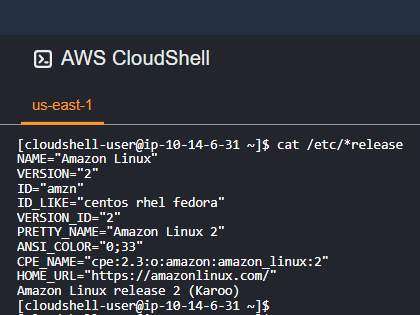

- [REST API](https://restfulapi.net/) - an **API** (Application Programming Interface) that conforms to the constraints of **REST** (Representational State Transfer) architectural style, allowing interaction with RESTful web services.
  - the cloud can be integrated into third parties management tools
  - [Google Cloud APIs](https://cloud.google.com/apis)

### Cost

**Pricing Models**

- *Capacity*: `e.g.` Virtual machines - per second/minute/hour basis
- *Consumption*: `e.g.` Storage/functions/service - pay for the amount (transaction cost)
- both
- fixed cost
- data transfer, egress cost
- Marketplace Billing (3rd party vendor support additional cost)

📌Calculators

- 🔗 [Azure Pricing Calculator](https://azure.microsoft.com/en-us/pricing/calculator/)
- 🔗 [AWS Pricing Calculator](https://calculator.aws/#/)
- 🔗 [Google Cloud Pricing Calculator](https://cloud.google.com/products/calculator)

**Billing**, **Monitoring**, **Optimization**

There are different billing **entities** (what is being billed), with a billing **cycle** that is generally a month. Optimize billing **rate** with billing **management** tools.

**Budgets** and **alerts** are useful for monitoring.

**Agents** (Azure advisors, Google recommenders, AWS cost anomaly detection) monitor the cloud patterns and make recommendations for cost-cutting, **sizing** and **autoscale** strategies. *Serverless* options and long-term commitments (discounts, etc) can be useful too.

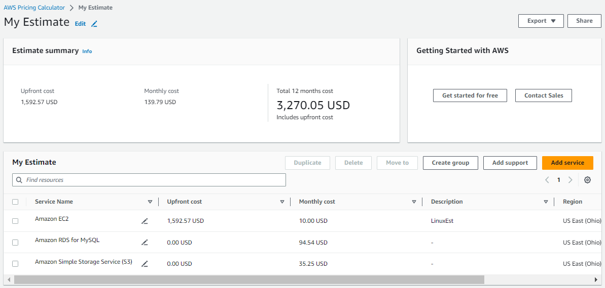

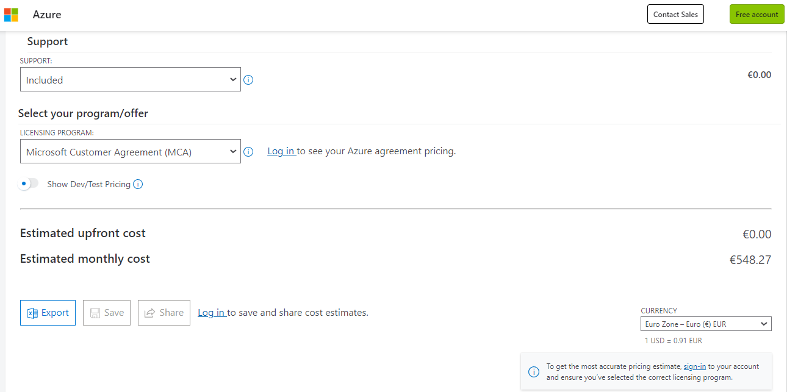

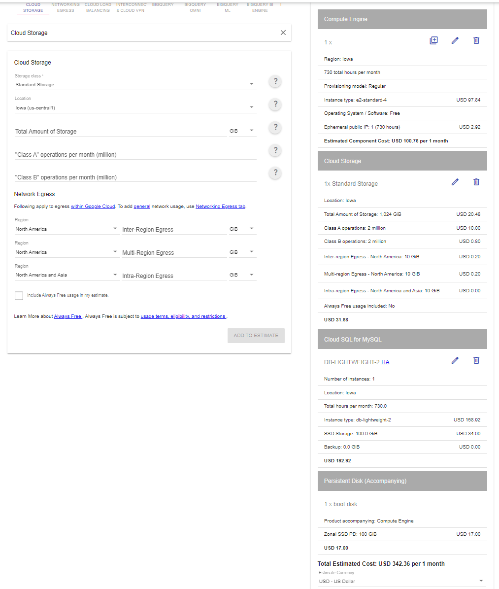

### Support

Cloud **resource responsibility** refer to the distribution of responsibilities between the cloud service provider (CSP) and the cloud customer regarding the management and maintenance of various aspects of the cloud environment.

- The specific responsibilities allocated to each party can vary based on the cloud service model being used (`e.g.` IaaS, PaaS, SaaS) - shared responsibility model.
  - CSP - infrastructure, data centers, networking, physical security, hardware maintenance
  - Customer - resources and services management and configuration (data plane)

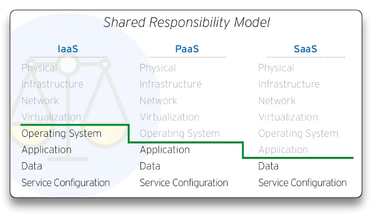

In terms of **SLA**s (**S**ervice **L**evel **A**greements), the customer can be responsible of the workload and services that are running. *The **SLA** is a contractual agreement between a service provider and a customer that defines the expected level of service and the metrics by which that service will be measured.*

📌 SLAs

- 🔗 [AWS - Service Level Agreements (SLAs)](https://aws.amazon.com/legal/service-level-agreements/)
- 🔗 [Azure - Service Level Agreements (SLA) for Online Services](https://www.microsoft.com/licensing/docs/view/Service-Level-Agreements-SLA-for-Online-Services)
- 🔗 [Google Cloud Platform - Service Level Agreements](https://cloud.google.com/terms/sla/)

Cloud **support** refers to the assistance and services provided by the CSP to support the customer in effectively utilizing and managing cloud resources and services. 

`e.g.` Technical assistance, issue resolution, service monitoring, configuration and deployment assistance, kb and documentation, SLAs, service upgrades, training.

📌 Support Plans

- 🔗 [AWS Support Plan Pricing](https://aws.amazon.com/premiumsupport/pricing/)
- 🔗 [Azure Support Plans](https://azure.microsoft.com/en-us/support/plans/)
- 🔗 [Google Cloud Customer Care](https://cloud.google.com/support/)

## Services

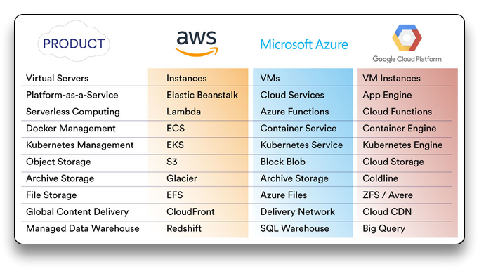

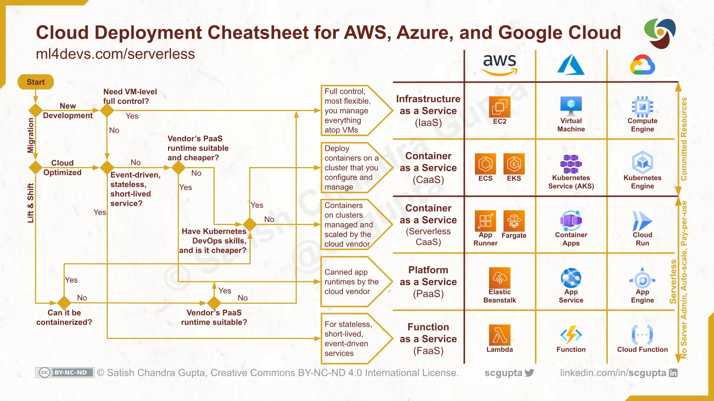

### IaaS

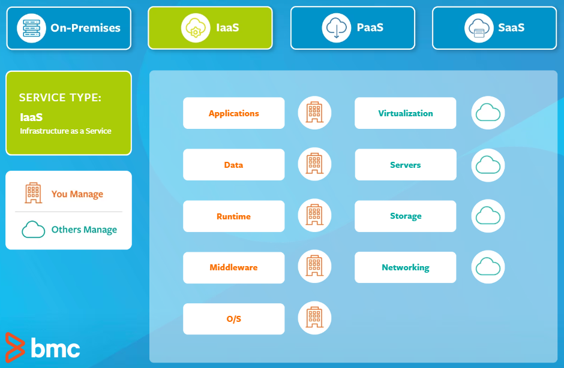

| Cloud Provider - Infrastructure as a Service |
| :------------------------------------------: |
|              Physical Facility               |
|           Physical Infrastructure            |
|                Virtualization                |
|               Management Plane               |

The customer is responsible for the **Virtual Machines, Services and Workload** levels.

#### Networking

A **VPC** (**V**irtual **P**rivate **C**loud) is a virtual network environment within a cloud computing platform, that provides isolated and secure networking capabilities, allowing users to create and manage their own virtual network infrastructure in the cloud.

- Private networking, IP management, Subnets, Routing, DNS, Net Security/ACLs

#### Computing

A cloud **instance** (virtual machine - VM), is a virtualized computing environment created within a cloud computing platform. It represents a single, independent server instance that runs within the infrastructure of the cloud service provider.

- Size
  - Series/Size/CPU/Ram
- Image (Win/Linux Operating System, Software, Custom)
- Storage
- Networking (VPC)
- Security Access
- Monitoring

#### Storage

Cloud **storage** refers to a data storage service provided by the CSP where data is stored and managed in a remote cloud infrastructure.

- AWS
  - S3 buckets, EFS, EBS
- Azure
  - Storage account, Managed disks
- Google Cloud
  - Storage buckets
  - Compute engine disks and images

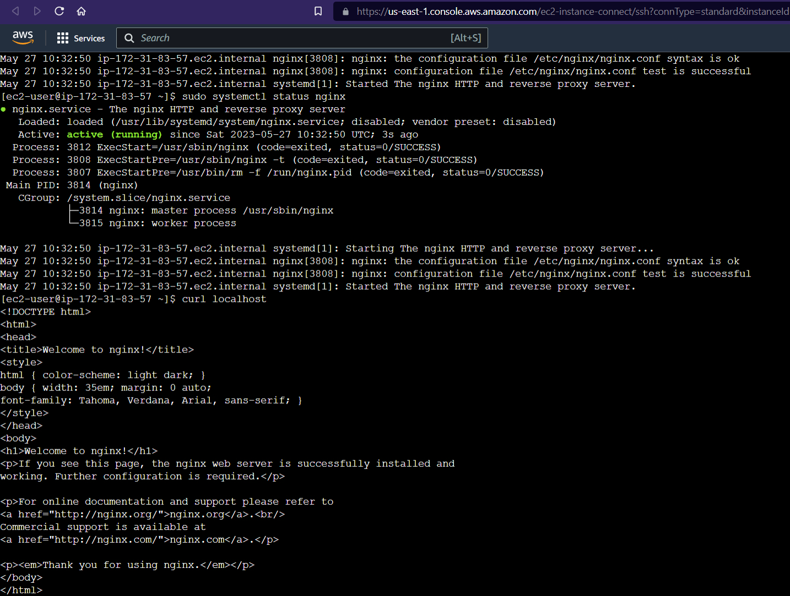

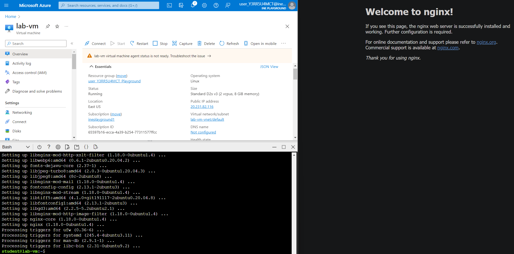

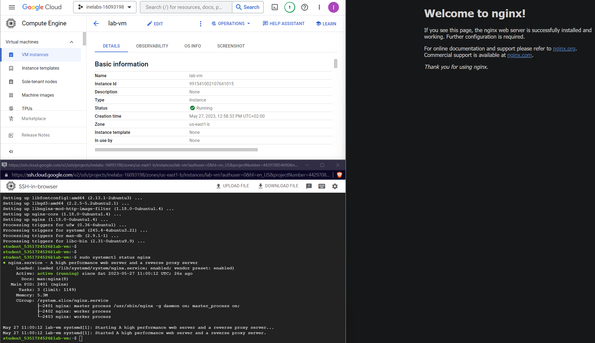

### PaaS

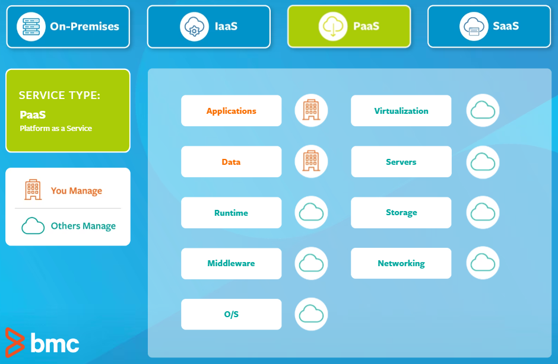

| Cloud Provider - Platform as a Service |
| :------------------------------------: |
|           Physical Facility            |
|        Physical Infrastructure         |
|             Virtualization             |
|            Management Plane            |
|            Virtual Machines            |
|                Services                |

The customer is responsible only for the **workload** level.

- Application Hosting
  - Containers
  - Various types of Apps

- Data Hosting
  - Various types of databases
- Security, Media, Migration, Archiving, IoT, Cognitive, Machine learning Services, etc

### SaaS

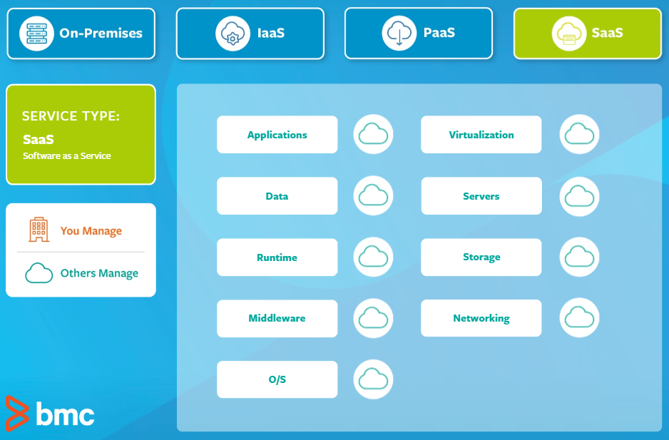

| Cloud Provider - Software as a Service |
| :------------------------------------: |
|           Physical Facility            |
|        Physical Infrastructure         |
|             Virtualization             |
|            Management Plane            |
|            Virtual Machines            |
|                Services                |
|                Workload                |

The cloud SaaS provider supplies every level, but gives the customer the ability to manage the **Workload** level.

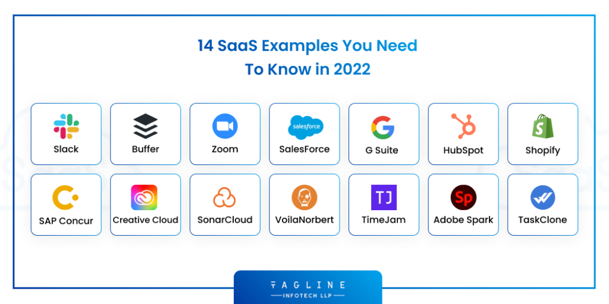

📌 SaaS Examples

- 🔗 [SalesForce](https://www.salesforce.com/)
- 🔗 [Microsoft365](https://www.microsoft.com/)
- 🔗 [Google Workspace (G Suite)](https://workspace.google.com/)
- Collaboration
  - 🔗 [Slack](https://slack.com/)
  - 🔗 [Zoom](https://zoom.us/)
  - 🔗 [Microsoft Teams](https://www.microsoft.com/en-us/microsoft-teams/group-chat-software)
- Others like:
  - CRM (customer relations management), 
  - Resource planning (SAP), Business continuity
  - Content management systems, etc

### Scalability & Availability

Cloud **regional computing** refers to the deployment of cloud computing resources within a specific geographic region.

Cloud service providers typically have **multiple data centers** located in different regions around the world, and regional computing allows users to deploy and access their cloud resources in a specific geographic area/**availability zones**.

- `e.g.` - [Google Cloud Global Locations](https://cloud.google.com/about/locations/)

**Availability** refers to the measure of how accessible and operational cloud services an resources are to users (load balancing, disaster recovery, redundancy, failover). 

**Cloud scale** refers to the ability of cloud computing systems to handle large-scale workloads and accommodate rapid growth and demand. It refers to the capacity and capability of cloud infrastructure to scale resources, such as computing power, storage and network bandwidth, in response to varying workloads and user demands, also minimizing costs by **auto-scaling**.

- `e.g.` - [Google Cloud Load balancing and Scaling](https://cloud.google.com/compute/docs/load-balancing-and-autoscaling)

------

