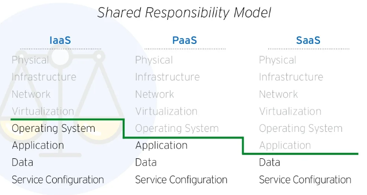

# 📒2. Cloud Management Concepts

> #### 📕 Learning Objectives
>
> * Basics aspects of managing cloud **resources** and related tasks
> * Cloud **access control** fundamentals

## Management Foundations

Cloud **shared responsibility** refers to the distribution of security and management responsibilities between cloud service providers and cloud customers. Both the CSP and the customer have distinct roles and responsibilities to ensure the security, availability and proper management of the cloud environment and its resources.

### Management Responsibility

The **CSP** will always be responsible for the physical facility and infrastructure, virtualization and cloud management plane.

The **customer** is always responsible for identities and subscription access.

- `Customer Responsibility e.g.`
  - IaaS: *Virtual machine* (O.S.), *Services*, *Workload* (Application, Data, Service configuration)
  - PaaS: *Workload* (Application, Data, Service configuration)
  - SaaS: *Customizations* (Data, Service configuration, Usage, Identity, Access, Good practices & Compliance)

### Security Responsibility

CSP is responsible of

- Physical, Infrastructure, Platform security
- Identity system security
- *Standards compliance*

Customer is responsible of

- Identity, Data, Application security (good practices)
- *Standards compliance*

### Resiliency Responsibility

CSP responsibility

- Infrastructure **Resiliency**, Uptime service level agreement (SLAs)
- Service **Availability**, Disaster Recovery

Customer responsibility

- Build resilient applications and integrate CSP built-in availability and resiliency
- Implement data backup, replication, business continuity planning

### Workload Responsibility

Workload responsibility includes the tasks and considerations involved in deploying, configuring, monitoring and securing the specific applications, services and data that make up the workload.

CSP is responsible of

- SaaS out of the box workload failures (with no customization)

📌 *Effective software lifecycle management techniques are essential.*

Customer is responsible of

- Workload configuration
- App and Data security
- Monitoring and Performance

## Resource Management

### Control Plane

### Data Plan