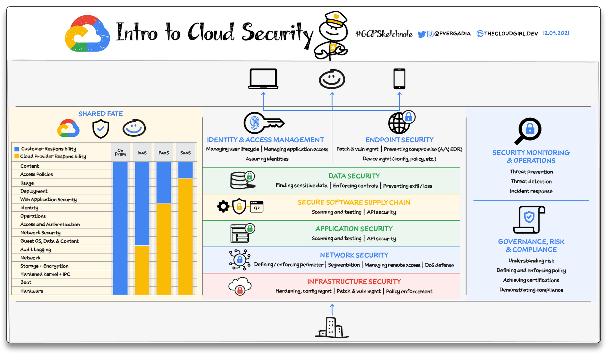
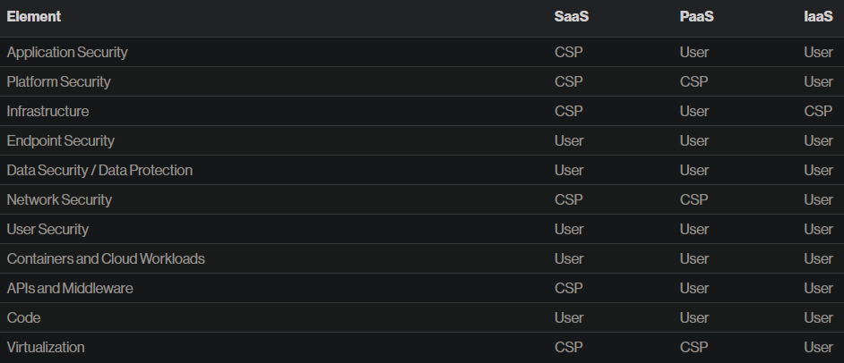
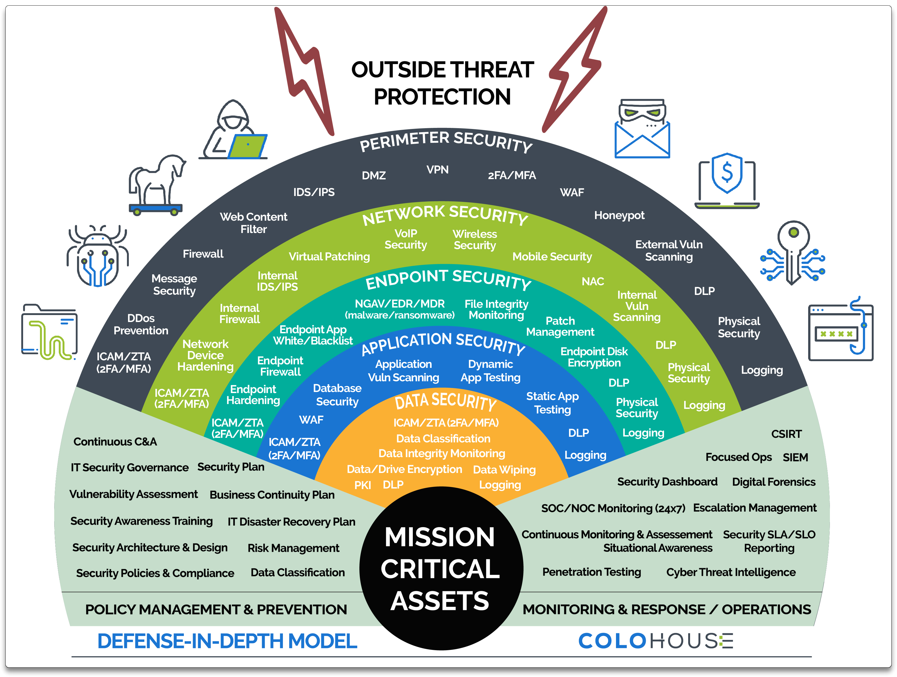
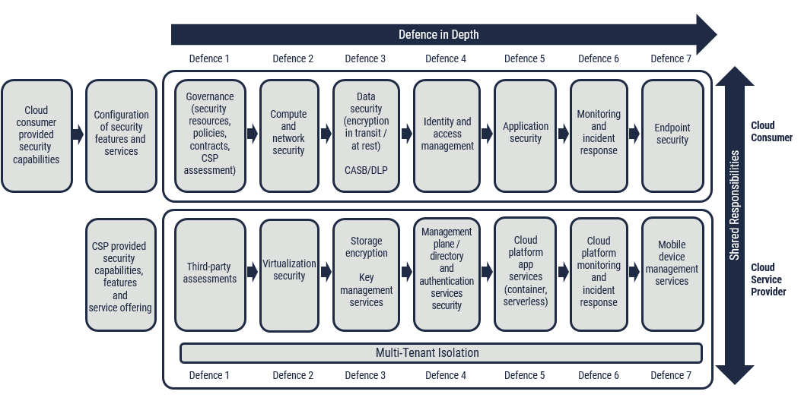
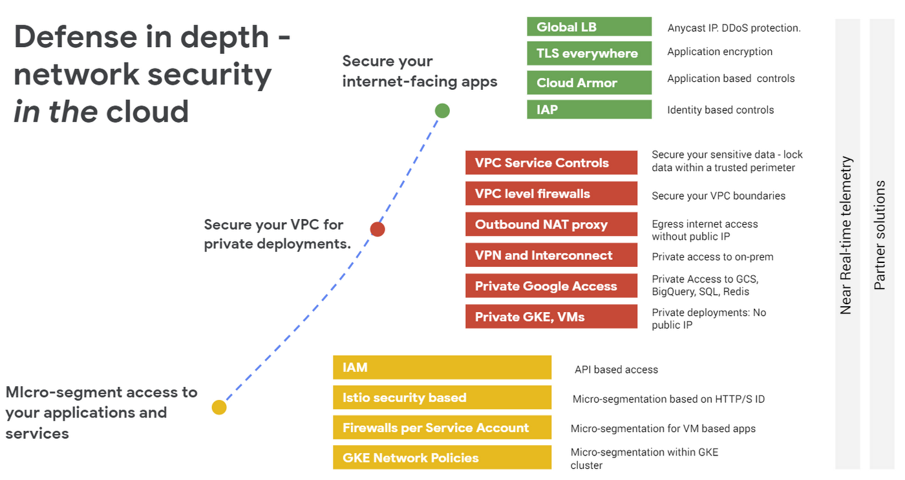
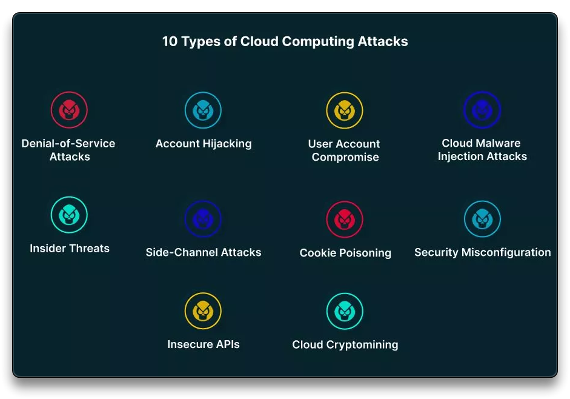
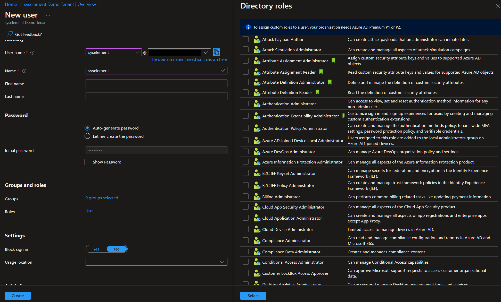
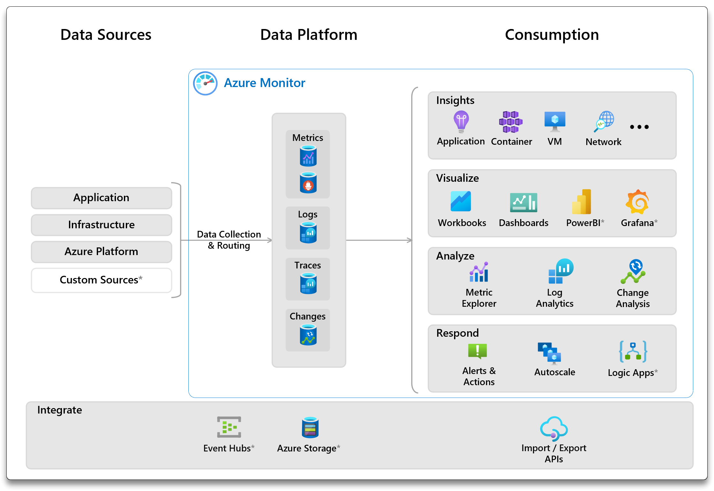
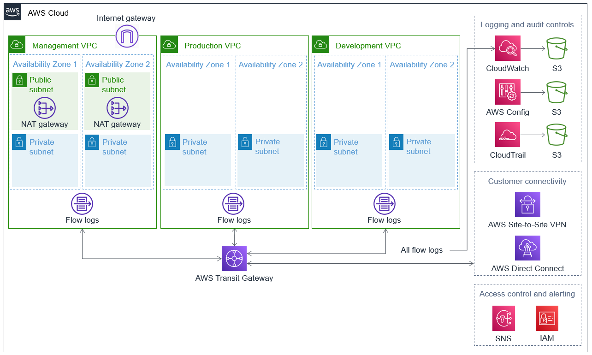

# 📒3. Cloud Identity, Security, and Compliance

> #### 📕 Learning Objectives
>
> * Basics aspects of managing cloud **resources** and related tasks
> * Cloud **access control** fundamentals

## Cloud Security

**Securing** cloud resources involves implementing measures and best practices to protect data, applications and infrastructure deployed in a cloud environment from unauthorized access, data breaches and other security threats. Cloud security is a shared responsibility between the **cloud service provider** (CSP) and the **cloud user** (customer).

### Shared Responsibility Model

> 🔗 [Shared Responsibility Model - Crowdstrike](https://www.crowdstrike.com/cybersecurity-101/cloud-security/shared-responsibility-model/)
>

|     Cloud Architecture      | e.g. Responsibility for IaaS | e.g. Responsibility for PaaS |
| :-------------------------: | ---------------------------- | ---------------------------- |
|          Workload           | User                         | User                         |
|          Services           | User                         | CSP                          |
|      Virtual Machines       | User                         | CSP                          |
|       *Control Plane*       | CSP                          | CSP                          |
|     **Virtualization**      | CSP                          | CSP                          |
| **Physical Infrastructure** | CSP                          | CSP                          |
|    **Physical Facility**    | CSP                          | CSP                          |

From a security standpoint, the responsibility depends on what level of service is used.

At the level of **data plane** and **control plane** (tools, consoles, CLI, SDK), securing cloud resources is important and IAM is a key aspect of it.

- Identity protection
- Strong authentication mechanisms
- Control access
- Data encryption
- Network security
- Patching and updates

**Security measures must be applied to both the data and the control plane.**

### Defense in depth

[Defense in depth](https://www.cloudflare.com/learning/security/glossary/what-is-defense-in-depth/) (layered security) is a principle and strategy in cloud security that involves implementing multiple layers of security controls and measures to protect cloud resources from various threats and attacks.

- Robust and resilient posture
- Mitigate the risk of a single security control

Public Network (Perimeter)

- Public **firewall**, DDos Prevention, IDS/IPS, etc

Local Network

- nACL, Device **Hardening**, Monitoring, etc

Operating System (Endpoint)

- Hardening, **Patching**, Endpoint Protection, **Monitoring**, etc

Service (Application)

- **Hardening**, Patching, Monitoring, Vuln Scanning, Testing, etc

Workload

- Authentication, Authorization, Auditing, Data access control, Monitoring, **Encryption** (in transit & at rest), MFA, etc

> 🔗 `e.g.` [Google Cloud networking in depth](https://cloud.google.com/blog/products/networking/google-cloud-networking-in-depth-three-defense-in-depth-principles-for-securing-your-environment)
>

## Cloud Attacks

Cloud platform attacks refer to security **incidents** and **vulnerabilities** that specifically *target cloud computing platforms*.

> 🔗 [Top 10 Cloud Attacks and What You Can Do About Them - aquasec.com](https://www.aquasec.com/cloud-native-academy/cloud-attacks/cloud-attacks/)

### Attacks targets

- *Identities* - SaaS, Cloud Platform, Data plane identities
  - `e.g.` - administrator Azure **AD** credentials/identities
- *Data*
  - `e.g.` - AWS S3 **bucket**, or relational/non-relational data
- *Services* - SaaS, Control plane services, Compute instance
  - `e.g.` - emails, automation (API), EC2

### Attack Methods

- *Misconfiguration* - intentional or unintentional
  - `e.g.` - Publicly available data stores or services (DBs, public API, etc)
- *Account hijacking*
  - `e.g.` - Brute force, Password spraying, [Credentials stuffing](https://www.cloudflare.com/learning/bots/what-is-credential-stuffing/)
- *Service hijacking*
  - `e.g.` - Insecure API Keys
- *Malware injection*
  - `e.g.` - compromised web app, API compromised bad code, infected VM, code repositories (open-source libraries)

## IAM & Identity Protection

### Sources

Providers naming: **AWS/GCP IAM**, **Azure AD**

- *Users* - Cloud User, Guest User, External/Hybrid User (*Federated Systems*)
  - minimize privileged `admin`/`root` (cloud subscription account) user access
  - create groups and use **dynamic management**
  - security assessments and **auditing** user configuration
  - apply ***least required rights*** concept ([POLP](https://www.crowdstrike.com/cybersecurity-101/principle-of-least-privilege-polp/))
- *Resources*
  - apply least privileges and **audit** resource access & review
  - use dynamic access policies
  - **separate control plane and data plane access**

`e.g.` It can be useful to organize user identities into a flow like this:

User identity/credentials (Access management)

⬇️

Group

⬇️

Role

⬇️

Resource

> 📌 CSPs Identity Management
>
> 🔗 [AWS IAM Identities](https://docs.aws.amazon.com/IAM/latest/UserGuide/id.html)
>
> - Users, Roles, Policies
>
> 🔗 [Azure AD](https://learn.microsoft.com/en-us/azure/active-directory/fundamentals/active-directory-whatis)
>
> - Users, Service Principals, Managed Identities, Roles
>
> 🔗 [Google Cloud IAM](https://cloud.google.com/iam/docs/overview)
>
> - Google Account, Service Account, Role, Policy

All the CSPs have identity protection services like

- AWS CloudTrail, Trusted Advisor
- Azure Identity Protection and AD Logs
- Google Cloud Identity, Advanced Protection Program, Security Key

### Vulnerabilities

`e.g.` Account & Login vulnerabilities:

- weak passwords, leaked credentials, threat intelligence
- location/IP anomalies, password spraying, brute force attacks

 📌 Best practices for accessing and managing cloud resources and users:

- use strong authentication (**MFA**) & enforce strong **password policies**
- implement **role-based/conditional access** control
- **monitor** user activities & review user permissions/config
- use secure connection protocols & data encryption
- implement network segmentation
- regular systems patching & users training
- **audit** unused accounts

### Response

1. **Revoke** the permissions for the compromised identity and isolate it
2. **Reset** identities (session tokens, API & access keys)
3. **Review** what happened and determine impact with IT and business colleagues
4. **Remediate** and fix it, improve processes and plan of action, report
5. **Return** to operating state and monitor

## Resource Protection

### Data

There are many types of cloud data like

- files, relational/non-relational databases (managed, proprietary, IaaS), big data, sensitive data

Protecting **cloud data at rest** involves implementing mechanisms to ensure the confidentiality, integrity and availability of data even when it is not actively being accessed or transmitted.

- network controls and permissions
- encryption, hardware security module
- backup, replication

Protecting **cloud data in transit** involves security measures and protocols to safeguard data transmitted across networks.

- encryption (always) through secure communication protocols
- Hardware security modules (`HSM`)

 📌 Best practices for cloud data protection:

- Access controls - limit access to resource, data, network
- Encryption - at rest, in transit, end-to-end
- Backup and Recovery
- Regular security Audits and assessments

> 🔗 [GCP Data Encryption options](https://cloud.google.com/storage/docs/encryption)
>
> 🔗 [AWS Data Encryption](https://docs.aws.amazon.com/AmazonS3/latest/userguide/UsingEncryption.html)
>
> 🔗 [Azure Storage service-side encryption](https://learn.microsoft.com/en-us/azure/storage/common/storage-service-encryption)

### Network

The cloud provider ensures network and (virtualized and physical) infrastructure  protection through DDoS protection and general threat protection.

The physical connection between the cloud resources of one customer and those of another is handled by the cloud vendor. The customer is responsible for the physical network between their cloud resources.

At tenant level, there are some layers to protect and that the customer is responsible for, such as:

- [AWS VPC](https://aws.amazon.com/products/security/network-application-protection/)
  - Network ACL - Subnet level
  - Security Group - EC2 level
  - [PrivateLink](https://docs.aws.amazon.com/vpc/latest/userguide/endpoint-services-overview.html) - establish private connectivity between Virtual Private Clouds and supported services.
- [Azure Network Security](https://azure.microsoft.com/en-us/solutions/network-security)
  - Network Security Group - Subnet & Instance level
  - [Private Endpoint](https://learn.microsoft.com/en-us/azure/private-link/private-endpoint-overview)
- [Google Cloud Network Security](https://cloud.google.com/learn/what-is-cloud-network-security)
  - Firewall Rule - VPC, Subnet, VM Level
  - [VPC Service Controls](https://cloud.google.com/vpc-service-controls)

Additional network security services:

- *AWS* - Shield, Web Application Firewall (WAF), GuardDuty
- *Azure* - Firewall, App Gateway, FrontDoor
- *Google* - Cloud Armor

📌 Best practices for cloud network protection:

- leverage cloud provider tools and limit **public** attack surface
  - check firewall rules and don't open ports globally
- monitor, setup alerts for abnormal usage and have a playbook for this kind of activity

### Compute

**Infrastructure compute protection** involves

- *patch management*
  - IaaS - automated OS patching (AWS, Azure) & service
- *resource protection*
- *OS hardening* (run only required services, with most secure settings)
- *monitoring* (logs)
- *attack surface minimization* (block ports).
- *availability* (multiple instances)

**Platform compute protection** involves the cloud provider to secure the services and operating system of the running application

- custom options can also be set up by the customer
- PaaS - always patched by the CSP

**Confidential computing** enables the execution of workloads while *keeping the data and code confidential*, protecting them from the cloud service provider, other tenants and potential attackers, unauthorized data access, inside a trusted isolated execution environment (application **enclave**).

- Confidential compute requires specific compute instance sizes and hardware

> 🔗 [Azure Confidential Computing](https://azure.microsoft.com/en-us/solutions/confidential-compute/)
>
> - `e.g.` [Azure - Confidential computing on a healthcare platform](https://learn.microsoft.com/en-us/azure/architecture/example-scenario/confidential/healthcare-inference#architecture)

**Monitoring** is a built-in feature into the cloud platform.

- 3rd party agent monitoring can also be used

> 🔗 [Azure Monitoring](https://learn.microsoft.com/en-us/azure/azure-monitor/overview)
>
> 

### Compliance

**Cloud Regulatory Compliance**  refers to the adherence to specific laws, regulations and industry standards that govern the protection, privacy and security of data and systems within the cloud computing environment. *Organizations that operate in regulated industries or handle sensitive data are required to comply with various legal and industry-specific requirements and frameworks*.

Key aspects:

- data protection regulations (GDPR, CCPA, HIPAA)
- security standards (PCI DSS, ISO 27001, NIST CyberSec framework
- data residency and vendor due diligence
- audit and reporting
- incident response
- data backup and retention

**CSP Regulatory Support**

> 📌 Tools
>
> - 🔗 [**Amazon** GuardDuty](https://www.amazonaws.cn/en/guardduty/)
> - 🔗 [**Azure** Compliance Manager](https://learn.microsoft.com/en-us/microsoft-365/compliance/compliance-manager)
> - 🔗 [**GCP** Security Command Center](https://cloud.google.com/security-command-center)
>
> 📌 Documentation
>
> - 🔗 [AWS Artifact](https://aws.amazon.com/artifact/)
> - 🔗 [Microsoft Trust Center](https://www.microsoft.com/en-us/trust-center/product-overview)
> - 🔗 [GCP Compliance Resource Center](https://cloud.google.com/security/compliance)

**Tenant Responsibilities**

Since the customer is responsible for cloud services compliance, he should

- understand customer compliance requirements and document provider compliance with regulations
- implement customer responsibilities
- use provider tools to maintain compliance

**Common Protected Data**

Protected data refers to sensitive information that requires special safeguards and security measures to *ensure its confidentiality, integrity and availability.*

- **PII** (Personally Identifiable Information) - individual data
- **PHI** (Protected Health Information) - healthcare
  - HIPAA ([Health Insurance Portability and Accountability Act](https://www.hhs.gov/hipaa/index.html))
- Financial Data - sensitive banking information (PII, PCI-DSS)
- **IP** (Intellectual Property) - inventions, patents, copyrights, business plans
- Legal & Compliance Data
- Confidential Business Data & business reputation
- Regional Considerations
  - GDPR-EU ([General Data Protection Regulation](https://gdpr.eu/))
  - CCPA ([California Consumer Privacy Act](https://oag.ca.gov/privacy/ccpa))
  - etc

> 🔗 [HIPAA Reference Architecture on AWS](https://aws.amazon.com/solutions/implementations/compliance-hipaa/)
>
> - [AWS HIPAA](https://aws.amazon.com/compliance/hipaa-compliance/)
>   - Under the HIPAA regulations, cloud service providers (CSPs) such as AWS are considered *business associates*
>
> 
>
> 🔗 [Google Cloud HIPAA - Compliance](https://cloud.google.com/security/compliance/hipaa-compliance)

***

