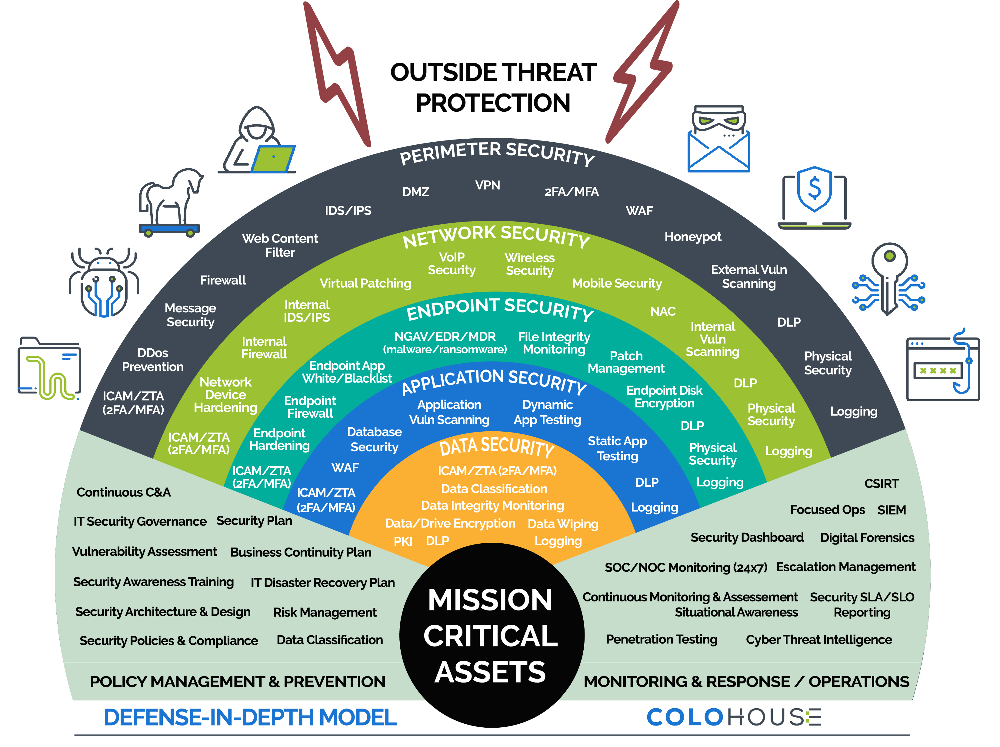
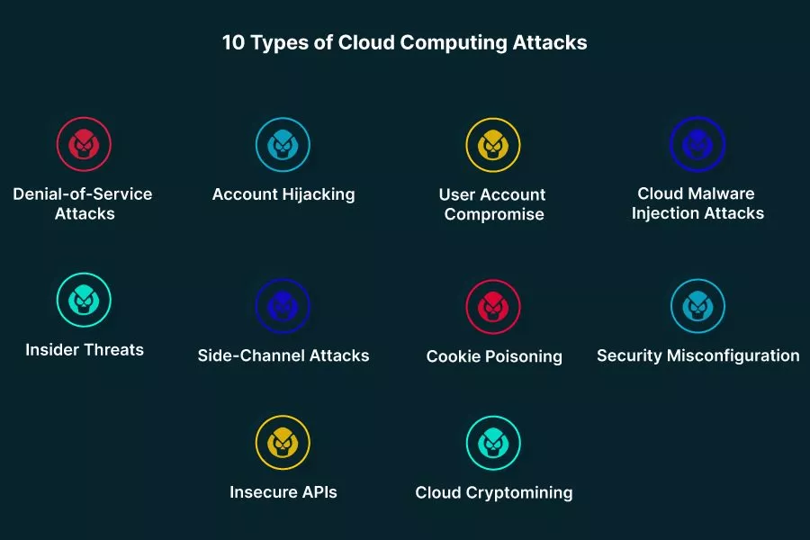

# 📒3. Cloud Identity, Security, and Compliance

> #### 📕 Learning Objectives
>
> * Basics aspects of managing cloud **resources** and related tasks
> * Cloud **access control** fundamentals

## Cloud Security

**Securing** cloud resources involves implementing measures and best practices to protect data, applications and infrastructure deployed in a cloud environment from unauthorized access, data breaches and other security threats. Cloud security is a shared responsibility between the **cloud service provider** (CSP) and the **cloud user** (customer).

### Shared Responsibility Model

> 🔗 [Shared Responsibility Model - Crowdstrike](https://www.crowdstrike.com/cybersecurity-101/cloud-security/shared-responsibility-model/)
>

|     Cloud Architecture      | e.g. Responsibility for IaaS | e.g. Responsibility for PaaS |
| :-------------------------: | ---------------------------- | ---------------------------- |
|          Workload           | User                         | User                         |
|          Services           | User                         | CSP                          |
|      Virtual Machines       | User                         | CSP                          |
|       *Control Plane*       | CSP                          | CSP                          |
|     **Virtualization**      | CSP                          | CSP                          |
| **Physical Infrastructure** | CSP                          | CSP                          |
|    **Physical Facility**    | CSP                          | CSP                          |

From a security standpoint, the responsibility depends on what level of service is used.

A the level of **data plane** and **control plane** (tools, consoles, CLI, SDK), securing cloud resources is important and IAM is a key aspect of it.

- Identity protection
- Strong authentication mechanisms
- Control access
- Data encryption
- Network security
- Patching and updates

**Security measures must be applied to both the data and the control plane.**

### Defense in depth

[Defense in depth](https://www.cloudflare.com/learning/security/glossary/what-is-defense-in-depth/) (layered security) is a principle and strategy in cloud security that involves implementing multiple layers of security controls and measures to protect cloud resources from various threats and attacks.

- Robust and resilient posture
- Mitigate the risk of a single security control

Public Network (Perimeter)

- Public **firewall**, DDos Prevention, IDS/IPS, etc

Local Network

- nACL, Device **Hardening**, Monitoring, etc

Operating System (Endpoint)

- Hardening, **Patching**, Endpoint Protection, **Monitoring**, etc

Service (Application)

- **Hardening**, Patching, Monitoring, Vuln Scanning, Testing, etc

Workload

- Authentication, Authorization, Auditing, Data access control, Monitoring, **Encryption** (in transit & at rest), MFA, etc

> 🔗 `e.g.` [Google Cloud networking in depth](https://cloud.google.com/blog/products/networking/google-cloud-networking-in-depth-three-defense-in-depth-principles-for-securing-your-environment)
>

## Cloud Attacks

Cloud platform attacks refer to security **incidents** and **vulnerabilities** that specifically *target the cloud computing platforms*.

> 🔗 [Top 10 Cloud Attacks and What You Can Do About Them - aquasec.com](https://www.aquasec.com/cloud-native-academy/cloud-attacks/cloud-attacks/)

### Attacks targets

- *Identities* - SaaS, Cloud platform, Data plane identities
  - `e.g.` - administrator Azure **AD** credentials/identities
- *Data*
  - `e.g.` - AWS S3 **bucket**, or relational/non-relational data
- *Services* - SaaS, Control plane services, Compute instance
  - `e.g.` - emails, automation (API), EC2

### Attack Methods

- *Misconfiguration* - intentional or unintentional
  - `e.g.` - Publicly available data stores or services (db, public API, etc)
- *Account hijacking*
  - `e.g.` - Brute force, Password spraying, [Credentials stuffing](https://www.cloudflare.com/learning/bots/what-is-credential-stuffing/)
- *Service hijacking*
  - `e.g.` - Insecure API Keys
- *Malware injection*
  - `e.g.` - compromised web app, API compromised bad code, infected VM, code repositories (open-source libraries)

## IAM & Identity Protection

### Sources

Providers naming: **AWS/GCP IAM**, **Azure AD**

- *Users* - Cloud User, Guest User, External/Hybrid User (*Federated Systems*)
  - minimize privileged `admin`/`root` (cloud subscription account) user access
  - create groups and use **dynamic management**
  - security assessments and **auditing** user configuration
  - apply ***least required rights*** concept ([POLP](https://www.crowdstrike.com/cybersecurity-101/principle-of-least-privilege-polp/))
- *Resources*
  - apply least privileges and **audit** resource access & review
  - use dynamic access policies
  - **separate control plane and data plane access**

`e.g.` It can be useful to organize user identities into a flow like this:

User identity/credentials (Access management)

⬇️

Group

⬇️

Role

⬇️

Resource

> 📌 CSPs Identity Management
>
> 🔗 [AWS IAM Identities](https://docs.aws.amazon.com/IAM/latest/UserGuide/id.html)
>
> - Users, Roles, Policies
>
> 🔗 [Azure AD](https://learn.microsoft.com/en-us/azure/active-directory/fundamentals/active-directory-whatis)
>
> - Users, Service Principals, Managed Identities, Roles
>
> 🔗 [Google Cloud IAM](https://cloud.google.com/iam/docs/overview)
>
> - Google Account, Service Account, Role, Policy

All the CSPs have identity protection services like

- AWS CloudTrail, Trusted Advisor
- Azure Identity Protection and AD Logs
- Google Cloud Identity, Advanced Protection Program, Security Key

### Vulnerabilities

`e.g.` Account & Login vulnerabilities:

- weak passwords, leaked credentials, threat intelligence
- location/IP anomalies, password spraying, brute force attacks

Best practices for accessing and managing cloud resources and users:

- use strong authentication (**MFA**) & enforce strong **password policies**
- implement **role-based/conditional access** control
- **monitor** user activities & review user permissions/config
- use secure connection protocols & data encryption
- implement network segmentation
- regular systems patching & users training
- **audit** unused accounts

### Response

## Resource Protection

### Data

### Network

### Compute

### Compliance

***

