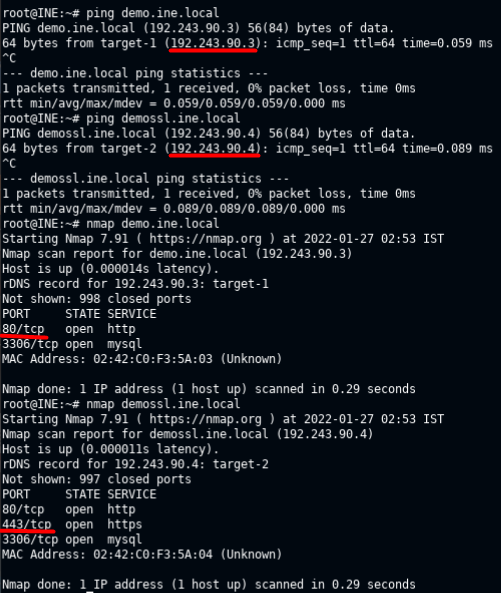

# HTTP(S) Traffic Sniffing

## 🔬 

0. Connect to the Lab VPN (INE in this case) by using OpenVpn and the **.ovpn** file provided. (in my case INE provided a direct Lab Link / Kali GUI instance opened in another tab).

    - From terminal, check if the machines are reachable:

      `ping demo.ine.local`

      `ping demossl.ine.local`

    - Check open ports with nmap tool:

      `nmap demo.ine.local`

      `nmap demossl.ine.local`

    - Check the Kali Machine interface name:

      `ifconfig`

      

1. Open Wireshark and start the capture on the Vpn network interface.

   - or use the terminal: `wireshark -i eth1 `

2. Generate traffic from the browser by browsing to the **HTTP** web page (`http://demo.ine.local`) and try a login.

3. The sniffer records the traffic between the browser and the server. Right click on a packet and `Follow TCP Stream` to see the traffic exchange.

   - In case of HTTP protocol, the clear-text traffic can be sniffed easily. The content of the packets is in human readable form.

     

4. Restart the capture to clean the results. Try the same login into the **HTTPS** web page (`https://demossl.ine.local`) and check the TCP Stream in the captured traffic.

   - Check the certificate with the lock icon.

   - In case of HTTPS protocol, the traffic is encrypted, unreadable and protected.

   - HTTPS (HTTP over TLS) protects the content

     

5. Captured traffic can be filtered in Wireshark with *display filters*.

> 📍 Lab solved!
