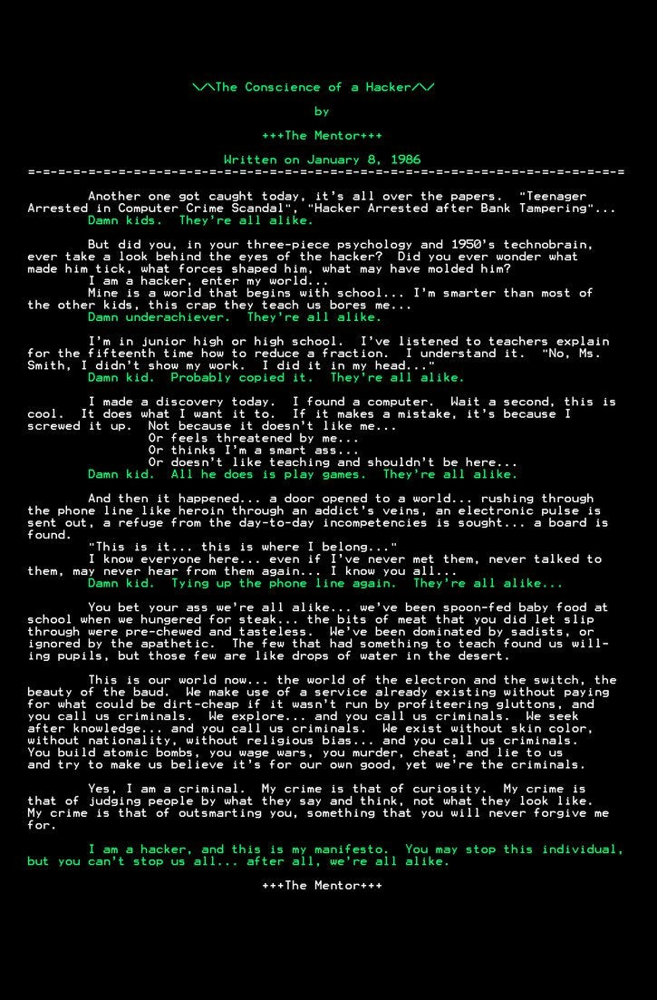

# Introduction

## The Information Security Field

Pentesting career, supported by:

- knowing the information security (**`infosec`**) field
- career opportunities
- talking with colleagues

### InfoSec Culture

Deep roots in the underground hacking scene.

**`Hacker`** = refers to people who prefer to understand how a system works, being curious, intelligent and motivated to pursue knowledge.

Usually a hacker approach systems with curiosity, so he can:

- Find new ways to use computer systems
- Bypass imposed restrictions
- Understand security pitfalls

*Performing an attack* means to **understand** the technology and the functioning of the target system.

*Being a Hacker* means **improving** skills everyday, pushed by **curiosity** and hunger for **knowledge**.

> There is always something new to learn!

*Hacking* is more of an approach, a lifestyle.

*Being an InfoSec professional* means pursuing knowledge by keeping challenging yourself and your colleagues, being honest with yourself and never stop. 

- To have an idea about the ideals of the underground hacking community read "[The Conscience of a Hacker](http://phrack.org/issues/7/3.html)" or in the picture below.

### Career Opportunities

Companies, government bodies are using advanced tech to store and process confidential data.

*Data* is transmitted across private & public networks. It is a **must** to:

- **Protect sensitive information**
- Implement hardware and software defensive systems
- Protect digital assets from major **cyber-threats** like:
  - global cyber syndicates
  - hackers for hire
  - hacktivists
  - terrorists
  - state-sponsored hackers

