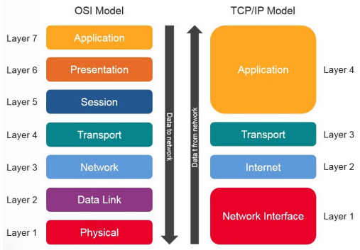
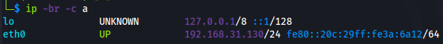
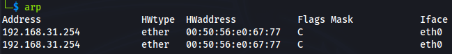
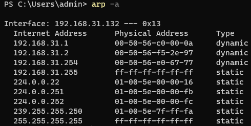
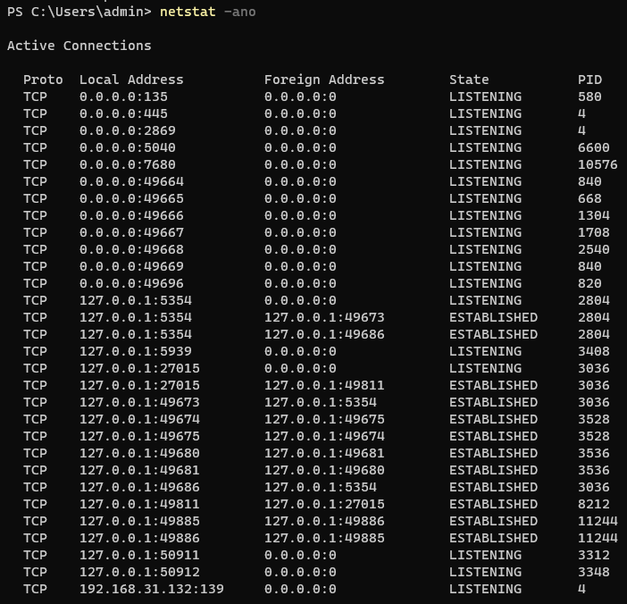

# Networking

## Protocols

> ⚡ P.T. Usage:
>
> * Know how protocols work in order to learn how to exploit them

Computers have to use a wide variety of networking **protocols**, to ensure that different types of hardware and software can communicate between each other.

### Packets

**`Packets`** carry the information exchanged in networking.

* Streams of bits, electric signals running on media such as a **wire** in a LAN network or **the air** in a wireless connection.
* Interpreted as bits (0,1).

A packet's structure consists of a **`header`** and a **`payload`**.

* The header have a protocol specific structure, ensuring that the payload is correctly interpreted.
* The payload is the data, the content, the body of a packet.

_**IP** (Internet Protocol) header_ (IPv4) is 160 bits (20 Bytes) long.

* First 4 bits - version of IP protocol.
* Source Address - 32 bits (4 Bytes), in position 96.
* Destination Address - 32 bits (4 Bytes) after Source Address.

### Protocol Layers

A protocol provides various features like:

* making an _application_ work (emails, VoIP calls, FTP, browser)
* connecting a server and a client, _transporting_ data between them
* identifying and internetworking computers/hosts on a _network_
* transmitting data over _physical_ media

These features are structured as a protocol stack, in a series of layers.

* TCP/IP is a real world implementation of a networking stack.

| TCP/IP Protocol Stack |
| :-------------------: |
|      Application      |
|       Transport       |
|   Network / Internet  |
|   Physical Interface  |

> 📕 Each layer has its own protocol and serves the one above it.

### ISO/OSI

The Open System Interconnection (**`OSI`**) is a logical and conceptual model published by the International Organization for Standardization (**`ISO`**) in 1984, used as reference.

| ISO/OSI Protocol Stack |
| :--------------------: |
|       Application      |
|      Presentation      |
|         Session        |
|        Transport       |
|         Network        |
|        Data Link       |
|        Physical        |

* TCP/IP vs ISO/OSI model:

### Encapsulation

During the process of **`encapsulation`**, a lower-layer protocol places the entire upper protocol packet (header + payload) in its payload portion and adds its own header to the packet.

* Every packet sent by a host is encapsulated.
* The same operation is done in reverse order by the receiving host.

***

## Internet Protocol (IP)

> ⚡ P.T. Usage:
>
> * Understand network attacks and use network attack tools
> * Studying other networking protocols

The Internet Protocol (**`IP`**) runs on the Internet layer of the TCP/IP stack, by delivering the **datagrams** (IP packets) to the hosts participating in the communication.

* Every host is identified by a unique **`IP address`**.

### IPv4

**`IP version 4`** is widely used in networking and is considered the primary Internet Protocol.

* An **IPv4 address** is a 32 bits address, consisting of 4 Bytes/octets, separated by a dot (**.**) .

$$
1\ Byte = 8\ bits \\ 2^8=256\ values\ that\ can\ be\ represented\ from\ 0\ to\ 255 \\ IP\ Example\dashrightarrow\ 216.58.208.142
$$

* There are some IPv4 addresses with reserved intervals:

$$
10.0.0.0/8\ (10.0.0.0\to\ 0.255.255.255)\dashrightarrow\ Private\ networks\ \\ 127.0.0.0/8\ (127.0.0.0\to\ 127.255.255.255)\dashrightarrow\ Internet\ host\ loopback\ / \ Local\ host \\ 192.168.0.0/16\ (192.168.0.0\to\ 192.168.255.255)\dashrightarrow\ Private\ networks\
$$

* Refer to the [RFC 5735](https://datatracker.ietf.org/doc/html/rfc5735) for more examples and details.

### IP/Mask

The **`network`** of a host is identified using a **`netmask`** (subnet mask) paired with the IP.

* The network part of the IP is found with a bitwise AND operation between the IP and the Mask.
* The address/host part of the IP is found with a bitwise AND between the IP and the inverse of the Netmask.
* For example 192.168.44.22 with 255.255.224.0 subnet mask is part of the 192.168.32.0/19 network.
* **`CIDR`** notation = **C**lassless **I**nter-**D**omain **R**outing notation

$$
Notation \to 192.168.32.0/255.255.224.0 \\ CIDR\ notation \to 192.168.32.0/19 \\ 192.168.32.0 \to network\ address \\ 192.168.32.255 \to broadcast\ address \\ Total\ number\ of\ hosts\ contained\ =\ 2^{13}=8192\ \\ Total\ number\ of\ usable\ hosts =8190
$$

> 📌 Practice with an [Online IP Subnet Calculator](https://www.calculator.net/ip-subnet-calculator.html).

### IPv6

* An **IPv6 address** is a 128 bits address, consisting of 16 bits hexadecimal numbers (case insensitive) grouped in 8 segments, separated by a colon (**:**).
* Zeros can be skipped.
* The first half of an address is the _network_ part, the other half is the _device_ part:
  * The first 3 segments (upper 48 bits) are used for the Internet global network addresses.
  * The 4th segment of 16 bits is the Subnet Id, defining subnets.
  * The last 4 segments of 64 bits are the Interface/Device Id.

$$
IPv6\ Example \\Regular form\dashrightarrow\ 2001:0db8:0000:0000:0000:ff00:0042:7879 \\Compressed form\dashrightarrow\ 2001:0db8::ff00:0042:7879
$$

* Reserved addresses:

$$
Loopback\ address\dashrightarrow\ ::1/128 \\ IPv4\ Mapped\ addresses\dashrightarrow\ ::FFFF:0:0/96
$$

* Types of IPv6 address formats:
  * **`Global Unicast`** - start with "2001:", routable on the Internet (equivalent of IPv4 public addresses).
  * **`Unique Local`** - used inside an internal network, routed only internally.
  * **`Link Local`** - start with "fe80:", used inside an internal network, not routed, self assigned (no DHCP server).
* The number of bits used for the prefix is the **`prefix length`**, like the IPv4 subnet mask.

$$
2001:1234:5678:1234:5678:ABCD:EF12:1234/64 \\ Prefix\ is\dashrightarrow\ 2001:1234:5678:1234::/64 \\ Host\dashrightarrow\ 5678:ABCD:EF12:1234
$$

* Refer to the [RFC 3513](https://datatracker.ietf.org/doc/html/rfc3513) for more examples and details.

> 📌 Practice with an [IPv6 Subnet Calculator](https://www.vultr.com/resources/subnet-calculator-ipv6).

***

## Routing

> ⚡ P.T. Usage:
>
> * Perform network traffic inspection
> * Understand routing protocol attacks

The _forwarding_ policy of the IP datagrams through **`routers`** is base on **routing protocols** which determine the best path to reach a network.

* The destination address of every incoming packet is _inspected_ and _forwarded_ through a router interface.
* IP-to-interface bindings are written in the **`routing table`**.
* A router performs a lookup in the routing table and choose the right interface to forward the packets.
* When the destination is an unknown network, the **default address** is used for the forwarding (**0.0.0.0**). This entry is contained in the routing table.

### Routing table

Let's have 3 different interfaces on a router with this routing table as a result:

|    IP (CIDR)    |    Netmask    |    Interface #    |
| :-------------: | :-----------: | :---------------: |
|  210.95.0.0/16  |  255.255.0.0  |         1         |
| 192.168.15.0/24 | 255.255.255.0 |         2         |
|    0.0.0.0/0    |    0.0.0.0    | 3 "default route" |

* A packet arriving on interface #3 for _192.168.15.100_ is forwarded on the Interface #2, since it matches the second entry in the table.
* A packet arriving on interface #1 for _2.215.47.3_ is routed through Interface #3, the **default route**.

During path discovery a **`metric`** is assigned to each link, to make sure the _fastest route_ is selected in case of the same number of hops in two or more paths, according to the channel's estimated bandwidth and congestion.

> 💻 Routing tables are stored by every host. Commands below are used to check the routing table on different operating systems:

|      Command      | Operating System |
| :---------------: | :--------------: |
|   **`ip route`**  |       Linux      |
| **`route print`** |      Windows     |
|  **`netstat -r`** | Mac OS X / Linux |

 _Linux OS_

 _Windows OS_

 _Mac OS X / Linux_

***

## Link Layer Devices & Protocols

> ⚡ P.T. Usage:
>
> * MAC Spoofing
> * Sniffing techniques
> * MITM (Man in the middle) attacks
> * Testing switches security

**`Link layer`** devices and protocols only deal with the next-hop, in the link layer of the TCP/IP stack, working with **`frames`** (layer 2 packets).

* Hubs/Switches forward frames on a local network.
* They work with MAC addresses.

### MAC Addresses

While IP addresses are the Layer 3 (Network layer) addressing scheme, **`MAC addresses`** _uniquely identify a network card_ on the **Layer 2**.

* **MAC** (**M**edia **A**ccess **C**ontrol) address is known as the **physical address**.
* A MAC Address is 48 bits (6 bytes) long, expressed in hexadecimal form - `00:0C:AA:4F:79:6E`
* Every host on a network has a MAC and an IP address.

> 💻 Discover network cards MAC address with the commands below:

|       Command       |               Operating System               |
| :-----------------: | :------------------------------------------: |
|      **`ip a`**     |                     Linux                    |
| **`ipconfig /all`** |                    Windows                   |
|    **`ifconfig`**   |               \*nix / Mac OS X               |
|  **`ip -br -c a`**  | Linux - useful for fast finding IP interface |

 _Linux OS_

### IP and MAC Address usage

* The router has two interfaces, each with its own IP and MAC addresses.
* Every host has an IP and MAC address.
* The router will _not change_ the source and destination IP addresses.
* When a device sends a packet:
  * **Destination IP address = Destination host IP address** (remains the same, global information)
  * **Destination MAC address = Next hop MAC address** (the network knows where to forward the packet)
* Broadcast MAC address: `FF:FF:FF:FF:FF:FF`
  * A frame with this address is delivered to all the hosts in the local network.

### Hubs

* Hubs are repeaters that simply forward packets (repeating the electric signals) on all the ports.
* Do not check any header.
* Every host receives the same packets.
* Very rare nowadays and replaced by switches.

### Switches

**Layer 2 Switches** work with MAC addresses.

* Switches can have multiple interfaces (4 ports for "home switches", 64 ports for "corporate switches")
* Different packet forwarding speed: 10 Mbps (megabits per second) to 10 Gbps.
* Corporate networks use to have a multi-switch network to accommodate more hosts.
  * by using switches without VLANs, networks are not segmented.
  * routers do the **`segmentation`** in those cases, since every interface is attached to different subnets.

### CAM / Forwarding Table

Switches need to keep a _forwarding table_ that binds MAC addresses to interfaces, called **`CAM table`** (**C**ontent **A**ddressable **M**emory table).

* Contains: MAC addresses, interface used for delivery, TTL (time to live).
* Stored in the device's RAM.
* Constantly refreshed with new info.
* Multiple hosts might be connected on the same interface (via another switch).
* Interfaces without any host attached might be present.
* Since the CAM table _has a **finite size**_, the TTL determines _how long an entry will stay_ in the table.
  * When an entry expires, it's automatically removed from the table.

Switches learn new MAC address _dynamically_, inspecting the header of every packet they receive, populating the CAM table. They just use the source MAC address to decide the interface to use for the forwarding.

* **CAM Table Population** - The source MAC address is compared to the CAM table:
  1. if the MAC _address is not in the table_, it will be added as a **new MAC-Interface binding** to the switch table.
  2. if the MAC _is already in the table_, its **TTL gets updated**.
  3. if the MAC _is in the table_, but not bound to another interface, the **switch will update the table**.

To **`forward a packet`**, the switch:

1. reads the destination MAC address of the frame.
2. performs a look-up in the CAM table.
3. forwards the packet to the corresponding interface.
4. if no entry is found with that MAC address, the switch will forward the frame to all its interfaces.

### ARP

**`ARP`** (**A**ddress **R**esolution **P**rotocol) is used to build the correct _IP Address - MAC Address binding_ when a host do not know the MAC address of the other network nodes.

* For example, when HostA wants to send traffic to HostB and it only knows the HostB IP address:
  1. HostA builds an **`ARP request`** with the HostB IP address and FF:FF:FF:FF:FF:FF as destination MAC address.
  2. The switch will forward the packet to every host on the network.
  3. HostB replies with an **`ARP reply`**, containing its MAC address.
  4. HostA will save the IP - MAC binding of HostB in its **`ARP cache`**.
  5. No new ARP resolution round will be needed for further traffic from HostA to HostB.
* ARP cache entries have a TTL too. Entries are discarded by a host at the power off or when entry's TTL expires.

> 💻 Check the ARP cache on a host with the commands below:

|       Command      | Operating System |
| :----------------: | :--------------: |
| **`ip neighbour`** |       Linux      |
|    **`arp -a`**    |      Windows     |
|      **`arp`**     | \*nix / Mac OS X |

 _Linux_

 _Windows_

***

## TCP & UDP

> ⚡ P.T. Usage:
>
> * TCP Session attacks
> * Advanced DoS (Denial of Service) attacks
> * Network scanning

**`TCP`** (**T**ransport **C**ontrol **P**rotocol) and **`UDP`** (**U**ser **D**atagram **P**rotocol) are the most common **transport layer** protocols used on the Internet.

> 📕 Considerations:
>
> * Computer networks can be **unreliable**.
> * Network congestion, loss of connection and other technical issues can cause a _packet loss_ during the communication.

* Key differences:

|                                     TCP                                    |                              UDP                              |
| :------------------------------------------------------------------------: | :-----------------------------------------------------------: |
|                        Connection-oriented protocol                        |                    Connectionless protocol                    |
|                    Reliable, guarantees packet delivery                    |               Delivery of data is not guaranteed              |
|                Slower speed, lower throughput, heavy-weight                |        Faster than TCP, better throughput, lightweight        |
|                        Delays when network congested                       |              Less delay, possibility of data loss             |
|                           Acknowledgment segments                          |                   No acknowledgment segments                  |
| Used by majority of applications (Email client, Web browsers, Ftp clients) | Used by multimedia applications (VoIP, Audio/Video streaming) |

### Ports

**`Ports`** are used to identify a single **network process**, to make sure the transport layer know what the destination process is.

* **`<IP>:<Port>`** pair identifies a process on a network. For example: `192.168.13.2:80`
* **1024 well-known ports** are used for the most common services: 0-1023. They are assigned by IANA in [this registry](https://www.iana.org/assignments/service-names-port-numbers/service-names-port-numbers.xhtml).
* A **`daemon`** is a program that runs a service. Its configuration can be changed, so the service listening port can be changed in order to make recognition harder.
* Server-Client applications know which port to use because the TCP/UDP header contains two fields for the source/destination ports.
* Common ports:

|      Port     |        Service        |
| :-----------: | :-------------------: |
|       21      |          FTP          |
|       22      |          SSH          |
|       23      |         Telnet        |
|       25      |          SMTP         |
|       80      |          HTTP         |
|      110      |          POP3         |
| 137, 138, 139 |        NetBIOS        |
|      143      |          IMAP         |
|      443      | HTTPS (HTTP over SSL) |
|   1433-1434   |  Microsoft Sql Server |
|      3306     |         MySQL         |
|      3389     | RDP (Terminal Server) |

> 💻 Check _listening ports_ and TCP connections on a host with the commands below:

|                                                          Command                                                         | Operating System |
| :----------------------------------------------------------------------------------------------------------------------: | :--------------: |
| 
<strong><code>netstat -tunp</code></strong> <strong><code>netstat -tulpn</code></strong> (listening ports too)
 |       Linux      |
|                                                    **`netstat -ano`**                                                    |      Windows     |
|     
<strong><code>netstat -p tcp -p udp</code></strong> <strong><code>lsof -n -i4TCP -i4UDP</code></strong>
    | \*nix / Mac OS X |

 _Linux_

 _Windows_

* [TCPView](https://docs.microsoft.com/en-us/sysinternals/downloads/tcpview) tool from Microsoft Sysinternals shows detailed listings of all TCP and UDP connections.

### TCP 3-Way Handshake

A **`three-way handshake`** process is necessary to establish a connection between two hosts running TCP (server/client).

* The TCP header fields involved in the handshake are:
  * Sequence number
  * Acknowledgment number
  * ACK flag
  * SYN flag
* The 3 steps in the handshake synchronize the sequence and acknowledgment numbers between the server and the client:
  1. Client sends a TCP packet (**`SYN segment`**) to the server with:
     * SYN=1 (flag enabled) - request to establish connection and data synchronization with server
     * ACK=0 (flag disabled) - no acknowledgment of request
     * ISN=7001 - Random initial sequence number set
     * ACK # = NULL - acknowledgment number set to null
  2. Server replies by sending a TCP packet (**`SYN/ACK segment`**) with:
     * SYN=1 (flag enabled) - request to establish connection and data synchronization with client
     * ACK=1 (flag enabled) - acknowledgment of request
     * ISN=3001 - Random initial sequence number set
     * ACK # = \[client ISN + 1] = 7002 - adding 1 to the client's ISN and acknowledge the client's request
  3. Client replies with a TCP packet (**`ACK segment`**) with:
     * SYN=0 (flag disabled) - no more requests
     * ACK=1 (flag enabled) - acknowledgment of request
     * ISN=7002 - Server's sequence number received
     * ACK # = \[server ISN + 1] = 3002 - adding 1 to the server's ISN and acknowledge the server's request

> 📌 _By performing the above 3-way handshake, the client-server connection is fully established and the data transfer process can begin. TCP automatically terminates the connection after the data transmission process is over._

***

## Firewall & Defense

> ⚡ P.T. Usage:
>
> * Firewall evasion
> * Advanced stealth scanning
> * Filtering evasion

There exists different appliances/devices used to protect the network with different techniques (access control, attack detection, attack prevention).

A **`Firewall`** is a specialized software module running on a computer or a dedicated hardware device.

* **Access control** to network resources and services.
* Can work on **different layers** of the OSI model (different features and protections).

### Packet Filtering Firewalls

* Firewalls monitor and **filter** all the traffic and data coming in and out of a network.
* System administrators can create _rules with specific filter_ on the packets: Source / Destination IP, Source / Destination Port, Protocol.
* _Packet filters inspect the header_ of every packet, but not the packet content.
* Packet inspections common **actions** are:
  * **`Allow`**: allow the packet to pass
  * **`Drop`**: drops the packet, with no diagnostic message to the source host
  * **`Deny`**: do not let the packet pass, but notify the source host

> 📌 _Any kind of application layer traffic will pass_, so **packet filtering is not enough to stop layer 7 attacks** like:
>
> * XSS exploit
> * Buffer overflow
> * SQL injection
> * others...

### Application Layer Firewalls

* Application firewalls checks all the OSI 7 layers and provide a more comprehensive protection.
  * Control of the execution of files or code by specific applications.
  * _Content of a packet_ inspection.
  * Filter unwanted traffic and protect a network from external attacks.

### IDS

**`IDS`** (**I**ntrusion **D**etection **S**ystems) inspect the application payload trying to detect any potential attack.

* _Detect ongoing intrusions_, attack vectors (ping sweeps, port scans, SQL injections, BoF ...)
* _Detection_ is performed by lots of **sensors**, inspecting the network activity.
* Identify traffic generated by a work or a virus, by means of **signatures** patterns (like an antivirus) frequently updated by the vendor.
* IDS cannot detect intrusions if it does not already know them.
* _False positives_ are presented when legit traffic is flagged as malicious.
* Intercepted intrusions are communicated to the **IDS manager**, a software in charge of maintaining policies, with a management console for the sysadmin.

> 📕 IDS **do not substitute firewalls**!
>
> * They support firewall with a further layer of security, monitoring the traffic and reporting well-known malicious activity.
> * Suspicious activity is logged for future analysis, but **it is not blocked**.

|                   IDS Category                  |                                                                                                            Description                                                                                                            |
| :---------------------------------------------: | :-------------------------------------------------------------------------------------------------------------------------------------------------------------------------------------------------------------------------------: |
| **`NIDS`** - Network intrusion detection system | 
Identifies intrusions by examining network traffic and monitors multiple hosts. Uses sensors placed on a router or on a high intrusion risk network (DMZ). Example: <a href="https://www.snort.org/snort3">Snort</a>
 |
|   **`HIDS`** - Host intrusion detection system  |          
Identifies intrusions by analyzing system calls, application logs, file-system changes, host activities. Uses sensors/agent installed on a host. Example: <a href="https://www.ossec.net">OSSEC</a>
         |

### IPS

**`IDS`** (**I**ntrusion **P**revention **S**ystems) detect malicious activity and block it by not allowing the traffic to gain access to its target network.

* IPS **drop** malicious requests when a threat has a _risk classification_ above a pre-defined threshold.
* Detective and preventive technology.
* IPS _inspect real time traffic, detect and classify it, and prevent the attacks on detection_.

### Spot an obstacle

The presence of a firewall-like mechanism in the environment can be checked by looking at the the TCP 3-way handshake.

An environmental constraint (FW, IPS, IDS, etc) may be in place, when:

* TCP **SYN** are sent, but there are _no TCP **`SYN/ACK`** replies_.
* TCP **SYN** are sent, but a _TCP **`RST/ACK`** reply is received_.

### NAT and IP Masquerading

Firewalls can be used to implement **`NAT`** (**N**etwork **A**ddress **T**ranslation) and **`IP masquerading`**.

Take a machine inside a private network, that is using the NAT device as its default gateway. The machine can access the Internet if the NAT device allows the traffic to pass.

* NAT _rewrites the source IP address_ of every packet, setting it to the default gateway public IP (for example) and _masquerading the original client's IP address_.

> 📌 A machine on the Internet will never know the original client's IP address. Take a home router as an example.

> 🔬 Check [_Find the Secret Server_](../exam-preparation-labs/p.t.-prerequisites-labs/find-the-secret-server.md) lab.

***

## DNS

> ⚡ P.T. Usage:
>
> * SSL/TLS certificates validation relies on DNS
> * Mounting spoofing attacks
> * Performing information gathering

The **`DNS`** (**D**omain **N**ame **S**ystem) is an application layer protocol.

- It is a service which translates human-readable resource names/URLs to their corresponding IP addresses - **`name resolution`**.
- It is a very important service and the Internet security relies upon DNS.
- The global domain names and IPs database forms the DNS network hierarchy of DNS servers.

### DNS Structure/Hierarchy

...
