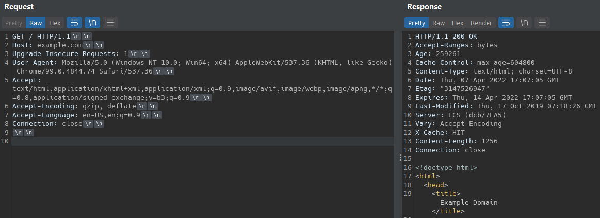
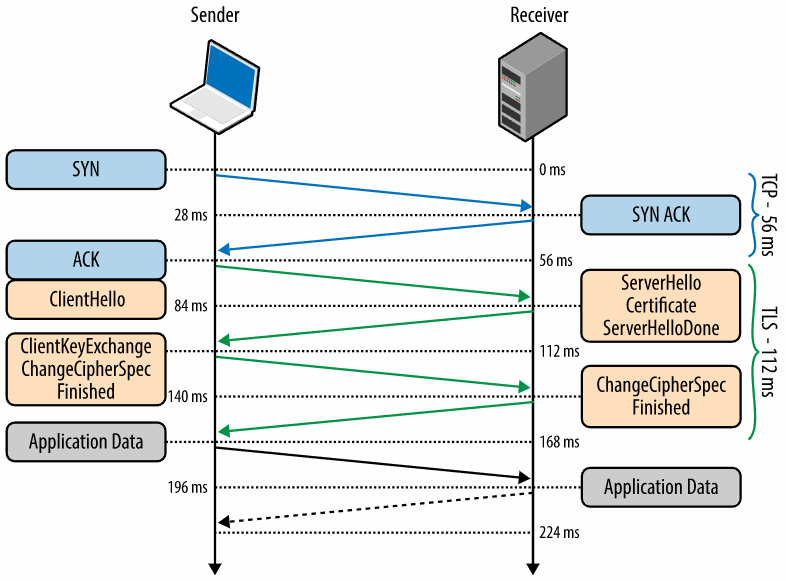
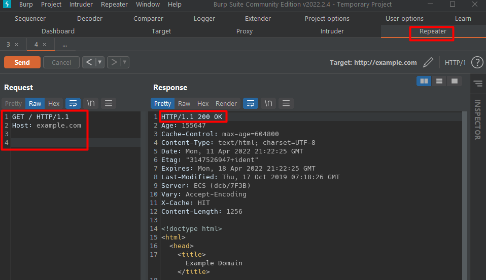
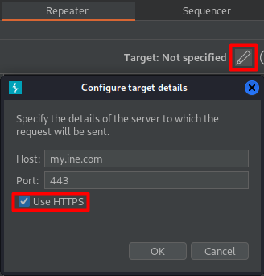
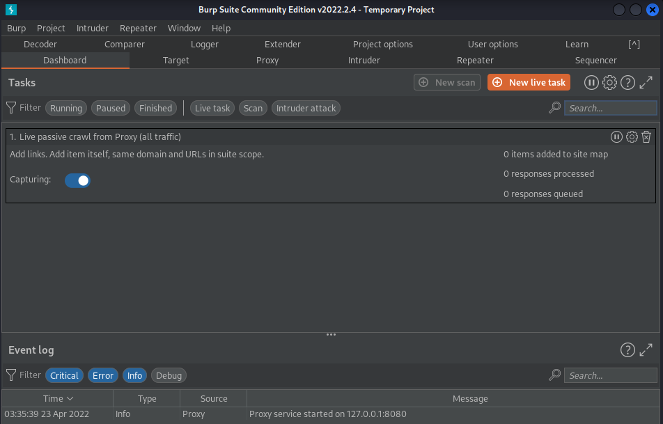
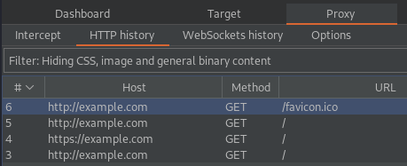

# Web Applications

- **`Web applications`** are software that runs on web servers and are accessible via web browsers.
- The web app world is heterogeneous, since every web app can be differently developed to accomplish the same task.
- This great flexibility in development results in more flexibility in creating insecure code and messing things up.

> 📕 *"With great power comes great responsibility."* {Stan Lee}

## HTTP Protocol Basics

> ⚡ P.T. Usage:
>
> * Ability to *exploit* web applications and find *vulnerabilities* in web servers and services
> * Web app technology is used market-wide also by desktop and mobile apps

**`HTTP`** (**H**ypertext **T**ransfer **P**rotocol) is one of the most used application protocol on the Internet, built on top of TCP.

- It is the **client-server protocol** used to transfer web pages and web application data.
- Is is a **stateless** protocol.
- The client (a web browser) connects to a web server (usually Microsoft IIS, Apache HTTP Server, or others) by sending HTTP **requests** to the server and getting back HTTP **responses**.
- First a TCP connection is established, then the HTTP messages are sent.


### HTTP Requests

| *The structure of an HTTP message* |
| ---------------------------------- |
| "**Start line**\r\n"               |
| "**Headers**\r\n"                  |
| "\r\n"                             |
| "**Message Body**\r\n"             |

- **`"\r\n"`** (carriage return & newline) are used to the lines in HTTP.

- Each start-line contains 3 elements:

  1. an `HTTP method` (verb/noun) that states the type of the request, like: GET, PUT, POST, HEAD, OPTIONS
  2. the `request target` (URL/path), which resource the browser is asking for
  3. the *protocol version* (`HTTP/1.x`)which defines the structure of the remaining message, telling the server how to communicate with the browser

  ```http
  GET / HTTP/1.1
  ```

- Each header is represented in a single line, composed of a String followed by a colon (**:**) and a value:

  - *Header-name: value*

  ```http
  Host: example.com
  Upgrade-Insecure-Requests: 1
  User-Agent: Mozilla/5.0 (Windows NT 10.0; Win64; x64) AppleWebKit/537.36 (KHTML, like Gecko) Chrome/92.0.4515.131 Safari/537.36
  Accept: text/html,application/xhtml+xml,application/xml;q=0.9,image/avif,image/webp,image/apng,*/*;q=0.8,application/signed-exchange;v=b3;q=0.9
  Accept-Encoding: gzip, deflate
  Accept-Language: en-US,en;q=0.9
  Connection: close
  
  (body)
  ```
  
  - The `Host` value is obtained from the URI (**U**niform **R**esource **I**dentifier) of the resource.
  - `User-Agent` - reveals the client software issuing the request (Chrome, Safari, Firefox, mobile app ...) and the operating system version.
  - `Accept` - expected document type.

### HTTP Responses

The web server *processes the request and sends an HTTP response* back to the client:

  - The start-line, called the **`status-line`**, contains the protocol version, a status code and a status text.
  - HTTP headers same as above, different headers may appear, such as:
    - `Cache-Control` - informs the client about cached content (saves bandwidth)
    - `Content-Type` - lets the client know how to interpret the body
    - `Server` - header of the web server, software running (useful in pentesting!)
    - `Content-Length` - length in bytes of the message body

  - The `body` is separated from the header by 2 empty lines (\r\n\r\n).

```http
HTTP/1.1 200 OK
Accept-Ranges: bytes
Age: 259261
Cache-Control: max-age=604800
Content-Type: text/html; charset=UTF-8
Date: Thu, 07 Apr 2022 17:07:05 GMT
Etag: "3147526947"
Expires: Thu, 14 Apr 2022 17:07:05 GMT
Last-Modified: Thu, 17 Oct 2019 07:18:26 GMT
Server: ECS (dcb/7EA5)
Vary: Accept-Encoding
X-Cache: HIT
Content-Length: 1256
Connection: close

<!doctype html>
<html>
...
</html>

```

- *HTTP Request / Response example*



- Common status codes:

|          Status code          | Meaning                                                      |
| :---------------------------: | :----------------------------------------------------------- |
|          **200** OK           | the request has succeeded (***Successful codes 2xx***)       |
|   **301** Moved Permanently   | the target resource has been assigned a new permanent URI (***Redirection codes 3xx***) |
|         **302** Found         | the target resource resides temporarily under a different URI (Redirection codes 3xx) |
|       **403** Forbidden       | the server understood the request but refuses to authorize it, client doesn't have enough privileges (***Client Error codes 4xx***) |
|       **404** Not Found       | the origin server did not find a current representation for the target resource or is not willing to disclose that one exists (Client Error codes 4xx) |
| **500** Internal Server Error | the server encountered an unexpected condition that prevented it from fulfilling the request (***Server Error codes 5xx***) |
|      **502** Bad Gateway      | the server, while acting as a gateway or proxy, received an invalid response from an inbound server it accessed while attempting to fulfill the request (Server Error codes 5xx) |

> 📌 For more in depth info refer to [RFC 7321 -  Hypertext Transfer Protocol (HTTP/1.1): Semantics and Content](https://httpwg.org/specs/rfc7231.html)
>

## HTTPS Protocol Basics

HTTP (a clear-text protocol) can be protected using an **encryption** layer, by using a *cryptographic protocol* like SSL/TLS.

**`HTTPS`** (HTTP Secure) is a method to run HTTP over SSL/TLS. 

- This encryption layer protects data exchanged between the client and the server, but it does *not protect against web application flaws*. XSS and SQL injections attack will still work.
- It provides **confidentiality**, **integrity protection** and **authentication** to the HTTP protocol.
- Application layer communication cannot be sniffed or altered by an eventual attacker.
- Traffic can be sniffed and inspected by a user, but he cannot know HTTP headers, body, target domain or what data is exchanged.
  - Target IP address and target port can be recongnized
  - DNS (or similar protocols) may disclose which domain user tries to resolve



> 📌 Refer to the [High Performance Browser Networking](https://hpbn.co/transport-layer-security-tls/) book for more in depth information.

## Command Line / GUI Tools

### Netcat

**`netcat`** or **`nc`** is a tool that reads and writes data accross network connections (opens a raw connection to a service port for example), using TCP or UDP protocol.

- considered as a Swiss army knife of networking tools
- used to debug and monitor network connections, scan for open ports, transfer data, listen for incoming connections (reverse shells) and more

**`nc -h`**


- Establishing a connection to a server and communicate via HTTP:

> - **`nc -v example.com 80`**
>
> ```bash
> $ nc -v example.com 80
> Warning: inverse host lookup failed for 93.184.216.34: Unknown host
> example.com [93.184.216.34] 80 (http) open
> GET / HTTP/1.1			# Input Request
> Host: example.com		# 2 lines \r\n after this line
> 
> HTTP/1.1 200 OK			# Response - status line
> Accept-Ranges: bytes
> Age: 414218
> Cache-Control: max-age=604800
> Content-Type: text/html; charset=UTF-8
> Date: Mon, 11 Apr 2022 20:05:16 GMT
> Etag: "3147526947"
> Expires: Mon, 18 Apr 2022 20:05:16 GMT
> Last-Modified: Thu, 17 Oct 2019 07:18:26 GMT
> Server: ECS (dcb/7F84)
> Vary: Accept-Encoding
> X-Cache: HIT
> Content-Length: 1256
> 
> <!doctype html>
> <html>
> <head>
>     ...
> </head>
> 
> <body>
> ...
> </body>
> </html>
> 
> ```
>
> - **`nc -v my.ine.com 80`**
>
> ```bash
> $ nc -v my.ine.com 80                                                     
> DNS fwd/rev mismatch: my.ine.com != server-108-138-36-10.muc50.r.cloudfront.net
> DNS fwd/rev mismatch: my.ine.com != server-108-138-36-101.muc50.r.cloudfront.net
> DNS fwd/rev mismatch: my.ine.com != server-108-138-36-96.muc50.r.cloudfront.net
> DNS fwd/rev mismatch: my.ine.com != server-108-138-36-29.muc50.r.cloudfront.net
> my.ine.com [108.138.36.10] 80 (http) open
> GET / HTTP/1.1			# Input Request
> Host: my.ine.com		# 2 lines \r\n after this line
> 
> HTTP/1.1 301 Moved Permanently	# Response - status line
> Server: CloudFront
> Date: Mon, 11 Apr 2022 20:18:56 GMT
> Content-Type: text/html
> Content-Length: 183
> Connection: keep-alive
> Location: https://my.ine.com/	# Index page moved here
> X-Cache: Redirect from cloudfront	# X- headers are for non-standard usage
> Via: 1.1 210c8ad3e752d602af05a2de06eb2ff8.cloudfront.net (CloudFront)
> X-Amz-Cf-Pop: MUC50-P2	
> X-Amz-Cf-Id: 7zDSRlBNtqmIjJuUwda9jFQkwxA0lzp4w0Lv3R0vNlkzdapfvQPRcQ==
> 
> <html>
> <head><title>301 Moved Permanently</title></head>
> <body bgcolor="white">
> <center><h1>301 Moved Permanently</h1></center>
> <hr><center>CloudFront</center>
> </body>
> </html>
> 
> HEAD / HTTP/1.1			# Input HEAD Request
> Host: my.ine.com		# 2 lines \r\n after this line
> 
> ...
> ```

- Check if a port is opened:

> - **`nc -zv HOST PORT#`**
>   - **-z** performs a port scan against a given host and port or port range.
>
> ```bash
> $ nc -zv my.ine.com 443 
> DNS fwd/rev mismatch: my.ine.com != server-143-204-98-103.fra50.r.cloudfront.net
> DNS fwd/rev mismatch: my.ine.com != server-143-204-98-77.fra50.r.cloudfront.net
> DNS fwd/rev mismatch: my.ine.com != server-143-204-98-59.fra50.r.cloudfront.net
> DNS fwd/rev mismatch: my.ine.com != server-143-204-98-6.fra50.r.cloudfront.net
> my.ine.com [143.204.98.103] 443 (https) open	# Port 443 open
> ```

### Burp Suite

**`Burp Suite`** is an integrated platform and graphical tool for performing security testing of web apps, by testing, mapping and analyze the application's attack surface.

- it is written in Java, developed by [PortSwigger](https://portswigger.net/).
- can be used as proxy server, scanner, intruder, repeater, spider, decoder, comparer, sequencer, extender and more.

Using the ***Repeater*** tool:

- Example of a GET request on port 80:


- Example of a *301 Moved Permanently* response and redirection:
  - 301 response received:


- By clicking the **`Follow redirection`** button, it follows the redirection (to the *Location*) in the current response without manually modifying the request to the target domain. I this case it got redirected to the HTTPS page:


### OpenSSL

**`OpenSSL`** is a full-featured toolkit for general-purpose cryptography and secure communication, a widely used implementation of the **T**ransport **L**ayer **S**ecurity (**TLS**) protocol.

> 📕 Check the [OpenSSL Cookbook](https://www.feistyduck.com/library/openssl-cookbook/online/) by Ivan Ristić.

- Establish a HTTPS connection using the ***s_client*** subcommand:
  - *the SSL handshake is only done at the beginning of the session.*

> - **`openssl s_client -connect my.ine.com:443`**
>
> ```bash
> $ openssl s_client -connect my.ine.com:443
> 
> CONNECTED(00000003)
> depth=2 C = US, O = Amazon, CN = Amazon Root CA 1
> verify return:1
> depth=1 C = US, O = Amazon, OU = Server CA 1B, CN = Amazon
> verify return:1
> depth=0 CN = *.ine.com
> verify return:1
> ---				# Certificate info exchanged
> Certificate chain
>  0 s:CN = *.ine.com
>    i:C = US, O = Amazon, OU = Server CA 1B, CN = Amazon
>  1 s:C = US, O = Amazon, OU = Server CA 1B, CN = Amazon
>    i:C = US, O = Amazon, CN = Amazon Root CA 1
>  2 s:C = US, O = Amazon, CN = Amazon Root CA 1
>    i:C = US, ST = Arizona, L = Scottsdale, O = "Starfield Technologies, Inc.", CN = Starfield Services Root Certificate Authority - G2
>  3 s:C = US, ST = Arizona, L = Scottsdale, O = "Starfield Technologies, Inc.", CN = Starfield Services Root Certificate Authority - G2
>    i:C = US, O = "Starfield Technologies, Inc.", OU = Starfield Class 2 Certification Authority
> ---
> Server certificate
> -----BEGIN CERTIFICATE-----
> ...
> -----END CERTIFICATE-----
> subject=CN = *.ine.com
> 
> issuer=C = US, O = Amazon, OU = Server CA 1B, CN = Amazon
> 
> ---
> No client certificate CA names sent
> Peer signing digest: SHA256
> Peer signature type: RSA-PSS
> Server Temp Key: X25519, 253 bits
> ---				# Client-server handshake
> SSL handshake has read 5463 bytes and written 376 bytes
> Verification: OK
> ---
> New, TLSv1.3, Cipher is TLS_AES_128_GCM_SHA256
> Server public key is 2048 bit
> Secure Renegotiation IS NOT supported
> Compression: NONE
> Expansion: NONE
> No ALPN negotiated
> Early data was not sent
> Verify return code: 0 (ok)
> ---
> ```
>
> - **`openssl s_client -connect HOTS:PORT -debug`** - to analyze the handshake and the encrypted communication.
> - **`openssl s_client -connect HOTS:PORT -state`** - to print the state of the handshake.
> - **`openssl s_client -connect HOTS:PORT -quiet`** - no s_client output.
>
> ```bash
> $ openssl s_client -connect my.ine.com:443 -quiet
> depth=2 C = US, O = Amazon, CN = Amazon Root CA 1
> verify return:1
> depth=1 C = US, O = Amazon, OU = Server CA 1B, CN = Amazon
> verify return:1
> depth=0 CN = *.ine.com
> verify return:1
> GET / HTTP/1.1		# GET Request manually sent, same as with nc
> Host: my.ine.com
> 
> HTTP/1.1 200 OK		# Server Response
> Content-Type: text/html
> Content-Length: 6656
> Connection: keep-alive
> Date: Tue, 12 Apr 2022 16:50:43 GMT
> Last-Modified: Mon, 11 Apr 2022 15:29:44 GMT
> ETag: "2de37bd7e8c98aff5172792c663c4881"
> Cache-Control: no-store
> x-amz-version-id: rob8do2yVAbhoKDnnTj.UcTtzRk.DTov
> Accept-Ranges: bytes
> Server: AmazonS3
> Strict-Transport-Security: max-age=31536000; includeSubdomains; preload
> Content-Security-Policy: frame-ancestors 'none';
> X-Content-Type-Options: nosniff
> X-XSS-Protection: 1; mode=block
> Referrer-Policy: same-origin
> Vary: Accept-Encoding
> X-Cache: Miss from cloudfront
> Via: 1.1 39070ec61414daba1536aa06ac19ebb0.cloudfront.net (CloudFront)
> X-Amz-Cf-Pop: MUC51-C1
> X-Amz-Cf-Id: X4re8iPqni_Dsa8p6gIiFWtCCiMWPJ1HS81oxdWJlHo1uDvDRm0ziQ==
> 
> <!DOCTYPE html><html lang=en><head>
> ...
> </body></html>
> 
> ```

- In Burp Suite, HTTPS can be flagged to be used in the *Repeater target configuration*:
  - no handshake/encryption shown
  - focus on analyzing the request




> 📌 More on Burp Suite in the [PortSwigger Documentation](https://portswigger.net/burp/documentation/desktop/getting-started)

## HTTP Cookies

> ⚡ P.T. Usage:
>
> * Cookies are foundation of authorization of many applications
> * Lots of exploits rely on stealing cookies

To make HTTP (stateless) work like a **stateful** protocol, cookies were invented by Netscape (in 1994).

- **`Cookies`** are stored in the **cookie jar** of the web browser, a storage space used by the browser.
- To set a cookie, the server must use the `Set-Cookie` HTTP header field in the response message. The cookie will be sent from the server to the user agent:

```http
HTTP/1.1 200 OK
Date: Thu, 14 Apr 2022 18:30:56 GMT
Content-Length: 0
Connection: close
Cache-Control: no-cache
Set-Cookie: obuid=9f0fec5b-0f7e-49fb-a11a-3f2ae3592dd6; Max-Age=7776000; Expires=Wed, 13 Jul 2022 18:30:56 GMT; Path=/; Domain=.outbrain.com;SameSite=None;Secure
Set-Cookie: adrl=Nzg1YzVjMzMwOTZkYmIyNzljYjMzZWRiYTA4OTkwZTY; Max-Age=1728000; Expires=Wed, 04 May 2022 18:30:56 GMT; Path=/; Domain=.outbrain.com;SameSite=None;Secure
X-TraceId: d009bd334ba3d13cf0f7c47929b642fa
```

### Cookies Format

Cookies contain the following attributes:

| **Attribute**                             | **Value**                      |
| ----------------------------------------- | ------------------------------ |
| Cookie content - KEY=Value                | `Cookie-NameID=<Cookie-Value>` |
| Expiration date - validity time window    | `Expires=<date>`               |
| Max-Age - Seconds until cookie expiration | `Max-Age=<number_in_seconds>`  |
| Path - in the requested URL               | `Path=<path-value>`            |
| Domain - Host to send the cookie to       | `Domain=<domain-value>`        |
| Optional Flags                            | `Secure; HttpOnly; SameSite;`  |

- Cookies are sent only to the valid domain/path, according to their expiration date and their flags, and browsers use these attributes to choose to send a cookie in a request or not.

### Cookies  Domain & Path

- The **scope** of the cookie is set by the `Domain` and `Path` fields, so the browser send the cookie only to the right domain.

- After a web server sets the domain field via a cookie, the browser *will use the cookie for every request sent to that domain and all its subdomains*.

  - If domain attribute is not specified, the browser will automatically *set the domain as the server domain* and set the **`host-only`** flag. The cookie will be *sent only the that precise hostname*.

- The browser will send a cookie to the right domain *and to any subpath of the **path field value***.

### Other Attributes

- **Expired** cookies are not sent to the server and session cookies expire with the HTTP session.
- **`HttpOnly`** flag forbids JavaScript from accessing the cookie. It prevents any non-HTML technology (JavaScript, Flash, Java ...) from reading the cookie, mitigating *cross-site scripting attacks* (cookie stealing via **XSS**).
- **`Secure`** flag creates secure cookies sent only over an HTTP**S** connection. It's more resistant to *man-in-the-middle attacks* (**MITM**).
- A server can set **multiple values** (key=value) with a single Set-Cookie header.


> 📌 For more in depth info on cookies format and usage, refer to the [RFC 6265 - HTTP State Management Mechanism](https://datatracker.ietf.org/doc/html/rfc6265).

## Sessions

Websites can also store information (variables specific for a given visit) on the **server side** instead of the client side, by using **sessions**.

- Each user session is identified by a **`session id`** or **`token`** assigned by the server to the client, which presents this ID for each subsequent request.
  - By that session ID, the server retrieves the state of the client and its associated variables.
  - Session ID can be stored as a cookie, form field or URL.
  - It is a unique number used to identify a logged in user session.
- Application logic is hidden and the cost of cookies data transmission is reduced.

### Session Cookies

Session IDs are installed on the web browser by using **session cookies**.

- Each development language has its own default session parameter name: `PHPSESSID`, `JSESSIONID`, custom-names, etc.
- Session IDs are also transmitted via `GET` requests.

Browser activities generating session cookies are:

- logging in 
- opening a specific web page
- change settings in the web application

> 📌 For more in depth information check the [Beginner Guide to Understand Cookies and Session Management](https://www.hackingarticles.in/beginner-guide-understand-cookies-session-management/) article.

A web developer tool can be used to analyze web applications, examine, edit, and debug HTML, CSS, and JavaScript, inspect and manipulate Cookies.

- Firefox has a built in set of web developer tools - [Firefox DevTools](https://firefox-source-docs.mozilla.org/devtools-user/index.html).

## Same Origin Policy (SOP)

**`SOP`** (**S**ame **O**rigin **P**olicy) is a web browser security mechanism that restricts scripts on one origin from accessing data from another origin. For example, it *prevents* JavaScript code from getting or setting properties on a resource *coming from a different origin*.

- Web application security is entirely based on Same Origin Policy.
- ***Domain*** (hostname), ***port*** and ***protocol*** must match to determine if JavaScript can access a resource.
- SOP applies to the actual code of a script.
- SOP allows embedding of external resources with HTML tags like `img`, `script`, `iframe`, `video`, etc. Any JS on the page won't be able to read the contents of these resources.
- There some exceptions to the same-origin policy (`location`, `length`, `replace`, others).
- Cookies are often accessible from all subdomains of a site (the is technically a different origin) - check the `HttpOnly` flag.

> 📌 [PortSwigger Academy SOP Explanation](https://portswigger.net/web-security/cors/same-origin-policy)

------

## Burp Suite Tool

> ⚡ P.T. Usage:
>
> * Web application behavior study and analysis 
> * Attacks, finding and test vulnerabilities

**Burp Suite** is an **`intercepting proxy`**, a tool that lets the user *analyze and modify any request and any response* exchanged between an HTTP client and server.

- Another widely used intercepting tool is OWASP **Z**ed **A**ttack **P**roxy (**ZAP**).
- Intercepting proxy is NOT a web proxy. Proxy servers provides a gateway (a layer of security as web filters, firewalls) between end-users and the web pages they visit online.

Burp Suite will let a user:

- Intercept requests and responses between the browser and the web server
  - Requests can be intercepted and modified before they are sent to the remote server
- Build requests manually
  - Header and body of a message can be manually or automatically altered
- Crawl a website automatically
- Fuzz web apps with valid/invalid inputs to test their behavior 



### Burp Suite - Tools

- **Proxy** - operates as a web proxy server that let the user *view, intercept, inspect and modify the raw traffic passing in both directions*. Operates in conjunction with Burp's browser (or with external browser with [Burp's CA certificate](https://portswigger.net/burp/documentation/desktop/external-browser-config/certificate) and an addon like [FoxyProxy](https://addons.mozilla.org/it/firefox/addon/foxyproxy-standard/)).


  - Intercept and modify headers in the *Raw* tab or in the *Headers* tab of the Inspector tool.


  - Even with interception off, Burp will still collect info on the traffic. This can be checked in the ***Proxy - History** tab* or in the ***Target - Site Map*** tab.




- **Repeater** - used for manually manipulating and reissuing raw HTTP and WebSocket messages, in order to analyze the application's response.

  - Provides syntax highlighting, raw and rendered responses, integration with other Burp tools.
  - `netcat` or `telnet` can be used to do the same thing too, without the above benefits.
  - Proxy can intercept a request and send it to the Repeater function (**`CTRL+R`**):


> 📌 For a better overview of all the Burp Suite Tools, check the official documentation [here](https://portswigger.net/burp/documentation/desktop/tools).
>
> 🔬 Check [_Burp Suite Basics_](../exam-preparation-labs/p.t.-prerequisites-labs/burp-suite-basics.md) and [_Burp Suite Directory Enumeration_](../exam-preparation-labs/p.t.-prerequisites-labs/burp-suite-directory-enumeration.md) labs.


------

